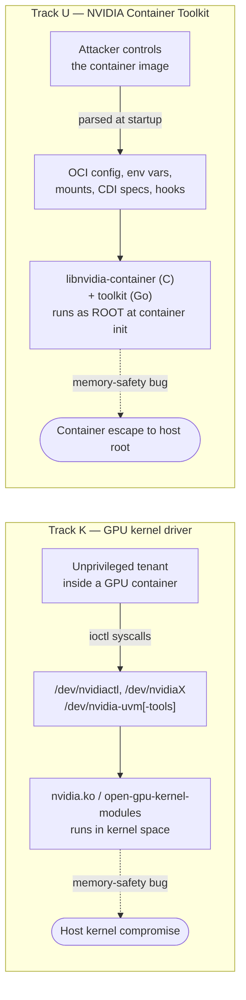
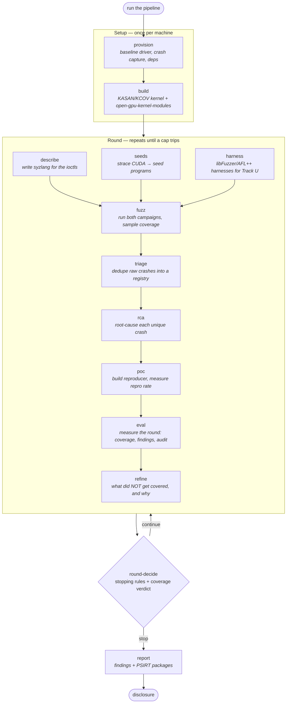
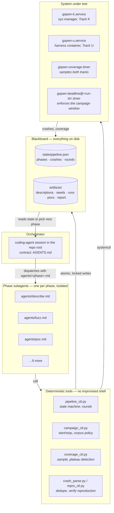
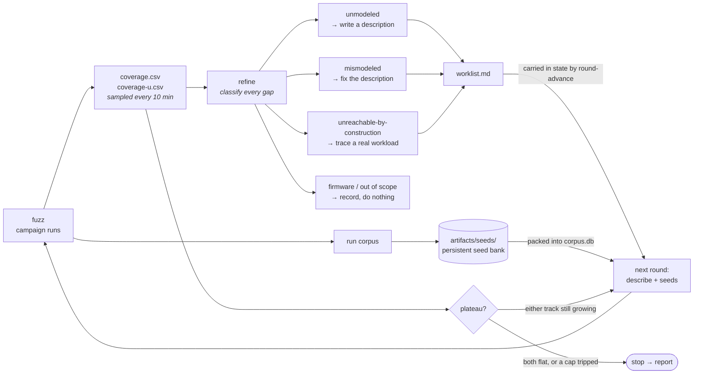
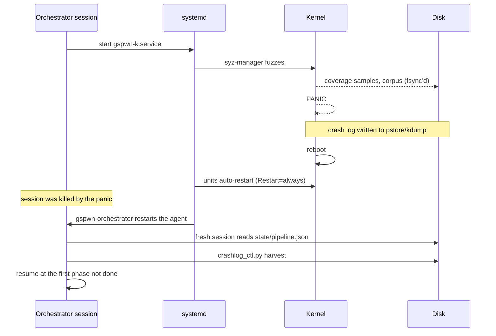

# gspwn

Autonomous bug-hunting against the NVIDIA GPU kernel driver and the NVIDIA
Container Toolkit, driven by AI agents instead of a human operator.

[](LICENSE)
[](https://www.python.org/)

A coding-agent session in this repo, running on a cloud GPU instance,
executes the pipeline: it provisions the machine, builds an instrumented
kernel, writes the fuzzing grammar for NVIDIA's undocumented driver interface,
fuzzes both attack surfaces for days, triages the crashes, root-causes them,
builds reproducers, measures the reproduction rate of each, and writes the
report. It halts on the first configured cap that trips, or when coverage
growth flattens.

Every reported finding carries a replayable reproducer and a measured
reproduction rate from a clean boot.

---

## Contents

- [What it attacks](#what-it-attacks)
- [Why this surface is hard to fuzz](#why-this-surface-is-hard-to-fuzz)
- [The pipeline](#the-pipeline)
- [Architecture](#architecture)
- [The improvement loop](#the-improvement-loop)
- [Surviving kernel panics](#surviving-kernel-panics)
- [Repo layout](#repo-layout)
- [Configuration and stopping rules](#configuration-and-stopping-rules)
- [Supported GPUs and instances](#supported-gpus-and-instances)
- [Quickstart](#quickstart-ec2)
- [Tests](#tests)
- [Threat model](#threat-model)
- [Responsible disclosure](#responsible-disclosure)

---

## What it attacks

Two separate pieces of software, referred to throughout as **Track K** (kernel)
and **Track U** (userspace).



**Track K** is the GPU driver itself. Any program that uses the GPU opens a
device node like `/dev/nvidia0` and drives it with `ioctl()` calls — "here's a
command number and a blob of data, go do something." That code runs in the
kernel, so a memory-safety bug there is a privilege escalation. The attacker
model is a tenant inside a GPU-enabled container started with the default
capability set, who gets exactly those device nodes and nothing else.

**Track U** is the glue that sets GPU containers up. It runs **as root**
during container initialization, before isolation is fully in place, and it
parses input the attacker controls — CVE-2024-0132 was in this area. The C
library `libnvidia-container` is the memory-safety target. The Go components
are fuzzed for panics and DoS only: Go is memory-safe, so memory-corruption
coverage does not apply to them.

## Why this surface is hard to fuzz

The technique is **fuzzing**: generate millions of malformed inputs, feed them
to the target, watch for crashes. For the kernel this uses
[syzkaller](https://github.com/google/syzkaller), the standard Linux kernel
fuzzer. The kernel is rebuilt with two features turned on:

| Instrumentation | What it does | Why it's needed |
|---|---|---|
| **KCOV** | Reports which kernel code each input reached | The fitness signal. Inputs that reach new code are kept and mutated further, directing generation toward unexplored paths |
| **KASAN** | Detects memory errors at the moment they happen | Without it a heap overflow corrupts memory silently and crashes minutes later somewhere unrelated, and the crash site no longer indicates the cause |

Two problems stand in the way of fuzzing this driver.

**Problem 1: syzkaller can't fuzz what it can't describe.** It needs a grammar
— written in a language called *syzlang* — declaring what each ioctl takes:
struct layout, field types, which arguments are handles produced by earlier
calls. NVIDIA's driver exposes hundreds of ioctls with no public descriptions.
Writing them means reading driver headers and source and translating by hand.
Writing them is slow specialist work, and the main reason this surface
remains under-fuzzed.

**Problem 2: random input never gets deep.** Real GPU work is a chain — open
the control device, allocate a client object, allocate a device under it, then
a memory context, then a channel. Each step needs a handle returned by the
previous one. Random bytes never build a valid chain, so the fuzzer bounces off
the entry points and never reaches the interesting code.

Both jobs are done by phase agents:

- **`describe`** reads the open-source driver headers and writes the syzlang
  descriptions.
- **`seeds`** runs a real CUDA workload under `strace`, captures the actual
  ioctl sequence, and converts it into seed programs that hand the fuzzer a
  valid object chain to start mutating from.

The `eval` phase ablates both contributions: agent-authored descriptions
against manually refined ones, and trace-derived seeds against seedless runs.

## The pipeline

Twelve phases. Two run once per machine, nine run once per **round**, and the
report runs once at the end.



`describe`, `seeds` and `harness` are independent of each other and may run in
parallel once `build` is done. Everything after `fuzz` is strictly sequential.

Each phase has a **gate** — a concrete, checkable condition — and the
orchestrator advances only after confirming that evidence:

| Phase | Gate to advance |
|---|---|
| provision | manifest written; crash capture verified READY; a test panic was captured |
| build | booted into the instrumented kernel; KASAN state matches the manifest; `nvidia-smi` works |
| describe | syzlang compiles; a smoke run provably reaches the driver |
| seeds | seed programs exist and parse under syz-manager |
| harness | Track U harnesses build and produce coverage on their seeds |
| fuzz | both campaigns active; coverage increases within the smoke window |
| triage | every raw crash registered as unique, duplicate or flagged |
| rca | a root-cause writeup exists for every crash selected for a PoC; claims not verified against source are tagged `[UNVERIFIED]` |
| poc | every unique crash has a measured reproduction rate and a classification; every reliable or flaky Track K crash has been re-run inside a container matching the threat model, with the outcome recorded |
| eval | coverage series, findings table and round progression exist for every run, including an audit sample of `[UNVERIFIED]` RCA claims re-checked against source |
| refine | gap list and next-round worklist written; round outcome recorded |
| report | report and PSIRT packages exist; disclosure status recorded |

A phase that fails its gate is marked `blocked` and the pipeline **stops**. It
does not skip ahead to keep looking productive.

## Architecture

Four layers. The important rule is the boundary between the second and third:
**agents reason, tools act.**



**Orchestrator.** A session that has read `AGENTS.md`. It coordinates and does
no phase work itself. It asks `pipeline_ctl.py next` what to do, spawns the
right subagent, checks the gate, records the result.

**Subagents.** One per phase, prompted from `agents/<phase>.md`. They are
isolated — no talking to each other — and they hand off *paths*, not
conversation transcripts. Because the handoff is on disk, any agent can be
replaced mid-run and the next one resumes from the same state.

**Tools.** Every action that touches the build, the campaign, the crash data or
the state file goes through Python in `tools/`. An agent decides *which* ioctl
to model; a script does the building, parsing and verifying. Results
therefore depend on the tools rather than on commands composed at runtime.

**Blackboard.** `state/pipeline.json` plus the `artifacts/` tree. Nothing
pipeline-relevant lives in the conversation. Writes are atomic, fsync'd, and
protected by a lock so parallel subagents can't clobber each other.

## The improvement loop

Syzkaller already has an inner feedback loop: mutate an input, measure coverage
with KCOV, keep whatever reaches new code. That loop is good at exploring
*within* what it has been told about. It cannot notice "there is an entire
ioctl family nobody wrote a description for."

An outer loop wraps it.



Each round ends by asking what *didn't* get covered and sorting every gap by
**why**:

- **unmodeled** — no description exists, so the fuzzer never generated the call
- **mismodeled** — a description exists but calls get rejected before reaching
  real work, usually a wrong struct or a bad constraint
- **unreachable-by-construction** — needs an object chain random generation
  won't build, so it needs a traced seed
- **out of scope** — lives behind GSP firmware, which can't be instrumented at
  all; recorded so the coverage claims stay correctly scoped

That becomes a worklist, which is carried into the next round **through the
state file**, not by filename convention, so the next round's agents read it
with `pipeline_ctl.py worklist` instead of guessing. Meanwhile the run's
evolved corpus is promoted into a persistent seed bank, so round 3 starts from
everything rounds 1 and 2 learned rather than from zero.

**When it stops.** A sampler records the coverage curve for both tracks. If
edge growth over the trailing window falls below the configured threshold, the
round has *plateaued*. The loop stops on plateau, on the round cap, or on the
run-hour budget. It also stops if the coverage verdict is `unknown` — a broken
sampler must never be able to authorize another blind campaign. A round counts
as still learning if **either** track is still finding edges.

Each sample also records whether the GPU is answering. A GPU that falls off
the bus does not stop the fuzzer, so the curve flattens and a plateau test
with no view of the hardware would report a finished round that never
happened. A flat window over an unhealthy GPU reads `unknown` instead, which
stops the loop and says why.

## Surviving kernel panics

Crashing the kernel is the expected outcome. When the fuzzer finds a bug the
machine panics and reboots, and since the orchestrator runs on that same
machine, the agent session dies with it.



Fuzzers run as systemd units with `Restart=always` so they outlive the
session; crash logs land in persistent storage that survives
the reboot; state writes are tempfile + fsync + atomic rename, so a panic
mid-write leaves the previous good file rather than a truncated one; and the
campaign carries a **deadline on disk**, enforced by its own per-run
`gspwn-deadline@<run-id>.timer`, so a run configured for 24 hours ends
on time across any number of reboots, with no session attached.

The agent itself is supervised the same way. A fresh session needs no memory
of the one the panic killed, because `pipeline_ctl.py next` reads the state
file and says where the pipeline is. That makes the state file the
orchestrator's memory and the agent replaceable, which is what lets
`gspwn-orchestrator.service` simply start a new one. It refuses to keep
restarting forever: `orchestrator_ctl.py` counts same-boot restarts and
reboots separately, and stops the unit when either passes its limit, when a
phase is blocked, or when the pipeline is complete. Kernel fuzzing reboots the
box by design, so those two counters cannot share one limit without either
stopping a healthy campaign or letting a crash loop run all night.

## Repo layout

| Path | What lives there |
|---|---|
| `AGENTS.md` | The orchestrator contract. Reading it is what turns a session into the orchestrator |
| `agents/*.md` | One prompt per phase — the actual instructions each subagent runs on |
| `tools/*.py` | Deterministic tools. Everything that acts on the system |
| `config/campaign.yaml` | Every tunable and every spend cap, in one file |
| `state/pipeline.json` | The blackboard: phase statuses, crash registry, rounds, disclosure status |
| `state/spend.json`, `state/orchestrator.json` | Machine-global: the run-hour ledger and the orchestrator circuit breaker. Neither follows `GSPWN_STATE` |
| `artifacts/` | Everything produced at runtime — descriptions, seeds, runs, crashes, PoCs, report. Gitignored |
| `docs/` | Runbook, design spec, implementation record |

The tools, briefly:

| Tool | Job |
|---|---|
| `gspwn_config.py` | Loads and validates `campaign.yaml`. Single source of truth for every limit |
| `pipeline_ctl.py` | The state machine: phases, rounds, crash registry, loop decisions |
| `campaign_ctl.py` | Installs and controls the fuzz campaigns; corpus policy; campaign deadline |
| `coverage_ctl.py` | Samples both tracks, detects plateau, compares runs |
| `corpus_ctl.py` | Promotes a run's corpus into the persistent seed bank |
| `crash_parse.py` / `crashlog_ctl.py` | Turns raw crashes and post-panic logs into registry entries |
| `repro_ctl.py` | Extracts reproducers and measures reproduction rate |
| `trace2seed.py` | Converts an strace of a CUDA workload into seed programs |
| `orchestrator_ctl.py` | Supervises the driving agent so it comes back after a panic; circuit breaker against restart loops |
| `build_kernel.sh` | Builds the KASAN/KCOV kernel and the open-source driver modules |
| `selftest.py` | The offline test suite for all of the above |

## Configuration and stopping rules

The pipeline runs unattended on a GPU instance and crashes the machine by
design. Every limit lives in one file, `config/campaign.yaml`, set before a
campaign starts:

```yaml
loop:
  max_rounds: 3              # hard cap, whatever coverage does
  max_total_run_hours: 216   # total across every campaign
  campaign_hours: 24         # each campaign self-stops after this
  stop_on_plateau: true
```

Check what actually took effect before launching anything:

```bash
python3 tools/gspwn_config.py
```

An unknown key is a hard error rather than a warning, so a typo in a limit
fails loudly instead of falling back to the default. Values are range-checked,
and combinations that would break the loop are rejected: a campaign longer
than the total run-hour budget, or a plateau window too short to hold enough
samples.

These limits bound the search. They are not a budget. The repo has no view of
what an instance costs and does not try to estimate one: prices vary by
instance family and region, and again between spot and on demand, so a number
written into config would go stale while still looking authoritative. Watch
real money in the AWS console and set an AWS Budgets alert on day one.

What the repo can enforce is hours. Every campaign install goes through
`campaign_ctl.py`, which refuses to start a run whose hours would exceed
`max_total_run_hours`, counting every hour already recorded in
`state/spend.json` plus this campaign's window. The ledger is filled by
`round-end --from-run` from measured coverage samples, so a run that died
after 3 h records 3 rather than the configured 24. It deliberately ignores the
`GSPWN_STATE` redirection used by tests and side runs, so a fresh state file
never arrives with a fresh allowance.

The ledger also fails closed. If it goes missing while the state file still
records hours, every command that reads it refuses rather than treating the
cap as untouched. A lost ledger on a re-provisioned box would otherwise reset
the count to zero without saying so. Rebuild it with `pipeline_ctl.py
spend-init`, which re-derives the hours from the state file and never lowers
what was already recorded. A genuinely new machine, with no ledger and no
recorded hours, starts at zero and needs no action.

Once set, the pipeline requires no further input. Campaigns stop on their
deadline, round outcomes are measured from the recorded curve rather than
supplied by an agent, and the loop halts on the first rule that trips.

Nothing stops the instance itself. When the loop ends the fuzz units stop, but
the box keeps running until you stop it from the console. That is deliberate.
The artifacts and the crash registry live on its disk, and an automatic stop
firing partway through a long reproduction run would lose more than it saved.

## Supported GPUs and instances

`open-gpu-kernel-modules` supports Turing and later. Those architectures carry
a GSP microcontroller and the open modules depend on it. Volta and earlier have
no GSP, so they run only the proprietary driver, whose Resource Manager ships
as a prebuilt binary. KCOV cannot instrument that binary, so coverage-guided
kernel fuzzing does not work there at all.

| EC2 family | GPU | Architecture | Open kernel modules | MIG |
| --- | --- | --- | --- | --- |
| `p3` | V100 | Volta | No | No |
| `g4dn` | T4 | Turing | Yes | No |
| `g5` | A10G | Ampere | Yes | No |
| `g6` | L4 | Ada | Yes | No |
| `g6e` | L40S | Ada | Yes | No |
| `p4d` | A100 | Ampere | Yes | Yes |
| `p5` | H100 | Hopper | Yes | Yes |

`p3` is listed to make its exclusion explicit. Size variants within a family
carry the same GPU, and the region affects availability, quota and price but
never which GPU a family carries. `g4ad` is an AMD GPU and unrelated; `g5g`
pairs a T4G with Graviton, so it is arm64 and the instrumented kernel build has
never been exercised there.

Hourly price spans roughly two orders of magnitude across this table. MIG
matters because it is the only hardware partitioning here, and the tenancy
model a finding is claimed under depends on it.

Pick the instance before cloning: the choice is made in the AWS console, and
nothing in this repo can validate it after the fact.

## Quickstart (EC2)

Full runbook: [docs/cloud-setup.md](docs/cloud-setup.md). The short version:

1. Launch a `g4dn.2xlarge` — 8 vCPU, 32 GB, one T4, the cheapest supported
   entry in the table above. Official Debian 12 AMI. At launch, and not
   afterwards:
   - **On-demand, not spot.** A one-time spot request is *terminated* on
     interruption, not stopped, so the root volume and every artifact go with
     it mid-campaign.
   - **Attach an IAM instance profile allowing `ec2:GetConsoleOutput`** on the
     instance itself. That is the only AWS permission the pipeline uses, and
     it is how a hard hang gets captured: EC2 has no pstore, so a hang that
     never reaches kdump is only recoverable from the console log.
   - **Enable termination protection** and set `DeleteOnTermination=false` on
     the root volume.
   - **Put `artifacts/` on its own EBS volume.** A GPU that dies for good
     costs you the instance; a separate volume detaches and reattaches, so it
     does not also cost you the campaign.
2. `git clone` this repo on the instance.
3. Set the limits in `config/campaign.yaml` and confirm them with
   `python3 tools/gspwn_config.py`.
4. Open a coding-agent session in the repo root and say **"run the pipeline"**.
   `AGENTS.md` makes it the orchestrator.
   For an unattended campaign, set `orchestrator.command` in
   `config/campaign.yaml` and run
   `sudo python3 tools/orchestrator_ctl.py install`, so a kernel panic
   restarts the agent instead of ending the campaign.
5. Snapshot the provisioned instance to an AMI once `build` is done. Every
   later campaign launches from that image, so re-provisioning costs nothing.

## Tests

The deterministic tools have an offline self-test — no GPU, no kernel build, no
root, no network:

```bash
python3 tools/selftest.py
```

It covers state durability and locking, the round/loop state machine and its
stop conditions, plateau detection across both tracks, crash dedup and
flagging, the strace→syz-program conversion, seed packing, reproduction
bookkeeping, the config contract, and the CLI end to end.

It does **not** cover anything touching the system under test — kernel
builds, systemd units, crash harvesting, real reproduction. Those are exercised
by the phase gates on the target machine.

## Threat model

- **Track K:** the attacker is an unprivileged tenant in a GPU container
  started with the default capability set (`NVIDIA_DRIVER_CAPABILITIES` unset,
  or the `compute,utility` most CUDA images request). That tenant receives
  `/dev/nvidiactl`, `/dev/nvidiaX` and `/dev/nvidia-uvm[-tools]`, and nothing
  else.
- **Deliberately out of scope:** `nvidia-drm`, `nvidia-modeset` and
  `/dev/dri/*`. Those nodes appear only when the container additionally
  requests the `graphics` or `display` capability, which a default CUDA
  workload does not. Fuzzing them would produce findings that cannot be
  claimed under the attacker model above. Widening the model to cover them is
  a deliberate decision, not something the describe phase does on its own.
- **Reachability is verified, not assumed.** Syzkaller runs under
  `sandbox: namespace`, which gives it a full capability set inside a fresh
  user namespace. A container tenant has dropped capabilities, a seccomp
  filter and a device cgroup allowlist, so syzkaller can reach paths the
  attacker model cannot. That asymmetry produces over-claims rather than
  missed bugs, which is the failure that gets challenged first. A finding is
  only claimed under this model once its reproducer has been re-run inside a
  container matching the profile above.
- **Track U:** the attacker controls the container image. The code under test
  runs as root during container initialization, before isolation is fully
  enforced. Attacker-controlled inputs are the OCI config, hooks, environment
  variables, mounts and CDI device specs.
- **Disclosed blind spot:** on GSP-based GPUs the Resource Manager runs in
  closed-source GSP firmware, which KASAN/KCOV cannot instrument. Coverage is
  reported as kernel-side reachable code only, and `NVRM:`/GSP firmware errors
  are harvested as a secondary crash signal.

## Docs

- [docs/index.md](docs/index.md) — index of the full documentation set
- [docs/architecture.md](docs/architecture.md) — data model, crash lifecycle, run layout, coverage internals, how to extend
- [docs/cloud-setup.md](docs/cloud-setup.md) — EC2 operational runbook
- [Design spec](docs/superpowers/specs/2026-08-12-nvidia-driver-fuzzing-workflow-design.md) — the original architecture, phases, gates and threat model. A dated record; `docs/architecture.md` is current
- [Implementation plan](docs/superpowers/plans/2026-08-12-nvidia-fuzzing-workflow.md) — task-by-task build record

## Responsible disclosure

Confirmed findings go to NVIDIA PSIRT before any publication. A PSIRT-ready
package — reproducer, root-cause analysis, affected versions — is assembled per
finding, and disclosure status is tracked in `state/pipeline.json`. Nothing is
published before that process completes.

This is authorized-security-research tooling. Run it only on systems the
operator owns or has explicit permission to test. Kernel panics are an expected
outcome of normal operation.

## Status

Active research. The repo carries the orchestrator contract, the phase
prompts, the tools and the config templates. The syzlang descriptions, seeds
and harnesses are generated by the agents at runtime on the target machine and
land in the gitignored `artifacts/` tree.

The work extends Interrupt Labs' published research on
[fuzzing the NVIDIA GPU drivers](https://www.interruptlabs.co.uk/articles/fuzzing-the-nvidia-gpu-drivers).
What is added here is the agentic layer: agent-authored interface descriptions
and trace-derived seeds for a surface that has lacked both, driven by a loop
that feeds each round's coverage gaps back into the next round's
descriptions.

## License

MIT. See [LICENSE](LICENSE).
