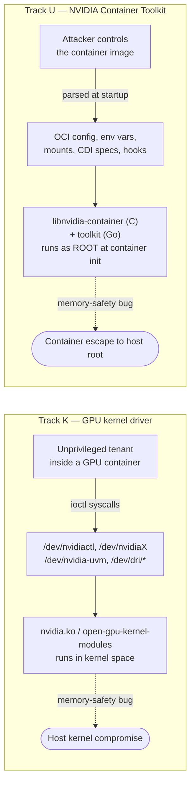
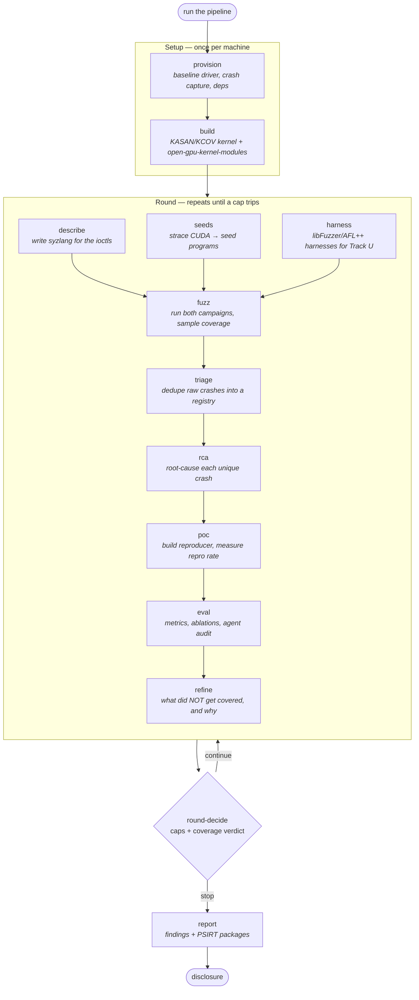
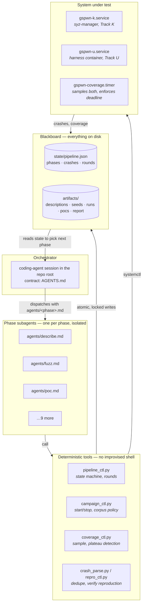
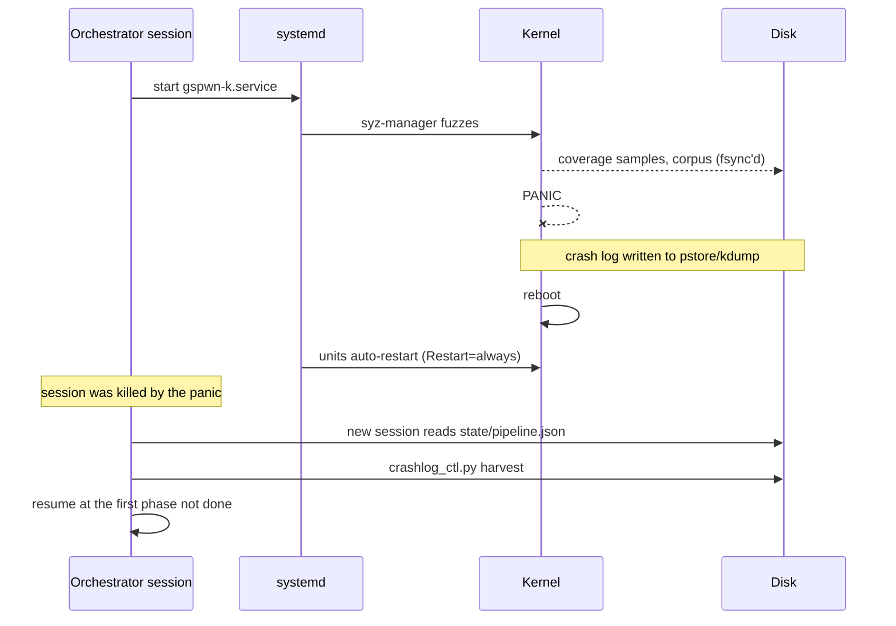

# gspwn

Autonomous bug-hunting against the NVIDIA GPU kernel driver and the NVIDIA
Container Toolkit, driven by AI agents instead of a human operator.

[](LICENSE)
[](https://www.python.org/)

You start a coding-agent session in this repo on a cloud GPU box and tell it to
run the pipeline. It provisions the machine, builds an instrumented kernel,
writes the fuzzing grammar for NVIDIA's undocumented driver interface, fuzzes
both attack surfaces for days, triages the crashes, root-causes them, builds
working reproducers, measures how often each one actually reproduces, and
writes the report. It stops itself when it hits a cap you set or when it stops
finding anything new.

Everything it claims is backed by a reproducer that runs. Nothing gets into the
report because an agent said so.

---

## Contents

- [What it attacks](#what-it-attacks)
- [Why this is hard](#why-this-is-hard-and-what-the-research-bet-is)
- [The pipeline](#the-pipeline)
- [Architecture](#architecture)
- [The improvement loop](#the-improvement-loop)
- [Surviving kernel panics](#surviving-kernel-panics)
- [Why so much of this repo is about not lying](#why-so-much-of-this-repo-is-about-not-lying)
- [Repo layout](#repo-layout)
- [Configuration and cost control](#configuration-and-cost-control)
- [Quickstart](#quickstart-ec2)
- [Tests](#tests)
- [Threat model](#threat-model)
- [Responsible disclosure](#responsible-disclosure)

---

## What it attacks

Two separate pieces of software, referred to throughout as **Track K** (kernel)
and **Track U** (userspace).



**Track K** is the GPU driver itself. Any program that uses your GPU opens a
device node like `/dev/nvidia0` and drives it with `ioctl()` calls — "here's a
command number and a blob of data, go do something." That code runs in the
kernel, so a memory-safety bug there is a privilege escalation. The attacker
model is a tenant inside a GPU-enabled container, who gets exactly those device
nodes and nothing else.

**Track U** is the glue that sets GPU containers up. It matters because it runs
**as root** during container initialization, before isolation is fully in
place, and it parses input the attacker controls. Parsing hostile data as root
is a classic bug farm — CVE-2024-0132 lived in this exact area. The C library
`libnvidia-container` is the memory-safety target; the Go components are fuzzed
for panics and DoS only, since Go is memory-safe and claiming otherwise would
be dishonest.

## Why this is hard, and what the research bet is

The technique is **fuzzing**: generate millions of malformed inputs, feed them
to the target, watch for crashes. For the kernel this uses
[syzkaller](https://github.com/google/syzkaller), the standard Linux kernel
fuzzer. The kernel is rebuilt with two features turned on:

| Instrumentation | What it does | Why it's needed |
|---|---|---|
| **KCOV** | Reports which kernel code each input reached | The fitness signal. Inputs that reach new code get kept and mutated further — this is what makes fuzzing smarter than random |
| **KASAN** | Detects memory errors at the moment they happen | Without it a heap overflow corrupts memory silently and crashes minutes later somewhere unrelated, and you can't tell what happened |

Two problems stand between you and actually fuzzing this driver.

**Problem 1: syzkaller can't fuzz what it can't describe.** It needs a grammar
— written in a language called *syzlang* — declaring what each ioctl takes:
struct layout, field types, which arguments are handles produced by earlier
calls. NVIDIA's driver exposes hundreds of ioctls with no public descriptions.
Writing them means reading driver headers and source and translating by hand.
It is slow, expert work, and it is the reason this surface stays under-fuzzed.

**Problem 2: random input never gets deep.** Real GPU work is a chain — open
the control device, allocate a client object, allocate a device under it, then
a memory context, then a channel. Each step needs a handle returned by the
previous one. Random bytes never build a valid chain, so the fuzzer bounces off
the entry points and never reaches the interesting code.

This repo's bet is that an agent can do both jobs:

- **`describe`** reads the open-source driver headers and writes the syzlang
  descriptions.
- **`seeds`** runs a real CUDA workload under `strace`, captures the actual
  ioctl sequence, and converts it into seed programs that hand the fuzzer a
  valid object chain to start mutating from.

Whether that actually works is the thing being measured — see
[not lying](#why-so-much-of-this-repo-is-about-not-lying).

## The pipeline

Twelve phases. Two run once per machine, nine run once per **round**, and the
report runs once at the very end.



`describe`, `seeds` and `harness` are independent of each other and may run in
parallel once `build` is done. Everything after `fuzz` is strictly sequential.

Each phase has a **gate** — a concrete, checkable condition — and the
orchestrator refuses to advance until it has seen the evidence itself:

| Phase | Gate to advance |
|---|---|
| provision | manifest written; crash capture verified READY; a test panic was captured |
| build | booted into the instrumented kernel; KASAN state matches the manifest; `nvidia-smi` works |
| describe | syzlang compiles; a smoke run provably reaches the driver |
| seeds | seed programs exist and parse under syz-manager |
| harness | Track U harnesses build and produce coverage on their seeds |
| fuzz | both campaigns active; coverage increases within the smoke window |
| triage | every raw crash registered as unique, duplicate or flagged |
| rca | a root-cause writeup exists for every crash selected for a PoC |
| poc | every unique crash has a measured reproduction rate and a classification |
| eval | metrics exist for all configured runs and ablations |
| refine | gap list and next-round worklist written; round outcome recorded |
| report | report and PSIRT packages exist; disclosure status recorded |

A phase that fails its gate is marked `blocked` and the pipeline **stops**. It
does not skip ahead to keep looking productive.

## Architecture

Four layers. The important rule is the boundary between the second and third:
**agents reason, tools act.**



**Orchestrator.** A session that has read `AGENTS.md`. It coordinates and does
no phase work itself. It asks `pipeline_ctl.py next` what to do, spawns the
right subagent, checks the gate, records the result.

**Subagents.** One per phase, prompted from `agents/<phase>.md`. They are
isolated — no talking to each other — and they hand off *paths*, not
conversation transcripts. That is what keeps the pipeline resumable: any agent
can be replaced mid-run and the next one picks up from disk.

**Tools.** Every action that touches the build, the campaign, the crash data or
the state file goes through Python in `tools/`. An agent decides *which* ioctl
to model; a script does the building, parsing and verifying. This is why the
results are reproducible rather than dependent on what some agent improvised.

**Blackboard.** `state/pipeline.json` plus the `artifacts/` tree. Nothing
pipeline-relevant lives in the conversation. Writes are atomic, fsync'd, and
protected by a lock so parallel subagents can't clobber each other.

## The improvement loop

Syzkaller already has an inner feedback loop: mutate an input, measure coverage
with KCOV, keep whatever reaches new code. That loop is good at exploring
*within* what it has been told about. It cannot notice "there is an entire
ioctl family nobody wrote a description for."

So there is an outer loop around it, and that outer loop is the point of the
project.


Each round ends by asking what *didn't* get covered and sorting every gap by
**why**:

- **unmodeled** — no description exists, so the fuzzer never generated the call
- **mismodeled** — a description exists but calls get rejected before reaching
  real work, usually a wrong struct or a bad constraint
- **unreachable-by-construction** — needs an object chain random generation
  won't build, so it needs a traced seed
- **out of scope** — lives behind GSP firmware, which can't be instrumented at
  all; recorded so the coverage claims stay honest

That becomes a worklist, which is carried into the next round **through the
state file**, not by filename convention, so the next round's agents read it
with `pipeline_ctl.py worklist` instead of guessing. Meanwhile the run's
evolved corpus is promoted into a persistent seed bank, so round 3 starts from
everything rounds 1 and 2 learned rather than from zero.

**When it stops.** A sampler records the coverage curve for both tracks. If
edge growth over the trailing window falls below the configured threshold, the
round has *plateaued*. The loop stops on plateau, on the round cap, or on the
run-hour budget. It also stops if the coverage verdict is `unknown` — a broken
sampler must never be able to authorize another blind campaign. A round counts
as still learning if **either** track is still finding edges.

## Surviving kernel panics

The whole point is crashing the kernel. When the fuzzer finds a good bug the
machine panics and reboots — and since the orchestrator runs on that same
machine, the agent session dies with it.



Concretely, that means: fuzzers run as systemd units with `Restart=always` so
they outlive the session; crash logs land in persistent storage that survives
the reboot; state writes are tempfile + fsync + atomic rename, so a panic
mid-write leaves the previous good file rather than a truncated one; and the
campaign carries a **deadline on disk**, so a run that was supposed to last 24
hours still ends on time even if it rebooted four times and nobody was
watching.

## Why so much of this repo is about not lying

This is the part that would surprise you reading the source. A large fraction
of the code exists to stop the system from overstating its own results, because
an agent that confidently reports a use-after-free it cannot reproduce is worse
than useless.

**Every finding needs a reproducer that actually runs.** `repro_ctl.py` compiles
it, runs it N times from a clean boot, and records a measured rate: `reliable`
at 80% or better, `flaky` below that, `unreproducible` at zero. Flaky is a
legitimate, reportable outcome — races and use-after-frees land there — and it
is reported as flaky, never rounded up.

**The measurement refuses to flatter itself.** Runs that produce no honest
verdict are voided rather than guessed: an interrupted run only counts as a
reproduction if the boot ID changed, meaning the machine really went down, and
a dmesg ring buffer that wrapped past the anchor voids the run instead of
matching an *earlier* run's crash report. If every run comes back void, no rate
is recorded at all and the tool exits non-zero.

**Gates are checked, not asserted.** The orchestrator marks a phase done only
after seeing the evidence on disk. A phase whose evidence can't be confirmed is
`blocked`, not `done`.

**Agent errors are treated as data.** The `rca` phase tags claims it hasn't
verified against source as `[UNVERIFIED]`, and the `eval` phase re-checks a
sample of them and logs how often the agent was wrong. That number is a result
worth publishing, not something to bury.

**Known blind spot, stated everywhere.** On modern GSP-based GPUs a large part
of the driver's logic runs in closed-source firmware that KASAN and KCOV cannot
instrument. Coverage is therefore reported as *kernel-side reachable code only*
— never as total driver coverage — and firmware errors are harvested as a
secondary signal.

**The experiments are built to be able to fail.** The ablations compare
agent-written descriptions against manually refined ones, trace-derived seeds
against no seeds, and the whole thing against vanilla syzkaller. Each arm runs
in its own workdir with its own corpus, because two arms sharing a corpus
aren't independent and the comparison would be meaningless. A flat result is
reported as a flat result.

## Repo layout

| Path | What lives there |
|---|---|
| `AGENTS.md` | The orchestrator contract. Reading it is what turns a session into the orchestrator |
| `agents/*.md` | One prompt per phase — the actual instructions each subagent runs on |
| `tools/*.py` | Deterministic tools. Everything that acts on the system |
| `config/campaign.yaml` | Every tunable and every spend cap, in one file |
| `state/pipeline.json` | The blackboard: phase statuses, crash registry, rounds, disclosure status |
| `artifacts/` | Everything produced at runtime — descriptions, seeds, runs, crashes, PoCs, report. Gitignored |
| `docs/` | Runbook, design spec, implementation record |

The tools, briefly:

| Tool | Job |
|---|---|
| `gspwn_config.py` | Loads and validates `campaign.yaml`. Single source of truth for every cap |
| `pipeline_ctl.py` | The state machine: phases, rounds, crash registry, loop decisions |
| `campaign_ctl.py` | Installs and controls the fuzz campaigns; corpus policy; campaign deadline |
| `coverage_ctl.py` | Samples both tracks, detects plateau, compares runs |
| `corpus_ctl.py` | Promotes a run's corpus into the persistent seed bank |
| `crash_parse.py` / `crashlog_ctl.py` | Turns raw crashes and post-panic logs into registry entries |
| `repro_ctl.py` | Extracts reproducers and measures reproduction rate |
| `trace2seed.py` | Converts an strace of a CUDA workload into seed programs |
| `build_kernel.sh` | Builds the KASAN/KCOV kernel and the open-source driver modules |
| `cost_ctl.py` | Idle watchdog that stops the cloud instance when nothing is fuzzing |
| `selftest.py` | 104 offline tests for all of the above |

## Configuration and cost control

This thing runs unattended, on a paid GPU instance, and deliberately crashes
the machine. So every limit lives in one file — `config/campaign.yaml` — and
you set it before you start:

```yaml
loop:
  max_rounds: 3              # hard cap, whatever coverage does
  max_total_run_hours: 216   # total across every campaign
  campaign_hours: 24         # each campaign self-stops after this
  stop_on_plateau: true
cost:
  idle_stop_minutes: 120     # stop the box when no fuzzer is running
  monthly_budget_usd: 0      # record your ceiling
  budget_alerts_usd: [50, 150]
```

Check what actually took effect before launching anything:

```bash
python3 tools/gspwn_config.py
```

An unknown key is a hard error, not a warning — a typo in a cap must never
silently fall back to the default while you believe the cap took effect. Values
are range-checked, and combinations that would quietly break the loop (a
campaign longer than the total budget; a plateau window too short to ever hold
enough samples) are rejected outright.

Once those are set, nothing asks you anything. Campaigns stop themselves on
their deadline, round outcomes are measured from the recorded curve rather than
typed in by an agent, and the loop halts on the first cap that trips.

## Quickstart (EC2)

Full runbook: [docs/cloud-setup.md](docs/cloud-setup.md). The short version:

1. Launch a spot `g4dn.2xlarge` — 8 vCPU, 32 GB, one T4. Turing is GSP-based,
   so `open-gpu-kernel-modules` is supported. Use the official Debian 12 AMI.
2. `git clone` this repo on the instance.
3. Set your caps in `config/campaign.yaml` and confirm them with
   `python3 tools/gspwn_config.py`.
4. Install the cost guardrail: `sudo python3 tools/cost_ctl.py install-watchdog`.
5. Open a coding-agent session in the repo root and say **"run the pipeline"**.
   `AGENTS.md` makes it the orchestrator.
6. Snapshot the provisioned instance to an AMI once `build` is done. Every
   later campaign launches from that image, so re-provisioning costs nothing.

## Tests

The deterministic tools have an offline self-test — no GPU, no kernel build, no
root, no network:

```bash
python3 tools/selftest.py
```

It covers state durability and locking, the round/loop state machine and its
stop conditions, plateau detection across both tracks, crash dedup and
flagging, the strace→syz-program conversion, seed packing, reproduction
bookkeeping, the config contract, and the CLI end to end.

It deliberately does **not** cover anything touching the system under test —
kernel builds, systemd units, crash harvesting, real reproduction. Those are
exercised by the phase gates on the target machine, and pretending otherwise
would be the same dishonesty the rest of the repo is built to avoid.

## Threat model

- **Track K:** the attacker is an unprivileged container tenant with access to
  `/dev/nvidiactl`, `/dev/nvidiaX`, `/dev/nvidia-uvm[-tools]` and `/dev/dri/*`
  — exactly what a GPU-enabled container gets. Syzkaller's `sandbox: namespace`
  approximates those privileges; the approximation and its limits are spelled
  out in the design spec.
- **Track U:** the attacker controls the container image. The code under test
  runs as root during container initialization, before isolation is fully
  enforced. Attacker-controlled inputs are the OCI config, hooks, environment
  variables, mounts and CDI device specs.
- **Disclosed blind spot:** on GSP-based GPUs the Resource Manager runs in
  closed-source GSP firmware, which KASAN/KCOV cannot instrument. Coverage is
  reported as kernel-side reachable code only, and `NVRM:`/GSP firmware errors
  are harvested as a secondary crash signal.

## Docs

- [docs/index.md](docs/index.md) — index of the full documentation set
- [docs/architecture.md](docs/architecture.md) — data model, crash lifecycle, run layout, coverage internals, how to extend
- [docs/cloud-setup.md](docs/cloud-setup.md) — EC2 operational runbook
- [Design spec](docs/superpowers/specs/2026-08-12-nvidia-driver-fuzzing-workflow-design.md) — architecture, phases, gates, threat model, paper framing
- [Implementation plan](docs/superpowers/plans/2026-08-12-nvidia-fuzzing-workflow.md) — task-by-task build record

## Responsible disclosure

Confirmed findings go to NVIDIA PSIRT before any publication. A PSIRT-ready
package — reproducer, root-cause analysis, affected versions — is assembled per
finding, and disclosure status is tracked in `state/pipeline.json`. Nothing is
published before that process completes.

This is authorized-security-research tooling. Run it only on systems you own or
have explicit permission to test. Kernel panics are an expected outcome. That
is the point.

## Status

Pre-publication research. The repo carries the orchestrator contract, the phase
prompts, the tools and the config templates. The syzlang descriptions, seeds
and harnesses are generated by the agents at runtime on the target machine and
land in the gitignored `artifacts/` tree.

The work extends Interrupt Labs' internship research on
[fuzzing the NVIDIA GPU drivers](https://www.interruptlabs.co.uk/articles/fuzzing-the-nvidia-gpu-drivers).
The contribution here is the agentic layer: an agent writing the interface
descriptions and trace-derived seeds that this surface has always been short
of, and an honest measurement of whether that works.

## License

MIT. See [LICENSE](LICENSE).
