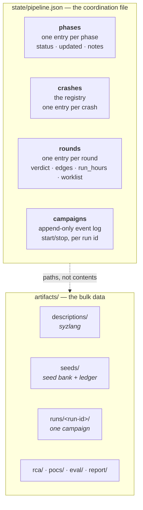
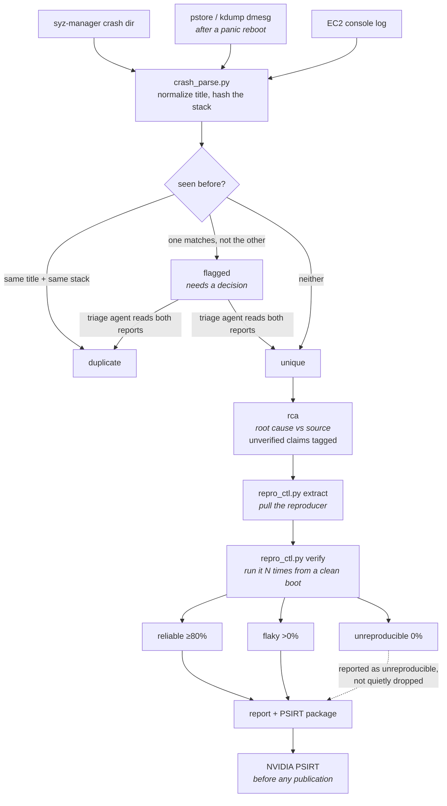

# Architecture reference

The [README](../README.md) explains what the pipeline does and why. This
document is the level below that: the data model, the on-disk layout, and the
lifecycle of a crash. Read it if you are modifying the tools or trying to
work out where a number in the report came from.

## The blackboard

There is no shared memory between agents and no message passing. Every agent
reads and writes the same two places on disk, and that is the entire
coordination mechanism.



`state/pipeline.json` holds only small, structured facts — statuses, counts,
verdicts, and *paths into* `artifacts/`. Bulk output never goes in the state
file. That keeps the file small enough to rewrite atomically on every update.

### Phase statuses

`pending` → `in_progress` → `done`, or `blocked` / `failed`.

`blocked` and `failed` stop the walk. `next_phase()` returns the first phase
that is not `done`, so a blocked phase is returned forever until someone deals
with it — the pipeline cannot route around a failure to keep making progress.

### Crash statuses

| Status | Meaning | Set by |
|---|---|---|
| `unique` | A distinct crash, awaiting or undergoing analysis | triage |
| `duplicate` | Same bug as another entry; carries `duplicate_of` | triage |
| `flagged` | Dedup heuristics disagreed; needs a human-grade decision | crash_parse, resolved in triage |
| `reliable` / `flaky` / `unreproducible` | Measured reproduction outcome | repro_ctl |
| `rca_done` | Root cause written | rca |
| `reported` | Included in the report | report |

Disclosure is tracked separately: `pending` → `submitted` → `resolved`, or
`not_applicable`.

### Rounds

Each round records what it measured and what it produced:

| Field | Where it comes from |
|---|---|
| `coverage_verdict` | `growing` / `plateaued` / `unknown`, computed from the coverage curve |
| `edges_start`, `edges_end` | Track K edge counts, first and last sample |
| `run_hours` | Measured span of the recorded samples — **this is the budget the loop enforces** |
| `new_crashes` | Registry growth since previous rounds accounted for theirs |
| `run_ids` | Every campaign attached to this round |
| `worklist` | What this round's `refine` produced |
| `worklist_in` | What this round must execute, carried from the previous round |
| `decision` | `continue` / `stop`, with a recorded reason |

`worklist` → `worklist_in` is the learning handoff. `round-advance` copies one
to the other so the next round's `describe` and `seeds` agents can find their
input with `pipeline_ctl.py worklist` instead of guessing a run id.

## Durability and concurrency contract

The pipeline runs on a machine that panics on purpose, with parallel subagents
writing to one file. Two rules make that safe, and both are tested in
`selftest.py`:

**Every write is atomic.** `save()` writes to a tempfile in the same
directory, `fsync`s it, `os.replace()`s it into position, then `fsync`s the
parent directory. A panic at any point leaves either the old file or the new
one, never a truncated one.

**Every read-modify-write holds a lock.** `transaction()` takes an exclusive
`flock` for the whole cycle:

```python
with ps.transaction() as st:
    st["crashes"][cid]["status"] = "reliable"
```

A bare `load()` / `save()` pair is a bug — two agents doing that will silently
lose each other's updates. An exception inside the block aborts the write and
leaves the file untouched.

## The lifecycle of a crash

This is the path every finding takes, and the point where each claim becomes
checkable.



The `flagged` state exists because dedup heuristics disagree in both
directions — same crash title with a different stack, or the same stack under
a different title. Either can be a real second bug or the same bug reported
twice. Every flag must end in an explicit decision; an unreviewed flag is an
open gate item, not a default-distinct crash.

### What `verify` actually counts

Reproduction rate is `hits / counted runs`, and the tool is deliberately
pessimistic about what counts:

- A run that leaves the machine up and shows a matching crash signature in the
  dmesg delta is a **hit**.
- A run interrupted with no verdict is a hit **only if the boot ID changed** —
  meaning the machine really went down. Same boot means the process died
  locally (Ctrl-C, OOM kill, a reproducer that won't exec), which says nothing
  about the bug and is **void**.
- A dmesg ring buffer that wrapped past the anchor is **void**, because the
  remaining buffer holds *earlier* runs' crash reports and scanning it would
  score a hit on every subsequent run.
- Void runs are excluded from both sides of the ratio and re-run. If every run
  is void, no rate is recorded and the tool exits non-zero.

## Run directory layout

Every campaign is isolated. This is not cosmetic: the eval reports variance
across independent runs, and two runs sharing a workdir share an evolved
corpus, which makes them not independent and contaminates every ablation arm.

```
artifacts/runs/<run-id>/
├── syz-manager.cfg          generated, never hand-written
├── deadline                 epoch second the campaign self-stops at
├── coverage.csv             Track K curve, one row per sample
├── coverage-u.csv           Track U curve
├── workdir/
│   └── corpus.db            syz-manager's ONLY corpus input
└── u/
    └── <harness-name>/
        ├── fuzzer_stats     AFL++ stats — the Track U edge signal
        └── queue/           corpus entries
```

Run ids are `r<round>-<track><n>`, e.g. `r2-k1`. They are never reused.

### Corpus policy

| Policy | Effect |
|---|---|
| `--corpus fresh` | Empty corpus. Required for the vanilla-baseline ablation arm |
| `--corpus carry --from-run <id>` | Copies the previous run's `corpus.db`. This is how a round builds on the last |
| `--seeds artifacts/seeds` | Packs the seed bank into `corpus.db` with `syz-db pack`, merging with anything carried |

The seed bank at `artifacts/seeds/` outlives every run. `corpus_ctl.py promote`
adds coverage-advancing programs from a finished run, deduplicated by content
hash and tracked in `promoted.json`, so repeated promotion converges instead of
growing without bound. A promotion that adds nothing new is direct evidence the
round stopped learning.

## Coverage sampling

A single systemd timer (`gspwn-coverage.timer`) does three jobs on each tick,
at `loop.coverage_sample_min` intervals:

1. Sample Track K from syz-manager's HTTP stats endpoint.
2. Sample Track U by summing AFL++ `fuzzer_stats` across the run's harness
   dirs.
3. Check the campaign deadline and stop the campaign if it has elapsed.

One timer covers all three because it is the run's heartbeat, and it survives
reboots — so a campaign cannot outlive its window just because the agent
session died.

**Track K sources, in order of preference:** the JSON stats endpoint, then
scraped dashboard HTML, then `corpus.db` size. The source used is written into
every CSV row, because syz-manager's HTTP surface has changed across syzkaller
versions and a silently degraded source would otherwise look like real data.
`corpus.db` size is recorded in its own `corpus_bytes` column — never in
`corpus`, which is a program count — so a file size can never be charted as if
it were coverage.

**Track U** has no equivalent of KCOV edges across harnesses; each harness
keeps its own bitmap, so the edge figure is a *sum across harnesses* and is a
per-run trend line, not a claim about one target's coverage. libFuzzer
harnesses write no `fuzzer_stats` at all; those report corpus count with no
edge figure and say so in the source column rather than letting corpus size
stand in for coverage.

### The plateau test

Growth is measured over the trailing `plateau_window_min` of the curve:

```
growth = (edges_at_end - edges_at_window_start) / edges_at_window_start
plateaued  if  growth < plateau_min_growth
```

`unknown` is a real answer, returned when there are fewer than three usable
samples, when the samples span less than the window, or when there is no
non-zero edge baseline. The loop treats `unknown` as a **stop**, so a broken
sampler can never authorize another campaign.

The verdict the loop acts on combines both tracks: the round is still learning
if **either** track is still finding edges. A track that was never sampled is
ignored rather than forcing `unknown` — an absent Track U must not veto a
healthy Track K verdict — but if no track has data at all, the answer is
`unknown`.

## Extending the pipeline

**Adding a phase.** Add it to `PHASES` in `pipeline_state.py` (in
`SETUP_PHASES`, `ROUND_PHASES` or `FINAL_PHASES` as appropriate), write
`agents/<phase>.md`, and add a row to the gate table in `AGENTS.md`. The
ordering validation in `validate()` picks it up automatically.

**Adding a tunable.** Add it to `DEFAULTS` in `gspwn_config.py` — that dict is
the schema, and anything not in it is rejected as an unknown key. Add a
validation rule if a bad value would cost money or invalidate a measurement.
Never read a constant from anywhere else; a value duplicated into a tool is a
value that will drift from the config file.

**Adding a tool.** Import `pipeline_state` for state access and use
`transaction()` for anything that mutates. Add offline tests to
`selftest.py` — it must keep passing with no GPU, no root, and no network.
