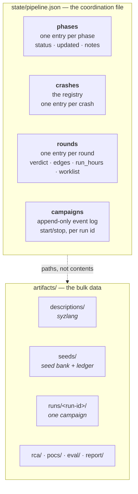
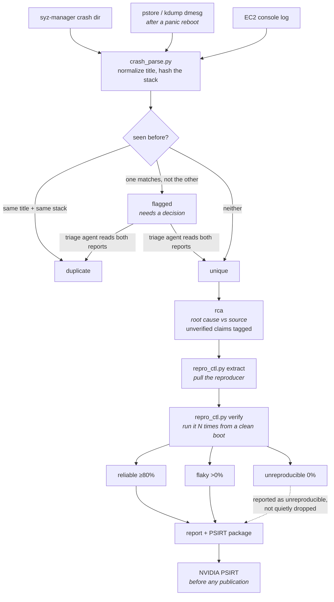

# Architecture reference

The [README](../README.md) explains what the pipeline does and why. This
document covers the level below that: the data model, the on-disk layout, and
the lifecycle of a crash. It is the reference for modifying the tools or
tracing a number in the report back to its source.

## The blackboard

There is no shared memory between agents and no message passing. Every agent
reads and writes the same two places on disk, and that is the entire
coordination mechanism.



`state/pipeline.json` holds only small, structured facts — statuses, counts,
verdicts, and *paths into* `artifacts/`. Bulk output never goes in the state
file. That keeps the file small enough to rewrite atomically on every update.

A second state file sits beside it: `state/spend.json`, the run-hour ledger,
keyed by run id and written under its own lock. `pipeline.json` follows the
`GSPWN_STATE` redirect so a side run can keep its own registry, but the
run-hour cap belongs to the machine rather than to whichever registry is in
use, so the ledger ignores that redirect. It also fails closed: if the state
file records hours and no ledger is present, every command that reads it
refuses instead of presenting a spent cap as untouched.
`pipeline_ctl.py spend-init` rebuilds it from the state file.

### Phase statuses

`pending` → `in_progress` → `done`, or `blocked` / `failed`.

`blocked` and `failed` stop the walk. `next_phase()` returns the first phase
that is not `done`, so a blocked phase is returned forever until someone deals
with it — the pipeline cannot route around a failure to keep making progress.

### Crash statuses

| Status | Meaning | Set by |
|---|---|---|
| `unique` | A distinct crash, awaiting or undergoing analysis | triage |
| `duplicate` | Same bug as another entry; carries `duplicate_of` | triage |
| `flagged` | Dedup heuristics disagreed; needs a human-grade decision | crash_parse, resolved in triage |
| `reliable` / `flaky` / `unreproducible` | Measured reproduction outcome | repro_ctl |
| `rca_done` | Root cause written | rca |
| `reported` | Included in the report | report |

Disclosure is tracked separately: `pending` → `submitted` → `resolved`, or
`not_applicable`.

### The research record

Every analysed crash carries a `finding`: the structured record `rca` produces
alongside its prose write-up. The prose is what the report is built from; the
record is what the *next round* can act on.

| Field | What reads it |
|---|---|
| `subsystem` | `refine` groups by it; it is the key of the per-subsystem rollup |
| `bug_class`, `trigger` | closed vocabularies (`pipeline_state.BUG_CLASS`, `TRIGGER`) so records from different rounds group together |
| `ioctls` | the calls the reproducer made, in call order — `describe` models a sequence, not a set |
| `preconditions` | the object state that had to exist first; `seeds` builds exactly this |
| `adjacent` | calls **not** exercised that share an object, lock, refcount or teardown path — the highest-value field, and nothing else in the pipeline derives it |
| `source_refs`, `hypothesis`, `confidence` | the report, and the next round's `rca` |

A record is refused if it names no `subsystem`, or if `ioctls`,
`preconditions` and `adjacent` are all empty. A taxonomy with nothing to
target would let the feedback edge look wired while carrying nothing, and the
failure would be silent for the rest of the campaign. Not `ioctls` alone:
Track U findings are userspace and have none.

`validate` reports an `rca_done` crash with no record as an integrity problem.
The analysis happened and nothing survived it, which is the exact failure this
whole path exists to prevent.

Records from `duplicate` crashes are excluded from `findings()`. They describe
the same bug as their surviving entry, so counting both would weight a
subsystem by how many times the fuzzer happened to rediscover one bug.

### Rounds

Each round records what it measured and what it produced:

| Field | Where it comes from |
|---|---|
| `coverage_verdict` | `growing` / `plateaued` / `unknown`, computed from the coverage curve |
| `edges_start`, `edges_end` | Track K edge counts, first and last sample |
| `run_hours` | Measured span of the recorded samples — **this is the budget the loop enforces** |
| `new_crashes` | Registry growth since previous rounds accounted for theirs |
| `run_ids` | Every campaign attached to this round |
| `worklist` | What this round's `refine` produced |
| `worklist_in` | What this round must execute, carried from the previous round |
| `decision` | `continue` / `stop`, with a recorded reason |

`worklist` → `worklist_in` is the learning handoff. `round-advance` copies one
to the other so the next round's `describe` and `seeds` agents can find their
input with `pipeline_ctl.py worklist` instead of guessing a run id.

Two signals travel that road, tagged per item so the receiving agent can tell
them apart:

- `[coverage]` — derived from the run's own curve. Where the fuzzer has not
  been.
- `[finding crash-NNNN]` — derived from a research record's `adjacent` and
  `preconditions`. Where a bug has already been.

Coverage alone widens the surface indefinitely and never returns to a place
that yielded. That is the difference between a fuzzing pipeline and a research
loop, and it is one payload on a road that already existed.

## Surviving a panic

This pipeline crashes its own machine on purpose, so every moving part has to
come back on its own. Each one is a systemd unit:

| Part | Unit | Comes back |
|---|---|---|
| syz-manager (Track K) | `gspwn-k.service`, `Restart=always` | Yes |
| Track U container | `gspwn-u.service`, `Restart=always` | Yes |
| Coverage sampler | `gspwn-coverage.timer` | Yes |
| Campaign deadline | `gspwn-deadline@<run-id>.timer` | Yes |
| The agent driving all of it | `gspwn-orchestrator.service` | Yes |

The last row was the gap. The fuzzers restarted after every panic and kept
producing crashes, but the agent's session was gone and `AGENTS.md`'s resume
procedure sat waiting for a human to SSH in and type it.

The hard part was already solved: a fresh agent needs no memory of the old
session, because `pipeline_ctl.py next` tells it where the pipeline is. **The
state file is the orchestrator's memory.** What was missing was only a process
supervisor, which is what `orchestrator_ctl.py install` writes.

### The circuit breaker

An always-restarting agent is a token bill with no ceiling, so
`orchestrator_ctl.py run` counts two things separately before launching
anything:

- **Same-boot starts.** The agent keeps exiting and being restarted while the
  machine stays up. Nothing is progressing and each restart costs tokens.
- **Reboots.** The machine keeps going down. Kernel fuzzing panics the box by
  design, so this is not inherently wrong. It is a problem only when reboots
  arrive faster than a round can progress between them, which is why the limit
  is separate and higher.

One shared counter would either stop a healthy panicky campaign or let a
same-boot loop run all night. Both limits and the window come from
`orchestrator:` in `config/campaign.yaml`.

A tripped breaker is recorded in `state/orchestrator.json` and the run exits
`78`, which the unit names in `RestartPreventExitStatus`, so systemd stops
instead of restarting into the same wall. `orchestrator_ctl.py status` shows
why; `reset` clears it after the cause is fixed.

The same exit is used when the pipeline is complete and when a phase is
`blocked`. Relaunching an agent into either spends tokens to reach an answer
that will not change.

`state/orchestrator.json` is machine-global and does not follow `GSPWN_STATE`,
for the same reason the spend ledger does not: a run with its own state file
must not also get a fresh, empty breaker.

## Durability and concurrency contract

The pipeline runs on a machine that panics on purpose, with parallel subagents
writing to one file. Two rules make that safe, and both are tested in
`selftest.py`:

**Every write is atomic.** `save()` writes to a tempfile in the same
directory, `fsync`s it, `os.replace()`s it into position, then `fsync`s the
parent directory. A panic at any point leaves either the old file or the new
one, never a truncated one.

**Every read-modify-write holds a lock.** `transaction()` takes an exclusive
`flock` for the whole cycle:

```python
with ps.transaction() as st:
    st["crashes"][cid]["status"] = "reliable"
```

A bare `load()` / `save()` pair is a bug — two agents doing that will silently
lose each other's updates. An exception inside the block aborts the write and
leaves the file untouched.

## The lifecycle of a crash

The path every finding takes, from raw log to disclosure package.



The `flagged` state exists because dedup heuristics disagree in both
directions — same crash title with a different stack, or the same stack under
a different title. Either can be a real second bug or the same bug reported
twice. Every flag must end in an explicit decision; an unreviewed flag is an
open gate item, not a default-distinct crash.

### The `signal` field, and why Xids need one

A fuzzer generates illegal instructions and bad pointers on purpose, and the
driver reports exactly that as Xid 13 and Xid 31. Harvesting every `NVRM:`
line as a finding buries the interesting entries under thousands of rows and
makes any "crashes found" number meaningless.

So every NVRM registration carries a `signal` set from its Xid number, using
the table in `crash_parse.XID_CLASS`:

| `signal` | Meaning | What triage does |
|---|---|---|
| `noise` | The fuzzer caused it by design (13, 31, 43, 45, 8, 69) | Not a finding; not counted |
| `signal` | Memory-integrity or firmware boundary (ECC classes, 119/120 GSP, 32 push buffer) | Queue for RCA |
| `health` | The GPU or box is degraded (79 fallen off the bus, NVLink, page retirement) | Not a finding; the measurement path is broken |
| `review` | Anything else, **including every Xid not in the table** | Read it before deciding |
| `unclassified` | Not an NVRM entry, or an NVRM line with no Xid number | No verdict was made |

The default for an unrecognized Xid is `review`, never `noise`. A driver
branch can introduce an Xid this table predates, and defaulting it to exhaust
would silently discard the one class of finding the campaign exists to
produce. Filter with `pipeline_ctl.py crash-list --signal <class>`.

The numbers come from NVIDIA's published Xid documentation, not from this
repo's sources; confirm them against the branch under test before leaning on
a classification in a report.

### What `verify` actually counts

Reproduction rate is `hits / counted runs`. What counts is deliberately
narrow:

- A run that leaves the machine up and shows a matching crash signature in the
  dmesg delta is a **hit**.
- A run interrupted with no verdict is a hit **only if the boot ID changed** —
  meaning the machine really went down. Same boot means the process died
  locally (Ctrl-C, OOM kill, a reproducer that won't exec), which says nothing
  about the bug and is **void**.
- A dmesg ring buffer that wrapped past the anchor is **void**, because the
  remaining buffer holds *earlier* runs' crash reports and scanning it would
  score a hit on every subsequent run.
- Void runs are excluded from both sides of the ratio and re-run. If every run
  is void, no rate is recorded and the tool exits non-zero.

**Track U** verification replays the extracted input through a caller-supplied
command template: `repro_ctl.py verify <id> --track u --cmd '<template with
{input}>'` runs the harness once per run with the input path substituted, and
`--crash-exit N` names a harness exit code that also counts as a
reproduction. `--track` only cross-checks the registry entry; the registry is
authoritative.

`verify` exits 0 with a recorded rate, 2 when the attempt cap left fewer runs
counted than requested (the rate is still recorded, on a short denominator,
and stdout says so), and 1 when no run could be counted at all.

## Run directory layout

Every campaign is isolated. Two runs sharing a workdir share an evolved
corpus, so neither one's coverage curve describes what that run actually
reached.

Only one run's campaign may be live at a time. `install-k` / `install-u`
refuse while another run's units are active or its deadline timer is still
installed — installing over a live run would repoint the global unit names
and retire its deadline enforcement. `--replace` retires the old run first
(stops and disables its units and its deadline timer), then installs the new
one.

```
artifacts/runs/<run-id>/
├── syz-manager.cfg          generated, never hand-written
├── deadline                 epoch second the campaign self-stops at
├── coverage.csv             Track K curve, one row per sample
├── coverage-u.csv           Track U curve
├── workdir/
│   └── corpus.db            syz-manager's ONLY corpus input
└── u/
    └── <harness-name>/
        ├── fuzzer_stats     AFL++ stats — the Track U edge signal
        └── queue/           corpus entries
```

Run ids follow the convention `r<round>-<track><n>`, e.g. `r2-k1`, and are
never reused. The tools enforce this only in one direction: `--corpus fresh`
refuses to install over an existing `corpus.db`, but `--corpus carry` copies
over it — a reused id would destroy the earlier run's corpus, and with it the
run independence the eval protocol depends on.

### Corpus policy

| Policy | Effect |
|---|---|
| `--corpus fresh` | Empty corpus. Ignores whatever earlier rounds built |
| `--corpus carry --from-run <id>` | Copies the previous run's `corpus.db`. This is how a round builds on the last |
| `--seeds artifacts/seeds` | Packs the seed bank into `corpus.db` with `syz-db pack`, merging with anything carried |

The seed bank at `artifacts/seeds/` outlives every run. `corpus_ctl.py promote`
adds coverage-advancing programs from a finished run, deduplicated by content
hash and tracked in `promoted.json`, so repeated promotion converges instead of
growing without bound. A promotion that adds nothing new is direct evidence the
round stopped learning.

## Coverage sampling

Two systemd timers run for each campaign, installed by different tools and
ticking on independent cadences.

**Sampling** — `gspwn-coverage.timer`, installed by `coverage_ctl.py
install-timer`, ticks at `loop.coverage_sample_min` intervals and does two
jobs:

1. Sample Track K from syz-manager's HTTP stats endpoint.
2. Sample Track U by summing AFL++ `fuzzer_stats` across the run's harness
   dirs.

**Deadline enforcement** — `gspwn-deadline@<run-id>.timer`, a template
instance installed per run by `campaign_ctl.py install-k` / `install-u`,
runs `campaign_ctl.py check-deadline --run-id <run-id>` on a fixed 2-minute
cadence. When the campaign's window is up it stops **and disables** the
campaign units, so they cannot come back on the next panic/reboot. Two
properties are deliberate: the cadence is decoupled from
`coverage_sample_min` so raising the sampling interval cannot delay the
deadline stop past the campaign window, and the timer is per-run so
installing run B never retires run A's enforcement.

Both timers survive reboots, so a campaign cannot outlive its window just
because the agent session died.

**Track K sources, in order of preference:** the JSON stats endpoint, then
scraped dashboard HTML, then `corpus.db` size. The source used is written into
every CSV row, because syz-manager's HTTP surface has changed across syzkaller
versions and a silently degraded source would otherwise look like real data.
`corpus.db` size is recorded in its own `corpus_bytes` column — never in
`corpus`, which is a program count — so a file size can never be charted as if
it were coverage.

**Track U** has no equivalent of KCOV edges across harnesses; each harness
keeps its own bitmap, so the edge figure is a *sum across harnesses* and is a
per-run trend line, not a claim about one target's coverage. libFuzzer
harnesses write no `fuzzer_stats` at all; those report corpus count with no
edge figure and say so in the source column rather than letting corpus size
stand in for coverage.

### The plateau test

Growth is measured over the trailing `plateau_window_min` of the curve:

```
growth = (edges_at_end - edges_at_window_start) / edges_at_window_start
plateaued  if  growth < plateau_min_growth
```

`unknown` is a real answer, returned when there are fewer than three usable
samples, when the samples span less than the window, or when there is no
non-zero edge baseline. The loop treats `unknown` as a **stop**, so a broken
sampler can never authorize another campaign.

A flat window over an unhealthy GPU is also `unknown`. Every sample records
the GPU's state in the curve's `gpu` column, probed with `nvidia-smi`. A GPU
that has fallen off the bus (Xid 79) does not stop the fuzzer: syz-manager
keeps executing, the sampler keeps appending rows, and the edge count stops
moving, which looks exactly like a finished round. Only the `plateaued`
reading is gated this way. `growing` needs no guard, because coverage cannot
climb on a card that is not answering, so growth is its own evidence the
probe was only having a bad moment.

Rows from a curve written before the `gpu` column existed report no status,
which counts as unhealthy: absence of evidence that the GPU was alive is not
evidence that it was. Such a run reads `unknown` until its window fills with
newly sampled rows.

The verdict the loop acts on combines both tracks: the round is still learning
if **either** track is still finding edges. A track that was never sampled is
ignored rather than forcing `unknown` — an absent Track U must not veto a
healthy Track K verdict — but if no track has data at all, the answer is
`unknown`.

## Extending the pipeline

**Adding a phase.** Add it to `PHASES` in `pipeline_state.py` (in
`SETUP_PHASES`, `ROUND_PHASES` or `FINAL_PHASES` as appropriate), write
`agents/<phase>.md`, and add a row to the gate table in `AGENTS.md`. The
ordering validation in `validate()` picks it up automatically.

**Adding a tunable.** Add it to `DEFAULTS` in `gspwn_config.py` — that dict is
the schema, and anything not in it is rejected as an unknown key. Add a
validation rule if a bad value would cost money or invalidate a measurement.
Never read a constant from anywhere else; a value duplicated into a tool is a
value that will drift from the config file.

**Adding a tool.** Import `pipeline_state` for state access and use
`transaction()` for anything that mutates. Add offline tests to
`selftest.py` — it must keep passing with no GPU, no root, and no network.
