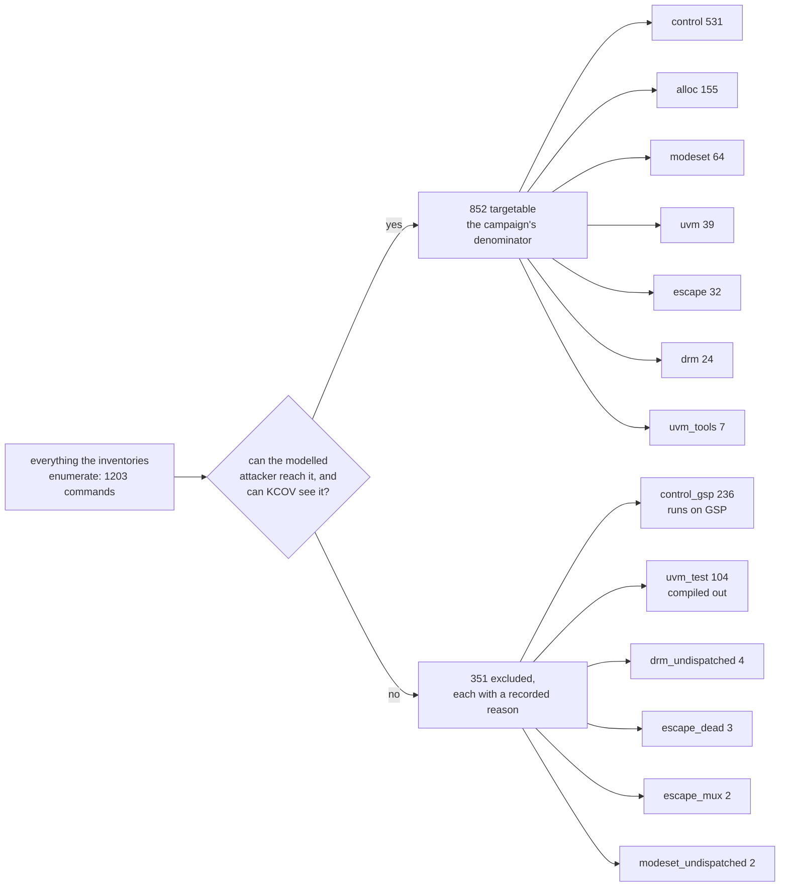
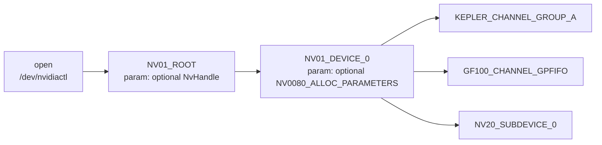

Every number on this page is derived from three checkouts. No GPU took part,
so the inventories describe the source they were built from.

| Tree | Version | Commit |
|---|---|---|
| `NVIDIA/open-gpu-kernel-modules` | `610.57.04` | `e4a5faa2` |
| `NVIDIA/libnvidia-container` | `v1.20.0` | `08cb279` |
| `NVIDIA/nvidia-container-toolkit` | `v1.20.0` | `1780ac69` |

Every file and line number cited on this page and on the pages it links to is
read from those three trees at those commits.

Five tools produce them, and the [Enumerated surface](/gspwn/reference/surface/)
pages render the result one row per enumerated thing.

| Tool | Output |
|---|---|
| [`ioctl_inventory.py`](/gspwn/architecture/components/ioctl-inventory/) | The escape and UVM commands, their parameter structs and their request numbers, and the driver's registered entry points |
| [`ctrl_surface.py`](/gspwn/architecture/components/ctrl-surface/) | The RM control command space and its privilege classification |
| [`object_graph.py`](/gspwn/architecture/components/object-graph/) | The RM object allocation DAG and its chaining depth |
| [`nvkms_inventory.py`](/gspwn/architecture/components/nvkms-inventory/) | The `/dev/nvidia-modeset` command family, its dispatch ordinals and its parameter structs |
| `drm_inventory.py` | The `DRM_NVIDIA_*` command family on `/dev/dri`, with the permission flag and the node each command reaches |

The platform-side detail behind the numbers is in the knowledgebase:
[RM control surface](/gspwn/knowledgebase/rm-control-surface/),
[Resource Manager object model](/gspwn/knowledgebase/rm-object-model/),
[container device access](/gspwn/knowledgebase/container-device-access/) and
[prior vulnerabilities](/gspwn/knowledgebase/prior-vulnerabilities/).

## The measured denominator

A campaign is measured against 852 targets across seven families. The families
are the device-node command spaces the modelled attacker can issue.

| Family | Targetable | Reached through |
|---|---|---|
| `escape` | 32 | `NV_ESC_*` on `/dev/nvidiactl` and `/dev/nvidiaN` |
| `uvm` | 39 | `/dev/nvidia-uvm` |
| `uvm_tools` | 7 | `/dev/nvidia-uvm-tools` |
| `control` | 531 | `NV_ESC_RM_CONTROL`, the multiplexer behind escape 0x2A |
| `alloc` | 155 | `NV_ESC_RM_ALLOC`, one per allocatable class |
| `modeset` | 64 | `/dev/nvidia-modeset` |
| `drm` | 24 | `/dev/dri/card*` and `/dev/dri/renderD*` |

351 further commands are enumerated and excluded, in six groups.

| Excluded | Count | Reason |
|---|---|---|
| `control_gsp` | 236 | The handler is compiled out and the parameter buffer crosses the RPC queue to GSP, where KCOV cannot follow |
| `uvm_test` | 104 | Compiled out unless the module is built with `uvm_enable_builtin_tests=1` |
| `drm_undispatched` | 4 | Declared at 0x19 to 0x1c with no entry in `nv_drm_ioctls[]` |
| `escape_dead` | 3 | Declared with no dispatch case, so no kernel code runs |
| `escape_mux` | 2 | Multiplexers whose leaves are counted in the `control` and `alloc` families |
| `modeset_undispatched` | 2 | Declared and not reached by the modeset dispatcher |

A campaign is complete when every one of the 852 is either exercised by a
corpus program or carries a written reason in the completion ledger. The 351
excluded commands are removed before that ledger opens and never count as work
remaining.

852 is an upper bound on two measured counts. 16 control commands carry a
capability check inside the handler body that the RMCTRL flag word does not
expose, and that figure is itself a floor, because it comes from reading
handlers. 2 DRM commands carry `DRM_MASTER` and reach a handler only while the
opening file is the current DRM master.

Entry points are counted apart from the command total. The driver registers 42
entry points across every `file_operations` table it defines, and 24 of those
belong to the six device nodes whose entry points are modelled. That six counts
the entry-point surface. The command surface covers seven nodes, and
`/dev/nvidia-modeset` is the seventh, opened for the modeset command family with
its own `mmap` and `poll` unmodelled. An entry point carries no method id, no
parameter struct and no inventory row.

## Surface by layer

Six layers make up the driver's ioctl surface, each with a total, the part an
unprivileged tenant reaches, and whether KCOV instruments it.

| Layer | Total | Reachable by an unprivileged tenant | Instrumented by KCOV |
|---|---|---|---|
| RM escapes on `/dev/nvidiactl` and `/dev/nvidiaN` | 34 dispatched | 33 (`RM_LOCKLESS_DIAGNOSTIC` is root-only) | Yes |
| RM control commands behind escape 0x2A | 1372 exported | 767 marked non-privileged | 531 of those have a kernel-side handler |
| RM object classes | 222 | 152 unprivileged, 147 reachable from the client root | Yes |
| UVM commands on `/dev/nvidia-uvm` | 39 | 39 | Yes |
| UVM tools commands on `/dev/nvidia-uvm-tools` | 7 | 7 | Yes |
| UVM test commands | 104 | Compiled out unless the module is built for test | Yes when present |

183 parameter struct sizes were measured by compiling the driver headers. None
were left unresolved, so every request number in the table is computed.

## Control command classification

Five successive filters narrow the 1372 exported control methods to the 531 a
campaign can target.

| Set | Count | Consequence |
|---|---|---|
| Exported control methods | 1372 | The full export table |
| Carrying the `NON_PRIVILEGED` flag | 790 | The flag word admits an unprivileged caller |
| Of those, also carrying `INTERNAL` | 23 | Rejected before the privilege check, so unreachable from an ioctl |
| Classified non-privileged | 767 | 790 less the 23 |
| Carrying `ROUTE_TO_PHYSICAL` with no local handler | 236 of the 767 | The parameter buffer crosses the RPC queue to GSP firmware |
| **Non-privileged with a kernel-side handler** | **531** | The set where a kernel memory-safety bug can exist and coverage can measure it |

531 is the number a round is sized against. A campaign reporting progress
against 1372 measures against a denominator holding 241 internal commands no
ioctl caller reaches, 114 kernel-only commands, 250 privileged commands, and
236 non-privileged commands whose handler runs on GSP firmware KCOV cannot
instrument. Those four groups and the 531 sum to 1372.

### Privilege flag semantics

Three properties of the flag word were established by reading the enforcement
code. Each one inverts or inflates a count when the flag word is read at face
value.

| Rule | Mechanism | Miscount |
|---|---|---|
| An empty flag word means kernel-only | `RMCTRL_FLAGS_NONE` and `RMCTRL_FLAGS_KERNEL_PRIVILEGED` are both `0x0`, and `flags == 0` is rejected below `RS_PRIV_LEVEL_KERNEL` | 114 kernel-only commands read as unrestricted |
| `INTERNAL` outranks `NON_PRIVILEGED` | The `INTERNAL` check in `serverControl_ValidateCookie` runs first and returns `NV_ERR_NOT_SUPPORTED` for every ioctl caller | The reachable set overstates by 23 |
| Object privilege is absent from Required Access Rights | All 222 `RS_ENTRY` records carry `RS_ACCESS_NONE`. The gate is `RS_FLAGS_ALLOC_*` in the Flags field | The whole class table reads as unprivileged |

## Object chaining

A command is aimed at an object, so the owning class must be allocated before
the command can be issued. The 222 allocatable classes occupy five depths below
the open file descriptor.

| Depth from the file descriptor | Classes |
|---|---|
| 1 | 3 |
| 2 | 22 |
| 3 | 45 |
| 4 | 151 |
| 5 | 1 |

151 of the 222 classes are at depth 4. A description set without resource
chaining reaches the 25 classes at depth 1 and 2 and stops. Three allocations
open the widest part of the tree.

| Parent | Classes in its subtree | Unprivileged among them |
|---|---|---|
| `NV01_ROOT` | 214 | 147 |
| `NV01_DEVICE_0` | 197 | 130 |
| `KEPLER_CHANNEL_GROUP_A` | 80 | 78 |
| `GF100_CHANNEL_GPFIFO` | 67 | 66 |
| `NV20_SUBDEVICE_0` | 54 | 39 |

Channel allocation returns the most per description authored and is the hardest
to model, because it requires a GPFIFO buffer and an address space object.

## Reach per allocation

`object_graph.py chains` walks the same tree with the privileged edges removed
and records one chain per owning class in `surface/rm-chains.json`. The
cumulative curve reads how many of the 531 commands an unprivileged process
reaches after N allocations.

| Objects built | Commands unlocked | Share of 531 | Last class added at that count |
|---|---|---|---|
| 1 | 91 | 17% | `RmClientResource` |
| 3 | 315 | 59% | `Device` |
| 4 | 337 | 63% | `VgpuConfigApi` |
| 11 | 430 | 81% | `ProfilerBase` |
| 16 | 464 | 87% | `Memory` |
| 40 | 529 | 100% | `ZbcApi` |

The curve ends at 40 allocations and 529 commands, which is every command an
unprivileged chain reaches.

The greedy step buys the class with the highest command count per allocation
the built set does not already hold, and credits every class allocated along
the way, so the curve rises at an allocation count no single chain has.
`Subdevice` alone owns 182 of the 531, and its three-allocation chain also
builds `RmClientResource` and `Device`, which own 91 and 42, giving 315.

Six readings measure how far chaining reaches. The `RS_ENTRY` table alone
narrows 531 to 516. The NVOC ancestor edge restores the 15 a base class owns,
because a command compiled into a base reaches an object allocated as any
class deriving from it. Privilege then removes 2.

| Reading | Count | Absent classes |
|---|---|---|
| Targetable control commands | 531 | |
| Owning class carries an `RS_ENTRY` record | 516 | `ProfilerBase` (9) and `Memory` (6), both NVOC base classes |
| Owning class resolves to a chain record, its own or a subclass's | 531 | |
| Reached by a chain an unprivileged process can build | 529 | `MmuFaultBuffer` and `NvDispApi`, whose every external class is `RS_FLAGS_ALLOC_PRIVILEGED` |
| Reached by no chain | 2 | |
| Internal classes carrying an unprivileged chain | 84 of the 100 recorded | |

`rm-control-rank.json` closes the arithmetic in both directions. Its
`no_chain_reason` field over the 531 records reads 529 null and 2 `every
external class requires allocation privilege`. The 2 unreached commands are the
entries the completion ledger closes under `needs-privilege`.

Every figure in this section is arithmetic over the `RS_ENTRY` table and the
NVOC class hierarchy the generated headers state. No chain has been allocated
and no GPU was involved, so the reach these numbers describe is unverified.

## Additional reachable surfaces

Four surfaces are reachable by the modelled attacker without appearing in the
device-node list. The [threat model](/gspwn/architecture/threat-model/) names
each one.

### NV04_DISPLAY_COMMON

`NV04_DISPLAY_COMMON` (class 0x0073) carries `RS_FLAGS_ALLOC_NON_PRIVILEGED`
and hangs off `NV01_DEVICE_0`, so it is allocated over `/dev/nvidiactl` with no
display device node involved. No device-node gate reaches this class, and the
privilege flag, the second gate, leaves it open as well.

| `NV0073` commands | Count |
|---|---|
| Total, all exported by `DispCommon` | 157 |
| Privileged | 105 |
| Kernel-only | 28 |
| Internal | 4 |
| Non-privileged and not internal | 20 |
| Of those, with a kernel-side handler | 4 |

`dispcmnCtrlCmdSystemExecuteAcpiMethod` (`0x00730120`) is among the four. Its
parameter struct carries two `NvP64` fields alongside separate input and output
size fields, the shape that produces length-confusion bugs. The same parameter
shape appears at the client level as `cliresCtrlCmdSystemExecuteAcpiMethod`
(`0x00000130`).

The display channel tree is closed. `NVC570_DISPLAY` and all 38 classes below
it carry `RS_FLAGS_ALLOC_PRIVILEGED`, and zero unprivileged classes occupy that
subtree, so the exclusion holds on the privilege flag as well as on the
device-node list.

### NVSwitch nodes

Six steps carry the image environment to an ungated ioctl surface.

1. `NVIDIA_NVSWITCH=enabled` injects `/dev/nvidia-nvswitchctl` and
   `/dev/nvidia-nvswitch*`, at `internal/discover/nvswitch.go:25-35`, reached
   from `internal/modifier/cdi.go:142-144`.
2. Environment device requests are honoured for unprivileged containers.
   `accept-nvidia-visible-devices-envvar-when-unprivileged` defaults to
   `true`, at `api/config/v1/config.go:106`.
3. `nvidia.ko` registers the nodes at module load, with no NVSwitch hardware
   required, at `linux_nvswitch.c:1731-1747`, called from `nv.c:712`.
4. Neither node checks privilege on open. `nvswitch_device_open` has no
   `capable()` call, and `ctl_fops` has no `.open` member at all.
5. Roughly a third of the device ioctl surface has no privilege gate: 38 plain
   `NVSWITCH_DEV_CMD_DISPATCH` against 82 `_PRIVILEGED` in
   `src/common/nvswitch/kernel/nvswitch.c`.
6. The intended node mode is world read/write. `procfs_nvswitch.c:49`
   hardcodes `DeviceFileMode: 438`.

`/dev/nvidia-nvlink` is never injected. It appears in the toolkit only inside
`blockedPrefixes` at `pkg/nvcdi/management.go:141`, so it is out of reach.

This chain crosses the campaign's two-track split. The image supplier sets the
environment variable, which is the Track U attacker's control, and the
in-container process then issues the ioctls, which is the Track K attacker's.
Neither track alone describes it.

### Host root IPC endpoints

A `compute,utility` container receives three IPC endpoints, and two of them
speak to processes running as root on the host.

| Endpoint | Capability | Peer |
|---|---|---|
| `/var/run/nvidia-persistenced/socket` | `utility` | Host root daemon |
| `/var/run/nvidia-fabricmanager/socket` | `utility` | Host NVSwitch fabric manager |
| `/tmp/nvidia-mps`, or `CUDA_MPS_PIPE_DIRECTORY` | `compute` | Host MPS server |

### Container-driven host mknod

`NVIDIA_IMEX_CHANNELS` is read from the container image environment, and
`nvc.c:296-303` calls `nvidia_cap_imex_channel_mknod` once per requested
channel id while running as root on the host, unless
`disable-imex-channel-creation` is set. The kernel side creates no node itself
by default: `NVreg_CreateImexChannel0` defaults to 0, and the one
`device_create` in the driver tree forces mode 0666 when it is enabled.

## Prior research

| Source | State |
|---|---|
| Upstream syzkaller | Carries no NVIDIA descriptions. At commit `1e72964b` the only `nvidia` match under `sys/linux/` is `typec_nvidia` in `auto.txt`, which belongs to the USB Type-C driver |
| Interrupt Labs | Unpublished. Their July 2026 article describes writing descriptions and names no repository |
| Moneta | The one public NVIDIA syzlang set, in a vendored syzkaller tree at `github.com/yonsei-sslab/moneta`, with 30 named `syz_ioctl_nvidia$*` variants |

Moneta's payloads are untyped byte arrays, so they carry the escape numbering
and not the parameter structure. They cover `/dev/nvidia-modeset`, which this
branch models as its sixth family.

## Limits of the CVE record

61 CVEs were classified. The record fixes the layer and rarely the ioctl.

| Claim | Confidence |
|---|---|
| Which ioctl any historical CVE reached | Unknown for 59 of 61. Not to be manufactured |
| Whether a historical CVE is reachable from a `compute,utility` container | Asserted publicly for CVE-2025-23282 and CVE-2025-23332 only |
| UVM is over-represented in real bugs | Weak. One paper's eleven-bug sample plus five of 61 CVEs |
| The CWE distribution shows where bugs live | Weak. It shows where bugs get found, and NULL dereference is the cheapest class to notice |
| Two bulletins hold half the kernel-module CVEs | Verified, and a caution. Bulletins 5415 and 5452 are batch fixes with near-identical descriptions, so they may describe one audit of one file |

### The record in the ranking

The 61 records are mined against the driver's release tags and the result is a
weighted term in the command ranking. `surface/cve-hotspots.json` carries a
per-file and a per-function release count, and `ctrl_rank.py` reads it as the
`cve` component at weight 0.30 against `depth` at 0.50 and `size` at 0.20. A
function-level match is scaled up by 1.5 over a file-level one, because it
names the changed code and not the file holding it.

| Reading | Count |
|---|---|
| Kernel-mode CVEs mined | 61 |
| Resolved to a tag pair | 53, over 32 distinct pairs |
| Resolved to a named function | 8 |
| Of the 531 ranked commands, handler resolved to an implementation | 518 |
| Handler in a file some fix touched | 245 |
| Handler matching a function some fix changed | 11 |

The signal is weak by construction and the ranking is built to survive that.
Each record carries its `depth`, `cve` and `size` components beside the score,
so a consumer disagreeing with the weights re-sorts on the components without
re-running the scan. Whether the ranking finds bugs faster than an arbitrary
order has not been measured, and the weights are a judgement no measurement
here settles.

## Limits

Four limits bound every number on this page.

- Chip gating is invisible. The class table spans generations.
  `gpuGetClassByClassId` decides at runtime which classes exist, and
  `config/machine.yaml` leaves `gpu_model` empty until provision runs. The
  `object_graph.py` module docstring states the gate, and the source tree
  carries nothing that tests it. Every chain on this page is a path the table
  permits, which a real part may still refuse.
- Privilege flags are necessary and not sufficient. Class constructors and
  control handlers carry further checks.
- GSP-routed commands are not measurable. 236 of the 767 non-privileged
  control commands cross the RPC queue, where KCOV cannot follow.
- The escape inventory covers one driver version. Every number is tied to
  commit `e4a5faa2`, and the ABI moves between branches.

## Requires SUT

Four items on this page cannot be settled from source and wait on a system
under test.

| Item | Reason |
|---|---|
| Which classes and control commands the installed part supports | Resolved at runtime against the real GPU |
| Whether the three-allocation prologue succeeds under the container capability set | Needs a running container against a real device node |
| Whether a container on this platform actually receives the NVSwitch nodes | Needs the deployed toolkit configuration as installed, beyond its documented defaults |
| Coverage attribution across the 531 kernel-side control commands | Needs an instrumented run |
