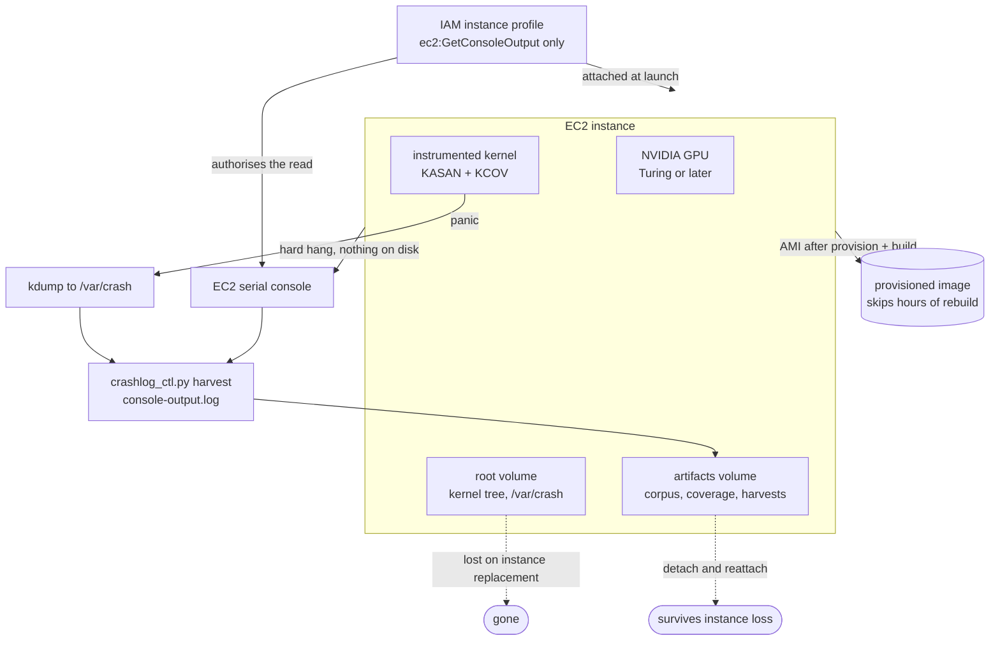

gspwn requires a machine it can panic repeatedly, a GPU the open kernel modules
support, and a capture path for the final kernel log output when the machine
hangs without reaching disk.

The operational sequence is in [Cloud runbook](/gspwn/guides/cloud-runbook/).

## Topology



## Instance constraints

| Constraint | Requirement | Reason |
|---|---|---|
| GPU generation | Turing or later | `open-gpu-kernel-modules` supports only cards carrying the GSP microcontroller. Volta and earlier run the proprietary driver, whose Resource Manager ships as a prebuilt binary KCOV cannot instrument |
| CPU architecture | x86-64 | `campaign_ctl.py gen-config` writes `"target": "linux/amd64"` into the syz-manager configuration |
| Instance size | The smallest usable size in a family | The campaign exercises the driver's ioctl surface, and `track_k.procs` defaults to 2 against a memory budget |

| Family | GPU | Microarchitecture | Usable |
|---|---|---|---|
| `g4dn` | T4 | Turing | Yes |
| `g5` | A10G | Ampere | Yes |
| `g6`, `gr6` | L4 | Ada Lovelace | Yes |
| `g6e` | L40S | Ada Lovelace | Yes |
| `p4d`, `p4de` | A100 | Ampere | Yes, at multi-GPU sizes |
| `p5`, `p5e`, `p5en` | H100, H200 | Hopper | Yes, at multi-GPU sizes |
| `p3`, `p3dn` | V100 | Volta | **No.** No GSP; the open modules do not support it |
| `g5g` | T4G | Turing | **No.** Graviton, arm64 |
| `g4ad` | Radeon Pro V520 | AMD | **No.** Not an NVIDIA driver |

The `p4` and `p5` families come only in multi-GPU sizes. A multi-GPU box does
not change what is fuzzed. Xid classification strips the PCI bus id from the
crash identity, so the same driver bug on two cards registers as one bug.

## Container runtime and the injection path

The threat model is a container tenant, so the device nodes a container receives
on this instance decide what the campaign is entitled to call reachable.

| Path | Reached by | Injects `/dev/nvidia-modeset` and `/dev/dri` |
|---|---|---|
| jit-cdi | `--runtime=nvidia`, and the ECS and EKS GPU AMIs | Yes, with no capability check |
| legacy | the prestart hook Docker 29.1.x and older inject for `--gpus` | No. The modeset node needs the `display` capability and `/dev/dri` is never injected |

Docker 29.2.0 and later read a CDI specification for `--gpus` and reach the
first path again.

| Selection | Requirement |
|---|---|
| AMI | Any Debian-family image. No AWS GPU AMI pins the toolkit mode |
| Toolkit | Installed from NVIDIA's repository, all four packages at one pinned version |
| Registration | `nvidia-ctk runtime configure --runtime=docker`, then a daemon restart |
| Confirmation | `verify_tenant_surface.py runtime-mode` before the campaign, `measure` at the `provision` gate |

The toolkit packages write `mode = auto` at install time and resolve it to
jit-cdi from 1.18.0 onward, so a stock instance lands on the first path. The
recorded tenant surface assumes it. An instance on the legacy path holds a
smaller device set than the 852-target denominator covers, and the campaign
would report coverage against surface no tenant on that instance can reach.

## Region and quota

Availability of these families moves between regions and over time, so it is
queried against the account before a campaign is planned. GPU instances also
need a service quota granted before launch, per region and per family. A new
account commonly holds a quota of 0 for them, and the increase request takes
time to approve, which puts a lead time in front of any campaign window.

## Storage

| Volume | Holds | Sized for | Survives instance replacement |
|---|---|---|---|
| Root | The kernel source tree, the build output, `/var/crash`, the OS | A full kernel build plus several kdump dumps | No |
| `artifacts/` | The corpus, the coverage series, the harvested crash logs, the reproducers | The campaign's evidence | Yes, by detach and reattach |

Without the split, everything the pipeline writes lands on one filesystem, and
a full disk stops the fuzzer, the sampler and every state write at the same
moment. kdump writes hundreds of megabytes per panic, and this pipeline panics
by design.

| Mechanism | Behaviour |
|---|---|
| `loop.min_free_disk_gb` | Warns below the floor. 0 disables the check |
| Every coverage sample | Records free space in its row |
| `crashlog_ctl.py prune` | The one command that reclaims harvest space |

Nothing prunes automatically. Harvested logs are evidence.

## Purchasing model

Use on-demand for the campaign. Spot is defensible for `provision` and `build`,
which produce an AMI and can be re-run.

| Affected by a spot interruption | Recoverable |
|---|---|
| The campaign window | Yes. The deadline is on disk and reconstructible, so the run resumes bounded |
| The coverage curve's continuity | Yes. The gap presents as a counter reset, which the accumulation model absorbs |
| The measured hours | Partially. Billed from the samples that exist, which under-reports the run |
| Anything on instance store | No |
| A reproducer verification in flight | Yes. Resolved as void or as a weak hit on the next invocation |

The pipeline does not distinguish a spot reclaim from a panic, so a
spot-interrupted round measures a shorter run than it configured and its
verdict rests on less data.

## Termination protection

Enable termination protection. The instance panics, hangs and reboots by
design, so an instance reporting an unhealthy status is in its normal operating
state.

## IAM instance profile

One permission:

```json
{"Version": "2012-10-17",
 "Statement": [{"Effect": "Allow",
                "Action": "ec2:GetConsoleOutput",
                "Resource": "*"}]}
```

`crashlog_ctl.py harvest` calls that action on EC2. Attach the profile **at
launch**. The action is needed after a hard hang, when attaching a profile to
the running instance is no longer practical.

Nothing else in the pipeline calls an AWS API, and nothing needs write access.
A broader role places wider credentials on a machine that is crashed by hostile
input by design. Never place long-lived access keys on the instance.

## Serial console capture

EC2 has no pstore. On bare metal, ramoops holds the kernel's final log output
in a reserved memory region that survives a reboot. On EC2 that backend does
not exist.

| Failure mode | Captured by | Available on EC2 |
|---|---|---|
| A panic that reaches the crash kernel | kdump, to `/var/crash` | Yes |
| A hard hang, where the machine stops before reaching the crash kernel | The serial console, through `ec2:GetConsoleOutput` | Yes, with the instance profile attached |
| Either, on bare metal | pstore or ramoops | No |

`crashlog_ctl.py setup` skips pstore on EC2 and reports that it did.
`crashlog_ctl.py verify` fails when the `aws` CLI is absent, because without it
the fallback capture path does not exist.

## Snapshot after provision and build

`provision` and `build` run once per machine and cost hours. Create an AMI once
both gates have passed.

Record in the image description what it contains: the kernel release, the
driver branch, the instrumentation rung and the syzkaller commit. Those facts
live in `config/machine.yaml` and `artifacts/builds/manifest.json`, and the
report cites them.

An image taken with `--no-reboot` is crash-consistent. Stop the instance first
when the state file matters.

Three things do not travel in an image and are re-checked on every relaunch:

| Check | Command |
|---|---|
| The instance profile is attached | `aws ec2 get-console-output --instance-id <id> --latest` |
| The state file matches what is expected | `python3 tools/pipeline_ctl.py show` |
| The spend ledger reflects prior campaigns | `python3 tools/pipeline_ctl.py round-show` |

## GPU recovery

A card that has fallen off the bus, Xid 79, leaves the fuzzer running against
nothing and the coverage curve flat. The plateau verdict is downgraded to
`unknown` while the GPU is in that state, so the loop stops.

| Step | Action | Recovers a passthrough GPU |
|---|---|---|
| 1 | `sudo nvidia-smi -r` | Sometimes |
| 2 | Unload and reload the modules | Sometimes |
| 3 | A guest reboot | Sometimes. A guest reboot does not power-cycle a passthrough GPU |
| 4 | An instance stop and start from the console, which moves the instance to different hardware | Yes. Nothing in the repository can do this |

`coverage_ctl.py gpu-health` reports the state and names the limit:

```
GPU: dead (nvidia-smi exit 255: Unable to determine the device handle for GPU 0000:00:1E.0: Unknown Error)
A plateau verdict will read 'unknown' while the GPU is in this state, so the loop stops without recording a plateau the fuzzer did not actually reach.
```

## Cost

The three caps in `config/campaign.yaml` bound the search. They do not bound
the bill. Watch real money in the AWS console, and set a budget alert
independently of anything here. See
[Spend accounting](/gspwn/architecture/spend-accounting/).

## See also

- [Cloud runbook](/gspwn/guides/cloud-runbook/)
- [Disk and crash logs](/gspwn/guides/disk-and-crash-logs/)
- [Requirements](/gspwn/getting-started/requirements/)
