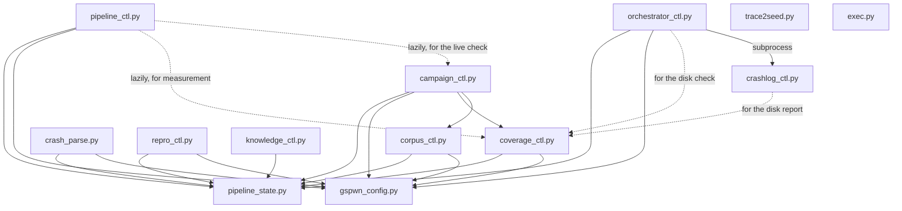

Nineteen files live in `tools/`, plus one data file. Seventeen are commands,
one is the shared state library, and one is the test runner.

Three of the commands read the driver source and never touch a device:
`ioctl_inventory.py`, `ctrl_surface.py` and `object_graph.py` derive the ioctl
surface, the control command space and the object allocation DAG from a
checkout. The `describe` phase models against those three outputs.

| Module | Kind | Owns |
|---|---|---|
| [`pipeline_state.py`](/gspwn/architecture/components/pipeline-state/) | Library | The state schema, the atomic write, the transaction lock, the spend ledger |
| [`pipeline_ctl.py`](/gspwn/architecture/components/pipeline-ctl/) | Command | The state machine's command surface |
| [`gspwn_config.py`](/gspwn/architecture/components/gspwn-config/) | Command and library | Every tunable, and its validation |
| [`campaign_ctl.py`](/gspwn/architecture/components/campaign-ctl/) | Command | Campaigns, deadlines, corpus policy, billing |
| [`coverage_ctl.py`](/gspwn/architecture/components/coverage-ctl/) | Command | Sampling, the curve, the plateau verdict, the GPU probe |
| [`crash_parse.py`](/gspwn/architecture/components/crash-parse/) | Command | Crash identity and registration |
| [`crashlog_ctl.py`](/gspwn/architecture/components/crashlog-ctl/) | Command | Persistent crash capture |
| [`repro_ctl.py`](/gspwn/architecture/components/repro-ctl/) | Command | Reproducer extraction and rate verification |
| [`orchestrator_ctl.py`](/gspwn/architecture/components/orchestrator-ctl/) | Command | The unattended supervisor and its breaker |
| [`corpus_ctl.py`](/gspwn/architecture/components/corpus-ctl/) | Command | The persistent seed bank |
| [`knowledge_ctl.py`](/gspwn/architecture/components/knowledge-ctl/) | Command | The committed knowledge files |
| [`trace2seed.py`](/gspwn/architecture/components/trace2seed/) | Command | strace to syz-program conversion |
| [`ioctl_inventory.py`](/gspwn/architecture/components/ioctl-inventory/) | Command | The escape and UVM ioctl inventory, and the request numbers |
| [`ctrl_surface.py`](/gspwn/architecture/components/ctrl-surface/) | Command | The RM control command space and its privilege classification |
| [`object_graph.py`](/gspwn/architecture/components/object-graph/) | Command | The RM object allocation DAG and its chaining depth |
| [`exec.py`](/gspwn/architecture/components/exec/) | Command | Logged command execution with retries |
| [`build_kernel.sh`](/gspwn/architecture/components/build-kernel/) | Script | The instrumented kernel build |
| [`selftest.py`](/gspwn/architecture/components/selftest/) | Test runner | The offline suite |
| `register_check.py` | Command | The writing-register linter run in CI. No page yet |

`tools/ioctl_map.json` is data: the map from ioctl request numbers to syzlang
description names.

## Page structure

Every module page carries the same sections in the same order, so one module can
be compared against another without rereading prose.

| Section | Contents |
|---|---|
| Responsibility | What the module owns, as invariants and the mechanism that enforces each |
| Interface | The public functions or subcommands, their returns, and what they raise |
| Callers | What imports the module, and what the module imports |
| Failure modes | Condition, behaviour, and exit code or exception |
| Concurrency and durability | Locks held, atomic writes, idempotency |
| Prohibited behaviour | Rules a reviewer can check a diff against |
| Design notes | Why the mechanism is the one it is |

## Dependencies

`gspwn_config.py` and `pipeline_state.py` are the two roots. Everything that
touches state imports the second; everything with a tunable imports the first.

`trace2seed.py` and `exec.py` import neither. Both are self-contained, and
`exec.py` is stdlib-only by design because it wraps builds that may run before
anything else is installed.

Three imports are deliberately lazy and are performed inside a function. The
importing module's argument parser reads configuration at build time, and a
cycle would deadlock the parser.

## Layering rules

| Rule | Reason |
|---|---|
| `pipeline_state.py` imports no other module in `tools/` | It is the root. It does not read configuration; the caller that has a setting passes it in |
| Only `pipeline_state.py` writes the state file | The atomic write, the backup and the lock live in one place |
| Every tunable comes from `gspwn_config.py` | A value cannot drift between the file and the code that uses it |
| No tool holds a copy of a derived address | `manager_url()` is derived from `track_k.http`, so a port change cannot leave the sampler polling a stale address |
| A tool that spends money reads the ledger, never the state file's own total | The ledger is the authority, and it is machine-global |

## Behaviour on invalid configuration

| Module | Behaviour |
|---|---|
| `pipeline_ctl.py` loop and agent settings | Exits. An unattended loop spends machine time, so the cap must come from the configuration |
| `pipeline_ctl.py validate` drift check | Skips the check and still reports on the registry |
| `coverage_ctl.py` | Falls back to the shipped defaults, because several tools call the verdict path |
| `repro_ctl.py` | Falls back to the shipped defaults, so verification runs on a box mid-edit |
| `orchestrator_ctl.py` resume anchor | Falls back to the module default, because this runs on the post-panic recovery path |

## See also

- [Extending gspwn](/gspwn/architecture/extending/)
- [Command line overview](/gspwn/reference/cli/)
