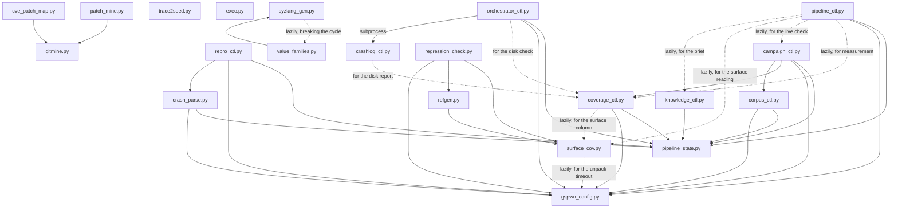

`tools/` holds 31 Python modules, one shell script, one Go program, two JSON
data files and two data directories. `syz-patches/` carries the one patch
applied to the pinned syzkaller checkout before syzkaller is built, and
`syz-stub/` carries the stub description file and its constant sidecar that
`syzlang_gen.py compile` compiles the description set alongside.

Fourteen of the Python modules read source trees and committed artefacts and
never touch a device: `ioctl_inventory.py`, `ctrl_surface.py`,
`object_graph.py`, `nvkms_inventory.py`, `drm_inventory.py`,
`value_families.py`, `syzlang_gen.py`, `ctrl_rank.py`, `surface_verify.py`,
`surface_cov.py`, `refgen.py`, `regression_check.py`, `cve_patch_map.py` and
`patch_mine.py`. The `Owns` column below states what each derives.

`cve_patch_map.py` and `patch_mine.py` read the fix history of the driver and
of the two container repositories, the only empirical signal available before a
campaign has run.

| Module | Kind | Owns |
|---|---|---|
| [`pipeline_state.py`](/gspwn/architecture/components/pipeline-state/) | Library | The state schema, the atomic write, the transaction lock, the spend ledger |
| [`pipeline_ctl.py`](/gspwn/architecture/components/pipeline-ctl/) | Command | The state machine's command surface |
| [`gspwn_config.py`](/gspwn/architecture/components/gspwn-config/) | Command and library | Every tunable, and its validation |
| [`campaign_ctl.py`](/gspwn/architecture/components/campaign-ctl/) | Command | Campaigns, deadlines, corpus policy, billing |
| [`coverage_ctl.py`](/gspwn/architecture/components/coverage-ctl/) | Command | Sampling, the curve, the plateau verdict, the GPU probe |
| [`crash_parse.py`](/gspwn/architecture/components/crash-parse/) | Command | Crash identity and registration |
| [`crashlog_ctl.py`](/gspwn/architecture/components/crashlog-ctl/) | Command | Persistent crash capture |
| [`repro_ctl.py`](/gspwn/architecture/components/repro-ctl/) | Command | Reproducer extraction and rate verification |
| [`orchestrator_ctl.py`](/gspwn/architecture/components/orchestrator-ctl/) | Command | The unattended supervisor and its breaker |
| [`corpus_ctl.py`](/gspwn/architecture/components/corpus-ctl/) | Command | The persistent seed bank |
| [`knowledge_ctl.py`](/gspwn/architecture/components/knowledge-ctl/) | Command | The committed knowledge files |
| [`trace2seed.py`](/gspwn/architecture/components/trace2seed/) | Command | strace to syz-program conversion |
| [`ioctl_inventory.py`](/gspwn/architecture/components/ioctl-inventory/) | Command | The escape and UVM ioctl inventory, and the request numbers |
| [`ctrl_surface.py`](/gspwn/architecture/components/ctrl-surface/) | Command | The RM control command space and its privilege classification |
| [`object_graph.py`](/gspwn/architecture/components/object-graph/) | Command | The RM object allocation DAG, its chaining depth, and the allocation chain per owning class |
| [`ctrl_rank.py`](/gspwn/architecture/components/ctrl-rank/) | Command | The measured ordering of the 531 targetable control commands |
| [`nvkms_inventory.py`](/gspwn/architecture/components/nvkms-inventory/) | Command | The NVKMS command space, reconciled between the declaring enum and the dispatch table |
| `drm_inventory.py` | Command | The `/dev/dri` command space, reconciled between `nv_drm_common_ioctl.h` and `nv_drm_ioctls[]` |
| `value_families.py` | Command and library | The value families derived for bare integer parameter fields, and the audit that accepts or rejects each one |
| [`syzlang_gen.py`](/gspwn/architecture/components/syzlang-gen/) | Command | The generated description set, and the per-struct size check on it |
| [`surface_verify.py`](/gspwn/architecture/components/surface-verify/) | Command | The version guard on every statically derived artefact |
| [`surface_cov.py`](/gspwn/architecture/components/surface-cov/) | Command | The share of the enumerated command surface a description set models and a corpus reaches |
| [`verify_tenant_surface.py`](/gspwn/architecture/components/verify-tenant-surface/) | Command | The measured device nodes a container receives, compared against the recorded tenant surface |
| [`cve_patch_map.py`](/gspwn/architecture/components/cve-patch-map/) | Command | The CVE to release-diff join, and the round-1 history worklist |
| [`patch_mine.py`](/gspwn/architecture/components/patch-mine/) | Command | The container-stack fix history, and the Track U target ranking |
| [`gitmine.py`](/gspwn/architecture/components/gitmine/) | Library | The git wrapper, the diff parser, the function attribution and the release-tag mapping both miners share |
| [`refgen.py`](/gspwn/architecture/components/refgen/) | Command and library | The six generated reference pages under `reference/surface/` and the index over them |
| [`exec.py`](/gspwn/architecture/components/exec/) | Command | Logged command execution with retries |
| [`build_kernel.sh`](/gspwn/architecture/components/build-kernel/) | Shell script | The instrumented kernel build |
| [`selftest.py`](/gspwn/architecture/components/selftest/) | Test runner | The offline suite |
| `regression_check.py` | Command | The comparison of the committed artefacts against each other and against the generated reference pages |
| `register_check.py` | Command | The mechanical check over the documentation's writing register |
| `gspwn-check/main.go` | Go program | The syzlang parse and compile gate, built by `syzlang_gen.py compile` against a pinned syzkaller checkout |

`drm_inventory.py`, `value_families.py`, `regression_check.py`,
`register_check.py` and `gspwn-check/main.go` have no page of their own.

Two files in `tools/` are data. `ioctl_map.json` maps ioctl request numbers to
syzlang description names. `cve_fix_verdicts.json` records the curated per-CVE
fix verdict and the evidence behind each one.

## Dependencies

`gspwn_config.py` and `pipeline_state.py` are the two roots. Everything that
touches state imports the second, and everything with a tunable imports the
first.

`gitmine.py` is a third root and a library only. It imports nothing in `tools/`
and holds no repository-specific knowledge, so the two miners keep their own fix
signals, path filters and output schemas.

`surface_cov.py`, `refgen.py` and `regression_check.py` all refuse the
`pipeline_state.py` import on purpose. That module needs `fcntl`, and all three
run on the Windows workstation and in CI, where no GPU and no kernel exist.

`trace2seed.py` and `exec.py` import neither root. Both are self-contained, and
`exec.py` is stdlib-only by design because it wraps builds that may run before
anything else is installed.

Twelve import statements are performed inside a function, and they cover the nine dashed
edges above. `syzlang_gen.py` defers `value_families.py` because that module
imports `syzlang_gen` back at module scope. Elsewhere the deferral keeps a
caller running where the dependency may be missing or unusable, as
`pipeline_ctl.py` does for a surface count on a box where the inventories were
never generated, `crashlog_ctl.py` for the disk report on the post-panic path,
and `surface_cov.py` for the unpack timeout when the configuration cannot be
read.

Ten modules are left out of the diagram. `selftest.py` imports almost every
module in `tools/`. The other nine import no module in `tools/` and no module
imports them: `ioctl_inventory.py`, `ctrl_surface.py`, `object_graph.py`,
`nvkms_inventory.py`, `drm_inventory.py`, `ctrl_rank.py`, `surface_verify.py`,
`verify_tenant_surface.py` and `register_check.py`.

## Layering rules

Five rules govern what a module may import and what it may write.

- `pipeline_state.py` imports no other module in `tools/`. It is the root, it
  reads no configuration, and the caller that has a setting passes it in.
- Only `pipeline_state.py` writes the state file, so one module holds the
  atomic write, the backup and the lock.
- Every tunable comes from `gspwn_config.py`, so a value cannot drift between
  the file and the code that uses it.
- No tool holds a copy of a derived address. `manager_url()` is derived from
  `track_k.http`, so a port change cannot leave the sampler polling a stale
  address.
- A tool that spends money reads the ledger, never the state file's own total.
  The ledger is the authority, and it is machine-global.

## Behaviour on invalid configuration

A tool whose whole run depends on a cap exits. A tool that can proceed with the
shipped defaults falls back and continues.

| Module and path | Behaviour |
|---|---|
| `pipeline_ctl.py` loop and agent settings | Exits 1. An unattended loop spends machine time, so the cap must come from the configuration |
| `pipeline_ctl.py validate` drift check | Skips the check and still reports on the registry |
| `coverage_ctl.py` command form | Exits 1 while building its parser, because the syz-manager URL default is derived from `track_k.http` |
| `coverage_ctl.py` verdict path and disk warning | Falls back to the shipped defaults, because several tools call the verdict path |
| `orchestrator_ctl.py` command form | Exits 1 |
| `orchestrator_ctl.py` resume anchor | Falls back to the module default, because this runs on the post-panic recovery path |
| `repro_ctl.py` | Falls back to the shipped defaults, so verification runs on a box mid-edit |

## See also

- [Extending gspwn](/gspwn/architecture/extending/)
