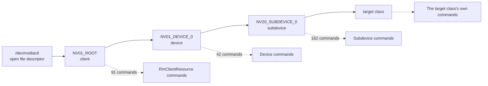

Extracts the Resource Manager allocation DAG from
`src/nvidia/src/kernel/rmapi/resource_list.h` in an open-gpu-kernel-modules
checkout. The `describe` phase needs the legal parent of every allocatable
class to chain syzlang resources. The driver declares that relation in one
table, and this module reads it.

The module runs entirely off the source tree. It reaches no device and needs no
GPU.

## Responsibility

The module owns the parse of `RS_ENTRY` records and the graph derived from
them, and writes only the JSON file it is given.

| Invariant | Enforced by |
|---|---|
| A field the source labels inconsistently is still read | The last field's label matches `Required Access Rights?`, covering the 15 records that omit the plural |
| A class with no `RS_LIST` parent still appears | `RS_ROOT_OBJECT` maps to the root sentinel and `RS_ANY_PARENT` to its own sentinel |
| Every external class an internal parent exports is a legal parent | The internal-to-external map holds a list per internal class, and the resolve loop extends the parent list with all of them |
| An `RS_ANY_PARENT` edge does not flatten the tree | The sentinel is seeded at depth 1 and is not an edge from any real class |
| Allocation privilege comes from the field that carries it | `RS_FLAGS_ALLOC_*` in Flags, never Required Access Rights |
| A record naming no privilege flag is never counted as reachable | It is classified `unclassified` and reported separately |
| A table format change fails loudly | Zero `RS_ENTRY` matches exits with a message naming the file |
| An unresolved parent is visible | Unresolved internal class names are counted and logged as a warning |

## Outputs

The parse writes one record per class, carrying the external and internal class
name, the legal parents, the allocation parameter kind and struct, the
allocation privilege, and the depth from the device node. A second artefact,
`surface/rm-chains.json`, joins each class to the control commands it owns and
carries the allocation chain that reaches it.

Alongside those, the tool reports the privilege split, the depth distribution,
the widest parent sets, the shortest chain to a named class, and the parents
ranked by reachable subtree size.

The privilege split over the 222 records comes from the `RS_FLAGS_ALLOC_*`
marker in Flags.

| Allocation privilege | Records | Marker in Flags |
|---|---|---|
| `unprivileged` | 152 | `RS_FLAGS_ALLOC_NON_PRIVILEGED` |
| `privileged` | 62 | `RS_FLAGS_ALLOC_PRIVILEGED` |
| `kernel` | 5 | `RS_FLAGS_ALLOC_KERNEL_PRIVILEGED` |
| `unclassified` | 3 | none |

## Concurrency and durability

The module reads one file and writes one file per invocation, and takes no
lock. It holds no state between runs and is safe to re-run. Two concurrent
invocations writing the same output path race for it, and the phase invokes it
sequentially.

## Prohibited behaviour

Five rules keep the privilege split and the depth distribution honest.

| Rule | Rationale |
|---|---|
| Never read allocation privilege from Required Access Rights | All 222 records carry `RS_ACCESS_NONE` there. A reader keyed on that field reports the entire table as reachable by an unprivileged client |
| Never treat an unclassified record as unprivileged | A record naming no `RS_FLAGS_ALLOC_*` marker says nothing about privilege, and defaulting it to unprivileged inflates the surface count |
| Never present the privilege split as a reachability count | Class constructors add their own checks, and `gpuGetClassByClassId` rejects classes absent from the installed part |
| Never let an `RS_ANY_PARENT` class inherit a depth from a real edge | Those classes attach under any object, and adding real edges for them collapses the depth distribution the chaining argument rests on |
| Never drop an unmatched field silently | A silently null field reads downstream as a class with no privilege requirement |

## Design notes

The source carries two inconsistencies that defeat a parser written to a single
pattern. 15 of the 222 records label the final field `Required Access Right`
without the plural. 5 records declare `RS_ANY_PARENT` where the rest declare
`RS_LIST(classId(...))`, and those five are the event and context-DMA classes,
which attach under any allocated object and are therefore the cheapest way to
place a second reference on an object under test.

Parent resolution is textual and one-to-many. `classId(X)` names an internal
class, and 18 of the 98 internal classes in the table export more than one
external class: `DispChannelDma` exports 23, `KernelGraphicsObject` 17,
`KernelChannel` 11. Every one of those is a legal parent, so a `classId(X)`
edge resolves to all of them. Resolving through the first declaring record
instead loses 970 of the 1216 parent edges and under-reports the parent list on
122 of the 222 records.

The loss propagates into the descriptions. `syzlang_gen.py` pins
`hObjectParent` to a single resource when a class has exactly one legal parent,
and a collapsed map manufactures that condition: 63 allocation variants pinned
their parent to `GF100_CHANNEL_GPFIFO` alone, where the widened map gives those
same 63 a parent set of 11 channel classes. No check reported the narrowing,
because the set compiled, the counts held, and `surface_cov.py` measured 155 of
155 modelled. What a single wrong pin costs a campaign is unverified.

No class changed depth when the map was widened. The recovered edges run from a
class to siblings of the parent it already had, and those siblings are at the
same depth.

Depth is measured from the open file descriptor. 151 of 222 classes are at
depth 4, so a description set without resource chaining reaches the 25 classes
at depth 1 and 2 and no further, which the `describe` phase prompt warns of.

## Chain grouping

Commands sharing an owning class share an allocation chain, so one program can
build the chain once and issue every command that class owns against it.
`chains` joins the control inventory's `owning_class`, the NVOC internal class
name, to `internal_class` on every record of this table.

| Field on a chain record | Contents |
|---|---|
| `internal_class` | The join key to the control inventory's `owning_class` |
| `external_classes` | Every external class this internal class exports, with its allocation privilege and table depth |
| `target_external_class` | The one the chain reaches, cheapest over all of them |
| `chain` | Ordered from the file descriptor, each step carrying `external_class`, `alloc_param_struct`, `alloc_param_kind` and `alloc_privilege` |
| `chain_length` | Prologue cost in allocations |
| `unclassified_steps` | Steps whose `RS_ENTRY` names no `RS_FLAGS_ALLOC_*` flag |
| `unallocatable_reason` | Why there is no chain, null when there is one |
| `commands`, `command_count` | The targetable control commands this class owns |

The artefact carries 98 records, 82 of them chained. 514 of the 531 targetable
control commands resolve to a chain.

`cumulative_reach` is the greedy curve. Each step buys the class with the
highest command count per allocation the built set does not already hold, and
every class allocated along the way is credited, so a class whose whole chain is
already built costs nothing further.

| Objects built | Commands unlocked | Share of 531 | Last class added at that count |
|---|---|---|---|
| 1 | 91 | 17% | RmClientResource |
| 3 | 315 | 59% | Device |
| 4 | 337 | 63% | VgpuConfigApi |
| 11 | 429 | 81% | ConfidentialComputeApi |
| 15 | 455 | 86% | SemaphoreSurface |
| 38 | 514 | 97% | ZbcApi |

Beyond 38 allocations nothing further unlocks.

17 commands reach no chain. Two properties of the driver's own class model
account for all of them, and `unresolved_owning_classes` records the class, the
reason and the handler names for each.

| Owning class | Commands | Cause |
|---|---|---|
| `Memory` | 6 | NVOC base class, no `RS_ENTRY` row |
| `ProfilerBase` | 9 | NVOC base class, no `RS_ENTRY` row |
| `MmuFaultBuffer` | 1 | Its one external class, `MMU_FAULT_BUFFER`, carries `RS_FLAGS_ALLOC_KERNEL_PRIVILEGED` |
| `NvDispApi` | 1 | All 8 of its external classes carry `RS_FLAGS_ALLOC_PRIVILEGED` |

The chain walk blocks on `privileged` and `kernel` and admits `unclassified`.
`NV01_ROOT`, `NV01_ROOT_NON_PRIV` and `NV01_ROOT_CLIENT` name no
`RS_FLAGS_ALLOC_*` flag, and every chain starts at one of the three, so a strict
test blocks every chain at its first step: 82 chains become 0, no command
resolves to a chain, and the cumulative-reach curve is empty. Every chain
carrying such a step lists it in `unclassified_steps`, so an admitted step is
distinguishable from a verified unprivileged one.

The conversion of `rm-chains.json` into `.syz` programs belongs to
[`trace2seed.py chains`](/gspwn/architecture/components/trace2seed/).

## Stated limits

Three limits bound the graph and everything derived from it.

- Chip gating is invisible in the table. The chain records name one external
  class and do not model `gpuGetClassByClassId`, which searches `pGpu->classDB`
  at `gpu_resource_desc.c:132`. That database is built at
  `gpu_resource_desc.c:38` from the per-chip class descriptor lists `gpu.c:1183`
  fetches. Over the 34 per-chip lists in
  `src/nvidia/generated/g_gpu_class_list.c`, 31 name a
  `*_CHANNEL_GPFIFO` class and all 31 name `GF100_CHANNEL_GPFIFO`, so the
  channel family is not one class per part on this release. The display family
  is gated, with at most 2 of its 8 members appearing together on any one part.
- Nothing in CI runs `chains`, so the artefact goes stale against a driver
  bump. `regression_check.py derived` reports the drift against the control
  inventory and does not repair it.
- No chain has been allocated. The cumulative-reach curve, the chain lengths
  and the 514 count are arithmetic over the `RS_ENTRY` table. No GPU was
  involved, no allocation was issued and no emitted program was executed, so
  the reach these numbers describe is unverified.

## See also

- [Resource Manager object model](/gspwn/knowledgebase/rm-object-model/)
- [ctrl_rank.py](/gspwn/architecture/components/ctrl-rank/)
- [trace2seed.py](/gspwn/architecture/components/trace2seed/)
- [Threat model](/gspwn/architecture/threat-model/)
