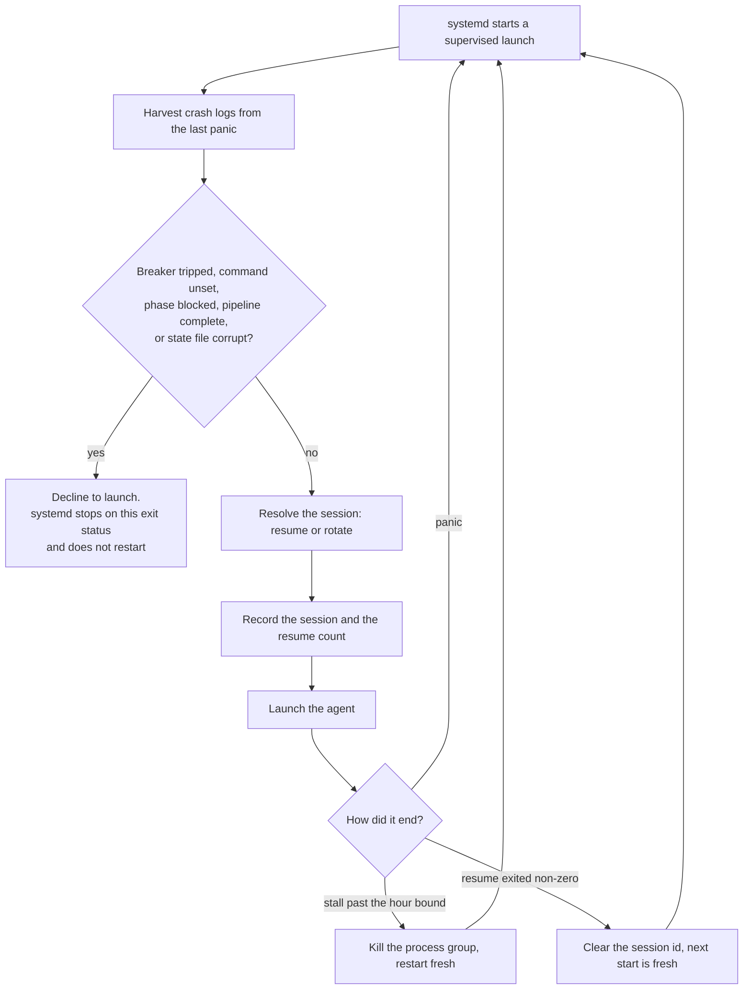

Keeps the orchestrating agent alive across panics, with a circuit breaker. The
rest of the pipeline survives a kernel panic through systemd units and on-disk
state, and the agent driving it does not. Without this module its recovery
requires an interactive login.

The supervisor is `gspwn-orchestrator.service`.

## Responsibility

The module owns the supervisor unit, the restart breaker, and the session
identity carried across a restart. It is the sole writer of the breaker state
file.

| Invariant | Enforced by |
|---|---|
| A restart never runs into a condition that will recur | Four situations return `BLOCKED_EXIT`, which the unit names in `RestartPreventExitStatus` |
| Reboots and same-boot restarts are counted separately | Two limits over one window, since kernel fuzzing panics the box by design |
| A session id exists before the agent is launched | The id is a UUID generated here and substituted into the invocation |
| A panic cannot lose the record of the launch | The session and the resume count are written before the launch |
| The agent never runs as root | `install` refuses without a non-root user and sets both `User=` and `Environment=HOME=` |
| The invocation is never stale | It is read from the configuration at every launch |
| A stalled agent is bounded | `launch_agent` kills the process group after `orchestrator.max_agent_hours` |

## One supervised launch

A launch harvests any crash logs the last panic left behind, checks the
breaker, resolves the session to run under, and starts the agent bounded by a
stall timeout. The session and the resume count are written before the launch,
because a panic kills the agent with no exit code and anything recorded
afterwards is lost on precisely the restarts this exists for.

Four situations make a launch decline: a tripped breaker, an unset agent
command, a blocked phase, and a completed pipeline. A corrupt state file
declines too, because a relaunched agent would read the same file. The unit
names that exit status in its restart policy, so systemd stops there and no
restart loop forms.

A separate check reports what an unattended run needs and nothing else
verifies: a valid configuration, a set agent command, passwordless sudo, the
host binaries the phases invoke, and disk headroom. It is deliberately not part
of a launch, because a preflight that blocked the supervisor would turn a
warning into an outage.

A failed harvest is reported loudly and the launch proceeds. Refusing to resume
because pstore was empty costs a whole run.

## Concurrency and durability

| Property | Mechanism |
|---|---|
| Breaker mutual exclusion | `flock(LOCK_EX)` on the breaker state file for the whole read-modify-write |
| Breaker scope | Machine-global. It does not follow `GSPWN_STATE`, so a run redirecting its state does not also get a fresh, empty breaker. `GSPWN_ORCH` redirects it for the test suite |
| Restart policy | `RestartPreventExitStatus` names `BLOCKED_EXIT`, so systemd stops on that exit code |
| Process control | `start_new_session=True` and `killpg`, so a stall kills the whole group |

## Prohibited behaviour

| Rule | Rationale |
|---|---|
| Never restart into a condition that will recur | A relaunched agent reads the same broken state and stops again, once per restart |
| Never count reboots against the same-boot limit | A single shared limit would stop a healthy campaign that panics often, or allow a same-boot restart loop to continue indefinitely |
| Never treat an unreadable boot id as a fresh boot | Assuming a reboot lets a same-boot loop run forever |
| Never reset a corrupt breaker file silently | Resetting outside `reset` clears a trip the operator has not seen |
| Never clear a trip without clearing the history | The counted window has not moved, so the next start re-trips |
| Never record the session after the launch | A panic terminates the agent with no exit code, so anything recorded afterwards is lost on precisely the restarts this exists for |
| Never discover the session id | Parsing it out of the agent's output, or globbing for the newest transcript, races every other agent on the machine |
| Never treat an unmeasurable transcript as small | `transcript_bytes` returns `None`, and the fallback to the resume count is reported |
| Never run the agent as root | A system unit runs as root unless told otherwise, and a coding agent keeps its login under the invoking user's home directory |
| Never bake the command into the unit | Editing `config/campaign.yaml` and rebooting must not keep running the old invocation |
| Never let a harvest failure stop the pipeline | Refusing to resume because pstore was empty costs a whole run |
| Never make preflight part of `run` | A preflight that blocked the supervisor would turn a warning into an outage |
| Never resolve a host binary by anything except `PATH` | The unattended session runs under its own `PATH`, and a toolchain installed into a shell that has since exited is absent for every phase that follows |
| Never treat a binary reached inside a container as a host requirement | The Track U harnesses build inside the image `config/campaign.yaml` names, so `afl-clang-fast` and `clang` are the image's requirement |
| Never kill only the immediate child on a stall | The launch goes through a shell, so killing the child leaves the agent running, detached and still stuck |

## Host binaries

`HOST_BINARIES` names each binary the pipeline invokes, the phase that stops
without it, and whether every deployment needs it. `missing_binaries` resolves
each through `shutil.which` and returns the required and the optional
absences apart.

| Binary | Needed by | Universal |
|---|---|---|
| `go` | The `describe` phase builds syzkaller and runs `syzlang_gen.py compile` | Yes |
| `docker` | The Track U harnesses, and `verify_tenant_surface.py measure` | Yes |
| `gcc` | `repro_ctl.py extract` compiles `repro.c` | Yes |
| `make` | The instrumented kernel build and the syzkaller build | Yes |
| `git` | The inventories record the checkout revision they derived from | Yes |
| `nvidia-smi` | `surface_verify.py` reads the running driver version | Yes |
| `nvidia-ctk` | The `provision` phase registers the `nvidia` runtime with Docker | No |
| `aws` | Hard-hang capture on EC2 reads the serial console | No |

A required absence is a problem and fails the gate. An optional absence is
reported with the deployment it applies to, because the same missing binary
reads differently on EC2 than on bare metal.

## Design notes

`check` is pure: it takes the state it judges as an argument, so the thresholds
can be exercised without a machine that reboots.

`resolve_session` returns the session to store, which invocation to use, and a
one-line explanation of whether a restart carried the previous context.

Rotation is primarily by transcript size, because size drives auto-compaction
and restart count does not. A campaign that panics twenty times in an hour
writes almost nothing, while one that panics twice in three days writes a great
deal.

A transcript that cannot be resumed would fail identically every `RestartSec`
until the breaker tripped.
Dropping the id costs the reasoning history and preserves the campaign.

`render_command` substitutes with `str.replace`. These invocations routinely
carry a prompt containing braces. Its anchor falls back to the module default
when the configuration cannot be read, because this runs on the post-panic
recovery path and a resume that fails on a configuration error strands the
campaign.

`launch_agent` uses `shell=True` because the configured value is a command line
written by the operator. Nothing user-controlled reaches it at run time: it
comes from a configuration file only root can install a unit from.

## See also

- [Unattended operation](/gspwn/guides/unattended-operation/)
- [orchestrator_ctl.py reference](/gspwn/architecture/components/orchestrator-ctl/)
