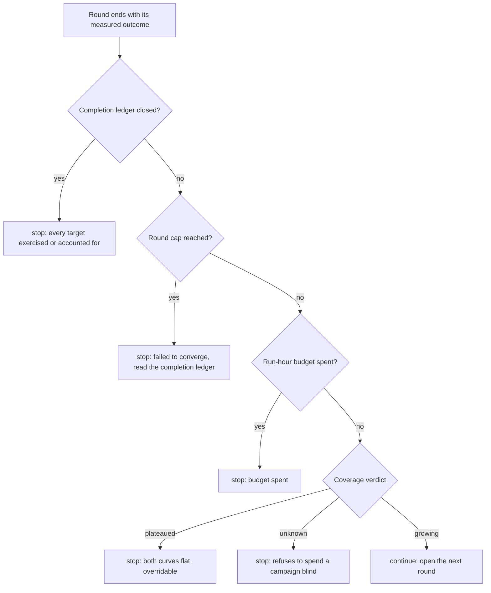

The dependency root of `tools/`. Standard library only, and it imports no other
module in `tools/`. It is the sole writer of `state/pipeline.json` and of the
machine-global spend ledger `state/spend.json`.

`GSPWN_STATE` redirects the state file. `GSPWN_SPEND` redirects the ledger and
exists for the test suite. The ledger does not follow `GSPWN_STATE`, so a run
with its own registry still bills the one machine-global budget.

## Responsibility

The module owns the state schema at `SCHEMA_VERSION = 2`, the durability
contract for every write, the phase and round machines, the crash registry, the
research and impact records, and the spend ledger.

| Invariant | Enforced by |
|---|---|
| A write leaves either the previous state or the new state, never a partial file | `save` writes a temporary file, `fsync`s it, `os.replace`s it into position, then `fsync`s the parent directory |
| Two concurrent read-modify-write cycles cannot lose an update | `transaction` holds `flock(LOCK_EX)` on `.pipeline.lock` for the whole cycle |
| A state file written by an older tool gains every key current readers expect | `normalize` fills defaults for every phase, crash, round, finding and impact |
| A newer writer's top-level keys survive an older reader | `normalize` keeps unknown top-level keys |
| A crash status change carries its history and its analysis stamp | `set_crash_status` is the single write path for `status` |

## The spend model

Recorded spend is authoritative and machine-global. The ledger
`state/spend.json` does not follow `GSPWN_STATE`, so a pipeline running with
its own registry still bills the one budget the cap is written against.

The budget read reconciles the two records. It reads the ledger and the state
file, and when the state file records more hours than the ledger holds, the
larger figure stands and a warning names the shortfall. The ledger is
machine-global and the state file is one pipeline, so the ledger standing above
the state file is the ordinary case and says nothing. The reverse cannot happen
while every billed run reaches the ledger, so it is read as lost writes, most
often a ledger write that failed on permissions.

Billing is idempotent per run id, so re-billing a run corrects its entry by the
delta and never double-counts. A ledger that is absent while the state file
records billed hours refuses, and never reads as an unspent budget, because
falling back to zero hands the loop a fresh budget on a machine that has
already spent one.

## Failure modes

| Condition | Behaviour |
|---|---|
| The state file holds invalid JSON, or its top level is not an object | Refused, naming the file and the parse error, with the instruction to restore from the backup |
| The ledger is absent while billed hours are recorded | Refused, carrying its own remediation |
| A round phase is unfinished when the round is asked to advance | Refused, naming the two ways to satisfy the check. Marking a phase blocked does not satisfy it |
| A finding or impact record carries an unknown key | Refused. The key is never dropped, because a misspelled field would leave the real one empty while the write reported success |
| The body of a transaction raises | The state file is left unchanged |

## Concurrency and durability

| Property | Mechanism |
|---|---|
| State mutual exclusion | `flock(LOCK_EX)` on `.pipeline.lock` in the state directory, held across the whole read-modify-write |
| Ledger mutual exclusion | A separate lock, so a state transaction and a billing write do not block each other |
| Write atomicity | Temporary file, `fsync`, `os.replace`, `fsync` of the parent directory |
| Panic durability | A backup file alongside the state file |
| Idempotency | Billing is idempotent per run id, seeding the ledger is a no-op when it exists, and the triage-settings stamp is written once |
| Root handovers | `_fix_root_ownership` returns files to `$SUDO_USER` after a write performed as root |

## Prohibited behaviour

| Rule | Rationale |
|---|---|
| Never change state through a bare `load`/`save` pair | Two loads followed by two saves lose an update, and `AGENTS.md` allows parallel sub-agents |
| Never key the completion ledger on the variant name | A control variant carries a C handler function name, which a driver refactor renames freely, and the ledger would lose every accounted row at the next bump while still looking full |
| Never re-create a corrupt completion ledger empty | An empty ledger reads as "nothing is accounted for" and silently reopens every closed target. The load path names the `.bak` to restore from |
| Never write the completion fields on a round one at a time | Omitting one leaves a stale `complete` from a previous call in place, so `end_round` writes all seven together and an unmeasurable reading arrives as `unknown` |
| Never add exercised and accounted to close the ledger | The two sets overlap, and the sum can reach the total while targets remain |

## The stop decision

Four stops end a campaign, and they are checked in a fixed order. The first
three are hard caps that no operator decision overrides. The plateau stop is a
judgement about what another campaign would buy, so it is overridable, and it
is only consulted once every hard cap has passed.

Completion is checked first so that a campaign finishing on its last permitted
round records why it finished and not which limit it also touched. A verdict of
`unknown` stops, because a round whose coverage could
not be measured gives the loop no evidence to spend another campaign on.

## Design notes

`end_round` accumulates `run_hours` because a round spans several campaigns and
`round-end` is called once per run. `billed` corrects a re-billed run by the
delta.

The completion ledger is its own artefact. `state/pipeline.json` is 1177 bytes
and `save()` rewrites it whole under a lock on every phase transition and every
crash registration, so 852 rows do not belong in it. The round carries a
repo-relative path to the ledger under `surface_ledger`, and
`surface_ledger_path` resolves a relative one against the repository root,
because a caller with a different working directory would otherwise create a
second empty ledger beside itself and report nothing accounted for.

`SURFACE_REASON_DEFERRED` names the reasons that do not close a target, and
today it holds `deliberately-deferred` alone. Seven of the eight reasons assert
that the target cannot be reached by this campaign as configured, and the
completion identity means "exercised, or excluded". `deliberately-deferred`
asserts the opposite, so `surface_completion` subtracts its rows before the
union and reports them separately as `deferred`. Counting them in would make
the identity read "exercised, or excluded, or postponed", and the stop it fires
would print "Nothing is left to fuzz" over targets the ledger itself records as
reachable.

`clear_surface_account` is the way out of a wrong accounting, and lets the
completion stop stay non-overridable. A row closes its target permanently and
the verdict built on it is a stop `round-decide` refuses to override. Reopening
a target moves the campaign back towards fuzzing it, so nothing there refuses
anything beyond an unknown key.

A malformed accounted row fails the completion reading closed to `unknown`, so
a damaged ledger never reads as an open one. A ledger that has
never been written still reports the denominator, so an empty reading is
distinguishable from an absent one.

`validate` reports a round marked `complete` with no ledger path. The primary
stop is non-overridable, so its evidence has to be auditable afterwards.

## See also

- [Durability](/gspwn/architecture/durability/)
