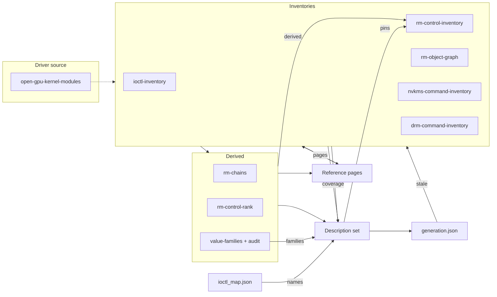

Compares the committed surface artefacts against each other, and the generated
reference pages against the artefacts they render. Each check covers a pair
that has to agree and that no other tool compares, so a disagreement between
them reaches the repository while every tool reports success.

The module reads committed files only. It needs no GPU, no kernel, no network
and no driver source checkout, so it runs in CI on the same runner as the
offline self-test.

## The ten checks

| Check | Compares | Defect it closes |
|---|---|---|
| `names` | Every call name `tools/ioctl_map.json` carries, against the calls the description set declares | A trace converted through a name no description declares produces a program syz-db rejects, or one that runs and attributes to nothing |
| `pins` | Every emitted leaf selector, against `const[...]` form and against the method id the control inventory carries for that handler | A control variant with a free `cmd` reaches all 1372 exported commands from one description and defeats the per-leaf denominator. One pinned to another leaf's id reaches one wrong leaf and reports as one right one |
| `coverage` | The enumerated denominator, against the variants the description set declares, per family | A target that lost its declaration is fuzzed by nothing while the headline ratio still reads complete |
| `derived` | `rm-chains.json` and `rm-control-rank.json`, against the control inventory and against their own record structure | Nothing in CI runs the two tools that produce them, so a driver bump leaves both stale and the seeds phase is otherwise the first thing to notice, at run time on the target |
| `families` | Every field bound to a value family, against the audit that accepted it, and every flags set defined against every one referenced | A field bound to the wrong family is worse than a bare integer, because the bare integer still reaches its real values by mutation and a wrong family never does |
| `pages` | The committed reference pages, against what `refgen.py` regenerates from the artefacts | A page edited by hand, and an artefact regenerated without regenerating the pages |
| `stale` | Every input `descriptions/generation.json` records, against the bytes on disk | An artefact regenerated without regenerating the description set leaves the record naming bytes that no longer exist, and both files still parse |
| `harnesses` | The four Track U target lists, against each other | A target named by fewer than all four is built and never run, or run and never built, and the campaign reports the skip hours in |
| `agents` | Every command line in a phase brief, against the tool's own argument parser | A wrong flag stalls an unattended campaign on a metered instance until a human notices |
| `figures` | Every surface figure a brief or a hand-written page states, against what the inventories measure | A brief is executed by a model that takes its numbers as fact, and nothing else read them |

The checks run in that order, which is also the order of the CI steps. A
failure reports the offending entry and the command that regenerates the
artefact behind it. An artefact the check cannot read at all is separated from
an artefact that disagrees, because a checkout without the committed artefacts
would otherwise read as a real regression.

Two checks compare something other than an artefact pair. `harnesses` reads
four files that carry the Track U target list, and `agents` reads the phase
briefs against the tools they invoke.

## Design notes

### Pinned selectors

Form alone is a weak assertion, so a control variant's `cmd` is compared
against a value as well. The inventory carries a method id against each handler
symbol, and the check joins on that symbol, which is the string both the
inventory row and the variant name are built from. `syzlang_gen.py` asserts the
same rule at emission for every control, allocation, XFER, modeset and DRM
variant it writes, which covers generation. This check covers a description set
edited by hand afterwards, so it sweeps every call.

Four fields are free on purpose, and all four belong to escape-family targets.
Each escape counts as one target and is never decomposed per leaf, so pinning
the field would add no target to the denominator.

| Variant | Struct | Field | Free because |
|---|---|---|---|
| `NV_ESC_CHECK_VERSION_STR` | `nv_ioctl_rm_api_version_t` | `cmd` | Selects the version comparison mode inside one handler |
| `NV_ESC_RM_LOCKLESS_DIAGNOSTIC` | `NV_LOCKLESS_DIAGNOSTIC_PARAMS` | `cmd` | Selects a diagnostic sub-operation inside one root-only handler |
| `NV_ESC_RM_ALLOC_OBJECT` | `NVOS05_PARAMETERS` | `hClass` | A class multiplexer. The classes behind it are decomposed in the alloc family under `NV_ESC_RM_ALLOC`, and both routes meet the same `RS_ENTRY` privilege gate |
| `NV_ESC_RM_ALLOC_CONTEXT_DMA2` | `NVOS39_PARAMETERS` | `hClass` | A class multiplexer, on the same grounds |

### The denominator floor

`coverage` compares the description set against whatever the inventories
return, so a driver bump that drops targets, or a defect in an inventory
parser, shrinks both sides together and the comparison still reads clean. A
per-family floor makes the denominator itself an assertion. A bump that
legitimately retires a target moves the floor, and moving it is the change to
review.

| Family | Floor |
|---|---|
| escape | 32 |
| uvm | 39 |
| uvm_tools | 7 |
| control | 531 |
| alloc | 155 |
| modeset | 64 |
| drm | 24 |

### Artefacts read against their own structure

`derived` also reads each artefact against its own restatement of its
structure, and neither pass needs the tool that produced the file. The
ranking's rank is 1..N in array order, its score is the weighted sum of its
components to within a tolerance, and the score does not increase along the
array within each of the two runs the file is built from. A chain's length
matches its step count, its last step is the class it targets, and its command
count matches its command list. Each restatement is read only where the
artefact carries it on every record. One carried on part of an array is
reported, and one carried nowhere leaves the command-set comparison as the
whole of the check.

### Provenance and line endings

`stale` reads the record `syzlang_gen.py emit` writes. It carries a path, a
digest and a record count for each of the nine inputs the description set was
generated from, plus the driver version and commit of the checkout the emitter
read.

| Recorded input | Path | Records |
|---|---|---|
| `control_inventory` | `surface/rm-control-inventory.json` | 1372 |
| `ctrl_rank` | `surface/rm-control-rank.json` | 531 |
| `ctrl_sizes` | `surface/ctrl-param-sizes.json` | 739 |
| `drm_inventory` | `surface/drm-command-inventory.json` | 28 |
| `escape_inventory` | `surface/ioctl-inventory.json` | 4 |
| `nvkms_inventory` | `surface/nvkms-command-inventory.json` | 66 |
| `object_graph` | `surface/rm-object-graph.json` | 222 |
| `value_families` | `surface/value-families.json` | 72 |
| `value_families_audit` | `surface/value-families-audit.json` | 73 |

A digest that moved on line endings alone is reported apart from one that moved
on content. The repository normalises to LF, so a committed artefact is LF in
the blob whatever platform wrote it, and git reports a CRLF working copy of it
as unmodified. A digest taken over that working copy passes on the machine that
recorded it and fails on every checkout of the same commit, which is the
machine a campaign runs on.

| State | Condition | Remedy |
|---|---|---|
| `crlf` | The file holds the recorded content with CRLF line endings | Convert the working copy to LF |
| `crlf-record` | The file is LF and the recorded digest was taken over a CRLF copy | Re-record the digest from an LF checkout |
| `differs` | The content itself moved | Regenerate the description set against the same driver checkout |

### The four Track U target lists

Each drives a different step, so a target named by fewer than all four is built
and never run, or run and never built.

| Source | Construct read | Drives |
|---|---|---|
| `config/campaign.yaml` | `track_u.targets` | The fuzz phase, and the output directory the coverage sampler reads |
| `harnesses/run_all.sh` | The `C_TARGETS` bash array | Which binaries the campaign runs |
| `harnesses/TARGETS.md` | Every `Harness` column in the file | The entry point, the reachability argument and the replay command |
| `harnesses/` | Directories holding a `build.sh` | What `build_all.sh` compiles |

An offender line names the source that does not carry the target and the
sources that do. Two directories under `harnesses/` carry no Track U target and
are declared as known absences, so a directory holding no `build.sh` and
declared nowhere is reported.

| Directory | Reason |
|---|---|
| `common` | A shared helper tree. It holds `build_common.sh`, which every harness `build.sh` sources, and builds no target of its own |
| `go_cudacompat_elf` | `go test -fuzz` writes no `fuzzer_stats`, so it produces no coverage output for the sampler to read. `config/campaign.yaml` records the same reason against `track_u.targets` |

### Reading a tool's command surface

`agents` reads the argparse parser each tool declares, never its `--help`
output. The help text is a rendering of the parser, and a flag hidden from it
or a value type declared on an action never reaches it, while the parser object
carries both. A placeholder is never measured against a declared choice or a
declared type, because the operator substitutes it and reporting one would make
every documented `<id>` an offender. A line naming a tool that does not read as
an invocation of it is reported and never skipped, since a silent skip is a
command nothing checks.

## Figure rules

`figures` applies three rules to the prose, in order of precision. Each names
the artefact that settles the figure, so a report carries the value the prose
should have stated.

| Rule | Condition | Settled by |
|---|---|---|
| `superseded` | A denominator this repository has retired, stated as a current one | The recorded history of denominator versions |
| `bound` | A figure the surrounding words bind to a quantity, such as the commands outside the denominator or the number of exclusion groups | The inventories |
| `enumeration` | A family list, checked by its own sum | The per-family counts, which move when a family is added |

The `enumeration` rule catches a family added to the surface and left out of a
brief. Every figure in the list is right and the list is still wrong, so no
per-figure comparison finds it. The sum moves, and the report names the family
the list omits.

A figure inside a code span or a fenced block is a reproduction of what a tool
printed, and is read as immutable. Prose wraps at 80 columns, so the lines are
joined before matching and the offset is mapped back to a line for the report.

## Current readings

Against the committed artefacts at driver 610.57.04.

| Check | Reading |
|---|---|
| `names` | 78 map entries over 78 distinct names, 933 declared calls, OK |
| `pins` | 860 selector fields across 933 calls, control 531, alloc 207, xfer 31, modeset 64, drm 24, outside every group 3. 531 control `cmd` values checked against the inventory over 521 distinct values, 64 modeset `cmd` values over 64 and 24 drm requests over 24, 0 the inventory does not carry. 2 calls whose `arg` resolves to no declared struct, 0 of them inside a reported group. OK, 4 unpinned by design |
| `coverage` | 852 targetable, 852 modelled, 81 declared variants outside the denominator, denominator floor 852 across 7 families, 24 entry points on the 6 modelled nodes of the 42 the driver registers, 10 entry-point calls required and 10 declared, OK |
| `derived` | 531 targetable control commands. `rm-chains.json` 98 records implying 598 names and accounting for 531, `rm-control-rank.json` 531 records implying 531 and accounting for 531, 0 undeclared, 0 mismatched and 0 internal, OK |
| `families` | 72 derived families, 53 accepted by the audit, 53 bound to a field, 0 collisions and 0 accepted and unbound, OK |
| `pages` | 7 generated pages. `allocation-classes.md` 253 records at 38706 bytes, `control-commands.md` 531 at 105433, `driver-cves.md` 61 at 50000, `drm-commands.md` 28 at 8854, `escapes.md` 37 at 9350, `index.md` 6 at 7877, `modeset-commands.md` 66 at 14198, each equal to the committed copy, OK |
| `stale` | 9 recorded inputs, 9 matching, driver 610.57.04 at commit `e4a5faa`, OK |
| `harnesses` | 6 targets across 4 sources, 2 declared exclusions, OK |
| `agents` | 12 briefs, 183 command lines and 26 stated exit codes over 23 tools, 2 declared exclusions, OK |
| `figures` | 79 prose files read, denominator 852 over 7 families, 351 excluded over 6 groups, retired denominators 764 and 828, OK |

The two calls whose `arg` resolves to no declared struct are
`UVM_DEINITIALIZE`, which declares no pointer, and `NV_ESC_ATTACH_GPUS_TO_FD`,
whose `arg` renders as `int32`. The 531-against-521 reading is five NV0090
commands each exported by three owning classes, so 15 handler symbols carry 5
distinct method ids. [surface_cov.py](/gspwn/architecture/components/surface-cov/)
records the same 521 against 531.

## Stated limits

None of the ten checks says whether a pinned selector reaches the handler it
names. That is settled by a call on the target.

`families` reads the audit's verdict and never the reasoning behind it. A
family accepted in error is bound and reported as correct, which is why the
audit is committed and reviewed by hand.

`families` reads the emitted field's width against the set it carries and never
the values in it, so a set holding a value wider than the field it binds is
left to the compile gate.

`derived` compares the two artefacts against the inventory and not against the
driver source, so a bump that moves the source without moving
`rm-control-inventory.json` passes.

`pins` compares a value for the control family alone. The allocation `hClass`
and the XFER inner `cmd` have no committed authority to compare against, and
`VALUE_CHECKED` records the scope.

`pages` proves that a page follows from the artefacts. `coverage` and
`derived` cover whether the artefact is right about the driver, and neither
reads the driver source.

`stale` compares the recorded digest against the file on disk, and never the
artefact against the driver source.

`harnesses` reads the union of every `Harness` column in
`harnesses/TARGETS.md`. A harness carried by the replay table and absent from
the sanitizer table is outside what the check compares. It also says nothing
about whether a harness compiles or runs, and `build_all.sh` settles that on
the target machine.

`agents` reads the argument surface a command claims. It does not run the
command, so it says nothing about whether the tool succeeds, whether a required
argument the brief omits is supplied at run time, or whether the value behind a
placeholder is valid. Positional arguments are counted by neither the check nor
the parser it reads, because a brief writes them as placeholders.

Two tools a brief names declare no argparse parser and are resolved no further
than their file existing. `tools/build_kernel.sh` takes its inputs from the
environment. `tools/crashlog_ctl.py` reads `sys.argv` by hand, so its four
subcommands and its two flags are literals inside `main()` and no import
reaches them. `AGENT_TOOL_EXCLUSIONS` carries both with the reason, and the
check prints the pair on every run.

An exit code binds to the tool named most recently at or before the line that
states it. The briefs are written in that order, with the command block first
and the sentence after it saying what each code means. A brief that states a
code far from the command it belongs to binds it to the wrong tool.

The exit set covers every `return` and every `sys.exit` in the module. Reading
`main()` alone would miss the value a helper produces, so the set
over-approximates, and the check reports a code only when nothing anywhere in
the tool produces it.

## See also

- [syzlang_gen.py](/gspwn/architecture/components/syzlang-gen/)
- [surface_cov.py](/gspwn/architecture/components/surface-cov/)
- [refgen.py](/gspwn/architecture/components/refgen/)
- [trace2seed.py](/gspwn/architecture/components/trace2seed/)
