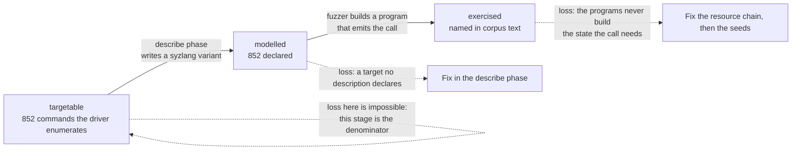

Measures how much of the driver's own enumerated command surface a description
set declares and a corpus names. `coverage_ctl.py` counts KCOV edges, and the
driver's edge space has no known size, so an edge count cannot support a
"covered X% of the driver" claim. `config/campaign.yaml` disclaims that reading
of it.

The inventories supply a denominator that has been measured. Five modules
enumerate the surface: `ioctl_inventory.py`, `ctrl_surface.py`,
`object_graph.py`, `nvkms_inventory.py` and `drm_inventory.py`.

The module reads committed artefacts. It reaches no device and needs no KCOV,
no syz-manager and no GPU.

## Commands

| Command | Output |
|---|---|
| `targets` | The denominator, one row per family, and the excluded groups below it. `--json` emits it as JSON and `--out PATH` writes that JSON to a file. |
| `modelled` | What the descriptions declare, against the denominator, plus the entry-point block and the variants no inventory names. `--top N` bounds the surplus list, default 20. |
| `report` | The three-stage decomposition. `--json` emits it as JSON. |
| `gaps` | The uncovered targets. `--stage model` or `--stage corpus` picks the stage, default `model`. `--family` restricts to one family and `--top N` bounds the list, default 40. |

All four accept `--desc` for the description directory, `--corpus` for a
corpus directory, `--run-id` to read a run's own corpus, and `-v` to log at
DEBUG.

## Input artefacts

| File | Written by | Supplies |
|---|---|---|
| `surface/ioctl-inventory.json` | `ioctl_inventory.py` | The escape, UVM and UVM-tools families |
| `surface/rm-control-inventory.json` | `ctrl_surface.py` | The control family and the class-id lookup |
| `surface/rm-object-graph.json` | `object_graph.py` | The alloc family |
| `surface/nvkms-command-inventory.json` | `nvkms_inventory.py` | The modeset family |
| `surface/drm-command-inventory.json` | `drm_inventory.py` | The drm family |
| `surface/entry-points.json` | `ioctl_inventory.py` | The entry-point block reported beside the command total |

## The denominator

`targets` prints the count per family. The figures below are for driver
610.57.04. The driver enumerates 1203 commands: 852 enter the denominator and
351 are counted and reported outside it.

| Family | Targets | Contents |
|---|---|---|
| escape | 32 | Dispatched `NV_ESC_*` escapes on `/dev/nvidiactl` and `/dev/nvidiaX` |
| uvm | 39 | Commands on `/dev/nvidia-uvm` |
| uvm_tools | 7 | Commands on `/dev/nvidia-uvm-tools` |
| control | 531 | Non-privileged RM control commands carrying a kernel-side handler |
| alloc | 155 | Unprivileged allocatable classes, plus the three root classes the file descriptor itself gates |
| modeset | 64 | Commands on `/dev/nvidia-modeset` carrying a dispatch entry |
| drm | 24 | Dispatched `DRM_NVIDIA_*` commands on `/dev/dri/cardN` and `/dev/dri/renderDN` |
| total | 852 | |

The criterion for exclusion is that the command is enumerated in a driver
header and a default tenant's call cannot reach an instrumentable handler
through it.

| Group | Count | Exclusion reason |
|---|---|---|
| control_gsp | 236 | The handler is compiled out and the parameter buffer crosses the RPC queue to GSP, where KCOV cannot follow |
| uvm_test | 104 | Reachable only under `uvm_enable_builtin_tests=1`, which the target does not set |
| drm_undispatched | 4 | Declared in `nv_drm_common_ioctl.h` at command numbers 25 to 28 with no entry in `nv_drm_ioctls[]`, so the DRM core finds no handler |
| escape_dead | 3 | Declared in `nv_escape.h` with no dispatch case |
| escape_mux | 2 | `NV_ESC_RM_CONTROL` and `NV_ESC_RM_ALLOC`, multiplexers whose leaves are counted in the control and alloc families |
| modeset_undispatched | 2 | Declared in `enum NvKmsIoctlCommand` with a null dispatch entry, so `nvKmsIoctl` returns before any handler runs |
| total | 351 | |

The 236 GSP-routed commands are worth fuzzing. A tenant can call them and the
marshalling runs kernel-side, and the handler itself runs on firmware KCOV
cannot instrument. Effort spent there raises executions and moves no edge
count.

852 is an upper bound on what a tenant can actually reach. 16 control commands
flagged non-privileged call `rmclientIsCapableOrAdmin`, `rmclientIsCapable` or
`rmclientIsAdmin` inside the handler body, which the RMCTRL flag word does not
show. That 16 is itself a floor, because a check inside a helper the handler
calls is not attributed to the handler. A further 2 drm commands carry
`DRM_MASTER` and reach a handler only while the opening file is the current
DRM master, which `drm_master_open` grants only when the device has none.

## The three stages

A target passes through three stages, and each loses targets to a different
cause.

1. targetable, measured from the five inventories. This stage is the
   denominator, so nothing is lost here.
2. modelled, measured from `descriptions/`. A lost target is recovered by the
   describe phase writing the missing syzlang variant.
3. exercised, measured from the corpus under `artifacts/seeds/`. A lost target
   means the programs do not build the state the call needs, which is a
   resource-chain problem before it is a seed problem.

modelled over targetable measures the describe phase's own completeness.
exercised over modelled measures whether the fuzzer builds programs valid
enough to emit the call at all. A single headline ratio cannot separate the
two, and the two call for different work.

The generated baseline reads six description files carrying 933 distinct
variants, of which 852 model the whole denominator at 100.0% in every family
and 81 are named by no inventory. The exercised column reads 0 because no
campaign has run, and `report` states that an empty corpus says nothing about
the descriptions.

The measurement works because `syzlang_gen.py` names every control command as
its own syzlang variant, `ioctl$NV_ESC_RM_CONTROL_<handler>`, and never one
opaque `NV_ESC_RM_CONTROL` carrying a command field. The variant name is the
join key for all three stages, because a description declares it and a corpus
program names it in the same spelling.

## Entry points

`modelled` and `report` print an entry-point block beside the command total.
The description set registers 24 entry points on the six device nodes whose
entry points are modelled, out of 42 across every `file_operations` table the
driver defines, and declares 10 calls over them: `mmap$dri_card`,
`mmap$dri_render`, `mmap$nvidia`, `mmap$nvidia_uvm`, `mmap$nvidiactl`,
`poll$dri_card`, `poll$dri_render`, `poll$nvidia`, `poll$nvidia_uvm_tools` and
`poll$nvidiactl`.

Entry points stay outside the command total, because an entry point has no
method id, no parameter struct and no inventory row. `/dev/nvidia-modeset` is
opened for the modeset command family and its own `mmap` and `poll` are not
modelled.

## Responsibility

The module owns the denominator and the three-stage decomposition over it. It
writes only the JSON file `targets --out` is given.

| Invariant | Enforced by |
|---|---|
| A missing inventory cannot shrink the denominator silently | `_load` raises `SurfaceError` naming the file and the regeneration step |
| A denominator cannot mix driver releases | `load_targets` compares the `driver_version` each inventory records and refuses more than one distinct value |
| A multiplexer and its leaves are never both counted | `NV_ESC_RM_CONTROL` and `NV_ESC_RM_ALLOC` are classified `escape_mux` and excluded, and the control and alloc families carry their leaves |
| One call never counts in two families | A class allocation whose variant name collides with a dispatched escape yields to the escape, so `NV_ESC_RM_ALLOC_MEMORY` is counted once |
| A UVM test command is separated by its gate | The discriminator is the `reachable` field the extractor recorded, and never the command name, because test and production commands share a node path and a module |
| The three root classes stay inside the denominator | `NV01_ROOT`, `NV01_ROOT_NON_PRIV` and `NV01_ROOT_CLIENT` carry no `RS_FLAGS_ALLOC_*` marker because the file descriptor gates them, and a default tenant allocates one as the first call of every program |
| An empty corpus is never read as a modelling failure | `report` names the corpus directory, states that the exercised column is empty by construction, and skips the resource-chain diagnosis |
| A directory that yielded no file is visible | `scan_variants` logs a warning when it reads nothing, so every stage below it reading zero is attributable |
| A description declaring a variant no inventory names is reported | `modelled` lists the surplus variants, because a stale inventory and a description outside the tenant surface both appear there |

## Measurement inputs

The denominator comes from the five inventories. The modelled set comes from
the syzlang description files. The exercised set comes from corpus program
text, and a corpus reaches the tool by either of two routes.

- The seed bank, read from `artifacts/seeds`, the programs a round started
  from.
- A run's own corpus, read from `artifacts/runs/<id>/workdir/corpus.db`,
  unpacked through syz-db into a temporary directory and removed afterwards.

Every report prints the corpus path, its modification time and its program
count, so a stale read is visible. The seed bank holds a round's own programs
only after the promotion step has run, and reading the run's corpus removes
that ordering requirement.

The tool refuses to measure at all when an inventory is absent, unparseable, or
records a driver release the others do not, because each of those would shrink
or mix the denominator silently. An empty description directory or an empty
corpus warns and reports zero, which is a different condition and is reported
as one.

## Concurrency and durability

Every subcommand is read-only except `targets --out`, which writes the JSON
whole to `PATH.tmp` in the destination directory, flushes, `fsync`s and moves
it into place with `os.replace`. A crash mid-write leaves the previous file
intact and never a truncated one. No lock is taken. The module holds no state
between runs and is safe to re-run.

## Reporting rules

| Rule | Rationale |
|---|---|
| A surface number is never presented as a fraction of the driver's code | The denominator is the enumerated command surface. The driver's line and edge counts are not in it, and a reader who conflates the two gets a coverage claim the data does not support |
| The excluded groups stay out of the denominator | The 236 GSP-routed commands alone would move the ratio by more than a quarter with no campaign changing, and the movement would read as progress |
| The headline share is never reported without the per-stage split | Losing a target at the modelling stage and losing it at the corpus stage need different work, and one number cannot distinguish them |
| An empty corpus is never read as a description failure | The pre-fuzz state produces the same zero, and reporting it as a modelling gap sends the describe agent to fix a description set nothing has run against |
| A multiplexer is never counted alongside its leaves | `NV_ESC_RM_CONTROL` selects its real target from a field in its own parameter struct, so counting both puts the same calls in the denominator twice |
| An inventory naming a different driver release stops the measurement | A denominator mixed across releases counts commands that do not coexist |

## Design notes

`coverage_ctl.py` and this module answer different questions about the same
campaign. An edge count answers whether the fuzzer is still finding new code.
A surface number answers which commands it never tried. A plateau at low
surface coverage and a plateau at high surface coverage call for opposite
actions, and the edge count alone cannot separate them. See
[Coverage and plateau](/gspwn/architecture/coverage-and-plateau/).

The join key is the syzlang variant name and not an ioctl request number,
because a request number identifies `NV_ESC_RM_CONTROL` and stops there. All
531 control commands share that one request number, and the command a program
actually issues appears in the variant name `syzlang_gen.py` assigns. A
measurement keyed on request numbers would collapse the control family to a
single target.

`modelled` reports the variants a description declares that no inventory names.
Two different causes produce entries in that list. An alternate calling form or
an alternate route to a counted target is expected, and a description outside
the tenant surface or a stale inventory is a defect. The generated baseline
produces 81 such variants: 49 per-parent allocation forms, 31 XFER wrapper
routes, and `NV_ESC_RM_ALLOC_NVOS21`.

The completion ledger stores a target under a composite ABI key, never under
the variant name. A control variant carries the C handler function name, which
a driver refactor renames freely, and a ledger keyed on it would lose every
accounted row at the next driver bump while still looking full. The variant
stays on the record as an observation field, because `scan_variants` can
measure `exercised` only by matching variant names in corpus text.

| Family | Key | Distinct |
|---|---|---|
| control | `control/<class_id>/<method_id>/<owning_class>` | 531 of 531 |
| escape | `escape/<nr>` | 32 |
| uvm | `uvm/<nr>` | 39 |
| uvm_tools | `uvm_tools/<nr>` | 7 |
| alloc | `alloc/<external_class>` | 155 |
| modeset | `modeset/<nr>` | 64 |
| drm | `drm/<nr>` | 24 |

`(sdk_prefix, method_id)` is not sufficient for the control family: it yields
521 values for 531 commands, because five NV0090 commands are each exported by
three owning classes, and those three are three different allocation chains
reaching one ABI command. Escape, UVM and allocation names are ABI names and
not function names, so they carry no rename risk.

`rm-object-graph.json` records carry no numeric field, so `load_targets` builds
an owning-class to class-id lookup over every method in the control inventory
and joins each allocation record's `internal_class` against it. 62 of the 155
recover a class id that way and 93 store an explicit null, keyed on the ABI
class name, which is unique on its own.

## See also

- [Coverage and plateau](/gspwn/architecture/coverage-and-plateau/)
- [Attack surface](/gspwn/architecture/attack-surface/)
- [ctrl_surface.py](/gspwn/architecture/components/ctrl-surface/)
- [object_graph.py](/gspwn/architecture/components/object-graph/)
- [surface_verify.py](/gspwn/architecture/components/surface-verify/)
