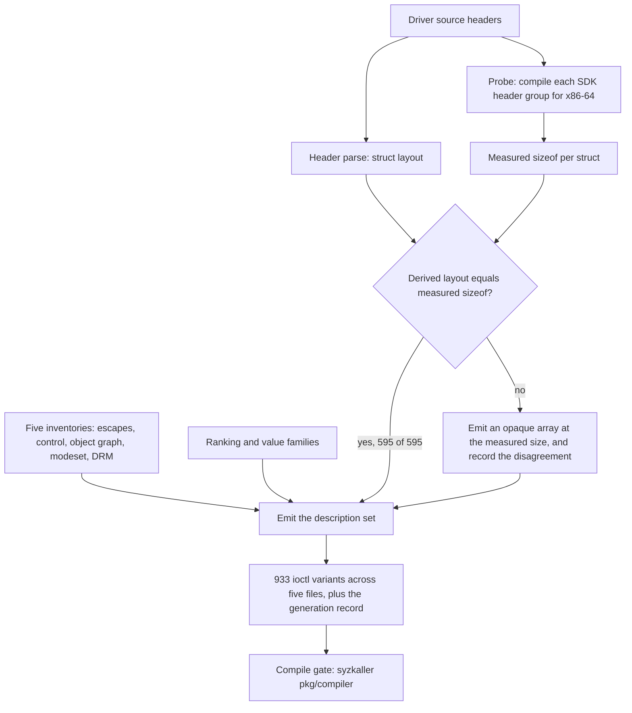

Generates a syzlang description set for the NVIDIA driver ioctl surface from
the three measured inventories. `ioctl_inventory.py` supplies the dispatched
escapes and their request numbers, `ctrl_surface.py` the RM control command
space with its privilege classification, and `object_graph.py` the allocation
DAG.

Struct field layout appears in none of the inventories, which carry struct
names and sizes only. This module parses layout out of the driver headers and
checks every derived layout against a `sizeof` measured by compiling the same
header for x86-64.

The module runs entirely off the source tree and the committed inventories. It
reaches no device and needs no GPU.

## Responsibility

The module owns the header parse, the layout derivation and the emitted
description set. It writes only the files under its output directory.

| Invariant | Enforced by |
|---|---|
| A derived struct layout never ships unchecked | Every struct a description names is compared against a measured `sizeof` |
| A layout that disagrees with its measurement is still correctly sized | The struct falls back to an opaque array at the measured size |
| A disagreement is visible | `generation.json` records the struct, the derived total and the measured total, and a strict run refuses to write the set at all |
| Nothing is guessed to complete a description | A parameter type with neither a derived layout nor a measured size is skipped and counted |
| The emitted size does not depend on syzkaller's alignment rules | Padding is explicit and every struct carries `[packed]` |
| The client allocation is always emitted | The three `RS_ROOT_OBJECT` classes name no `RS_FLAGS_ALLOC_*` flag and are emitted anyway, with a log line naming them |
| The control multiplexer is a constant set | One variant per command, with `cmd` pinned to `const[<method id>, int32]` |
| No emitted call leaves its leaf selector free | The rendered struct text is read at emission, and a `cmd` or `hClass` that is not `const[...]` stops the run. Every control, allocation, XFER, modeset and DRM variant is checked |
| The wrapper escape reaches no command the direct route cannot | Both multiplexers are declined, and one typed variant is emitted per remaining inner escape |
| A description set is reproducible from a clean checkout | Every input defaults to a committed artefact, and `generation.json` records the path, the digest and the entry count of each |
| A parent pin is never a chip-gated guess | A class expands to one variant per legal parent only when no member of its parent set is chip-exclusive |
| A UVM request number carries no `_IOC` fields | UVM commands are read from the inventory's `bare_command_number` nodes and emitted as bare values |
| No field is bound to a value family the audit did not accept | The derivation is joined against `surface/value-families-audit.json` and only accepted records reach a field |
| A bound field keeps the width it had | The width comes from the derived layout and never from the family record, so a field emitted as `int8` binds to `flags[..., int8]` and the struct size does not move |
| A value family never displaces an existing override | The existing override wins any field both name, and the collision is recorded and reported |
| A set is emitted only where a field references it | Sets are written after every struct has rendered, over the families that actually bound |
| The emitted identifier is the audited identifier | The set definition and the field binding read one name off the derivation, computed once at derivation time |
| Out-of-scope device nodes stay absent | Seven nodes get an `openat$` variant: `/dev/nvidiactl`, `/dev/nvidiaN`, `/dev/nvidia-uvm`, `/dev/nvidia-uvm-tools`, `/dev/nvidia-modeset`, `/dev/dri/cardN` and `/dev/dri/renderDN`. Nothing else does |

## Generation

Five inventories and the driver headers go in, and a syzlang description set
comes out with a size check standing between them.



The size check is the reason the set can be trusted at all. An ioctl request
number encodes the size the driver expects, so a wrong layout compiles, runs,
and lands on a different field or on none. Every struct a description names is
compared against a `sizeof` measured by compiling the same header for x86-64,
and a struct whose derived layout disagrees falls back to an opaque array at
the measured size with the disagreement recorded.

The generation record `descriptions/generation.json` carries the driver version
and commit the set was built from, a digest of each of the nine inputs, and the
per-family counts, so a stale description set is detectable at rest.

## Concurrency and durability

Each invocation reads five inventories and the header tree, then writes five
description files, the struct file, the `_IOWR` header and the generation
record. Every output goes to a temp file in its target directory and moves into
place atomically, so a crash mid-write leaves the previous file intact and
never a truncated one. The module holds no state between runs.

The probe deletes the translation units an earlier run left behind, because a
unit from a different grouping would still compile and contribute sizes for
structs the current set no longer names.

## Prohibited behaviour

| Rule | Rationale |
|---|---|
| Never emit a struct whose derived layout disagrees with its measured `sizeof` | The ioctl request number encodes the size the driver expects. A wrong layout compiles, runs, and lands on a different field or on none |
| Never model `NV_ESC_RM_CONTROL` as one escape carrying an opaque buffer | `agents/describe.md` step 4b. One opaque ioctl gives the fuzzer no command number to mutate and no parameter structure, and it puts the command number out of reach of any corpus-text measurement |
| Never emit one call covering both `/dev/dri` node types | `drm_ioctl_permit` refuses a render client any command whose flag word omits `DRM_RENDER_ALLOW`, so one call name would model the union on both nodes and emit programs that reach no handler. `openat$dri_card` and `openat$dri_render` carry separate `fd` resources, which makes the 21-of-24 split a compile-time type error |
| Never classify a record carrying no `RS_FLAGS_ALLOC_*` flag with the privileged ones | The three such records are the root client classes. Filtering them drops the client allocation and every description that consumes its handle |
| Never widen a variant's file descriptor argument past its node restriction | `NV_ESC_RM_CONTROL` carries `NV_CTL_DEVICE_ONLY`, so all 531 control variants take `fd_nvidiactl` |
| Never leave padding to syzkaller | Whether its alignment rules agree with the compiler's is an assumption no compile gate checks |
| Never report a count against 1372 exported control methods | 841 of them are privileged, kernel-only or internal, and the reachable denominator is 531 |

## Design notes

One predicate decides the whole control family:
`reachability == "non_privileged" and not handler_compiled_out`. It selects 531
of the 1372 exported methods. `reachability` partitions the export table into
767 non-privileged, 250 privileged, 241 internal and 114 kernel-only, and the
second clause removes the 236 non-privileged methods whose local handler is
compiled out and whose parameter buffer crosses the RPC queue to GSP firmware.

Each control command is named as its own variant,
`ioctl$NV_ESC_RM_CONTROL_<handler>`. That makes corpus text self-describing, so
[`surface_cov.py`](/gspwn/architecture/components/surface-cov/)
measures which commands a corpus reaches with no KCOV, no syz-manager and no
GPU. Variants are named after the handler and not the command number, so the 5
duplicate method ids in the export table still produce distinct descriptions.

[`surface_cov.py`](/gspwn/architecture/components/surface-cov/) measures the
generated baseline at 852 of 852 targets modelled, 100.0%. The denominator
decomposes as 32 escapes, 39 UVM commands, 7 UVM tools commands, 531 control
commands, 155 allocation classes, 64 modeset commands and 24 DRM commands. The
set declares 933 `ioctl$` variants, split 268 in `nvidia.txt`, 531 in
`nvidia_ctrl.txt`, 46 in `nvidia_uvm.txt`, 64 in `nvidia_modeset.txt` and 24 in
`nvidia_drm.txt`, plus seven `openat$` descriptions.

81 of the 933 sit outside the denominator, and every one of them is an
additional calling form or an additional route to a target the denominator
already counts.

| Variants outside the denominator | Count | Calling form |
|---|---|---|
| `NV_ESC_RM_ALLOC_<class>_UNDER_<parent>` | 49 | One allocation variant per legal parent, for the 32 classes whose parent set is not chip-gated |
| `NV_ESC_IOCTL_XFER_CMD_<escape>` | 31 | The typed wrapper route to each inner escape |
| `NV_ESC_RM_ALLOC_NVOS21` | 1 | The NVOS21 calling form of `NV01_ROOT` |

`NV_ESC_RM_ALLOC` dispatches on two parameter sizes,
`sizeof(NVOS64_PARAMETERS)` at 48 and `sizeof(NVOS21_PARAMETERS)` at 32, so one
class takes two parameter structs where the inventories count one target.

595 of the 1947 emitted structs are named directly by a description and were
measured by the probe. All 595 derived layouts match their measured `sizeof`,
so `generation.json` records a size-mismatch count of zero. The remaining 1352
structs are nested inside those, or are synthetic names for an anonymous inner
struct or union. A nested struct has no `sizeof` of its own to check, and a
wrong nested layout moves its parent's total, which the check does see.

The check is verified to fail when the layout is wrong. Widening `NvHandle`
from 4 bytes to 8 in the base type table turns 105 of the 595 into reported
mismatches, each falling back to an opaque array at the measured size.

The compile gate runs syzkaller's own `pkg/compiler` over the staged set
against a pinned checkout. It reports 957 syscalls, over 181 resources and 4939
types, with nothing unsupported. 951 of the 957 come from the description set
and the other 6 are the `syz_builtinN` pseudo-syscalls `pkg/compiler` prepends
to every compile. The 951 are the 933 `ioctl$` variants, the 7 `openat$`
descriptions, the 10 entry-point calls and `syz_nvidia_uvm_init`.

Three spellings the set depends on are settled by that gate:
`array[const[0, int8], N]` for explicit padding, `ptr64[in, T]` for the `NvP64`
parameter pointers, and a resource produced by an inout struct field. Every
allocation depends on the third of those, because syzkaller has to treat
`hObjectNew` as an output. A smoke run reporting uniform early-out across a
device node is the symptom of the driver disagreeing at run time about
something the parser accepted.

Request numbers are literal in the description files. `syz-extract` produces
the `.const` file that would let them be named constants, and its exact format
could not be checked against source here. `nvidia_gspwn.h` carries the same
numbers as `_IOWR` macros for `syz-extract` to consume on the SUT. That header
was compiled and its macros evaluated as an independent check on the encoding,
and `NV_ESC_RM_ALLOC`, `NV_ESC_RM_CONTROL` and `UVM_REGISTER_GPU` expand to the
numbers the inventory computed.

Four header constructs in the RM tree defeat a straightforward member parser,
and three more appear only under `src/nvidia-modeset/interface`. `nvos.h`
places `#define` lines between struct members, which makes a naive splitter
read a macro and the field after it as one declaration. 25 control parameter
structs carry an `enum` typed field, and `ctrl2080gr.h` uses an enumerator as
an array bound. 41 control parameter types are typedef aliases of another
command's struct. 17 allocation parameter types are macro aliases, and
`nv-ioctl-numa.h` spells alignment `__aligned(8)` where the rest of the tree
uses `NV_DECLARE_ALIGNED`.

## Value families

53 parameter fields render as `flags[<set>, intN]`. Each set holds the
constants the driver's own headers define for that one field, derived
mechanically from the headers and accepted by hand in
`surface/value-families-audit.json`.

The derivation and the audit are joined on the struct and the field, and only
accepted records reach a rendered field. The audit holds 73 records against the
72 derived families, 53 accepted and 20 rejected. 19 of those rejections fall
among the 72. The twentieth stands against
`NV0000_CTRL_GPU_ACTIVE_DEVICE.gpuId`, a pair the derivation no longer
produces, and the reason recorded there names the `NV0000_CTRL_GPU_ID_INFO_*`
defines as belonging to a different field. A field bound to the wrong family is worse than a bare integer, because
the bare integer still reaches its real values by mutation and a wrong family
never does.

The join is keyed on the canonical struct, so a family naming a typedef and one
naming the struct behind it reach one key. The set definition and the field
binding read one identifier off the derivation, so the emitted name and the
audited name cannot diverge. Every call site that emits a parameter struct
binds through one door, and the run reports the bound count, each collision and
each accepted family the layouts carry no field for.

The width comes from the layout. A field the driver declares as `NvU8` renders
as `int8`, and `flags[..., int32]` in its place would move three bytes of the
struct and change its measured size. 41 of the 53 bind at `int32`, 11 at `int8`
and one at `int64`.

The existing overrides carry
the handle resources, the pinned selectors and the typed descriptors, all
derived from the driver's dispatch, and the value-family rule has not examined
any of them. The current artefacts produce no collision.

## The modeset family

`/dev/nvidia-modeset` multiplexes its whole command set through one kernel
request number. `nvkms-ioctl.h:47` builds `NVKMS_IOCTL_IOWR` as
`_IOWR(NVKMS_IOCTL_MAGIC, NVKMS_IOCTL_CMD, struct NvKmsIoctlParams)`, which
evaluates to `0xc0106d00`, and `nvKmsIoctl` reads the leaf out of
`NvKmsIoctlParams.cmd` after `copy_from_user`. The emission mirrors the control family. One variant per leaf, each carrying a per-variant copy of the
16-byte envelope with `cmd` pinned to the dispatch ordinal, `size` pinned to
the command's own parameter size, and `address` typed as a pointer to the
parameter struct `surface/nvkms-command-inventory.json` names.

The request number is derived from the two macros and the measured envelope
size. A driver that renumbers the node moves it, and no literal in this tool
has to be edited to follow.

Three parser rules exist for this family and for nothing else in the tree.

| Construct | Occurrences | Layout rule |
|---|---|---|
| A run of single-bit `NvBool` members | `NvKmsLayerCapabilities` in `nvkms-api-types.h:499` | gcc allocates them into one byte-wide storage unit on x86-64, and the layout follows. Any other bitfield width still raises `LayoutError` |
| A member declared by enumeration tag, `enum NvKmsEventType eventType` | 30 struct definitions on the modeset ioctl path | It takes the size and alignment of `unsigned int`. Every RM header reaches an enumeration through a typedef, so this form appears nowhere else |
| A function-pointer typedef | `NVRgInterruptCallbackProc` at `nvkms-api-types.h:806` | It registers as an eight-byte pointer. The alias scanner's word-only pattern cannot spell the declaration |

Ten handle typedefs at `nvkms-api-types.h:55` become ten flat resources, one
per typedef, with no hierarchy between them, because the modeset handle scheme
carries no parent/child polymorphism to model where RM's does. A member is
typed by its C type and never by its field name. That works here because each
typedef is distinct. RM spells every handle `NvHandle`, so the type carries no
information there. Each parameter struct is pointed at `inout`, so `pkg/compiler`
counts one member as both a constructor and an input for its resource.

Two of the 66 declared enumerators carry no dispatch entry and no description
is emitted for either: `NVKMS_IOCTL_GET_3DVISION_DONGLE_PARAM_BYTES` at
ordinal 35 and `NVKMS_IOCTL_SET_3DVISION_AEGIS_PARAMS` at ordinal 36.

## The DRM family

`/dev/dri` is inside the tenant surface, because the CDI injection path hands a
container both node types. The driver declares 28 commands in the
`DRM_NVIDIA_*` range and dispatches 24 of them, and the four with no entry in
the dispatch table reach no driver code and stay outside the denominator.

Unlike the modeset family, every nvidia-drm command carries its own request
number, so the identity is the driver-relative command number the DRM core
recovers.

The two node types are emitted as separate calls with separate file-descriptor
resources, because a render client cannot issue every command a card client
can.

| Node | Commands reachable | Condition |
|---|---|---|
| `/dev/dri/cardN` | 24 of 24 | Two of them only while the opening file is the current DRM master |
| `/dev/dri/renderDN` | 21 of 24 | A render client is refused any command whose flag word omits `DRM_RENDER_ALLOW` |

One call name covering both nodes would model the union on each of them and
emit programs that reach no handler. Separate `fd` resources make the
21-of-24 split a compile-time type error instead. Both figures are carried on
every record, so a consumer reads either without re-deriving the flags, and
neither shrinks the family total of 24.

## The parent rule

A syzlang field carries one type, and 98 of the 155 allocatable classes name
more than one legal parent. The emitter splits them on whether their parent set
is chip-gated.

| Parent set | Classes | Emission | `hObjectParent` |
|---|---|---|---|
| One legal parent | 49 | One variant | That parent's `nvh_*` resource |
| Narrow: several parents, at most one chip-exclusive | 32 | One variant per legal parent, 81 in total | Each variant pins its own parent's resource |
| Wide: several parents drawn from the chip-gated GPFIFO channel family | 66 | One variant | `nv_handle` |
| `RS_ROOT_OBJECT` | 3 | One variant | `const[0, int32]`, parented by the file descriptor |
| `RS_ANY_PARENT` | 5 | One variant | `nv_handle` |

A chip-exclusive class is recognised by name. Two families are matched: `CHANNEL_GPFIFO`, and
the chip-numbered display classes under `^NV[0-9A-F]{3}0_DISPLAY$`, which
leaves the unnumbered `NV04_DISPLAY_COMMON`, `NVC372_DISPLAY_SW` and
`NVA083_GRID_DISPLAYLESS` out of the family. A wide class expanded per parent
produces about eleven variants, and a variant whose parent the installed part
does not carry stays in the choice table and in the corpus for the whole
campaign.

The display family is gated: over the 34 per-chip class descriptor lists in
`src/nvidia/generated/g_gpu_class_list.c`, at most 2 of its 8 members appear
together on one part, against parent sets naming all 8.

The channel family is treated as exclusive on a stricter basis than that file
supports. GB202 lists all 8 of the `*_CHANNEL_GPFIFO` classes that appear
anywhere, and all 31 lists carrying any channel class carry
`GF100_CHANNEL_GPFIFO`, so the driver keeps older channel classes allocatable
on newer parts. Treating the family as exclusive refuses an expansion the
driver would permit. It holds the alloc variant count at 204 over 155 classes
and produces no variant naming a parent the part refuses. Widening it is a
change to the emitted set and not a correction, so the classification is left
alone deliberately.

`nvidia.txt` declares `resource nv_handle[int32]` and every `nvh_*` resource
derives from it. A loose pin is expected to correct itself, because
`nv_handle` draws from a pool that includes the correct handle and coverage
feedback selects it. That is syzkaller run-time behaviour and it is unverified:
no syzkaller tree exists in this repository and no description set has been
executed.

The split needs no tuning parameter, because two independent readings of the
data agree on where the line falls. Over the 155 allocatable classes the
parent-set sizes are 1, 2, 3, 11, 12 and 13, so no threshold between 4 and 10
changes the answer, and all 66 wide classes carry all 11 GPFIFO channel classes
while no narrow class carries any. No record has an empty parent list. Over all
222 `RS_ENTRY` records there is also a size of 8, on the 38 privileged records
the split never sees.

The class-level name `ioctl$NV_ESC_RM_ALLOC_<class>` stays on exactly one
variant per class, carrying the cheapest legal parent, measured as the
shallowest in the object graph and then by name. The rest are named
`ioctl$NV_ESC_RM_ALLOC_<class>_UNDER_<parent>`. No external class in
`resource_list.h` contains `_UNDER_`, and the emitter exits on a collision.
One class-level name per class holds the alloc denominator at 155.
`surface_cov.load_targets` keys that family on `NV_ESC_RM_ALLOC_<CLASS>` built
from the object graph, and `scan_variants` joins on the whole name.

`generation.json.counts` carries `alloc_classes` at 155 and
`alloc_parent_variants` at 49 beside `alloc_variants` at 204, so the invariant
the denominator rests on is machine-readable.

`hObject` on a control variant is typed from the command's own SDK class id.
That number is joined against the external classes of `rm-object-graph.json`
that carry a class number in the headers, and falls back to `nv_handle` when
the number names none. 12 of the 531 take the fallback, and
`generation.json` carries the count on the `object_resource` field of each
control record.

| Owning class | Commands | SDK class id | Owning class has an `RS_ENTRY` row |
|---|---|---|---|
| `ProfilerBase` | 9 | `0xb0cc` | no |
| `KernelChannel` | 1 | `0x506f` | yes |
| `NvDispApi` | 1 | `0xc370` | yes |
| `MmuFaultBuffer` | 1 | `0xb069` | yes |

The absence of an `RS_ENTRY` row is a different property and does not decide
this. The 6 `Memory` commands whose owning class also has no row carry class id
`0x0041`, which does resolve, so they take `nvh_nv01_root_client` and are not
among the 12. The 15 commands whose owning class has no row are
[recorded separately](/gspwn/reference/surface/control-commands/) as
`ProfilerBase` 9 and `Memory` 6.

Whether the fallback reaches real work is settled by coverage on an
instrumented run, and no such run has been made.

## The XFER wrapper family

`NV_ESC_IOCTL_XFER_CMD` is a second entry path to every escape. `nv.c:2509`
assigns `arg_cmd` from the payload and re-enters the same dispatch switch, so a
description modelling `cmd` and `ptr` as unconstrained integers reaches every
escape and every control command in the driver through one field, including the
236 GSP-routed commands and the 250 privileged ones. In that model `ptr` is a
raw integer with no pointer type, so the address it carries is unrelated to any
mapping syzkaller made. The expected consequence, that `copy_from_user` returns
`-EFAULT` on almost every attempt, is syzkaller run-time behaviour and is
unverified here: no program has been executed and no driver was involved.

The generator replaces that with one typed variant per in-scope inner escape.

```
ioctl$NV_ESC_IOCTL_XFER_CMD_RM_FREE(fd fd_nvidiactl, cmd const[0xc01046d3], arg ptr[inout, nv_xfer_rm_free])

nv_xfer_rm_free {
	cmd 	const[41, int32]
	size	const[16, int32]
	ptr 	ptr64[inout, NVOS00_PARAMETERS]
} [packed]
```

| Field | Value | Driver constraint |
|---|---|---|
| Outer `cmd` | The wrapper's own request number | From the escape inventory |
| `fd` | The inner escape's device node | The node restriction is checked in the case body, after the unwrap. 20 variants take `fd_nvidiactl`, 6 `fd_nvidia`, 6 `fd_nv` |
| Inner `cmd` | `const[<bare escape number>, int32]` | `nv.c:2412` masks the dispatch key to 8 bits |
| `size` | `const[<measured sizeof>, int32]` | `nv.c:2439` requires exact equality for a non-array escape |
| `ptr` | `ptr64[inout, T]` | The inner `copy_from_user` at `nv.c:2535` reads a mapped address |

`T` is resolved once and read by both routes, so a struct rename cannot make
the direct description and the wrapper disagree.

The escape inventory records 34 dispatched escapes. 31 take a suffixed variant,
`NV_ESC_IOCTL_XFER_CMD` keeps its own bare name because the driver admits
escape 211 as an inner command, and `NV_ESC_RM_CONTROL` and `NV_ESC_RM_ALLOC`
are declined. A wrapper naming either multiplexer selects nothing, because the
target sits in `NVOS54_PARAMETERS.cmd` and `NVOS64_PARAMETERS.hClass` and the
field would have to be left free. One wrapper per leaf, 531 plus 155, reaches
no driver code the 32 do not already reach. An XFER variant adds only the
unwrap at `nv.c:2499` through `:2525`, which is identical for every inner
command.

A generator check declines any inner escape whose argument exceeds the 16384
bytes `nv.c:2513` accepts. No escape in this release reaches it, the largest
being `NV_ESC_RM_LOCKLESS_DIAGNOSTIC` at 15412 bytes.

`size` renders as a constant on all 32 variants, which fixes the two
argument-array escapes at one element. `NV_ESC_CARD_INFO` accepts up to 227
elements on the direct path and `NV_ESC_ATTACH_GPUS_TO_FD` up to 4095, and the
XFER route is bounded by 16384 bytes and not by the 14-bit `_IOC_SIZE` field, so
it can carry more elements than the direct route can encode. Expressing that
needs a construct absent from the existing set, and this repository holds no
syzkaller tree to check one against.

## See also

- [ioctl_inventory.py](/gspwn/architecture/components/ioctl-inventory/)
- [ctrl_surface.py](/gspwn/architecture/components/ctrl-surface/)
- [object_graph.py](/gspwn/architecture/components/object-graph/)
- [surface_cov.py](/gspwn/architecture/components/surface-cov/)
- [Attack surface](/gspwn/architecture/attack-surface/)
- [RM control surface](/gspwn/knowledgebase/rm-control-surface/)
