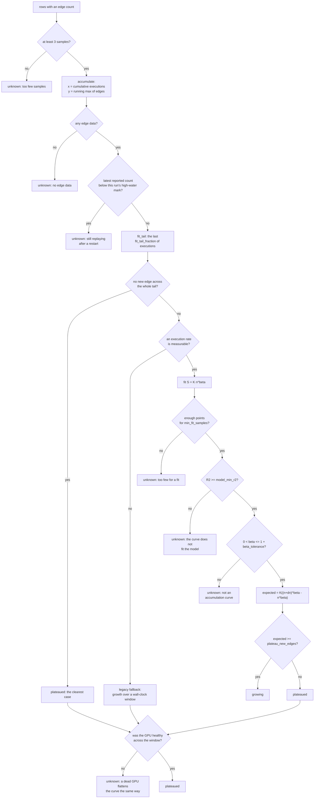

Coverage is the only signal that decides whether to run another round. The
verdict is an extrapolation from a fitted species-accumulation curve, computed
by `coverage_ctl.py plateau`.

## Model

Coverage growth is a species-discovery process. The framing is Böhme's, from
*STADS: Software Testing as Species Discovery* (TOSEM, 2018).

| Model term | Pipeline quantity |
|---|---|
| Species | One distinct edge |
| Sampled individual | One executed input |
| Species accumulation curve | Distinct edges against cumulative executions |
| Discovery exponent | `beta` in the fitted curve |

The output is the number of new edges another campaign of
`coverage.horizon_hours` is expected to find. That figure is in the units of
the quantity being predicted. A growth percentage is scale-dependent: the same
percentage means ten edges early in a run and a thousand late in one.

## Axis construction

`accumulate()` in `tools/coverage_ctl.py` transforms the sampled rows into the
curve. Both counters reset when the fuzzer restarts, and the two axes handle
that reset differently.

| Axis | Quantity | Accumulation | Behaviour on a counter reset |
|---|---|---|---|
| x | Cumulative executions | Sum of per-sample deltas | The delta is the new reading itself, so no negative delta is recorded |
| y | Distinct edges | Running maximum | The replayed count contributes zero until it passes the previous high-water mark |

Executions accumulate as a sum because they are work done. Edges accumulate as
a maximum because they are a set.

| Axis choice | Failure it removes |
|---|---|
| Executions on x | A fixed wall-clock window contains widely varying amounts of testing on a machine that panics by design, so a slow hour has the same shape as saturation |
| Running maximum on y | syzkaller re-executes its corpus after every restart. Taken from the raw reported count, a saturated run reports tens of percent of growth after each panic, and a campaign that has stopped finding edges continues on the strength of its own crashes |

## The fit

Heaps' law relates distinct edges `S` to cumulative executions `n`:

```
S(n) = K * n^beta
```

`heaps_fit()` fits it by ordinary least squares on `log S` against `log n`,
which needs nothing beyond the standard library. `beta` is the discovery
exponent: near 1 the run finds edges about as fast as it executes them, near 0
it has saturated.

Heaps' law assumes no asymptote. An exponential saturation curve assumes a
finite one, and this data does not support reporting an asymptote.

`fit_tail()` restricts the fit to the last `coverage.fit_tail_fraction` of the
run's executions. A power law fitted over a whole run is dominated by the early
steep phase, where syzkaller is still working through the seeds, so a run that
climbed hard and then went flat still reports a healthy exponent. The cut is
made by executions, so a stretch where the box was panicking and doing little
work does not count as recent history.

The extrapolation is:

```
expected new edges = K * ((n + dn)^beta - n^beta)
```

where `dn` is `coverage.horizon_hours` multiplied by the run's measured
execution rate.

## Parameters

| Config key | Default | Effect |
|---|---|---|
| `coverage.plateau_new_edges` | 50 | Expected new edges below which the run is `plateaued` |
| `coverage.horizon_hours` | 24 | How far ahead the extrapolation runs. Matches `loop.campaign_hours`, the unit of spend the decision authorises |
| `coverage.model_min_r2` | 0.90 | Fit quality below which no extrapolation is reported and the verdict is `unknown` |
| `coverage.min_fit_samples` | 8 | Points needed inside the tail before extrapolating |
| `coverage.fit_tail_fraction` | 0.5 | Fraction of the run's executions fitted. 1.0 fits everything |
| `coverage.beta_tolerance` | 0.05 | Slack above `beta = 1` absorbing early sampling noise |
| `coverage.gpu_probe_timeout_sec` | 20 | Ceiling on `nvidia-smi` before the driver counts as wedged. Track K only |
| `loop.plateau_window_min` | 240 | Trailing wall-clock window for the legacy fallback |
| `loop.plateau_min_growth` | 0.02 | Growth threshold for the legacy fallback |
| `loop.coverage_sample_min` | 10 | Sampling cadence, which sets how many points a run produces |

## Decision procedure

1. Reject fewer than 3 usable rows as `unknown`.
2. Build the accumulation curve. Reject an empty curve as `unknown`.
3. Compare the latest reported edge count against this run's high-water mark.
   A lower reading means the fuzzer is still replaying, and the verdict is
   `unknown`.
4. Cut the tail to the last `coverage.fit_tail_fraction` of executions, and
   measure the execution rate.
5. When the tail holds at least `coverage.min_fit_samples` points, carries an
   execution axis, and contains exactly one distinct edge value, return
   `plateaued`. A curve with no variance in `S` cannot be fitted.
6. When no execution rate is measurable, fall through to the legacy
   wall-clock window and mark the result a degraded measurement.
7. Fit `S = K n^beta` over the tail. Reject fewer than
   `coverage.min_fit_samples` fitted points, an `R2` below
   `coverage.model_min_r2`, or a `beta` outside
   `(0, 1 + coverage.beta_tolerance]`, each as `unknown`.
8. Extrapolate over `coverage.horizon_hours` at the measured rate. Return
   `growing` at or above `coverage.plateau_new_edges`, and `plateaued` below
   it.
9. Downgrade a `plateaued` verdict to `unknown` when any Track K sample in the
   window recorded a GPU state other than `ok`.



A detail line accompanies every verdict:

```
41907 distinct edges after 3.41e+09 executions; beta 0.412, R2 0.987 over 68 samples. At 1.45e+08 exec/h another 24 h is expected to find ~1180 new edge(s), 2.8% more (plateau below 50)
```

The relative figure is reported alongside the absolute one. The threshold is a
judgement about what would justify another campaign of machine time, and 2.5%
of a run's coverage reads differently from 37%.

## Unknown verdicts

`unknown` is a verdict, and `round-decide` treats it as a stop, so a broken
sampler cannot authorise more spend.

| Case | Message | Cause |
|---|---|---|
| Too few samples | `only N usable sample(s); need >= 3` | The run is too short, or the sampler started late |
| No edge data | `no edge data in any sample` | The source never reported an edge count |
| Still replaying | `the fuzzer is still replaying its corpus after a restart` | The round ended before the fuzzer regained its own high-water mark. A flat curve here indicates recovery |
| Too few fitted points | `only N sample(s) usable for a discovery fit` | The tail holds fewer than `coverage.min_fit_samples` points |
| Model mismatch | `the discovery curve does not fit the model well enough to extrapolate from (R2 ...)` | A stuck sampler, a source change mid-run, or a genuine regime change. All three present identically and need different responses |
| Not an accumulation curve | `discovery exponent beta=... is outside (0, 1]` | No extrapolation from the series is meaningful |
| GPU gate | `the GPU was not healthy for N of M sample(s) in the window` | See below |

## The GPU gate

A GPU that has fallen off the bus does not stop the fuzzer. syz-manager keeps
executing, the sampler keeps appending rows, the edge count stops moving, and
an ungated test reports a plateau that the fuzzer never reached.

Every Track K sample records the GPU state alongside the counters. A
`plateaued` verdict is downgraded to `unknown` when any sample in the window
recorded a state other than `ok`:

```
..., but the GPU was not healthy for 12 of 24 sample(s) in the window (dead x12). A dead GPU flattens the curve the same way a real plateau does, so this is not reported as a plateau. Check `coverage_ctl.py gpu-health` and the run's Xid entries before deciding the round is done.
```

| Rule | Reason |
|---|---|
| The gate applies to `plateaued` only | Coverage cannot climb on a GPU that is not answering, so a `growing` verdict establishes that the probe result was transient |
| A row written before the GPU column existed counts as unhealthy | Such a row carries no evidence that the GPU was alive |
| Track U rows record `n/a` and are excluded | Those harnesses run in a container and never touch the GPU, so gating them would report a genuine Track U plateau as `unknown` |

## Legacy fallback

A source that reports no execution count still has to produce a verdict.
`_legacy_window_verdict()` measures growth across a trailing wall-clock window
of `loop.plateau_window_min` against `loop.plateau_min_growth`, on the
accumulation curve.

The result is reported as a degraded measurement. A wall-clock window cannot
distinguish a slow hour from a saturated one, which is the reason the model
path exists:

```
no execution counts recorded, so growth is measured against the clock rather than against work done: distinct edges 41200 -> 41907 over 240 min = 1.716% growth (threshold 2.000%)
```

## Combining the tracks

```
python3 tools/coverage_ctl.py plateau --run-id r2-1
```

| Per-track verdicts | Combined |
|---|---|
| Any `growing` | `growing` |
| Some `plateaued`, none `growing` | `plateaued` |
| All `unknown`, or no track sampled | `unknown` |

A round is still learning while any track is still finding edges. Stopping
because Track K flattened while the container-toolkit harnesses were still
growing ends the campaign early. A track with no samples at all is ignored and
does not force `unknown`.

## Stated limits

| Limit | Consequence | Direction of the bias |
|---|---|---|
| No Good-Turing or Chao1 estimate | Those estimators need per-species frequency counts, and syz-manager's stats endpoint reports an aggregate edge count with nothing per-edge. No fraction-of-driver-covered figure is computed | None. The figure is absent |
| `max()` under-reports the union | A post-restart process can cover an edge the earlier one missed while its total is still lower, and that edge is not counted | Under-reports discovery, which ends a campaign early |
| Kernel-side reachable code only | GSP firmware is uninstrumented, so no coverage number describes it | None. `series` and `plateau` print the statement on every invocation |

## Verdict consumers

| Consumer | Use |
|---|---|
| `pipeline_ctl.py round-end --from-run` | Records the verdict on the round |
| `pipeline_ctl.py round-decide` | `plateaued` stops the loop when `loop.stop_on_plateau` is set. `unknown` always stops it |
| The `refine` sub-agent | The detail line's expected-new-edges figure goes into `gaps.md` |
| The `eval` sub-agent | The series and the cross-round progression |

A `plateaued` verdict is a statement about the descriptions as much as about
the driver: this grammar has stopped reaching new code. It is the strongest
available argument for what to model next, and it does not establish that the
subsystem is covered.

## See also

- [Throughput against depth](/gspwn/guides/tuning-throughput-vs-depth/)
- [coverage_ctl.py](/gspwn/reference/cli/coverage-ctl/)
- [Scope and oracle](/gspwn/architecture/scope-and-oracle/)
