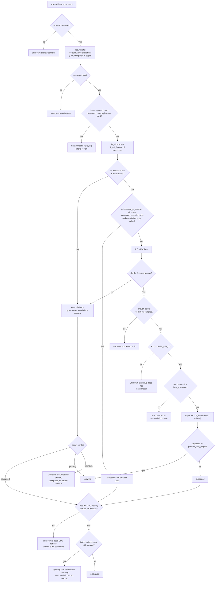

Two curves and a ledger decide whether to run another round. The edge curve
answers whether the fuzzer is still finding code, and its verdict is an
extrapolation from a fitted species-accumulation curve computed by
`coverage_ctl.py plateau`. The surface curve answers whether the commands the
descriptions declare have been tried, and the completion ledger answers whether
every target the inventories enumerate is either exercised or accounted for.

| Edge curve | Surface curve | Ledger | Recorded verdict | Loop decision |
|---|---|---|---|---|
| Climbing | Any | Open | `coverage_verdict=growing` | Continue |
| Flat | Climbing | Any | `coverage_verdict=growing` | Continue. The round is still reaching commands it had not reached |
| Flat | Flat | Open | `plateaued` and `surface_verdict=incomplete` | Stop, overridable. The reason names a stuck corpus and the number of open targets |
| Flat | Unknown | Any | `plateaued` and `surface_verdict=unknown` | Stop, overridable. The reason says no completion reading exists |
| Any | Any | Closed | `surface_verdict=complete` | Stop, non-overridable. Nothing is left to fuzz |

Completion is the campaign's primary termination. `loop.max_rounds` is a
backstop against a runaway loop, and a campaign that reaches it has failed to
converge.

## Model

Coverage growth is a species-discovery process. The framing is Böhme's, from
*STADS: Software Testing as Species Discovery* (TOSEM, 2018). Each model term
maps onto one pipeline quantity.

| Model term | Pipeline quantity |
|---|---|
| Species | One distinct edge |
| Sampled individual | One executed input |
| Species accumulation curve | Distinct edges against cumulative executions |
| Discovery exponent | `beta` in the fitted curve |

The output is the number of new edges another campaign of
`coverage.horizon_hours` is expected to find. A growth percentage is
scale-dependent, so the same percentage means ten edges early in a run and a
thousand late in one.

## Axis construction

`accumulate()` in `tools/coverage_ctl.py` transforms the sampled rows into the
curve. Both counters reset when the fuzzer restarts, and the two axes handle
that reset differently.

| Axis | Quantity | Accumulation | Behaviour on a counter reset |
|---|---|---|---|
| x | Cumulative executions | Sum of per-sample deltas | The delta is the new reading itself, so no negative delta is recorded |
| y | Distinct edges | Running maximum | The replayed count contributes zero until it passes the previous high-water mark |

Each axis choice removes one failure.

- Executions on x. A fixed wall-clock window contains widely varying amounts
  of testing on a machine that panics by design, so a slow hour has the same
  shape as saturation.
- Running maximum on y. syzkaller re-executes its corpus after every restart.
  Taken from the raw reported count, a saturated run reports tens of percent
  of growth after each panic, and a campaign that has stopped finding edges
  continues on the strength of its own crashes.

## The fit

Heaps' law relates distinct edges `S` to cumulative executions `n`:

```
S(n) = K * n^beta
```

`heaps_fit()` fits it by ordinary least squares on `log S` against `log n`,
which needs nothing beyond the standard library. `beta` is the discovery
exponent: near 1 the run finds edges about as fast as it executes them, near 0
it has saturated.

Heaps' law assumes no asymptote. An exponential saturation curve assumes a
finite one, and this data does not support reporting an asymptote.

`fit_tail()` restricts the fit to the last `coverage.fit_tail_fraction` of the
run's executions. A power law fitted over a whole run is dominated by the early
steep phase, where syzkaller is still working through the seeds, so a run that
climbed hard and then went flat still reports a healthy exponent. The cut is
made by executions, so a stretch where the box was panicking and doing little
work does not count as recent history.

The extrapolation is:

```
expected new edges = K * ((n + dn)^beta - n^beta)
```

where `dn` is `coverage.horizon_hours` multiplied by the run's measured
execution rate.

## Parameters

Fourteen configuration keys govern the fit and the stop rule.

| Config key | Default | Effect |
|---|---|---|
| `coverage.plateau_new_edges` | 50 | Expected new edges below which the run is `plateaued` |
| `coverage.horizon_hours` | 1000 | How far ahead the extrapolation runs. Matches `loop.campaign_hours`, the unit of spend the decision authorises |
| `coverage.model_min_r2` | 0.90 | Fit quality below which no extrapolation is reported and the verdict is `unknown`. Validation requires a value strictly between 0 and 1 |
| `coverage.min_fit_samples` | 8 | Points needed inside the tail before extrapolating. Validation refuses a value below 3, where a least-squares fit of two points is exact and describes nothing |
| `coverage.fit_tail_fraction` | 0.5 | Fraction of the run's executions fitted. 1.0 fits everything |
| `coverage.beta_tolerance` | 0.05 | Slack above `beta = 1` absorbing early sampling noise. Accepted from 0 up to but not including 1 |
| `coverage.gpu_probe_timeout_sec` | 20 | Ceiling on `nvidia-smi` before the driver counts as wedged. Track K only |
| `coverage.surface_sample_min` | 60 | Minutes between surface samples. 0 measures the surface on every coverage sample |
| `coverage.surface_min_samples` | 5 | Surface samples needed before the second curve's shape is read. Validation refuses a value below 2, where there is nothing to compare against |
| `coverage.unpack_timeout_sec` | 300 | Ceiling on one `syz-db unpack` of a run's corpus |
| `loop.stop_on_plateau` | `true` | Whether a `plateaued` verdict stops the loop. A plateau stop is overridable with a reason. The round cap, the run-hour budget and surface completion are not |
| `loop.plateau_window_min` | 240 | Trailing wall-clock window, used twice. The legacy fallback measures growth over it, and the GPU gate reads the samples that fall inside it |
| `loop.plateau_min_growth` | 0.02 | Growth threshold for the legacy fallback |
| `loop.coverage_sample_min` | 10 | Sampling cadence, which sets how many points a run produces |

## Decision procedure

1. Reject fewer than 3 usable rows as `unknown`.
2. Build the accumulation curve. Reject an empty curve as `unknown`.
3. Compare the latest reported edge count against this run's high-water mark.
   A lower reading means the fuzzer is still replaying, and the verdict is
   `unknown`.
4. Cut the tail to the last `coverage.fit_tail_fraction` of executions, and
   measure the execution rate over the sampled span.
5. When an execution rate is measurable and the tail holds at least
   `coverage.min_fit_samples` points, ends on a non-zero cumulative execution
   count, and contains exactly one distinct edge value, return `plateaued`
   without fitting. A curve with no variance in `S` cannot be fitted.
6. When no execution rate is measurable, or the fit returns no curve, fall
   through to the legacy wall-clock window and mark the result a degraded
   measurement.
7. Fit `S = K n^beta` over the tail. Reject fewer than
   `coverage.min_fit_samples` fitted points, an `R2` below
   `coverage.model_min_r2`, or a `beta` outside
   `(0, 1 + coverage.beta_tolerance]`, each as `unknown`.
8. Extrapolate over `coverage.horizon_hours` at the measured rate. Return
   `growing` at or above `coverage.plateau_new_edges`, and `plateaued` below
   it.
9. Downgrade a `plateaued` verdict to `unknown` when any sample in the
   trailing `loop.plateau_window_min` window recorded a GPU state other than
   `ok`. Track U rows record `n/a` and are excluded.
10. Raise a surviving `plateaued` verdict to `growing` when the surface curve
    is `growing`. A `flat` or `unknown` surface reading is appended to the
    detail line and leaves the verdict alone.

Steps 1 to 8 produce the verdict. Steps 9 and 10 apply to `plateaued` only,
and in that order.



A detail line accompanies every verdict:

```
41907 distinct edges after 3.41e+09 executions; beta 0.412, R2 0.987 over 68 samples. At 1.45e+08 exec/h another 1000 h is expected to find ~156444 new edge(s), 373.3% more (plateau below 50)
```

The threshold is a judgement about what would justify another campaign of
machine time, and 2.5% of a run's coverage reads differently from 37%.

`coverage.horizon_hours` is 1000, matching `loop.campaign_hours`, and that
horizon sets a high bar on its own. Against 3.41e+09 executions already done,
another 1000 h at any productive execution rate multiplies the cumulative
count many times over, and a power law with a fitted `beta` well above zero
clears 50 expected new edges. A `plateaued` verdict from the fit therefore
requires a `beta` close to zero. Most real plateaus are caught before the fit
runs at all, by the flat-tail case in step 5.

## Unknown verdicts

`unknown` is a verdict, and `round-decide` treats it as a stop, so a broken
sampler cannot authorise more spend.

| Case | Message | Cause |
|---|---|---|
| Too few samples | `only N usable sample(s); need >= 3` | The run is too short, or the sampler started late |
| No edge data | `no edge data in any sample` | The source never reported an edge count |
| Still replaying | `the fuzzer is still replaying its corpus after a restart` | The round ended before the fuzzer regained its own high-water mark. A flat curve here indicates recovery |
| Too few fitted points | `only N sample(s) usable for a discovery fit` | The tail holds fewer than `coverage.min_fit_samples` points |
| Model mismatch | `the discovery curve does not fit the model well enough to extrapolate from (R2 ...)` | A stuck sampler, a source change mid-run, or a genuine regime change. All three present identically and need different responses |
| Not an accumulation curve | `discovery exponent beta=... is outside (0, 1]` | No extrapolation from the series is meaningful |
| GPU gate | `the GPU was not healthy for N of M sample(s) in the window` | See below |
| Window not yet filled | `N min of samples, shorter than the M min window` | The legacy fallback only. The run is shorter than `loop.plateau_window_min` |
| Window too sparse | `only N sample(s) inside the window` | The legacy fallback only. Fewer than two samples fall inside the trailing window |
| No baseline | `no non-zero edge baseline in the window` | The legacy fallback only. The first sample in the window reports zero edges, so no growth fraction can be formed |

## The GPU gate

A GPU that has fallen off the bus does not stop the fuzzer. syz-manager keeps
executing, the sampler keeps appending rows, the edge count stops moving, and
an ungated test reports a plateau that the fuzzer never reached.

Every Track K sample records the GPU state alongside the counters. The window
is the trailing `loop.plateau_window_min` minutes, or the whole run when no
sample falls inside it. A `plateaued` verdict is downgraded to `unknown` when
any sample in that window recorded a state other than `ok`:

```
..., but the GPU was not healthy for 12 of 24 sample(s) in the window (dead x12). A dead GPU flattens the curve the same way a real plateau does, so this is not reported as a plateau. Check `coverage_ctl.py gpu-health` and the run's Xid entries before deciding the round is done.
```

`gpu_health()` records one of five statuses: `ok`, `dead` when `nvidia-smi`
exits non-zero or names no GPU, `hung` when it does not return within
`coverage.gpu_probe_timeout_sec`, `missing` when it is not on `PATH`, and
`error` when it could not be run at all. The probe reports and attempts no
recovery.

Three rules bound the gate.

- The gate applies to `plateaued` only. Coverage cannot climb on a GPU that is
  not answering, so a `growing` verdict establishes that the probe result was
  transient.
- A row written before the GPU column existed counts as unhealthy. Such a row
  carries no evidence that the GPU was alive.
- Track U rows record `n/a` and are excluded. Those harnesses run in a
  container and never touch the GPU, so gating them would report a genuine
  Track U plateau as `unknown`.

## Legacy fallback

A source that reports no execution count still has to produce a verdict.
`_legacy_window_verdict()` measures growth across a trailing wall-clock window
of `loop.plateau_window_min` against `loop.plateau_min_growth`, on the
accumulation curve.

Three conditions return `unknown` before a growth fraction can be formed: a run
shorter than the window, fewer than two samples inside the window, and a zero
edge count on the window's first sample. Otherwise the verdict is `growing` or
`plateaued` on the threshold.

The result is reported as a degraded measurement, because a wall-clock window
cannot distinguish a slow hour from a saturated one:

```
no execution counts recorded, so growth is measured over elapsed time with no measure of work done: distinct edges 41200 -> 41907 over 240 min = 1.716% growth (threshold 2.000%)
```

## Combining the tracks

Each track produces its own verdict, and the campaign verdict is their
combination.

| Per-track verdicts | Combined |
|---|---|
| Any `growing` | `growing` |
| Some `plateaued`, none `growing` | `plateaued` |
| All `unknown`, or no track sampled | `unknown` |

Stopping because Track K flattened while the container-toolkit harnesses were
still growing ends the campaign early. A track with no samples at all is
ignored and does not force `unknown`.

The model states three limits.

- No Good-Turing or Chao1 estimate. Those estimators need per-species
  frequency counts, and syz-manager's stats endpoint reports an aggregate edge
  count with nothing per-edge. No fraction-of-driver-covered figure is
  computed. The figure is absent and no bias follows.
- `max()` under-reports the union. A post-restart process can cover an edge
  the earlier one missed while its total is still lower, and that edge is not
  counted. The bias under-reports discovery, which ends a campaign early.
- Kernel-side reachable code only. GSP firmware is uninstrumented, so no
  coverage number describes it. `series` and `plateau` print the statement on
  every invocation, and no bias follows.

## The surface curve

The `surface` column of each coverage sample holds how many of the 852
enumerated targets this run's own corpus names. `collect_surface(run_id)`
unpacks `artifacts/runs/<id>/workdir/corpus.db` through syz-db and matches
variant names against the inventories, which is a measurement syz-manager's
stats endpoint cannot supply: it holds no model of the 852 targets.

Six properties govern the second measurement.

- The cadence is `coverage.surface_sample_min`, default 60 minutes, gated by
  `surface_due()`.
- The cadence is remembered in the CSV itself. The last row carrying a surface
  value is the last measurement, so the cadence survives a sampler restart and
  a reboot.
- `--skip-surface` on `sample` is the operator escape hatch, and the timer's
  Track U line passes it.
- Track U is refused. Those harnesses produce no syzlang programs, and a 0
  would put an absence of evidence into the curve as a measurement.
- A missing syz-db, a `corpus.db` syz-manager is midway through rewriting, and
  an unpack failure all record an empty value, which `metric_rows` drops.
- Accumulation is by running maximum, because syzkaller minimises its corpus
  and a genuine dip must contribute zero.

`surface_growth(rows)` returns `growing`, `flat` or `unknown` and fits nothing.
Heaps' law is not transferred to this series for three reasons: an unbounded
power law fitted to a quantity bounded at 852 predicts more new targets than
remain, the dynamic range makes the `R2` gate close to arbitrary over a
400-to-410 series, and the question the stop rule asks the second curve is only
whether it moved, which is subtraction.

`coverage.surface_min_samples` is 5. `plateau_verdict` returns a verdict on
three usable samples, so the surface curve is read from a longer series than
the edge curve needs, because the surface counter is quantised and a short
tail sitting between two steps is a common state. Where the tail is shorter
than that floor, the whole series is read instead, which can only report
growth a shorter window missed.

The surface reading is applied after the GPU gate. A dead GPU does not flatten
the surface count the way it flattens the edge count, since programs still
execute and still enter the corpus, so a climbing surface curve is not evidence
that the card is alive.

A run started before the `surface` column existed gains no second curve until
its CSV is migrated. `cmd_sample` appends under the header the file already
carries, so a value measured for such a file would be dropped by the writer.
`surface_due()` refuses the measurement on that ground, because the unpack and
the full corpus rescan it costs would buy nothing storable. Such a run warns on
every sample and reads
`surface_verdict=unknown`, which stops the loop on the plateau rule and never
on completion.

`coverage_ctl.py migrate-csv --run-id <id>` is the one operation on a coverage
CSV that is not an append. It adds the columns the header lacks, pads every
existing row, keeps the existing columns in their positions and carries the
file's mode across, so anything reading the file by column index still reads
the same numbers. It is an operator step: the sampler runs as root and appends
on a cadence, and a sample landing mid-rewrite would be dropped, so the file's
size is compared before and after and a change aborts with the file untouched.
Stop the sampler before running it.

## The completion check

Completion is the ledger identity `exercised + accounted-for = 852`, computed
as a union of the two sets. A target can be exercised in a later round after an
earlier one wrote a reason for it, and adding the counts would close the ledger
while targets remained.

The accounted-for set is the reasons that assert unreachability. Eight reasons
are admitted, and seven of them close a target.

| Reason | Assertion | Closes |
|---|---|---|
| `control_gsp` | The handler is compiled out. The parameter buffer crosses the RPC queue and runs on GSP, where KCOV cannot follow | Yes |
| `uvm_test` | Gated on `uvm_enable_builtin_tests=1`, which the target does not set | Yes |
| `escape_dead` | Declared with no dispatch case, so no kernel code runs | Yes |
| `escape_mux` | A multiplexer whose leaves are counted in another family | Yes |
| `needs-privilege` | The handler body checks a capability the modelled caller does not hold | Yes |
| `chain-unbuildable` | No allocation chain a default tenant can build reaches the object this call needs | Yes |
| `no-param-model` | The parameter struct cannot be modelled well enough for the call to reach its handler | Yes |
| `deliberately-deferred` | The target is in scope and reachable, and was left for a later campaign by an explicit decision | No |

Five of the seven closing reasons assert something about driver source or the
object graph, and those require a source reference: `control_gsp`,
`escape_dead`, `needs-privilege`, `chain-unbuildable` and `no-param-model`. A
claim that closes a target permanently is a claim about code.

`deliberately-deferred` rows are subtracted before the union and reported on
their own as `deferred`. Counting them as closed would make the identity read
"exercised, or excluded, or postponed", and fire a stop printing that nothing
is left to fuzz over targets the ledger itself records as reachable.

`completion_status` also requires every family in `surface_cov.FAMILIES` to
contribute at least one target. A truncated inventory would otherwise yield a
smaller denominator that a corpus can close, firing the stop over commands
nobody counted. It yields `unknown` instead.

The three verdicts are `complete`, `incomplete` and `unknown`. Every target
that is neither exercised nor accounted for is reported as a worklist line
carrying the variant in brackets, which is the handle an accounting entry is
recorded against:

```
- [surface] control NV0000 0x00000102 cliresCtrlCmdSystemGetCpuInfo  [NV_ESC_RM_CONTROL_cliresCtrlCmdSystemGetCpuInfo]
```

`completion` is its own subcommand and not a fourth state on `plateau`, so
`plateau` keeps its three verdicts and its exit map.

`round-end --from-run` computes the reading from the runs it names and records
it on the round, so no flag transcribes it.

## Reading a plateau against the surface

The driver exposes 767 non-privileged control commands. 531 of them carry a
kernel-side handler and are the control family's contribution to the 852-target
denominator. The other 236 have their handler compiled out and their parameter
buffer marshalled across the RPC queue to GSP, and are counted outside the
denominator. A corpus drifting onto those raises executions and moves no edge
count, so the accumulation curve flattens while the fuzzer is still issuing
calls it has never issued. The GSP subset is a structural ceiling in the edge
signal, and an edge count alone reads that ceiling and a plateau identically.

| Surface reading at a flat edge curve | Diagnosis | Next action |
|---|---|---|
| Still climbing | The round is still reaching commands it had not reached, whatever the edge count did | Continue |
| Flat, ledger open | The corpus is stuck. The fuzzer stopped finding edges while modelled targets remain unreached, which is a resource-chain problem | Model the targets `surface_cov.py gaps --stage model` names, or account for them |
| Flat, ledger closed | The grammar has reached the surface it declares and has stopped finding new code | Stop the loop |

See [surface_cov.py](/gspwn/architecture/components/surface-cov/).

## Verdict consumers

Four consumers read the verdict.

- `pipeline_ctl.py round-end --from-run` records the edge verdict and the
  completion reading on the round, as one write.
- `pipeline_ctl.py round-decide` stops the loop on `plateaued` when
  `loop.stop_on_plateau` is set. `unknown` always stops it. A `complete`
  surface verdict stops it non-overridably, checked ahead of the round cap and
  the budget.
- The `refine` sub-agent takes the detail line's expected-new-edges figure into
  `gaps.md`, and the unaddressed targets into the worklist or the ledger.
- The `eval` sub-agent reads the series and the cross-round progression.

A `plateaued` verdict states that this grammar has stopped reaching new code.
It does not establish that the subsystem is covered.

## See also

- [Throughput against depth](/gspwn/guides/tuning-throughput-vs-depth/)
- [surface_cov.py](/gspwn/architecture/components/surface-cov/)
- [Loops](/gspwn/architecture/loops/)
- [Scope and oracle](/gspwn/architecture/scope-and-oracle/)
