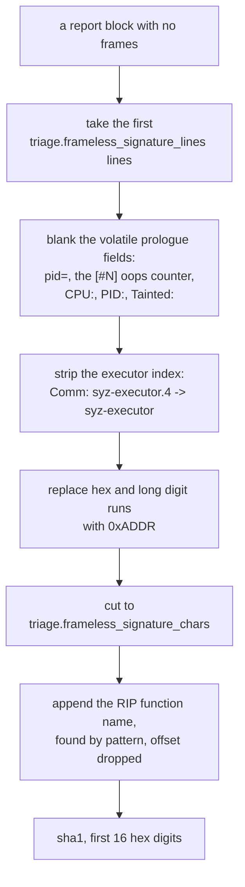
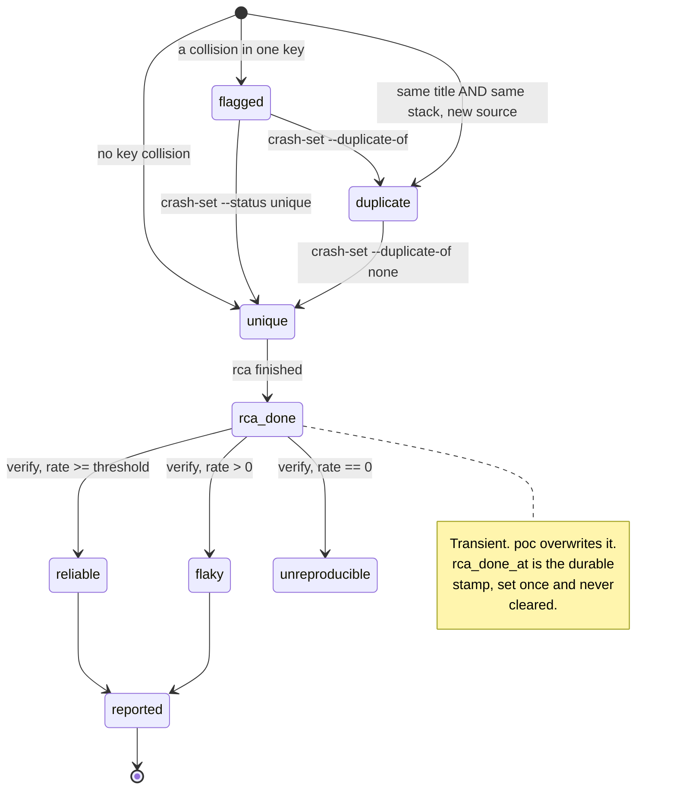

`crash_parse.py` decides whether two reports describe one bug. Two reports that
should be one bug produce a duplicate RCA. Two bugs that merge leave the second
without any analysis, because a `duplicate` entry never enters the RCA queue.

## The two keys

| Key | Derivation | Empty value |
|---|---|---|
| Primary | The canonicalised report title | Never empty |
| Secondary | sha1 of the top `triage.stack_hash_frames` function names, truncated to 16 hex digits | Empty string when the report carries no frames |

Both keys are normalised identically across sources, so the same bug found in
the syzkaller workdir and again in a harvested dmesg log collides on a single
registry entry.

An empty stack hash carries no evidence and never drives a stack-based
decision. Without that rule, report-less syzkaller crashes and signature-only
Track U inputs alias each other through a constant hash.

## Title canonicalisation

`canon_title()` applies four transformations in order.

| Step | Transformation | Purpose |
|---|---|---|
| 1 | Strip a leading `kernel ` or `NVRM ` prefix | The dmesg scanner adds prefixes that never appear in a syzkaller `description` file |
| 2 | Collapse whitespace | Line wrapping differs between sources |
| 3 | Fold `BUG: KASAN: ...` and `BUG: UBSAN: ...` into syzkaller's `KASAN: ...` and `UBSAN: ...` forms | The two sources print the same report with different leaders |
| 4 | Replace every hex address and every bare run of eight or more hex digits with `0xADDR` | Makes the same ASan report or paging fault at a different address collide |

## Stack hashing

Function names are read in log order from two line shapes, so a syzkaller
`report` file and the dmesg block of the same crash yield the same sequence.

| Shape | Example |
|---|---|
| syzkaller and ASan frames | `#1 0xffffffff81234567 in nv_uvm_free` |
| Kernel call-trace lines | `nv_uvm_free+0x12/0x34 [nvidia_uvm]` |

The second pattern also matches the `RIP:` line, which carries the innermost
frame. Addresses, offsets and module names are stripped before hashing.

## Decision table

`register()` compares both keys against the existing registry.

| Condition | Result |
|---|---|
| The exact tuple of title, hash and source directory matches an existing entry | `DUP`. Nothing is registered |
| Same title and same non-empty hash as a non-duplicate entry | Registered as a `duplicate` linked to it, and both sources cross-noted |
| Same title, neither sighting carries a stack | `flagged` |
| Same title, only one sighting carries a stack | `flagged` |
| Same title, different stacks | `flagged` |
| Same stack, different title | `flagged` |
| Neither key matches | `unique` |

The identity tuple makes re-scans idempotent. `crashlog_ctl.py harvest` runs
after every reboot, and the same sighting read again from the same source must
not register a second entry.

Duplicates stay out of the title and hash indexes, so a later sighting links
against the surviving finding.

### One-key collisions

A collision in one key alone may be a second bug or the same bug reported
twice, and distinguishing them requires reading both reports. Such a crash is
registered `flagged`, and is neither merged nor split. It stays in the
registry, so `crash-list --status flagged` is a durable review queue that
survives the tool's output scrolling away.

When neither side carries a stack, an exact title match is still flagged: no
evidence confirms identity. The identical sighting re-read from the identical
source is the exception, and stays a plain duplicate.

## Frameless signature

A report with no usable frames, a lone `BUG: unable to handle ...` or a
trace-less panic, has no stack to hash. The distinguishing evidence is the
wording around its start line plus the faulting function.



Two ordering constraints apply.

| Constraint | Failure it prevents |
|---|---|
| Volatile fields are blanked before hex blanking | An eight-digit PID is otherwise consumed as an address and never recognised as a PID, so the same panic splits on task id alone |
| The RIP function is appended after the character cut, never inside it | A long prologue otherwise pushes the strongest evidence out of the identity, so two different faulting functions behind the same fault type produce the same signature and the second registers as a duplicate that never reaches `rca` |

The RIP anchor is located by pattern, because the amount of prologue preceding
it varies with the fault type. Its offset is dropped for the same reason stack
frames drop theirs: the offset moves with the build, and the same bug in two
builds is one bug. An unresolved RIP, a bare address with no module loaded,
matches nothing and leaves the signature unchanged.

## Report blocks

A kernel log is split into blocks, so one KASAN report becomes one registry
entry. Without the split, each matching line registers its own entry.

| Line | Effect |
|---|---|
| `BUG:` | Always opens a new block |
| `KASAN:` | Always opens a new block |
| `Oops` | Opens a block only when no block is open |
| `Kernel panic` | Opens a block only when no block is open |

A block runs through the end of its call trace. `Oops` and `Kernel panic` can
belong to the prologue or the tail of the report already open: a single oops
prints `BUG:`, then `Oops:`, then `Kernel panic`.

## Xid identity

Two fields are stripped from an NVRM title before it becomes a key.

| Field stripped | Reason |
|---|---|
| `pid=` and the channel number | The same recurring Xid must deduplicate across processes and channels |
| The PCI bus id | Which card faulted is provenance. On a multi-GPU box the same driver bug on two cards is one bug |

The bus id is retained in the classification note. Classification runs before
the bus id is stripped, because `XID_NUM_RE` consumes the parenthesised bus id
as a group. Skipping that group loosely reads the first field of the bus id as
the Xid number and classifies every crash as an unknown Xid 0.

`XID_CLASS` in `tools/crash_parse.py` maps each known Xid number to one of
`signal`, `review`, `health` and `noise`. See
[Xid classification](/gspwn/reference/xid-classification/).

## The status machine



| Transition | Command or phase | Durable record |
|---|---|---|
| Into `unique`, `flagged` or `duplicate` | `crash_parse.py` | The registry entry and its history trail |
| `flagged` to `unique` or `duplicate` | `pipeline_ctl.py crash-set` | The same, plus `duplicate_of` |
| `unique` to `rca_done` | The `rca` sub-agent | `rca_done_at`, stamped once and never cleared |
| `rca_done` to a reproduction class | `repro_ctl.py verify` | `repro_rate` and the counted-run total |
| To `reported` | The `report` sub-agent | The disclosure package |

Every status write goes through one function, which appends to the crash's
history trail and stamps `rca_done_at` on the transition into `rca_done`. The
stamp is durable because `rca_done` is overwritten by the reproduction class,
and `poc` is the one phase guaranteed to run after `rca`. An invariant keyed on
the current status stops seeing an unanalysed crash exactly when the pipeline
reaches the phase that should notice it.

## Parameters

| Config key | Default | Effect | Failure at a lower value | Failure at a higher value |
|---|---|---|---|---|
| `triage.stack_hash_frames` | 3 | Frames hashed for the secondary key | Distinct bugs sharing a common caller merge | One bug whose stack varies by an inlined frame splits |
| `triage.signature_frames` | 5 | Frames a reproduction must match to count as the same crash | An unrelated crash scores as a hit | A real reproduction scores as clean |
| `triage.frameless_signature_lines` | 5 | Report lines forming the frameless signature | One panic registers as many bugs | The signature picks up per-occurrence detail |
| `triage.frameless_signature_chars` | 300 | Characters of normalised wording hashed. Validation refuses a value below 32 | Unrelated trace-less panics sharing a prologue merge | The signature picks up per-occurrence detail |

## Settings drift

The dedup settings in force at the first registration are stamped into
`state/pipeline.json`, written once and never overwritten. Rewriting them
erases the evidence that the stored hashes were produced under different
settings.

`triage_drift()` compares the stamped settings against the current ones, and
`pipeline_ctl.py validate` reports every key that moved:

```
PROBLEM: triage.stack_hash_frames is 5 now but the registry's hashes were built with 3. Hashes are not recomputed, so across this change one bug can register twice and two bugs can merge into one that never reaches rca. Restore it for the rest of this campaign, or start a fresh registry
```

Already-registered hashes are not recomputed. Change these settings between
campaigns.

## Integrity rules

| Rule | Enforced by |
|---|---|
| A crash cannot duplicate itself | `crash-set` and `validate` |
| `duplicate_of` must name a known crash | Both |
| `duplicate_of` implies status `duplicate` | Both |
| Status `duplicate` requires a link | Both |
| A link must point at a non-duplicate entry, so chains and cycles are refused | Both |
| Clearing a link returns the crash to the unique queue | `crash-set` |

Without the last rule, a cleared link leaves the crash at status `duplicate`
with nothing to duplicate, excluded from the RCA queue permanently.

## See also

- [Results and triage](/gspwn/guides/results-and-triage/)
- [crash_parse.py](/gspwn/reference/cli/crash-parse/)
- [Impact and severity](/gspwn/architecture/impact-and-severity/)
