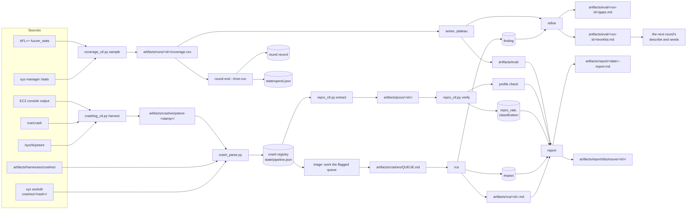

Every artifact in the pipeline traces back to one of four sources: the
syzkaller workdir, the Track U harness output, the kernel's crash-capture
backends, and the coverage sampler.

Where each store lives and what its lifetime is are in
[Architecture overview](/gspwn/architecture/overview/). This page traces the
path from a raw log to a disclosure package.

## Sources

| Source | Path | Produced by | Read by |
|---|---|---|---|
| syzkaller workdir | `workdir/crashes/<hash>/` | syz-manager | `crash_parse.py`, `repro_ctl.py extract` |
| Track U harness output | `artifacts/harnesses/crashes/` | The libFuzzer and AFL++ targets | `crash_parse.py` |
| pstore | `/sys/fs/pstore` | The kernel, on panic | `crashlog_ctl.py harvest` |
| kdump | `/var/crash` | The crash kernel | `crashlog_ctl.py harvest` |
| EC2 serial console | `ec2:GetConsoleOutput` | The hypervisor | `crashlog_ctl.py harvest`, on EC2 only |
| syz-manager stats | `track_k.http` `/stats` | syz-manager | `coverage_ctl.py sample` |
| AFL++ `fuzzer_stats` | `artifacts/runs/<id>/u/<harness>/` | AFL++ | `coverage_ctl.py sample --track u` |

## The whole path

## Stages

### Capture

| Producer | Artifact | Consumer | Lifetime |
|---|---|---|---|
| `crashlog_ctl.py harvest` | `artifacts/crashes/pstore-<stamp>/` | `crash_parse.py --dmesg` | The campaign |
| The same, on `/var/crash` | `artifacts/crashes/kdump-<name>/` | The same | The campaign |
| The same, on EC2 | `artifacts/crashes/console-output.log` | The same | The campaign |

Harvest runs before anything else on the recovery path. pstore has a fixed size
and frees a record only on unlink, so the next panic needs the space. Every
pstore record is unlinked after it is copied.

### Registration

| Producer | Artifact | Consumer | Lifetime |
|---|---|---|---|
| `crash_parse.py --run-id` reading `workdir/crashes/<hash>/description` and `report` | A registry entry | The `triage` sub-agent | The campaign |
| The same call, reading `artifacts/harnesses/crashes/*` | A registry entry | The same | The campaign |
| `crash_parse.py --dmesg` reading a harvested dmesg, kdump or console log | A registry entry | The same | The campaign |

Entries are deduplicated on the canonicalised title and a stack hash, so the
same panic in two sources becomes one finding with both sources linked. See
[Crash identity](/gspwn/architecture/crash-identity/).

### Analysis

| Producer | Artifact | Consumer | Lifetime |
|---|---|---|---|
| The `rca` sub-agent | `artifacts/rca/<id>.md` | The `report` sub-agent | The campaign |
| `pipeline_ctl.py finding-set` | `crash.finding` | `finding-list`, the `refine` sub-agent | The campaign |
| `pipeline_ctl.py impact-set` | `crash.impact` | `impact-list`, the `report` sub-agent | The campaign |
| The `rca` sub-agent reading `artifacts/builds/manifest.json` | The affected-versions section of the RCA | The `report` sub-agent | The campaign |

### Reproduction

| Producer | Artifact | Consumer | Lifetime |
|---|---|---|---|
| `repro_ctl.py extract` through `syz-prog2c` | `artifacts/pocs/<id>/repro.c` | `repro_ctl.py verify`, the `poc` sub-agent | The campaign |
| The same, on a Track U crash input | `artifacts/pocs/<id>/input` | The same | The campaign |
| `repro_ctl.py verify` | `crash.repro_rate`, `crash.status` | The `report` sub-agent | The campaign |
| The `poc` sub-agent, running a container matching the threat model | The profile-check outcome in the PoC README | The `report` sub-agent | The campaign |

### Measurement

| Producer | Artifact | Consumer | Lifetime |
|---|---|---|---|
| `coverage_ctl.py sample` | One row in `artifacts/runs/<id>/coverage.csv` | `series`, `plateau`, `round-end` | The campaign |
| The same, `--track u` | One row in `coverage-u.csv` | The same | The campaign |
| `pipeline_ctl.py round-end --from-run` | The round record's verdict, edges and hours | `round-decide`, the `eval` sub-agent | The campaign |
| The same, and `campaign_ctl.py` | `state/spend.json` | `check_budget()`, `loop_decision()` | The machine |

### Steering

| Producer | Artifact | Consumer | Lifetime |
|---|---|---|---|
| The `refine` sub-agent | `artifacts/eval/<run-id>/gaps.md` | The `refine` sub-agent's own work list step | The campaign |
| The same, from `gaps.md` plus `finding-list` | `artifacts/eval/<run-id>/worklist.md` | `round-end --worklist` | The campaign |
| `pipeline_ctl.py round-end --worklist` | `round.worklist` | `round-advance` | The campaign |
| `pipeline_ctl.py round-advance` | The next round's `round.worklist_in` | `pipeline_ctl.py worklist` | The next round |
| `pipeline_ctl.py worklist` | The work items | The next round's `describe` and `seeds` | The next round |

### Reporting

| Input | Section it produces |
|---|---|
| The RCA prose | The technical detail per finding |
| The research record's `source_refs`, `hypothesis` and `confidence` | The evidence and the severity justification |
| The impact record | The weakness class and the severity chain |
| The reproduction rate and classification | The confidence statement |
| The profile-check outcome | The reachability statement |
| `artifacts/builds/manifest.json` | Affected kernel, driver commit and GSP firmware |
| The PoC README | Build and run steps, and the expected signature |

Per confirmed finding, `artifacts/report/disclosure/<id>/` collects the PoC, the
RCA, the affected versions and a short impact statement. The package is
assembled and nothing is sent.

## Round boundary

Two artifacts cross a round boundary.

| Carried | Mechanism | Consumer in the new round |
|---|---|---|
| The corpus | `campaign_ctl.py install-k --corpus carry --from-run <prev>` | syz-manager, at campaign start |
| The work list | `round.worklist` becoming `round.worklist_in` | `describe` and `seeds` |

The crash registry persists across rounds because it belongs to the campaign.
The two setup phases persist for the same reason. Everything else resets: the
nine round phases return to `pending`, and the new round starts with its own
run ids, its own coverage files and its own outcome record.

## Machine boundary

| Path | Committed | Reason |
|---|---|---|
| `knowledge/` | Yes, to a public repository | The only content a rebuilt box starts with |
| `tools/ioctl_map.json` | Yes | Data the `seeds` phase produces once and later rounds reuse |
| `state/` | No | Execution position, valid for one campaign on one machine |
| `artifacts/` | No | Evidence, sized in gigabytes, and it contains findings |

`knowledge/` is public, so `knowledge_ctl.py note` refuses text naming a crash
id or a path under `artifacts/crashes`, `artifacts/pocs` or `artifacts/rca`.

The artifacts volume is separate from the root volume, so an instance replaced
after an unrecoverable GPU fault can have it detached and reattached. See
[Cloud deployment](/gspwn/architecture/cloud-deployment/).

## See also

- [Artifacts](/gspwn/reference/artifacts/)
- [State file schema](/gspwn/reference/state-file/)
- [Cloud deployment](/gspwn/architecture/cloud-deployment/)
