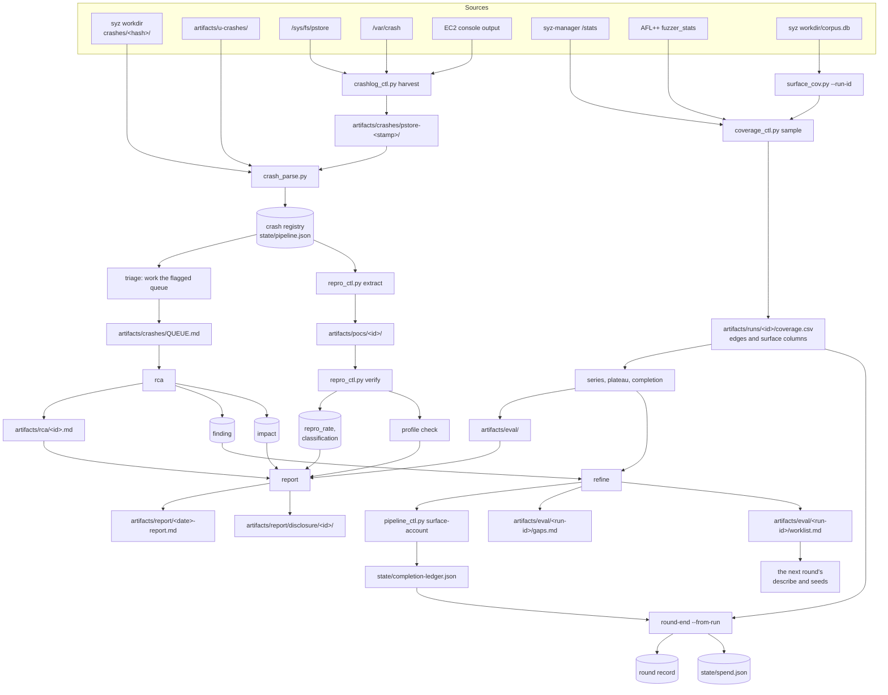

Every artifact in the pipeline traces back to one of four raw sources: the
syzkaller workdir, the Track U harness output, the kernel's crash-capture
backends, and the counters the two fuzzers publish. The coverage sampler reads
the fourth of those and produces no raw data of its own.

Where each store lives and what its lifetime is are in
[Architecture overview](/gspwn/architecture/overview/). This page traces the
path from a raw log to a disclosure package.

## Sources

The four sources resolve to eight stores on disk or over HTTP.

| Source | Path | Produced by | Read by |
|---|---|---|---|
| syzkaller workdir | `workdir/crashes/<hash>/` | syz-manager | `crash_parse.py`, `repro_ctl.py extract` |
| Track U harness output | `artifacts/u-crashes/` | The libFuzzer and AFL++ targets | `crash_parse.py` |
| pstore | `/sys/fs/pstore` | The kernel, on panic | `crashlog_ctl.py harvest` |
| kdump | `/var/crash` | The crash kernel | `crashlog_ctl.py harvest` |
| EC2 serial console | `aws ec2 get-console-output --latest` | The hypervisor | `crashlog_ctl.py harvest`, on EC2 only |
| syz-manager stats | `track_k.http` `/stats` | syz-manager | `coverage_ctl.py sample` |
| AFL++ `fuzzer_stats` | `artifacts/runs/<id>/u/<harness>/` | AFL++ | `coverage_ctl.py sample --track u` |
| syzkaller corpus | `workdir/corpus.db` | syz-manager | `surface_cov.py --run-id`, through `coverage_ctl.py sample` |

## The whole path

## Stages

### Capture

One `crashlog_ctl.py harvest` invocation creates one directory,
`artifacts/crashes/pstore-<stamp>/`, and every backend it reads writes inside
that directory. A harvest that found nothing removes the directory again.

| Producer | Artifact | Consumer | Lifetime |
|---|---|---|---|
| `crashlog_ctl.py harvest`, on bare metal, over `/sys/fs/pstore/*` | The pstore records, in `artifacts/crashes/pstore-<stamp>/` | `crash_parse.py --dmesg` | The campaign |
| The same, on EC2, over `aws ec2 get-console-output` | `artifacts/crashes/pstore-<stamp>/console-output.log` | The same | The campaign |
| The same, over every not-yet-harvested `/var/crash` dump | `artifacts/crashes/pstore-<stamp>/kdump-<name>/` | The same | The campaign |

The first two rows are alternatives. `--env ec2` takes the console output and
reads no pstore, because a hypervisor holds the last output of an instance that
panicked and `/sys/fs/pstore` on an EC2 guest does not.

Harvest requires root and refuses to run without it, because `/sys/fs/pstore`
and `/var/crash` are root-only and a non-root harvest reads nothing while
looking like it found nothing. It runs before anything else on the recovery
path, and every pstore record is unlinked once it is copied, because pstore is
a fixed-size backend that frees a record only when its file is deleted. See
[Durability](/gspwn/architecture/durability/).

### Registration

`crash_parse.py` turns a raw report from any of three routes into one registry
entry.

| Producer | Artifact | Consumer | Lifetime |
|---|---|---|---|
| `crash_parse.py --run-id` reading `workdir/crashes/<hash>/description` and the lowest-numbered `report<N>` | A registry entry | The `triage` sub-agent | The campaign |
| The same call, reading `artifacts/u-crashes/*` | A registry entry | The same | The campaign |
| `crash_parse.py --dmesg` reading a harvested dmesg, kdump or console log | A registry entry | The same | The campaign |

Entries are deduplicated on the canonicalised title and a stack hash, so the
same panic in two sources becomes one finding with both sources linked. See
[Crash identity](/gspwn/architecture/crash-identity/).

### Analysis

Four artifacts carry the analysis, written by the `rca` sub-agent and by two
`pipeline_ctl.py` setters.

| Producer | Artifact | Consumer | Lifetime |
|---|---|---|---|
| The `rca` sub-agent | `artifacts/rca/<id>.md` | The `report` sub-agent | The campaign |
| `pipeline_ctl.py finding-set` | `crash.finding` | `finding-list`, the `refine` sub-agent | The campaign |
| `pipeline_ctl.py impact-set` | `crash.impact` | `impact-list`, the `report` sub-agent | The campaign |
| The `rca` sub-agent reading `artifacts/builds/manifest.json` | The affected-versions section of the RCA | The `report` sub-agent | The campaign |

### Reproduction

`repro_ctl.py extract` produces the reproducer files, and verification and the
profile check write their outcomes back onto the crash.

| Producer | Artifact | Consumer | Lifetime |
|---|---|---|---|
| `repro_ctl.py extract` copying the crash directory, normalising the numbered files onto unnumbered names | `artifacts/pocs/<id>/repro.prog`, `report`, `log` | `repro_ctl.py verify`, the `poc` sub-agent | The campaign |
| The same, copying syzkaller's `repro.cprog` where the crash directory holds a non-empty one, and running `syz-prog2c` over `repro.prog` otherwise | `artifacts/pocs/<id>/repro.c` | The same | The campaign |
| The same, on a Track U crash input | `artifacts/pocs/<id>/input` | The same | The campaign |
| `repro_ctl.py verify` | `crash.repro_rate`, `crash.status` | The `report` sub-agent | The campaign |
| The `poc` sub-agent, running a container matching the threat model | The profile-check outcome in the PoC README | The `report` sub-agent | The campaign |

### Measurement

The coverage rows, the completion ledger, the round record and the spend ledger
are written here. The completion ledger and the spend ledger outlive the
campaign.

| Producer | Artifact | Consumer | Lifetime |
|---|---|---|---|
| `coverage_ctl.py sample` | One row in `artifacts/runs/<id>/coverage.csv`, carrying the edge count and the surface count | `series`, `plateau`, `completion`, `round-end` | The campaign |
| The same, `--track u --skip-surface` | One row in `coverage-u.csv`, with an empty `surface` column | The same | The campaign |
| `pipeline_ctl.py surface-account` | `state/completion-ledger.json` | `coverage_ctl.py completion`, `round-end`, `round-decide` | The machine, versioned by driver release |
| `pipeline_ctl.py round-end --from-run` | The round record's verdict, edges and hours | `round-decide`, the `eval` sub-agent | The campaign |
| The same, and `campaign_ctl.py` | `state/spend.json` | `check_budget()`, `loop_decision()` | The machine |

### Steering

The work list is built inside one round and read by the next, and a closed
ledger entry is read by every later round.

| Producer | Artifact | Consumer | Lifetime |
|---|---|---|---|
| The `refine` sub-agent | `artifacts/eval/<run-id>/gaps.md` | The `refine` sub-agent's own work list step | The campaign |
| The same, from `gaps.md` plus `finding-list` | `artifacts/eval/<run-id>/worklist.md` | `round-end --worklist` | The campaign |
| `pipeline_ctl.py round-end --worklist` | `round.worklist` | `round-advance` | The campaign |
| `pipeline_ctl.py round-advance` | The next round's `round.worklist_in` | `pipeline_ctl.py worklist` | The next round |
| `pipeline_ctl.py worklist` | The work items | The next round's `describe` and `seeds` | The next round |
| The `refine` sub-agent, through `surface-account` | One ledger row per target the round will not reach, closing it unless its reason is `deliberately-deferred` | `coverage_ctl.py completion` | The machine, until the driver release moves |

### Reporting

Seven inputs each produce one section of a finding's report.

| Input | Section it produces |
|---|---|
| The RCA prose | The technical detail per finding |
| The research record's `source_refs`, `hypothesis` and `confidence` | The evidence and the severity justification |
| The impact record | The weakness class and the severity chain |
| The reproduction rate and classification | The confidence statement |
| The profile-check outcome | The reachability statement |
| `artifacts/builds/manifest.json` | Affected kernel, driver commit and GSP firmware |
| The PoC README | Build and run steps, and the expected signature |

Per confirmed finding, `artifacts/report/disclosure/<id>/` collects the PoC, the
RCA, the affected versions and a short impact statement. The package is
assembled and nothing is sent.

## Round boundary

Three artifacts cross a round boundary.

| Carried | Mechanism | Consumer in the new round |
|---|---|---|
| The corpus | `campaign_ctl.py install-k --corpus carry --from-run <prev>` | syz-manager, at campaign start |
| The work list | `round.worklist` becoming `round.worklist_in` | `describe` and `seeds` |
| The completion ledger | A file outside the state, keyed on the driver release | `surface-account`, and `round-decide` in every later round |

The ledger outlives the campaign as well as the round. A target closed as
`chain-unbuildable` in round 2 stays closed in round 6, so within one driver
release the set of open targets only shrinks and completion is read by
subtraction. Two events reopen a target: `surface-unaccount` removing a row
written in error, and a driver bump, which invalidates the ledger because it
records the release its inventories were counted against.

The crash registry persists across rounds because it belongs to the campaign.
The two setup phases persist for the same reason. Everything else resets: the
nine round phases return to `pending`, and the new round starts with its own
run ids, its own coverage files and its own outcome record.

## Machine boundary

Two paths are committed and two stay on the machine that produced them.

| Path | Committed | Reason |
|---|---|---|
| `knowledge/` | Yes, to a public repository | The only content a rebuilt box starts with |
| `tools/ioctl_map.json` | Yes | Data the `seeds` phase produces once and later rounds reuse |
| `state/` | No | Execution position, valid for one campaign on one machine |
| `artifacts/` | No | Evidence, sized in gigabytes, and it contains findings |

`knowledge/` is public, so `knowledge_ctl.py note` refuses text naming a crash
id or a path under `artifacts/crashes`, `artifacts/pocs` or `artifacts/rca`.

The artifacts volume is separate from the root volume, so an instance replaced
after an unrecoverable GPU fault can have it detached and reattached. See
[Cloud deployment](/gspwn/architecture/cloud-deployment/).

## See also

- [Cloud deployment](/gspwn/architecture/cloud-deployment/)
- [Durability](/gspwn/architecture/durability/)
