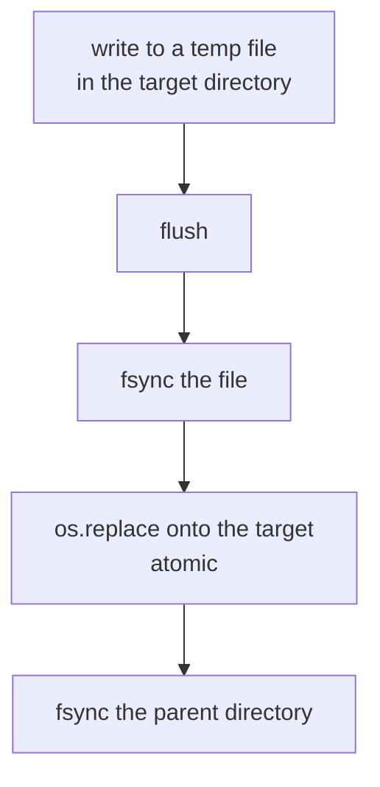

Track K fuzzing panics the machine as a normal part of its work. Every
persistent write is built to survive a power loss at any point during the
write, and every read-modify-write is built for a second process performing the
same operation concurrently.

## The write path

`pipeline_state.save()` and `knowledge_ctl.py`'s append run the whole sequence
below. Every other durable write runs a prefix of it, and the table under
[Files on the atomic path](#files-on-the-atomic-path) says which.



Each step of that sequence provides one property.

| Step | Property it provides |
|---|---|
| Temp file in the same directory as the target | `os.replace` is atomic only within one filesystem |
| `flush` then `fsync` of the file | The new contents reach the disk before the rename |
| `os.replace` | A reader sees either the previous complete file or the new complete file, never a truncated one |
| `fsync` of the parent directory | The rename itself is durable. Without it the rename is lost even though the contents were flushed |
| Unlink of the temp file on any failure, before the exception propagates | A failed write leaves no temp file behind |

A panic before the rename leaves the previous good file untouched. A panic
after it leaves the new file complete.

## The backup

`pipeline_state.save()` copies the file it is about to replace to
`<path>.bak` first, so every file written through it carries one previous
version. Four files are written through it: `state/pipeline.json`,
`state/spend.json`, `state/completion-ledger.json` and
`state/orchestrator.json`. Each corrupt-file error names the backup:

```
state/pipeline.json is not valid JSON (Expecting value: line 1 column 1 (char 0)). Restore it from state/pipeline.json.bak or re-init.
```

## Files on the atomic path

Ten files must survive a panic mid-write. They do not all take the same path:
the temp-file-and-rename step covers eight of them, the parent-directory
`fsync` six, and the backup four.

| File | Written by | Temp file, `fsync`, rename | Parent directory `fsync` | Previous version kept |
|---|---|---|---|---|
| `state/pipeline.json` | Every tool, through `pipeline_state.save()` | Yes | Yes | Yes |
| `state/spend.json` | `pipeline_state.record_run_hours()` | Yes | Yes | Yes |
| `state/completion-ledger.json` | `pipeline_state.set_surface_account()` and `clear_surface_account()` | Yes | Yes | Yes |
| `state/orchestrator.json` | `orchestrator_ctl.py`, the breaker | Yes | Yes | Yes |
| `knowledge/learnings.md` | `knowledge_ctl.py`, one read-modify-write per entry | Yes | Yes | No |
| `knowledge/mistakes.md` | The same | Yes | Yes | No |
| `artifacts/seeds/promoted.json` | `corpus_ctl.py promote` | Yes | No | No |
| `artifacts/pocs/<id>/input` | `repro_ctl.py extract` | Yes | No | No |
| `artifacts/runs/<id>/coverage.csv` | `coverage_ctl.py sample` | No. The row is appended and the file `fsync`ed | No | No |
| `artifacts/runs/<id>/deadline` | `campaign_ctl.py` at install | No. The epoch second is written in place and `fsync`ed | No | No |

The coverage CSV is appended to. A sample is a new row, and rewriting the whole
file every `loop.coverage_sample_min` minutes is the more fragile operation.
`coverage_ctl.py migrate-csv` is the one path that rewrites it, through a temp
file and a rename, and it is an operator step run with the sampler stopped.

`knowledge_ctl.py` holds a per-file lock for its append, because a panic
mid-append leaves a torn entry and two agents appending at once interleave
their lines. The append is a read-modify-write through a temp file, so it gets
the same guarantee the state file has.

`artifacts/seeds/promoted.json` and the extracted PoC files rename without
`fsync`ing the parent directory, so the rename itself is unflushed. A panic
between the rename and the filesystem's own writeback loses it, and the file
reverts to its previous contents. A truncated file is still impossible on
either path.

## Transactions

```python
with ps.transaction() as st:
    st["crashes"][cid]["status"] = "reliable"
```

The transaction takes an exclusive `flock` on `state/.pipeline.lock`, loads the
state, yields it, and saves on clean exit. The lock is a separate file beside
the state file, never the state file itself, so `save()` can replace the state
file by rename while the lock is held. An exception inside the block aborts the
write and leaves the file untouched.

A bare load-and-save pair is a defect. `AGENTS.md` allows parallel sub-agents
for `describe`, `seeds` and `harness`, plus a background `fuzz` monitor, and
all of them touch this file. Two loads followed by two saves lose one update.

`crash_parse.py` scans every source inside a single transaction, so a harvest
running while another phase writes cannot interleave with it.

## Locks

Six lock sites cover seven lock files. Every one takes an exclusive `flock`.
All but the reproduction lock take it blocking, so a second holder waits for
the first to release.

| Lock file | Protects | Redirected by | Behaviour on a held lock |
|---|---|---|---|
| `state/.pipeline.lock` | `state/pipeline.json` | `GSPWN_STATE`, which moves the file and the lock beside it | Waits |
| `state/spend.json.lock` | `state/spend.json` | `GSPWN_SPEND` | Waits |
| `state/completion-ledger.json.lock` | `state/completion-ledger.json` | `GSPWN_SURFACE_LEDGER` | Waits |
| `state/orchestrator.json.lock` | `state/orchestrator.json` | `GSPWN_ORCH` | Waits |
| `knowledge/learnings.md.lock`, `knowledge/mistakes.md.lock` | One knowledge file each | `GSPWN_KNOWLEDGE` | Waits |
| `state/repro.lock` | The one dmesg ring on the machine | Nothing. It is a machine-global lock | Exits, naming the lock file |

The spend lock and the completion-ledger lock are separate from the state lock,
so billing a run and accounting a surface target are both safe while a state
transaction is open. One lock covering the state file and the spend ledger
deadlocks the moment `round-end` bills inside its own transaction.

The reproduction lock is the exception and takes `LOCK_NB`. Two concurrent
verifiers share one dmesg ring and corrupt each other's delta windows, so a
second session exits immediately. A queued verification would start against a
ring already full of the other session's crashes. It does not follow
`GSPWN_STATE` for the same reason: two runs with separate registries share the
one ring and must still exclude each other.

The breaker lock exists because `orchestrator_ctl.py status` and `reset` can
touch the file while the unit is starting.

## Root ownership repair

`campaign_ctl.py start` and `stop` run as root and write state. The state file
is created with `mkstemp`, mode 0600, owner root, and so is its lock file. Left
alone, every subsequent non-root agent command fails with a permission error.

| Condition | Action |
|---|---|
| A root write completed and `SUDO_USER` names a real user | The file `save()` just wrote and its backup are chowned to that user, and each lock file is chowned when its transaction closes |
| The process is root but `SUDO_USER` is unset, or names no account | Nothing is chowned. There is no user to hand the files back to |
| A non-root process tries to append to a root-owned `coverage.csv` | The condition is reported as a message naming `sudo` and the `series` subcommand, and does not raise |

```
cannot write artifacts/runs/r2-1/coverage.csv, which is owned by the root sampler. Re-run this check with sudo, or read the curve with `series`.
```

## The deadline on disk

`artifacts/runs/<run-id>/deadline` holds one absolute epoch second, written and
`fsync`ed at install time.

| Condition | Resolution |
|---|---|
| The file is present | Read it and compare against the clock |
| The file is lost | Reconstruct it from the install event in the state file, which records the campaign start and the window it was given |
| Nothing on disk, nothing reconstructible, units still fuzzing | Stop the campaign |
| Nothing on disk, nothing reconstructible, no units fuzzing | Nothing to enforce, exit 0 |

The deadline is a file because a one-shot timer dies with the machine and this
machine reboots routinely. After a reboot the check reads the same deadline and
still stops on time. Without the reconstruction path, losing one small file
removes the spend ceiling with no visible symptom.

## Verification progress

`repro_ctl.py verify` writes `crash.repro_progress` before and after each run,
carrying an `in_flight` flag and the current boot id. A kernel reproducer often
takes the machine down mid-run, and the next invocation resolves the in-flight
run from the boot id and the harvested logs.

| Condition | Resolution |
|---|---|
| The boot id is unchanged, or either boot id is unavailable | Void: the verification process died while the kernel stayed up, or nothing establishes that it did not |
| New boot id, harvested log carries this signature | Hit |
| New boot id, harvested log shows a different crash | Void |
| New boot id, no recoverable logs, Track K | Hit on weak evidence |
| New boot id, no recoverable logs, Track U | Void |

The Track K and Track U rows differ because a Track K reproducer is expected to
take the box down, and a Track U harness runs in a container that does not.

## Session recorded before the launch

The orchestrator resolves and stores the session id before launching the agent.
A panic terminates the agent with no exit code, so anything written after the
launch is never written on the restarts this mechanism exists for. The resume
count is incremented for the same reason: counting only clean exits leaves a
panic-heavy campaign never rotating its session.

## Corrupt-file behaviour

Four of the five persistent JSON files raise on a parse failure.

| File | Behaviour on a parse failure |
|---|---|
| `state/pipeline.json` | Raises, naming the backup. `pipeline_stop_reason()` returns the error, so the orchestrator declines to launch an agent that would read the same broken file and stop again once per restart |
| `state/spend.json` | Raises, naming the backup and the option of deleting the file to re-seed from the state file |
| `state/completion-ledger.json` | Raises, naming the backup and refusing an empty replacement, because an empty ledger reads as nothing accounted for and reopens every closed target |
| `state/orchestrator.json` | Raises, naming the backup and the option of deleting it deliberately, accepting the loss of the restart history the breaker counts. Nothing resets it silently, because that would clear a trip the operator has not seen |
| `artifacts/seeds/promoted.json` | Rebuilt from the `.syz` files present, with a warning. Files on disk still count as known, so nothing is promoted twice |

## pstore clearing after harvest

pstore is a small fixed-size backend that frees a record only when the file is
deleted. `crashlog_ctl.py harvest` copies every record out and then unlinks the
ones the copy succeeded on. A record whose copy failed is reported and left in
place, so no evidence is deleted before it has been saved.

Records left in place leave the next panic with nowhere to write, which on a
machine that panics by design loses findings. Every later harvest also
re-copies the same records.

`harvest` refuses to run as anything but root. `/sys/fs/pstore` and
`/var/crash` are root-only, so a non-root harvest reads nothing while reporting
that it found nothing, and the unattended post-panic path would record success
over evidence still sitting on the machine. A harvest that reads nothing and
also fails on a source exits 1 for the same reason: "nothing to harvest" and
"could not look" are different answers. A harvest that collects evidence and
still leaves a source unread or deferred exits 2, so an unattended caller
reading only the exit code learns the record is incomplete.

## See also

- [Loops](/gspwn/architecture/loops/)
- [Long-running campaigns](/gspwn/guides/long-running-campaigns/)
