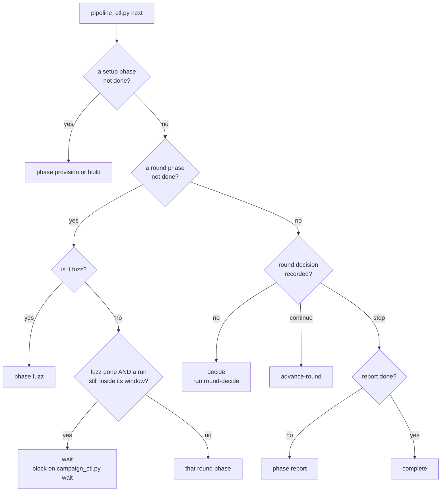
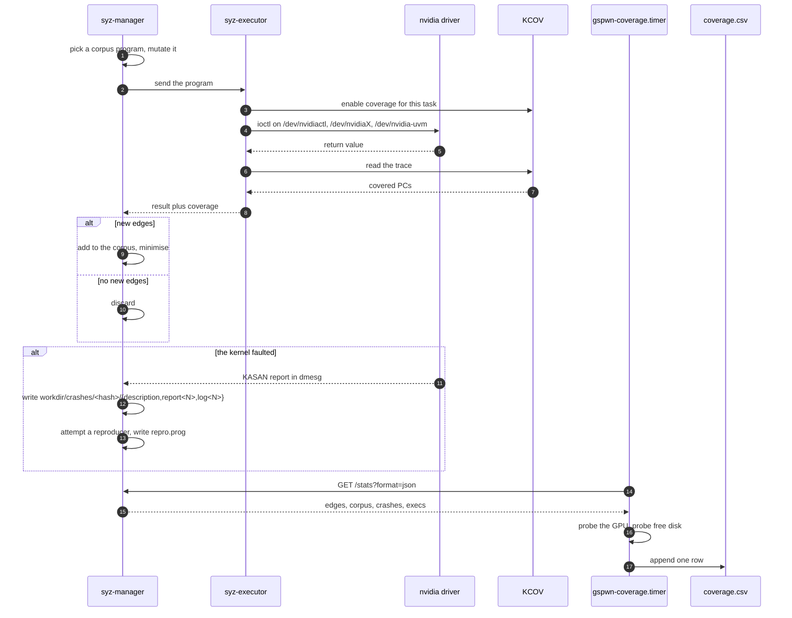

The orchestrator executes one serialised walk of the phase state machine. It
holds no pipeline state in conversation: every decision is derived from
`state/pipeline.json` at the moment it is needed.

The layer inventory and the crash-resilience mechanisms are in
[Architecture overview](/gspwn/architecture/overview/). This page specifies the
dispatch cycle itself.

## The dispatch cycle

1. Run `python3 tools/pipeline_ctl.py next`. It returns a phase name, `wait`,
   `decide`, `advance-round` or `complete`.
2. Run `set-phase <phase> in_progress`.
3. Dispatch a sub-agent. The dispatch carries the full contents of
   `agents/<phase>.md`, the current contents of `config/machine.yaml` and
   `config/campaign.yaml`, and the paths of the artifacts the phase reads. The
   sub-agent writes to the artifact paths its contract defines and returns a
   one-paragraph summary plus gate evidence.
4. Confirm the gate. Read the named artifacts and check that they exist and
   state what the sub-agent reported.
5. Record the result. `set-phase <phase> done` on confirmed evidence, or
   `set-phase <phase> blocked --notes "<why>"` when confirmation fails.

Step 4 is a read of the filesystem. Sub-agents are isolated and hand off
artifact paths, so the evidence a sub-agent returns is a claim about files. A
phase marked `done` on an unconfirmed claim leaves every later gate satisfied
by having nothing to inspect, and the condition stays invisible until
`round-end` measures the round, at which point the campaign hours are spent.

## Phase inventory

`tools/pipeline_state.py` holds the three phase lists.

| Group | Constant | Phases | Reset on `round-advance` |
|---|---|---|---|
| Setup | `SETUP_PHASES` | `provision`, `build` | No |
| Round | `ROUND_PHASES` | `describe`, `seeds`, `harness`, `fuzz`, `triage`, `rca`, `poc`, `eval`, `refine` | Yes |
| Final | `FINAL_PHASES` | `report` | No |

`PHASE_STATUS` admits `pending`, `in_progress`, `done`, `blocked` and `failed`.

## Return values of next

`next_action()` in `tools/pipeline_state.py` walks the phase lists in order.
`pipeline_ctl.py` wraps it with the `wait` branch.

| Return | Condition | Orchestrator action |
|---|---|---|
| A phase name | That phase is not `done`, walking setup then round then final | Dispatch its sub-agent |
| `wait` | `fuzz` is `done` and a run attached to this round is still inside its campaign window | Block on `campaign_ctl.py wait --run-id <id>` |
| `decide` | Every round phase is `done` and the round has no recorded decision | Run `round-decide` |
| `advance-round` | The round decision is `continue` | Run `round-advance` |
| `complete` | Every phase including `report` is `done` | Exit |

The `wait` branch prevents a phase from measuring a live campaign. `fuzz` is
exempt from it, because `fuzz` starts the campaign the branch guards.

A `blocked` or `failed` phase halts the walk at that phase. `round-advance`
refuses to open a new round while one is present.

## Concurrency

| Rule | Scope | Enforced by |
|---|---|---|
| `describe`, `seeds` and `harness` may run concurrently after `build` | `PARALLEL_AFTER_BUILD` in `tools/pipeline_state.py` | The phase-ordering integrity check exempts the trio from each other |
| A background sub-agent is allowed for `fuzz` and for the parallel trio | `AGENTS.md` | The orchestrator contract |
| A timed-out sub-agent is resumed | Any phase | The orchestrator contract |
| Every read-modify-write of the state file runs inside one transaction | All tools | An exclusive `flock` held across load, mutate and save |

In round 1 `seeds` consumes the `NV_*` header that `describe` produces, so the
trio is independent from round 2 onward, once the header and
`tools/ioctl_map.json` exist.

A bare load-and-save pair loses updates when two parallel sub-agents write
between the load and the save. See
[Durability](/gspwn/architecture/durability/).

## One fuzz iteration

The inner loop belongs to syz-manager. The pipeline observes it through the
crash directory and the stats endpoint the sampler polls.

The sampler runs as `gspwn-coverage.timer`, outside any agent session, because
sampling has to survive the panics this loop produces.

## Panic during an iteration

| Step | Actor | Effect |
|---|---|---|
| 1 | Kernel | Halts. pstore or kdump captures the final log output |
| 2 | systemd | Restarts `gspwn-k.service` after `RestartSec=30` |
| 3 | syz-manager | Reloads and re-executes its corpus |
| 4 | Sampler | Reports an edge count climbing steeply back towards its previous value |
| 5 | `coverage_ctl.py` | Accumulates the y axis with a running maximum, so the replay contributes zero |

Without step 5, a saturated run reports tens of percent of growth after each
panic, and a campaign that has stopped finding edges continues on the strength
of its own crashes. See
[Coverage and plateau](/gspwn/architecture/coverage-and-plateau/).

## Halt conditions

| Condition | Mechanism | Overridable |
|---|---|---|
| The campaign window elapsed | `gspwn-deadline@<run-id>.timer` stops and disables both fuzz units | No |
| The command surface is complete | `round-decide` returns `stop` from `hard_cap_reason()`, which checks it first | No |
| `loop.max_rounds` reached | `round-decide` returns `stop` from `hard_cap_reason()` | No |
| `loop.max_total_run_hours` spent | `round-decide` returns `stop` from `hard_cap_reason()` | No |
| Both curves flat with `loop.stop_on_plateau` set | `round-decide` returns `stop` | Yes, with `--reason` |
| Coverage verdict `unknown` | `round-decide` returns `stop` | Yes, with `--reason` |
| A phase is `blocked` | `next` halts there. `orchestrator_ctl.py run` exits 78 | No |
| The circuit breaker tripped | `orchestrator_ctl.py run` exits 78 | Reset only, through `orchestrator_ctl.py reset` |
| The pipeline is `complete` | `orchestrator_ctl.py run` exits 78 | No |

systemd does not restart a unit that exits 78, so all three exit-78 paths leave
the orchestrator stopped.

## See also

- [Loops](/gspwn/architecture/loops/): all ten loops, with entry, body, exit
  and bound.
- [Sub-agents](/gspwn/architecture/sub-agents/): the dispatch contract and the
  feedback edge.
- [Spend accounting](/gspwn/architecture/spend-accounting/): how the run-hour
  cap is computed.
