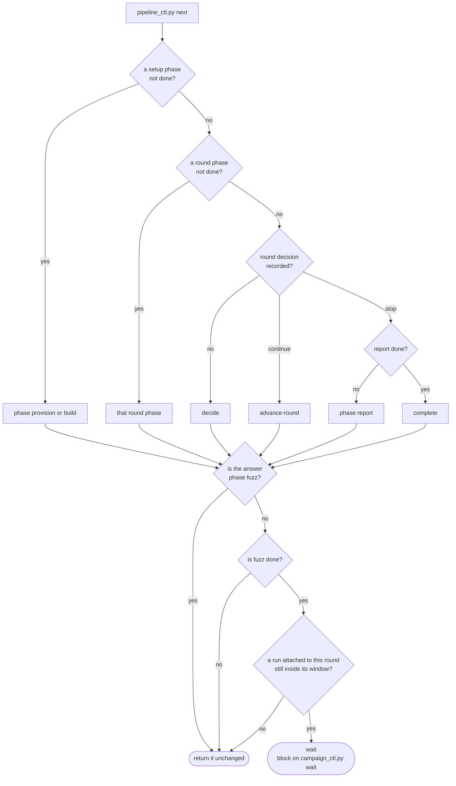
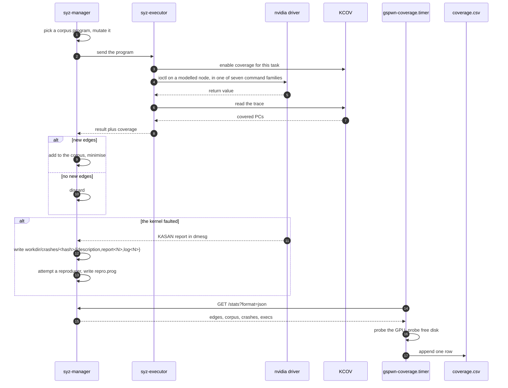

The orchestrator executes one serialised walk of the phase state machine,
deriving every decision from `state/pipeline.json` at the moment it is needed.
`state/pipeline.json` is the orchestrator's whole memory, so a fresh agent
started after a panic reaches the same next action a running one would.

The layer inventory and the crash-resilience mechanisms are in
[Architecture overview](/gspwn/architecture/overview/). This page specifies the
dispatch cycle itself.

## The dispatch cycle

1. Run `python3 tools/pipeline_ctl.py next`. It returns a phase name, `wait`,
   `decide`, `advance-round` or `complete`.
2. Run `set-phase <phase> in_progress`.
3. Dispatch a sub-agent. The dispatch carries the full contents of
   `agents/<phase>.md`, the current contents of `config/machine.yaml` and
   `config/campaign.yaml`, and the paths of the artifacts the phase reads. The
   sub-agent writes to the artifact paths its contract defines and returns a
   one-paragraph summary plus gate evidence.
4. Confirm the gate. Read the named artifacts and check that they exist and
   state what the sub-agent reported.
5. Record the result. `set-phase <phase> done` on confirmed evidence, or
   `set-phase <phase> blocked --notes "<why>"` when confirmation fails.

Sub-agents are isolated and hand off artifact paths, so the evidence a
sub-agent returns is a claim about files. A phase marked `done` on an
unconfirmed claim leaves every later gate satisfied by having nothing to
inspect, and the condition stays invisible until `round-end` measures the
round, at which point the campaign hours are spent.

## Phase inventory

`tools/pipeline_state.py` holds the three phase lists.

| Group | Constant | Phases | Reset on `round-advance` |
|---|---|---|---|
| Setup | `SETUP_PHASES` | `provision`, `build` | No |
| Round | `ROUND_PHASES` | `describe`, `seeds`, `harness`, `fuzz`, `triage`, `rca`, `poc`, `eval`, `refine` | Yes |
| Final | `FINAL_PHASES` | `report` | No |

`PHASE_STATUS` admits `pending`, `in_progress`, `done`, `blocked` and `failed`.

## Return values of next

`next_action()` in `tools/pipeline_state.py` walks the phase lists in order.
`pipeline_ctl.py` wraps it with the `wait` branch.

| Return | Condition | Orchestrator action |
|---|---|---|
| A phase name | That phase is not `done`, walking setup then round then final | Dispatch its sub-agent |
| `wait` | `fuzz` is `done` and a run attached to this round is still inside its campaign window | Block on `campaign_ctl.py wait --run-id <id>` |
| `decide` | Every setup and round phase is `done` and the round has no recorded decision | Run `round-decide` |
| `advance-round` | The round decision is `continue` | Run `round-advance` |
| `complete` | Every phase including `report` is `done` | Exit |

The live-run check is applied to whatever the walk returned, so a live campaign
suspends `decide`, `advance-round` and `complete` as well as a round phase.
`fuzz` is exempt, because `fuzz` starts the campaign the check guards.

`next_action()` treats every status other than `done` as pending, so a phase
recorded `blocked` or `failed` is returned again on the next call. Two other
mechanisms turn that into a stop. `pipeline_stop_reason()` in
`tools/orchestrator_ctl.py` refuses to launch an agent while any phase is
`blocked`, and `advance_round()` refuses to open a new round while any round
phase is anything but `done`. A `failed` phase is listed by
`pipeline_ctl.py brief` with its notes and stops neither the supervisor nor the
walk on its own.

## Concurrency

Four rules govern what may run at the same time and how the state file is
written.

| Rule | Scope | Enforced by |
|---|---|---|
| `describe`, `seeds` and `harness` may run concurrently after `build` | `PARALLEL_AFTER_BUILD` in `tools/pipeline_state.py` | The phase-ordering integrity check exempts the trio from each other |
| A background sub-agent is allowed for `fuzz`, a long-running monitor, and for the parallel trio | `AGENTS.md` | The orchestrator contract |
| A timed-out sub-agent is resumed, and its work is not restarted from the beginning | Any phase | The orchestrator contract |
| Every read-modify-write of the state file runs inside one transaction | All tools | An exclusive `flock` held across load, mutate and save |

The trio is independent in round 1 as in every later round. `seeds` reads
`tools/ioctl_map.json`, which is committed and pre-populated, so it takes no
input from `describe`.

A bare load-and-save pair loses updates when two parallel sub-agents write
between the load and the save. See
[Durability](/gspwn/architecture/durability/).

## One fuzz iteration

The inner loop belongs to syz-manager. The pipeline observes it through the
crash directory and the stats endpoint the sampler polls.

The sampler runs as `gspwn-coverage.timer`, outside any agent session, because
sampling has to survive the panics this loop produces.

## Panic during an iteration

1. The kernel halts. pstore or kdump captures the final log output.
2. systemd restarts `gspwn-k.service` after `RestartSec=30`.
3. syz-manager reloads and re-executes its corpus.
4. The sampler reports an edge count climbing steeply back towards its previous
   value.
5. `coverage_ctl.py` accumulates the y axis with a running maximum, so the
   replay contributes zero.

The running maximum in step 5 is specified in
[Coverage and plateau](/gspwn/architecture/coverage-and-plateau/).

## Halt conditions

Nine conditions halt the loop, and two of them can be overridden with
`--reason`.

| Condition | Mechanism | Overridable |
|---|---|---|
| The campaign window elapsed | `gspwn-deadline@<run-id>.timer` stops and disables both fuzz units | No |
| The command surface is complete | `round-decide` returns `stop` from `hard_cap_reason()`, which checks it first | No |
| `loop.max_rounds` reached | `round-decide` returns `stop` from `hard_cap_reason()` | No |
| `loop.max_total_run_hours` spent | `round-decide` returns `stop` from `hard_cap_reason()` | No |
| Both curves flat with `loop.stop_on_plateau` set | `round-decide` returns `stop` | Yes, with `--reason` |
| Coverage verdict `unknown` | `round-decide` returns `stop` | Yes, with `--reason` |
| A phase is `blocked` | `orchestrator_ctl.py run` names the blocked phases and exits 78 without launching an agent | No |
| The circuit breaker tripped | `orchestrator_ctl.py run` exits 78 | Reset only, through `orchestrator_ctl.py reset` |
| The pipeline is `complete` | `orchestrator_ctl.py run` exits 78 | No |

systemd does not restart a unit that exits 78, so all three exit-78 paths leave
the orchestrator stopped.

## See also

- [Loops](/gspwn/architecture/loops/): all ten loops, with entry, body, exit
  and bound.
- [Sub-agents](/gspwn/architecture/sub-agents/): the dispatch contract and the
  feedback edge.
- [Spend accounting](/gspwn/architecture/spend-accounting/): how the run-hour
  cap is computed.
