Ten loops run in gspwn. The agent-owned ones nest four deep at their deepest,
along the chain L6, L1, L2 and then whichever loop the running phase carries.
Each loop states a bound, because an unterminated loop on a machine billed by
the hour spends without limit.

## Nesting

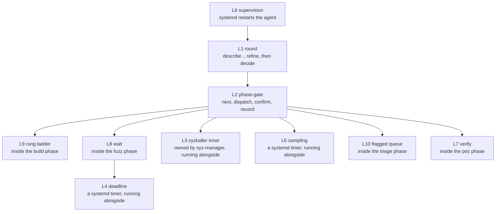

L3, L4 and L5 run under systemd and outlive any agent session.

| Loop | Owner | Bound |
|---|---|---|
| L1 round | `pipeline_ctl.py` | Surface completion, then `loop.max_rounds`, then `loop.max_total_run_hours` |
| L2 phase-gate | The orchestrator | Twelve phases; a `blocked` phase stops the orchestrator |
| L3 syzkaller inner | syz-manager | The campaign deadline, enforced by L4 |
| L4 deadline | systemd | Fires every `loop.deadline_check_min`; disables itself after enforcement |
| L5 sampling | systemd | Fires every `loop.coverage_sample_min`; skips once the window elapses |
| L6 supervision | systemd and the breaker | `orchestrator.max_same_boot_starts`, `orchestrator.max_reboots`, `orchestrator.max_agent_hours` |
| L7 verify | `repro_ctl.py` | `poc.default_runs` counted runs, `poc.void_retry_factor` attempts per still-needed run |
| L8 wait | The `fuzz` sub-agent | The deadline file |
| L9 rung ladder | The `build` sub-agent | Three rungs |
| L10 flagged queue | The `triage` sub-agent | The count of `flagged` registry entries |

## L1: the round loop

| Property | Value |
|---|---|
| Entry | `build` is `done` and the current round has no recorded decision |
| Iteration body | The nine round phases in dependency order, then `round-end`, then `round-decide` |
| State carried | The corpus, through `install-k --corpus carry --from-run`; the work list, through `round.worklist_in` |
| Exit | `round-decide` returns `stop` |
| Bound | Surface completion, `loop.max_rounds` and `loop.max_total_run_hours`, all three non-overridable |

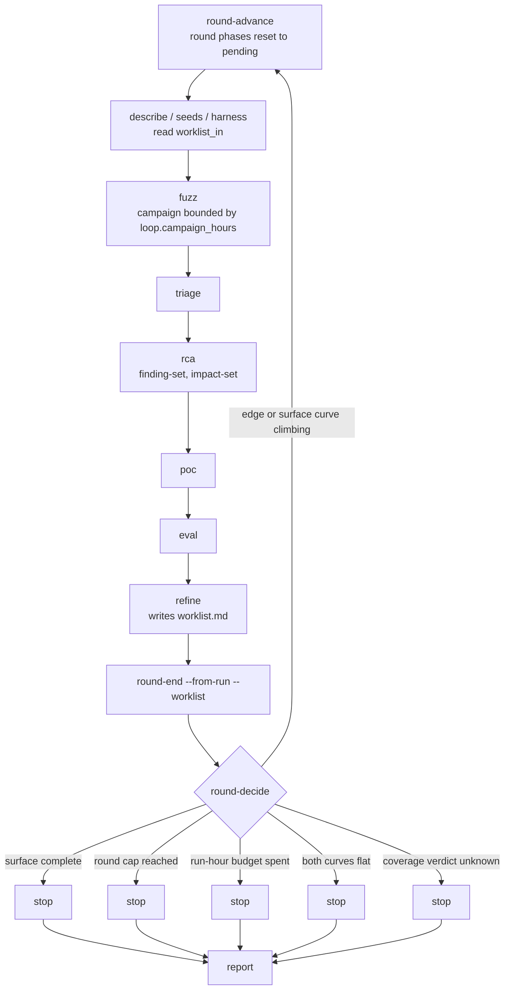

| Stop condition | Source | `--decision continue` accepted |
|---|---|---|
| Surface complete | `surface_stop_reason()` against the completion ledger | No |
| Round cap reached | `hard_cap_reason()` against `loop.max_rounds` | No |
| Run-hour budget spent | `hard_cap_reason()` against `loop.max_total_run_hours` | No |
| Coverage plateaued | `round.coverage_verdict` with `loop.stop_on_plateau` set | Yes, with `--reason` |
| Coverage verdict unknown | `round.coverage_verdict` | Yes, with `--reason` |

`hard_cap_reason()` checks completion first, so a campaign finishing on its
last permitted round records why it finished. `loop.max_rounds` is 10 and is a
backstop against a runaway loop. A campaign that reaches it has failed to
converge, and its stop reason says so and points at the completion ledger.
`loop.max_total_run_hours` at 5000 is the spend ceiling. See
[Coverage and plateau](/gspwn/architecture/coverage-and-plateau/) for the
two-curve decision table.

`round-advance` requires every round phase `done` and a recorded `round-end`. A
phase marked `blocked` fails that check, so a blocked gate cannot be carried
into a new round behind a fresh set of phase records.

The work list is the loop's carried state, and round 1 has no predecessor round
to produce one. `tools/cve_patch_map.py worklist` fills that position from
NVIDIA's published kernel-mode CVEs, the one steering signal available before
any campaign has run. It classifies 61 kernel-mode CVEs, resolves 53 of them to
a release tag pair and ranks 270 changed functions, 27 of which reach a named
ioctl target. The committed `surface/worklist-round1.md` carries 31 items: 22
in its describe section, 4 in its seeds section, and 5 targets recorded as
outside the tenant surface so that a later round does not rediscover them. A
`[history CVE-YYYY-NNNNN]` item ranks a place where the vendor found a bug and
is no evidence that a bug remains there. See
[Historical targeting](/gspwn/architecture/historical-targeting/).

`describe`, `seeds` and `harness` are declared parallel after the build phase
in `PARALLEL_AFTER_BUILD`, in round 1 as in every later round. `seeds` reads
`tools/ioctl_map.json`, which is committed and pre-populated, so it takes no
input from the describe phase and the three run concurrently.

## L2: the phase-gate loop

| Property | Value |
|---|---|
| Entry | Any phase is not `done` |
| Iteration body | Ask `next`, mark `in_progress`, dispatch the sub-agent, confirm the evidence on disk, record `done` or `blocked` |
| State carried | The phase records in `state/pipeline.json` |
| Exit | `next` returns `complete`, or a phase is recorded `blocked` and the orchestrator stops at it |
| Bound | Twelve phases per pipeline; a `blocked` phase stops the orchestrator before the next dispatch |

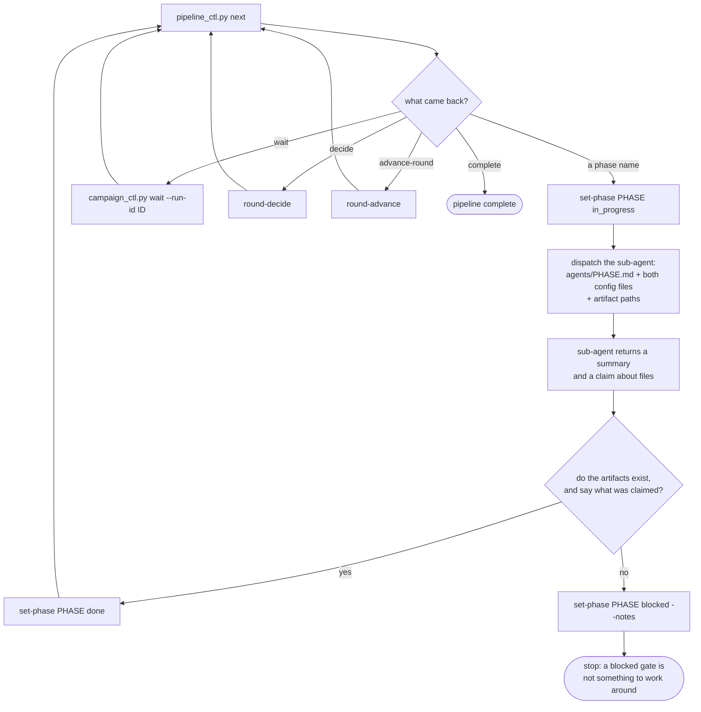

The confirmation step reads the filesystem. See
[Execution model](/gspwn/architecture/execution-model/).

## L3: the syzkaller inner loop

| Property | Value |
|---|---|
| Entry | `gspwn-k.service` starts |
| Iteration body | Pick a corpus program, mutate it, execute it, read the KCOV trace, keep it when it covered new edges |
| State carried | `workdir/corpus.db` and the crash directories |
| Exit | The unit is stopped. No condition inside the loop ends it |
| Bound | External. L4 stops and disables the unit at the deadline |

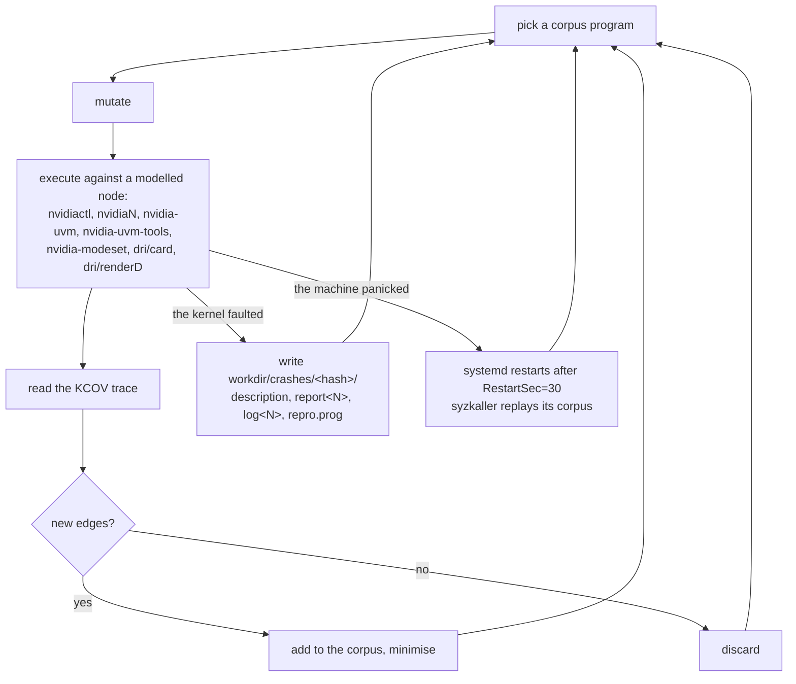

The pipeline does not modify this loop. The outer loop supplies what syzkaller
cannot produce for itself: models for ioctls it has no description for, and
valid object-chain seeds. One iteration is drawn in
[Execution model](/gspwn/architecture/execution-model/).

A replay climbs the reported count back towards its previous high-water mark
and records no new coverage, which the coverage model absorbs with a running
maximum on the y axis.

## L4: the deadline loop

| Property | Value |
|---|---|
| Entry | `install-k` or `install-u` enables `gspwn-deadline@<run-id>.timer` |
| Iteration body | Read or reconstruct the deadline, compare it against the clock, stop and disable the fuzz units once it has passed |
| State carried | `artifacts/runs/<run-id>/deadline`, one absolute epoch second |
| Exit | Enforcement completes and the timer disables itself |
| Bound | Fires every `loop.deadline_check_min` and after each boot, through `OnBootSec` |

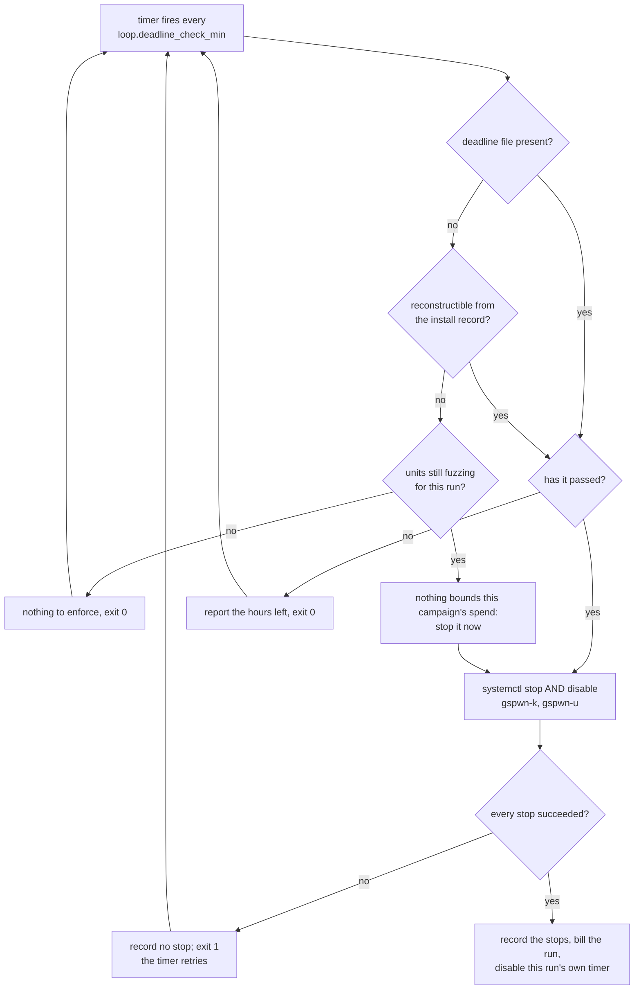

An enabled `Restart=always` unit resumes at the next boot, and this pipeline
reboots by design, so the disable step is required alongside the stop.

`loop.deadline_check_min` is separate from `loop.coverage_sample_min`, so
raising the sampling interval does not delay every campaign stop past the
window it enforces.

## L5: the sampling loop

| Property | Value |
|---|---|
| Entry | `coverage_ctl.py install-timer` enables `gspwn-coverage.timer` |
| Iteration body | One invocation per track: collect that track's counters, probe the GPU, read free disk, measure the surface when it is due, append one row |
| State carried | `artifacts/runs/<id>/coverage.csv` and `coverage-u.csv` |
| Exit | `coverage_ctl.py remove-timer` |
| Bound | Fires every `loop.coverage_sample_min`. The append is skipped once the campaign window has elapsed, absent `--force` |

The timer carries one `ExecStart` line per track and each is a separate
invocation against its own CSV. A sample handles one track and never both.

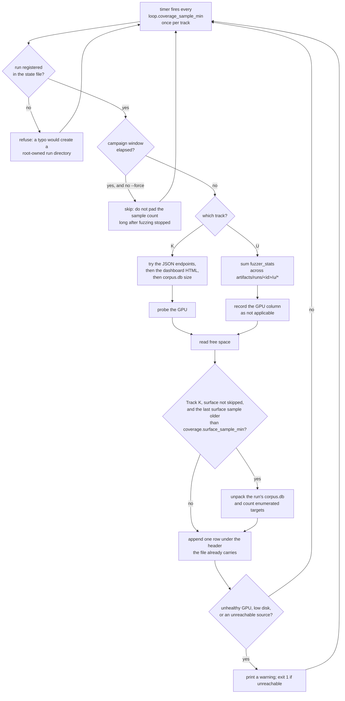

Both `ExecStart` lines carry a `-` prefix, so a failure sampling one track
leaves the other track's sample intact. The GPU probe is bounded by
`coverage.gpu_probe_timeout_sec`, default 20 seconds, which covers a hung
driver as well as a dead one.

The surface measurement runs on its own coarser cadence, because it unpacks the
run's `corpus.db` and rescans every program in it where the other columns come
from one HTTP fetch. The Track U line skips it: those harnesses produce no
syzlang programs. A sample that skips the measurement records an empty
`surface` value, which the curve drops.

## L6: the supervision loop

| Property | Value |
|---|---|
| Entry | `gspwn-orchestrator.service` is enabled and started |
| Iteration body | Breaker check, session resolve, harvest, launch the agent, wait for exit or kill on stall |
| State carried | `state/orchestrator.json`: the start history, the blocked record, the session id |
| Exit | Exit 78, which systemd does not restart |
| Bound | `orchestrator.max_same_boot_starts` (5) and `orchestrator.max_reboots` (10) inside `orchestrator.window_min` (60). `orchestrator.max_agent_hours` per launch, 0 in the shipped configuration and therefore off |

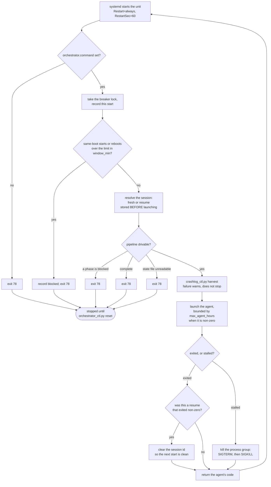

Same-boot starts and reboots are counted separately. Track K panics the box by
design, so one shared limit would trip on a healthy campaign.

The session id is stored before the launch. See
[Durability](/gspwn/architecture/durability/).

## L7: the verify loop

| Property | Value |
|---|---|
| Entry | `repro_ctl.py verify` acquires `state/repro.lock` |
| Iteration body | Persist progress, run the reproducer, score the verdict, persist progress |
| State carried | `crash.repro_progress` in the state file, with the boot id and an `in_flight` flag |
| Exit | The counted-run target is reached, or the attempt cap is hit |
| Bound | `poc.default_runs` counted runs; `poc.void_retry_factor` attempts per still-needed counted run, plus a fixed slack |

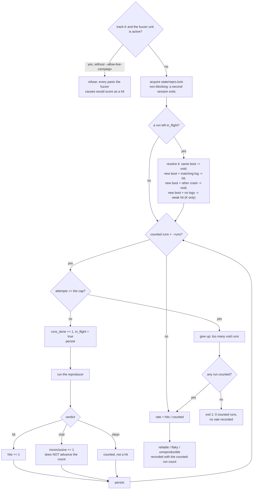

| Verdict | Advances the counted-run total | Counts as a hit |
|---|---|---|
| hit | Yes | Yes |
| clean | Yes | No |
| void | No | No |

Void runs leave the count unchanged, so the attempt cap bounds the loop. A
persistently wrapping dmesg ring would otherwise iterate without end.

A rate at or above `poc.reliable_threshold` classifies the crash `reliable`.
Any rate above zero below it classifies it `flaky`. A rate of zero classifies
it `unreproducible`.

## L8: the wait loop

| Property | Value |
|---|---|
| Entry | The `fuzz` phase calls `campaign_ctl.py wait --run-id <id>` |
| Iteration body | Re-read the deadline, print a heartbeat, sleep for the lesser of the poll interval and the time left |
| State carried | The deadline file, which this loop does not own |
| Exit | The deadline has passed |
| Bound | The absolute epoch second in `artifacts/runs/<run-id>/deadline` |

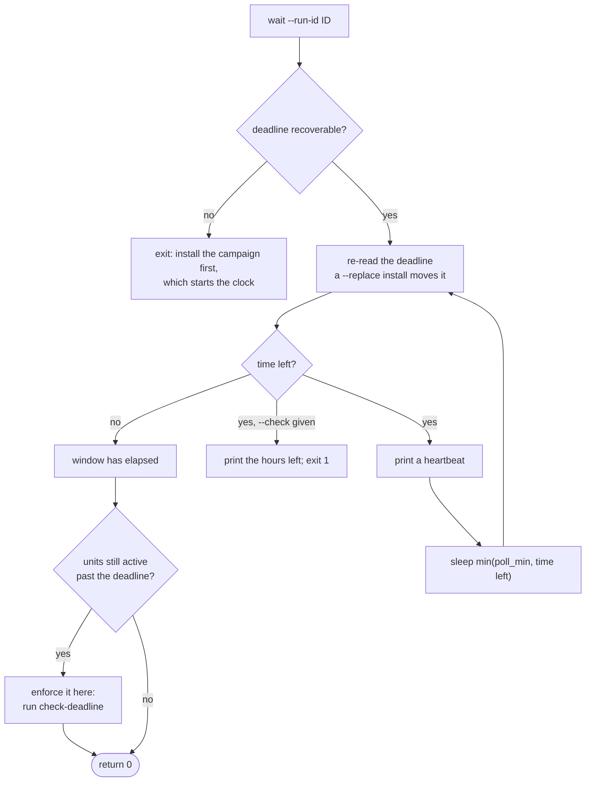

The deadline is re-read on every iteration, so a `--replace` install that moves
it takes effect without restarting the wait. The heartbeat distinguishes a
process blocking for a day from a hung one. A wait interrupted by a panic
resumes against the same deadline when the command is re-run after the reboot.

The wait enforces the deadline itself when the units are still active past it,
because the timer may never have been installed. Waiting out a window and then
measuring a campaign that is still running produces the same wrong number the
timer exists to prevent.

## L9: the rung ladder

| Property | Value |
|---|---|
| Entry | The `build` phase starts, at rung 1 |
| Iteration body | Build, install, reboot, check the gate |
| State carried | `instrumentation_rung` in `config/machine.yaml` and in `artifacts/builds/manifest.json` |
| Exit | The first rung whose gate passes, or all three failing |
| Bound | Three rungs |

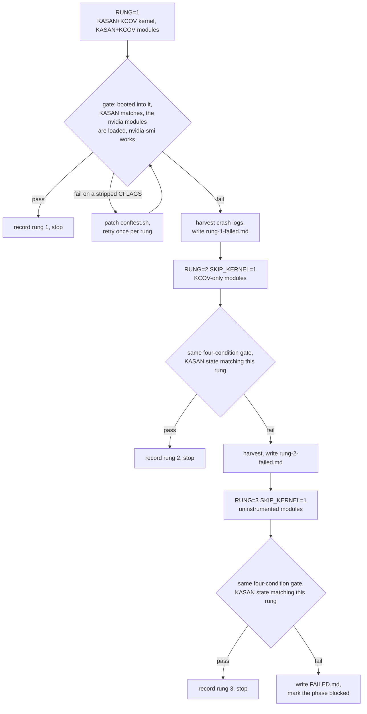

`SKIP_KERNEL=1` on rungs 2 and 3 bounds the ladder's cost. Only the module
CFLAGS differ between rungs. The kernel image is identical, and rebuilding it
per rung spends hours of billed machine time producing the same image.

The rung reached bounds what the oracles report. See
[Scope and oracle](/gspwn/architecture/scope-and-oracle/).

## L10: the flagged-queue loop

| Property | Value |
|---|---|
| Entry | `crash_parse.py` registered at least one `flagged` entry |
| Iteration body | Read both reports, decide duplicate or distinct, record the decision with `crash-set` |
| State carried | The crash registry in `state/pipeline.json` |
| Exit | `crash-list --status flagged` returns nothing |
| Bound | The count of `flagged` entries, which no iteration increases |

The queue is durable and survives the session that produced it. The
commands are in
[Results and triage](/gspwn/guides/results-and-triage/), and the flagging rules
are in [Crash identity](/gspwn/architecture/crash-identity/).

## The campaign lifecycle

L4, L5 and L8 all act on this state machine.

```mermaid
stateDiagram-v2
  [*] --> installed: install-k / install-u<br/>budget checked, deadline written,<br/>per-run timer enabled
  installed --> running: start k / start u
  running --> panicked: the kernel dies
  panicked --> rebooted: systemd comes back
  rebooted --> running: Restart=always;<br/>syzkaller replays its corpus
  running --> elapsed: the deadline passes
  elapsed --> stopped: check-deadline stops AND<br/>disables both units
  stopped --> billed: measured hours recorded<br/>to state/spend.json
  billed --> measured: round-end --from-run derives<br/>the verdict, edges and crash count
  measured --> [*]
  running --> retired: a --replace install of another run
  retired --> [*]: units disabled,<br/>deadline timer retired
```

| Transition | Trigger | Durable record |
|---|---|---|
| `installed` | `campaign_ctl.py install-k` or `install-u` | The install event in `state/pipeline.json`, the deadline file, the per-run timer |
| `running` | `campaign_ctl.py start k` or `start u` | The systemd unit state |
| `panicked` to `rebooted` to `running` | A kernel fault, then `Restart=always` | Nothing in-process. The corpus and the deadline file carry the run |
| `stopped` | `check-deadline` stops and disables both units | The stop record in the state file |
| `billed` | `measured_run_hours()` over the run's coverage samples | `state/spend.json`, keyed by run id |
| `measured` | `pipeline_ctl.py round-end --from-run` | The round record |
| `retired` | A `--replace` install of another run | The previous run's units disabled and its timer retired |

This pipeline traverses the `rebooted` to `running` edge most often. Every
mechanism on the diagram survives it, because each is either a file on disk or
a systemd unit carrying `OnBootSec`.

## See also

- [Execution model](/gspwn/architecture/execution-model/)
- [Coverage and plateau](/gspwn/architecture/coverage-and-plateau/)
- [Spend accounting](/gspwn/architecture/spend-accounting/)
- [Durability](/gspwn/architecture/durability/)
