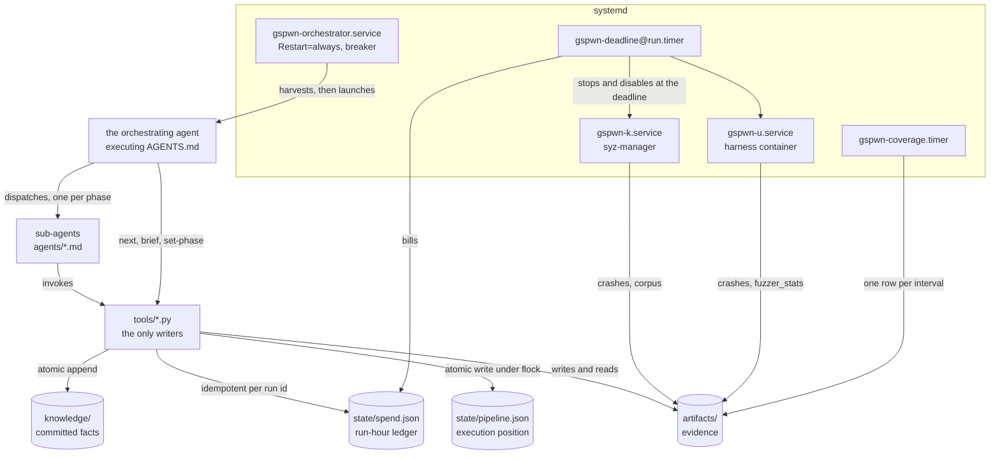
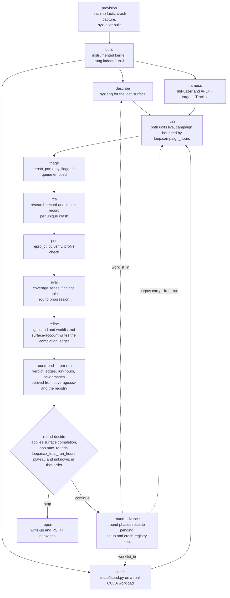
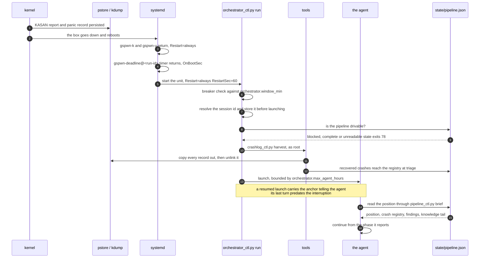

gspwn drives a fuzzing campaign against the NVIDIA GPU kernel driver (Track K)
and the NVIDIA Container Toolkit (Track U) with no human at the console. It is
built in five layers. Track K fuzzing panics the machine as a normal part of
its work, so each layer commits its result to disk as it produces it and
resumes from that record when the machine returns.

## Layers

| Layer | Components | Property the layer provides |
|---|---|---|
| Supervision | `gspwn-orchestrator.service`, `gspwn-k.service`, `gspwn-u.service`, `gspwn-deadline@<run-id>.timer`, `gspwn-coverage.timer` | Fuzzing, coverage sampling and deadline enforcement outlive the agent session and return after a reboot |
| Orchestration | One agent executing the contract in `AGENTS.md` | A single serialised walk of the phase state machine: ask `pipeline_ctl.py next`, dispatch, confirm the gate evidence on disk, record the result |
| Sub-agents | The twelve files in `agents/`, one per phase | Isolation. A dispatch carries the sub-agent's contract plus `config/machine.yaml` and `config/campaign.yaml`, and returns artifact paths plus a summary |
| Tools | `tools/*.py`, `tools/*.sh` | The only writers. Validation, locking, atomic writes, and refusal of operations whose output would be a wrong number |
| State | `state/pipeline.json`, `state/spend.json`, `artifacts/`, `knowledge/` | Durable position and evidence. A restarted agent needs nothing from the session it replaced |

The orchestrator holds no pipeline state in conversation. `state/pipeline.json`
is never hand-edited: `pipeline_ctl.py` validates the change, takes an exclusive
lock, and writes atomically. Sub-agents hand off paths, so the orchestrator
confirms each artifact on disk before marking a phase `done`. A phase whose
evidence cannot be confirmed is marked `blocked`, which stops the pipeline.

## State stores

Four stores hold everything that survives a process, and one of them is
committed to a public repository.

| Store | Holds | Lifetime | Committed |
|---|---|---|---|
| `state/pipeline.json` | Execution position: phases, the crash registry, rounds | This campaign | No |
| `state/spend.json` | Run-hours billed per run id | This machine | No |
| `artifacts/` | Evidence: coverage, crashes, reproducers, reports | This campaign | No |
| `knowledge/` | ABI and process facts | Every campaign, every machine | Yes, to a public repository |

A fact belongs to exactly one store. Execution position written into
`knowledge/` is published to a public repository and then drifts. Knowledge
written into `state/pipeline.json` is lost when the box is rebuilt.

`state/spend.json` is machine-global. `GSPWN_STATE` redirects
`state/pipeline.json` so a side run keeps its own registry. The ledger does
not follow it, so that run still counts against `loop.max_total_run_hours`,
which is checked at every campaign install and at every round decision. See
[Spend accounting](/gspwn/architecture/spend-accounting/).

Three locks cover these stores. `state/.pipeline.lock` follows `GSPWN_STATE` and
is created beside the file it protects. `state/spend.json.lock` and `state/repro.lock`
do not follow it. See [Durability](/gspwn/architecture/durability/).

## The round loop

`provision` and `build` run once per machine. The nine round phases run once per
round. `report` runs once, after the loop stops. A round inherits two things:
the work list, which `refine` writes and `round-advance` hands to the next
round's `describe` and `seeds`, and the corpus, which
`campaign_ctl.py install-k --corpus carry --from-run` packs into the next
campaign.

Solid edges are dependency order. Dashed edges are the only state a new round
inherits. `describe`, `seeds` and `harness` may run in parallel after `build`.
Every phase from `triage` onward measures the campaign, so
`pipeline_ctl.py next` returns `wait` while a run is inside its window, and
`round-end` refuses to measure a live campaign.

Entry conditions, carried state and termination for all ten loops are in
[Loops](/gspwn/architecture/loops/).

## Crash resilience

Eleven mechanisms carry a campaign across a panic, and each one exists against
a specific failure.

| Mechanism | Implementation | Failure it prevents |
|---|---|---|
| Durable position | `state/pipeline.json`, rendered by `pipeline_ctl.py brief`, which derives its output at read time | A resumed agent cannot locate the pipeline and restarts phases that already ran |
| Crash evidence capture | `crashlog_ctl.py harvest` copies every pstore record and every new `/var/crash` dump into `artifacts/`, then unlinks the pstore records. It runs before the orchestrator launches an agent | pstore is fixed-size and frees a record only on unlink, so the next panic has nowhere to write and later findings are lost |
| Atomic write path | Temp file in the target directory, `flush`, `fsync` of the file, `os.replace`, `fsync` of the parent directory | A panic mid-write truncates the state file and the next read fails to parse it |
| Exclusive transactions | An `flock` held across the whole read-modify-write cycle | Parallel `describe`, `seeds` and `harness` sub-agents overwrite each other's updates |
| Process supervision | `gspwn-orchestrator.service`, `Restart=always`, `RestartSec=60` | The pipeline stops at the first panic and waits for a human to log in |
| Circuit breaker | Same-boot starts and reboots counted separately inside `orchestrator.window_min`, against `orchestrator.max_same_boot_starts` and `orchestrator.max_reboots`. A trip records the block and exits 78, which systemd does not restart | A crash-looping agent restarts forever with no token ceiling. Separate counters keep expected panic reboots from tripping the same limit |
| Launch cap | `orchestrator.max_agent_hours` kills the process group of a launch that exceeds it. It is 0 in the shipped configuration, which disables it, and a non-zero value has to exceed `loop.campaign_hours` because `fuzz` waits out the whole window inside one launch | A stalled agent holds the pipeline open while the instance bills |
| Deadline on disk | `artifacts/runs/<run-id>/deadline` holds one absolute epoch second, `fsync`ed at install. `gspwn-deadline@<run-id>.timer` rechecks it every `loop.deadline_check_min` and after each boot. A lost file is reconstructed from the install event in the state file | A one-shot timer dies with the machine and the campaign runs past its window unbounded |
| Stop plus disable | Deadline enforcement runs `systemctl stop` and `systemctl disable` on both fuzz units | An enabled `Restart=always` unit resumes fuzzing at the next boot, after the campaign was stopped |
| Idempotent billing | `record_run_hours` overwrites the entry for a run id | A `round-end` retried after an interruption bills the campaign twice against `loop.max_total_run_hours` |
| Verification progress | `repro_ctl.py verify` persists `crash.repro_progress` with the boot id before and after every run | A reproducer that panics the box loses the run it was executing, and the boot-id evidence for whether that run was a hit |

### Resume sequence

The orchestrator harvests and launches. The agent reads the position as its
first act, because the position is derived at read time and a copy taken before
the launch would already be stale.

A harvest failure warns and does not stop the launch. A blocked phase, a
complete pipeline or an unreadable state file exits 78, and systemd leaves the
unit stopped until the breaker is reset. `orchestrator.max_agent_hours` is 0 in
the shipped configuration, which disables the per-launch wall-clock ceiling and
leaves the circuit breaker as the only bound on a stalled agent.

The same sequence restores the position by hand after a panic, a reboot, a
session restart or a compacted context: harvest the crash evidence, read the
recorded position, ask what comes next. The position is derived from the state
file at read time, so a stored copy of it goes out of date as soon as the
pipeline moves.

## Refusal conditions

The shared failure class is a broken measurement path that returns a well-formed
wrong number.

| Condition | Tool and command | Behaviour | Rationale |
|---|---|---|---|
| The `gpu` column of a Track K sample holds any value other than `ok` | `coverage_ctl.py plateau` | Reports the verdict as `unknown`, which `round-decide` treats as a stop | A card off the bus leaves syz-manager executing against nothing. The edge count stops moving and the curve matches a saturated run. Track U records `n/a` and is not gated on GPU health |
| `dmesg` is unreadable, which under `kernel.dmesg_restrict=1` appears as empty output | `repro_ctl.py verify`, Track K | Exits before any run is scored | An empty ring buffer scores every run `clean`, giving a real bug a repro rate of 0.0 and the classification unreproducible |
| `systemctl is-active gspwn-k` returns `active` or `activating` | `repro_ctl.py verify`, Track K | Exits before any run is scored | A Track K run counts as a reproduction partly because the box went down during it. A live fuzzer panics the box by design, and each such panic counts as a hit on the rate that gates disclosure |
| Effective uid is not 0 | `crashlog_ctl.py harvest`, `setup` and `prune` | Exits with the sudo remediation and names `orchestrator_ctl.py preflight` | `/sys/fs/pstore` and `/var/crash` are root-only. A non-root harvest reads nothing while reporting that it found nothing, and the unattended post-panic path records success while the evidence stays on the machine |
| `state/spend.json` is absent while rounds still record run-hours | `campaign_ctl.py install-k` and `install-u`, and every `pipeline_ctl.py` command that reads the ledger | Raises `SpendLedgerMissing`, refuses the operation, and names `pipeline_ctl.py spend-init` | A missing ledger read as zero spent removes `loop.max_total_run_hours` from an unattended run. `spend-init` rebuilds the ledger from the state file and never lowers recorded hours |
| A run attached to this round is still inside its campaign window | `pipeline_ctl.py round-end` | Refuses to measure the round | The coverage verdict, edge counts, new-crash count and billed hours would describe whichever part of the run had happened by then |
| A key in `config/campaign.yaml` is absent from the schema | `gspwn_config.py`, and every tool that loads the configuration | Raises `ConfigError` naming the offending key and the valid keys at that level, then exits non-zero | A misspelled cap leaves the default value in force, so a limit keyed in to bound the run has no effect |

## See also

- [Execution model](/gspwn/architecture/execution-model/): invocation to exit.
- [Loops](/gspwn/architecture/loops/): every loop in the system.
- [Durability](/gspwn/architecture/durability/): the write path.
