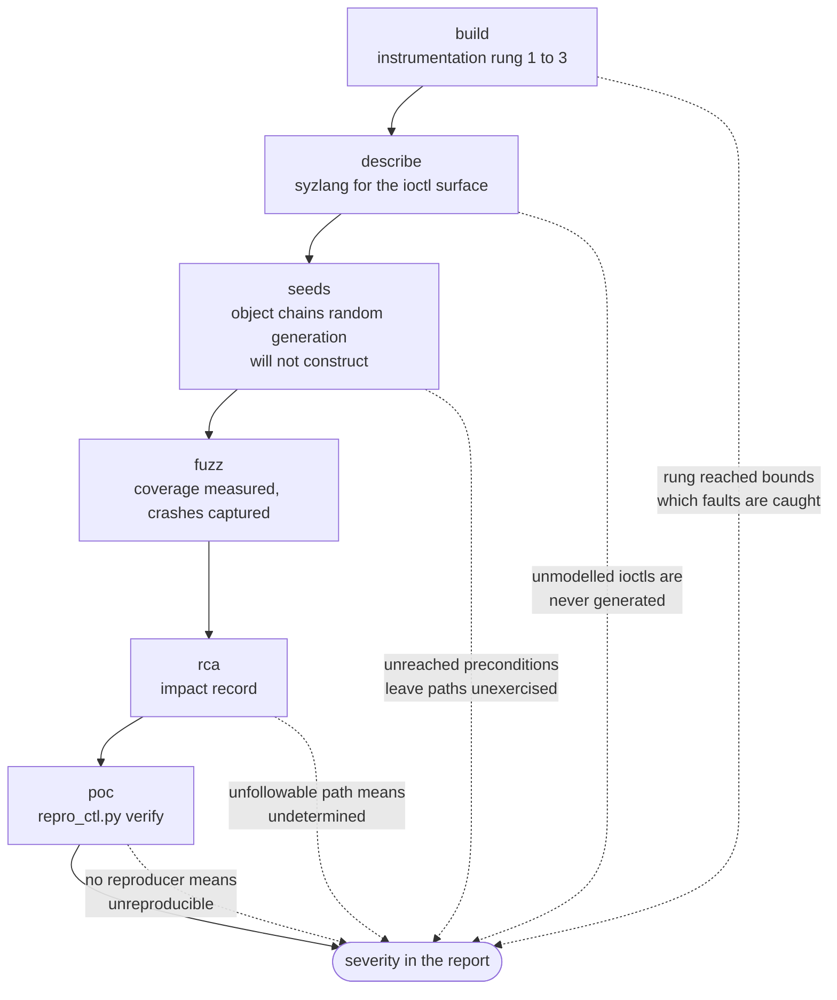

An oracle converts an execution into a verdict. A campaign detects a condition
only when one of the four oracles below fires on it, and reports that condition
only when every stage in the bounding chain carried it through.

[Threat model](/gspwn/architecture/threat-model/) states the scope exclusions
the attacker definition decides. The limits below are the ones the detection
mechanism imposes.

## Oracle inventory

Each oracle reads one source and covers one track. `crash_parse.py` reads all
four, and the patterns in the Signals column are the regular expressions it
matches on.

| Oracle | Source | Signals | Track |
|---|---|---|---|
| KASAN | Kernel log | A `KASAN:` report line, carrying the use-after-free or out-of-bounds class and the allocation, free and access sites | K |
| Kernel report lines | Kernel log, and syzkaller's own `description` file for a crash in its workdir | `REPORT_START_RE` opens a report at `BUG:`, `KASAN:`, `Kernel panic` or `Oops`, and the block runs to the end of its call trace. Titles syzkaller writes itself, including general protection fault, hung task and RCU stall, are taken from `description` | K |
| NVRM Xid lines | Kernel log | `NVRM: Xid ...` and `NVRM: GPU at ... error ...`, the Xid number classified `signal`, `review`, `health` or `noise` by the `XID_CLASS` table, with every number absent from that table classified `review` | K |
| Sanitizer output | The text of a Track U crash artifact | `ERROR: <Address, Memory, Leak, Thread or UndefinedBehavior>Sanitizer`, `SUMMARY:`, `runtime error:`, `SEGV on unknown address` and `ERROR: libFuzzer:` | U |

A Track U file registers as a crash only when it carries one of those five
patterns, so a log, a manifest or a README sitting in a crash directory
registers nothing.

Xid classification runs before the PCI bus id is stripped from the title, so
the classification note can name the card the Xid came from. `XID_NUM_RE`
consumes the parenthesised bus id as a group, which reads the Xid number past
it either way. See [Crash identity](/gspwn/architecture/crash-identity/).

## Hang as a reproduction verdict

A `repro_ctl.py verify` run that exceeds `poc.repro_timeout_sec` counts as a
hit when the crash title is hang-class. `HANG_PATTERNS` in `tools/repro_ctl.py`
holds the match list:

- `hung task`
- `task hung`
- `watchdog`
- `soft lockup`
- `softlockup`
- `rcu_sched`
- `rcu_preempt`
- `deadlock`

A timeout on any other title is void, and the run is retried against the
attempt cap.

## Undetected conditions

Seven conditions fall outside every oracle in the inventory.

- Any fault inside GSP firmware. The firmware is not instrumented, KCOV cannot
  see it, and a fault path entering GSP RPC cannot be followed from the kernel
  side.
- A logic bug with no memory-safety consequence. No oracle fires, the call
  returns a wrong answer, and the kernel log stays clean.
- An information leak that never faults. KASAN reports a bad access, and a
  correct read of data that should not have been returned produces no report.
- Symlink TOCTOU and mount-escape logic on Track U. Fuzzing finds these
  poorly, and the report records them as future work.
- Memory corruption in the Go toolkit. Go is memory-safe, so a panic there
  supports a denial-of-service finding only.
- Anything behind an unmodelled device node. No description declares a call on
  it. `/dev/nvidia-nvlink`, the nvswitch nodes and the `nvidia-caps` nodes
  reach no default tenant. `/dev/dri/card*` and `/dev/dri/renderD*` do reach
  one and are modelled, so they left this list when the drm family was added.
- Anything behind an ioctl with no syzlang description. syzkaller generates
  what the grammar describes.

The information leak is the widest gap on Track K. A driver returning
uninitialised kernel memory inside a valid response is a real vulnerability,
and no oracle in the inventory fires on it.

## The bounding chain

Five stages separate an ioctl in the driver from a severity in the report.
Each stage bounds every stage after it.

### Instrumentation rung

The `build` phase walks a degradation ladder and stops at the first rung whose
gate passes. The rung reached is recorded in `config/machine.yaml` and in
`artifacts/builds/manifest.json`, and the report cites it.

| Rung | Kernel | NVIDIA modules | Detection available |
|---|---|---|---|
| 1 | KASAN and KCOV | KASAN and KCOV | Memory-safety violations inside the modules are caught, and module coverage is measured |
| 2 | KASAN and KCOV | KCOV only | Module coverage is measured. A use-after-free inside a module is caught only when it faults |
| 3 | KASAN and KCOV | Uninstrumented | Only faults reaching instrumented kernel code are reported, and no module coverage is measured |

The ladder is L9 in [Loops](/gspwn/architecture/loops/).

### Coverage

Two statements are attached to every coverage number, and `coverage_ctl.py
series` and `coverage_ctl.py plateau` print both on every invocation.

- Kernel-side reachable code only. GSP firmware is uninstrumented. On a
  GSP-based GPU a large part of the Resource Manager runs where KCOV cannot
  see it, and a plateau verdict describes none of it.
- No total-coverage claim. The aggregate edge counter supports a fitted
  discovery curve and an extrapolation from it. A fraction-of-driver-covered
  figure needs per-edge frequency counts that syz-manager does not report.

A second curve carries a denominator the edge curve cannot. `surface_cov.py`
counts the distinct targets of the 852 the run's corpus has a program for, so
its reading is a fraction and its ceiling is known. That answers whether the
round is still reaching new targets, and the edge curve answers whether it is
still reaching new code inside the targets it already has. See
[Coverage and plateau](/gspwn/architecture/coverage-and-plateau/).

### Descriptions

Fuzzing quality is decided in the `describe` phase. Every coverage number and
every crash is downstream of the syzlang grammar.

Three failures each show a different symptom and are caught by a different
check.

| Failure | Symptom | Detected by |
|---|---|---|
| No description exists for an ioctl | The call is never generated | The `refine` phase classifies the surface `unmodeled` |
| A description exists and is wrong | Calls are rejected before reaching real work. A smoke run shows one device node early-outing uniformly | The `describe` gate's audit of five sampled descriptions against source |
| Handles are not chained with syzkaller resources | Generated programs fail at the first handle check | The smoke run's dmesg shows no program reaching the driver |

### Seeds

Some paths need a real object or handle chain that random generation does not
construct. `refine` classifies those surfaces `unreachable-by-construction`,
and the remedy is a seed from `trace2seed.py`, from either of its two
subcommands. `convert` derives a program from a real workload trace.
`chains` builds the allocation prologue from `rm-chains.json` and reaches 514
of the 531 control commands, which no trace names, because `strace` decodes no
NVIDIA parameter struct.

A seed that does not establish a precondition leaves the path unexercised. The
`seeds` gate names every precondition it could not reach, so the next round
retains the target.

### Reproduction

Four bounds decide the outcome recorded for a crash.

- syz-manager produced no reproducer. The crash is `unreproducible`, and
  nothing hand-crafts one.
- The dmesg ring wraps under crash spam. Runs are void and re-run, up to
  `poc.void_retry_factor` attempts per still-needed counted run.
- The crash title yields no signature and the registry holds no stack frames
  for the crash. Verification exits before it scores a run, because the
  generic `BUG:` and `Oops` patterns left to score against match any crash in
  the window.
- A Track U harness has no replay command in `harnesses/TARGETS.md`. The crash
  cannot be scored, and `poc` blocks it on the `harness` phase.

### Impact analysis

The impact record stops at the primitive, and building the escalation is out of
scope. `undetermined` is a valid outcome and carries no penalty, provided
`undetermined_reason` names what blocked the analysis. A fault path entering
GSP firmware cannot be followed further from the kernel side.
`pipeline_ctl.py impact-set` and `pipeline_ctl.py validate` refuse a conclusion
exceeding its evidence. See
[Impact and severity](/gspwn/architecture/impact-and-severity/).

## See also

- [Execution model](/gspwn/architecture/execution-model/)
- [Coverage and plateau](/gspwn/architecture/coverage-and-plateau/)
- [Impact and severity](/gspwn/architecture/impact-and-severity/)
