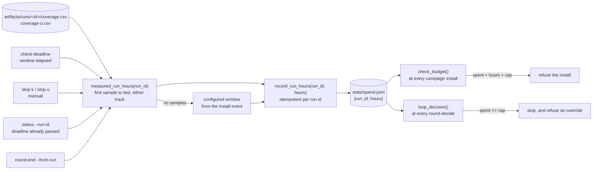

`loop.max_total_run_hours` is the ceiling an unattended loop spends against.
The figure checked against it is derived from the coverage samples a campaign
left on disk.

## Measurement

A campaign's hours are the wall-clock span from its first coverage sample to
its last, across either track.

```
hours = (max(ts) - min(ts)) / 3600
```

| Case | Billed figure | Reported as |
|---|---|---|
| The run left usable coverage samples | The span above | The measured figure |
| The run left no usable samples, and `campaign_ctl.py` is billing | The configured window, from the install event | `configured window (no usable coverage samples)` |
| The run left no usable samples, and `round-end` is billing | Nothing. `round-end` declines, so the `campaign_ctl.py` fallback stands | A warning naming the run |

A run that died after three hours does not bill the configured twenty-four:

```
billed 24.00 run-hours for run r2-1 (configured window (no usable coverage samples); campaign window elapsed)
```

A run with no samples at all bills nothing, and the tool reports that case
explicitly:

```  WARNING: run(s) r2-2 had no usable coverage samples and billed 0.0 h. Check the sampler, because unmeasured spend must not pass silently
```

## The write path



## Billing points

| Path | Bills when |
|---|---|
| `campaign_ctl.py` | A deadline stop, a manual stop, or `status` finding a campaign already finished |
| `pipeline_ctl.py round-end` | The round closes |

`record_run_hours()` is idempotent per run id: re-recording a run overwrites
its entry, so a retried `round-end` never double-counts a campaign. Both paths
derive the figure from the span of the run's coverage samples, so the two
cannot disagree.

Billing at both points covers the case where a round never closes, because a
phase blocked, the breaker tripped, or an operator stopped the campaign by
hand. With billing deferred to `round-end` alone, such a round's hours stay off
the ledger and the cap under-counts by a whole campaign.

## Round accumulation

A round routinely spans several campaigns, and `round-end` is called once per
run, so `round.run_hours` accumulates across calls.

| Field | Content |
|---|---|
| `round.run_hours` | The round's total, accumulated |
| `round.run_hours_by_run` | The per-run mapping `{run_id: hours}` the total came from |

Re-billing a run id corrects its entry, and adjusts the round total by the
delta.

```
python3 tools/pipeline_ctl.py round-end --from-run r2-1 --from-run r2-2
```

Each run is measured and billed independently. A campaign left off the command
is never billed.

## Hours entered by hand

`--run-hours` belongs to no single run, so it bills under the round's own
ledger key, `round-<n>`. Without a ledger key it raises the round total while
the budget keeps reading the ledger and never sees it.

The recorded figure is the round's current unattributed total, which keeps a
repeated `round-end` idempotent.

Derived per-run hours are preferred. The ledger total is the figure the cap is
measured against, and entering hours by hand puts a transcription step in front
of a budget.

## Ledger scope

| Path | Follows `GSPWN_STATE` | Reason |
|---|---|---|
| `state/pipeline.json` | Yes | A side run keeps its own crash registry and phase records |
| `state/spend.json` | No | A run with a fresh registry must not also get a fresh budget |
| The ledger's seed fallback | No. It reads the default state file | Reading the redirected file lets a run with a fresh `GSPWN_STATE` seed the machine-global ledger from its own empty registry, dropping every hour recorded before it |

`GSPWN_SPEND` overrides the ledger path directly, and the tests use it.

## Failing closed

`spent_hours()` raises `SpendLedgerMissing` when the ledger file is absent
while the state file still records billed hours:

```
error: spend ledger state/spend.json is missing, but the state file records 47.2 billed run-hours. Refusing to treat the budget as unspent. Re-seed it from the state file with: python3 tools/pipeline_ctl.py spend-init
```

| Condition | Behaviour |
|---|---|
| Ledger present | Return its total |
| Ledger absent, no hours recorded in the state file | Return 0.0 and start normally |
| Ledger absent, hours recorded in the state file | Raise `SpendLedgerMissing` |

Every command that reads spend raises through this path. A fallback to zero
hands the loop a fresh budget with no indication that hours were already spent.
The exception carries its own remediation, and callers surface it. No caller
substitutes a spend figure of its own.

## Re-seeding

```
python3 tools/pipeline_ctl.py spend-init
```

`seed_spend_ledger()` rebuilds the ledger from what the state file already
recorded.

| Source in the state file | Ledger key |
|---|---|
| `round.run_hours_by_run` | The run id it names |
| A round aggregate attributable to one run | That run id |
| A round aggregate spanning several runs with no split | `round-<n>` |

It never lowers recorded spend, and it is a no-op when a ledger already exists,
so it cannot be used to clear the budget. The same seeding runs automatically
before the first ledger write, so spend billed before the ledger existed still
counts.

## Cap enforcement

### At campaign install

`check_budget()` runs on `install-k` and `install-u`:

```
refusing to start: 200.0 h already spent + 24.0 h for this campaign exceeds loop.max_total_run_hours (216). Raise the cap in config/campaign.yaml to allow it.
```

`round-decide` enforces the cap between rounds, and a campaign started directly
by the `fuzz` phase never passes through it. Without the install check the cap
is overshot by an arbitrary number of extra runs. Exact equality is admitted,
matching the enforcement point in `round-decide`.

### At the round decision

`hard_cap_reason()` runs before the coverage verdict is consulted. An exhausted
budget stops the loop on its own, and takes precedence while coverage is still
growing.

```
error: computed decision is stop (run-hour budget spent (216.0 of 216.0 h)). A budget or round-cap stop cannot be overridden
```

| Stop reason | Overridable with `--decision continue --reason` |
|---|---|
| The command surface is complete | No |
| `loop.max_rounds` reached | No |
| `loop.max_total_run_hours` spent | No |
| Coverage `plateaued` | Yes |
| Coverage `unknown` | Yes |

## Concurrency

| Lock | Protects | Held for |
|---|---|---|
| `state/.pipeline.lock` | `state/pipeline.json` | The whole load-mutate-save cycle |
| `state/spend.json.lock` | `state/spend.json` | The whole read-modify-write |

The two are separate, so billing a run is safe while a state transaction is
open. One lock covering both deadlocks the moment `round-end` bills inside its
own transaction.

After a root write, the ledger and its lock are handed back to `$SUDO_USER`.
`campaign_ctl.py start` and `stop` run as root, and every later non-root
command would otherwise fail with a permission error. See
[Durability](/gspwn/architecture/durability/).

## Costs outside the caps

The three stopping rules bound the search. They do not bound the bill. The
repository has no view of what an instance costs and does not estimate one.
Watch real money in the provider's console.

Token cost is bounded separately, by the orchestrator's circuit breaker and by
`orchestrator.max_agent_hours`. Neither of those is a currency figure.

## See also

- [Budget and spend](/gspwn/guides/budget-and-spend/)
- [Durability](/gspwn/architecture/durability/)
- [Cloud deployment](/gspwn/architecture/cloud-deployment/)
