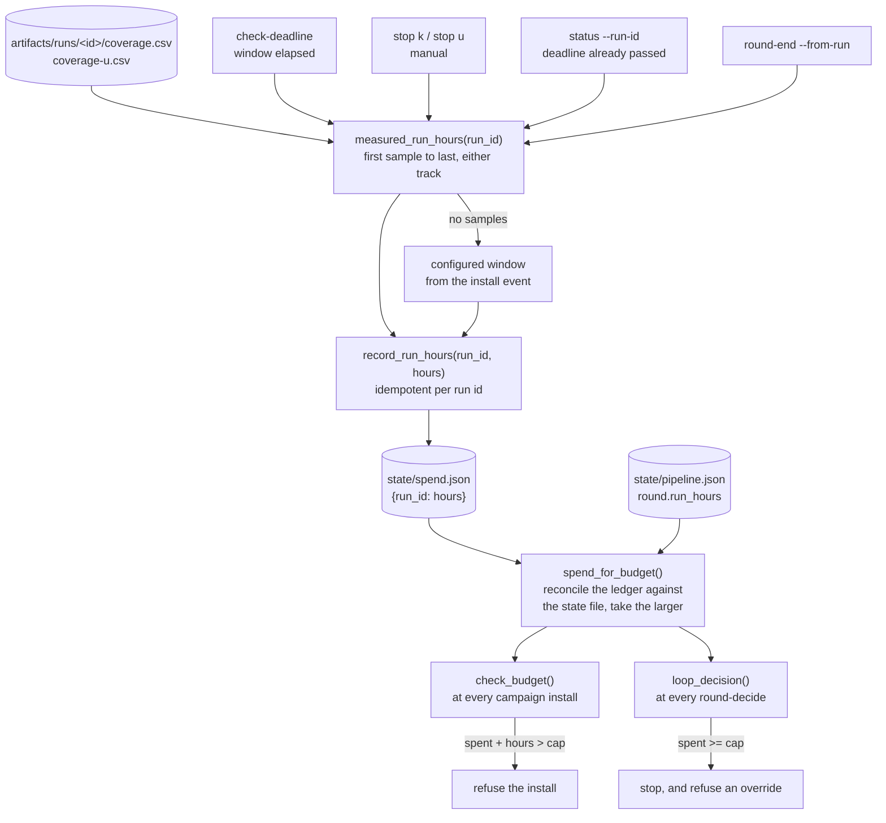

`loop.max_total_run_hours` is the ceiling an unattended loop spends against,
5000 hours as shipped. The figure checked against it is derived from the
coverage samples a campaign left on disk.

## Measurement

A campaign's hours are the wall-clock span from its first coverage sample to
its last, across either track.

```
hours = (max(ts) - min(ts)) / 3600
```

The billed figure depends on whether the run left more than one usable sample,
and on which tool bills it.

| Case | Billed figure | Reported as |
|---|---|---|
| The run left more than one usable coverage sample | The span above | The measured figure |
| The run left one usable sample or none, and `campaign_ctl.py` is billing | The configured window, from the install event | `configured window (no usable coverage samples)` |
| The run left one usable sample or none, and `round-end` is billing | Nothing. `round-end` declines, so the `campaign_ctl.py` fallback stands | A warning naming the run |
| The run left no samples and no install event recorded its window | Nothing | `no coverage samples and no recorded window` |

A run installed for the default 1000-hour window that died after three hours
bills three hours, because its samples span three hours. The configured
thousand is billed only when the sampler left nothing to measure:

```
billed 1000.00 run-hours for run r2-1 (configured window (no usable coverage samples); campaign window elapsed)
```

A run with no samples at all bills nothing at `round-end`, and the tool reports
that case explicitly:

```
  WARNING: run(s) r2-2 had no usable coverage samples and billed 0.0 h. Check the sampler, because unmeasured spend must not pass silently
```

## The write path



## Billing points

Two paths bill run-hours.

- `campaign_ctl.py` bills on a deadline stop (`check-deadline`), on a manual
  stop (`stop k`, `stop u`), and when `status --run-id` finds a campaign whose
  deadline has already passed.
- `pipeline_ctl.py round-end` bills every run named by `--from-run` when the
  round closes.

`record_run_hours()` is idempotent per run id: re-recording a run overwrites
its entry, so a retried `round-end` never double-counts a campaign. Both paths
derive the figure from the span of the run's coverage samples, so the two
agree on every run that left samples.

Billing at both points covers the case where a round never closes, because a
phase blocked, the breaker tripped, or an operator stopped the campaign by
hand. With billing deferred to `round-end` alone, such a round's hours stay off
the ledger and the cap under-counts by a whole campaign.

## Round accumulation

A round routinely spans several campaigns, and `round-end` is called once per
run, so `round.run_hours` accumulates across calls.

- `round.run_hours` holds the round's accumulated total.
- `round.run_hours_by_run` holds the per-run mapping `{run_id: hours}` that
  total came from.

Re-billing a run id corrects its entry, and adjusts the round total by the
delta.

Each run named by a `--from-run` at a round's close is measured and billed
independently. A campaign left off that list is billed only by
`campaign_ctl.py`, and by nothing at all when neither path ran.

## Hours entered by hand

`round-end --run-hours` belongs to no single run, so it bills under the round's
own ledger key, `round-<n>`. Without a ledger key it raises the round total
while the budget keeps reading the ledger and never sees it.

The recorded figure is the round's current unattributed total, the round total
less the sum of `round.run_hours_by_run`, which keeps a repeated `round-end`
idempotent.

Derived per-run hours are preferred. The ledger total is the figure the cap is
measured against, and entering hours by hand puts a transcription step in front
of a budget.

## Ledger scope

`GSPWN_STATE` redirects the state directory, and two of the three paths ignore
it.

| Path | Follows `GSPWN_STATE` | Reason |
|---|---|---|
| `state/pipeline.json` | Yes | A side run keeps its own crash registry and phase records |
| `state/spend.json` | No | A run with a fresh registry must not also get a fresh budget |
| The ledger's seed fallback | No. It reads the default state file | Reading the redirected file lets a run with a fresh `GSPWN_STATE` seed the machine-global ledger from its own empty registry, dropping every hour recorded before it |

`GSPWN_SPEND` overrides the ledger path directly, and `tools/selftest.py` uses
it to point the ledger at a temporary directory.

## Refusal when the ledger is absent

`spent_hours()` raises `SpendLedgerMissing` when the ledger file is absent
while the state file still records billed hours:

```
error: spend ledger state/spend.json is missing, but the state file records 47.2 billed run-hours. Refusing to treat the budget as unspent. Re-seed it from the state file with: python3 tools/pipeline_ctl.py spend-init
```

| Condition | Behaviour |
|---|---|
| Ledger present | Return its total |
| Ledger absent, no hours recorded in the state file | Return 0.0 and start normally |
| Ledger absent, hours recorded in the state file | Raise `SpendLedgerMissing` |

Every command that reads spend raises through this path, and each caller
surfaces the exception text to the operator. A fallback to zero hands the loop
a fresh budget with no indication that hours were already spent.

## Reconciliation

The campaign-start guard reads both records and takes the larger. A ledger can
exist and still have missed writes. A billing call that fails on permissions
warns and returns, and in an unattended loop nothing reads that warning.
Closing a round has the same failure by another route, because `end_round()`
saves the round's hours first and the ledger write follows, so a write that
raises leaves the hours on record and out of the ledger. Either way the ledger
falls below what the state file recorded, the cap reads headroom that was
already spent, and the loop keeps admitting campaigns.

- A ledger at or above the state file is the ordinary case, and the guard uses
  the ledger. The ledger is machine-global and the state file covers one
  pipeline, so the ledger standing higher says nothing.
- A ledger below the state file means writes were lost, because every billed run
  should have reached the ledger. The guard uses the state file and warns,
  naming the gap.

```
WARNING: spend ledger state/spend.json holds 3200.0 run-hours while the state file records 4100.0. 900.0 h of spend never reached the ledger, most likely a write that failed on permissions. Using the larger figure so the cap counts what actually ran. Fix the ledger's ownership and re-run: python3 tools/pipeline_ctl.py spend-init
```

## Re-seeding

`seed_spend_ledger()` rebuilds the ledger from what the state file already
recorded.

| Source in the state file | Ledger key |
|---|---|
| `round.run_hours_by_run` | The run id it names |
| A round aggregate attributable to one run, the round listing one run id | That run id |
| A round aggregate spanning several run ids with no split | `round-<n>` |

It never lowers recorded spend, and it is a no-op when a ledger already exists,
so it cannot be used to clear the budget. The same seeding runs automatically
before the first ledger write, so spend billed before the ledger existed still
counts.

## Cap enforcement

### At campaign install

`check_budget()` runs on `install-k` and `install-u`:

```
refusing to start: 4500.0 h already spent + 1000.0 h for this campaign exceeds loop.max_total_run_hours (5000). Raise the cap in config/campaign.yaml to allow it.
```

`round-decide` enforces the cap between rounds, and a campaign started directly
by the `fuzz` phase never passes through it. Without the install check the cap
is overshot by an arbitrary number of extra runs. Exact equality is admitted,
matching the enforcement point in `round-decide`.

### At the round decision

`hard_cap_reason()` runs before the coverage verdict is consulted. It returns
the completion stop first, then the round cap, then the budget, so a campaign
finishing on its last permitted round records why it finished. An exhausted
budget stops the loop on its own, and takes precedence while coverage is still
growing.

```
error: computed decision is stop (run-hour budget spent (5000.0 of 5000.0 h)). A completion, budget or round-cap stop cannot be overridden
```

`loop_decision()` reaches five stop conditions. Only the two coverage verdicts
are overridable, and each override needs `--reason`.

| Stop reason | Overridable with `--decision continue --reason` |
|---|---|
| The command surface is complete | No |
| `loop.max_rounds` reached, 10 as shipped | No |
| `loop.max_total_run_hours` spent | No |
| Coverage `plateaued`, while `loop.stop_on_plateau` is true | Yes |
| Coverage `unknown` | Yes |

## Concurrency

Two lock files cover the two mutable stores.

| Lock | Protects | Held for |
|---|---|---|
| `state/.pipeline.lock` | `state/pipeline.json` | The whole load-mutate-save cycle |
| `state/spend.json.lock` | `state/spend.json` | The whole read-modify-write |

The two are separate, so billing a run is safe while a state transaction is
open.

After a root write, the ledger and its lock are chowned back to `$SUDO_USER`.
`campaign_ctl.py start` and `stop` run as root, and every later non-root
command would otherwise fail with a permission error. See
[Durability](/gspwn/architecture/durability/).

## Costs outside the caps

Three caps in `config/campaign.yaml` bound the search: `loop.campaign_hours`
at 1000 hours per campaign, `loop.max_total_run_hours` at 5000 hours across
every campaign, and `loop.max_rounds` at 10 rounds. All three count machine
time. The repository has no view of what an instance costs and does not
estimate one. Watch real money in the provider's console.

Token cost is bounded separately, by the orchestrator's circuit breaker
(`orchestrator.max_same_boot_starts` at 5 and `orchestrator.max_reboots` at 10
within `orchestrator.window_min`, 60 minutes) and by
`orchestrator.max_agent_hours`, a wall-clock ceiling on one agent launch that
ships at 24 hours, with `loop.campaign_hours` added for the `fuzz` launch alone.
None of those is a currency figure.

## See also

- [Budget and spend](/gspwn/guides/budget-and-spend/)
- [Durability](/gspwn/architecture/durability/)
- [Cloud deployment](/gspwn/architecture/cloud-deployment/)
