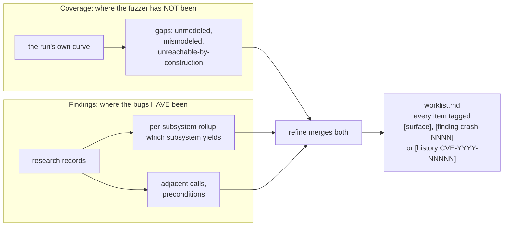
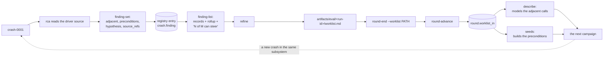

Twelve sub-agent definitions live in `agents/`, one per phase. Each file is a
contract stating what the sub-agent reads, what it does, what it writes, what
gate evidence it returns, and what it records in `knowledge/`.

| Sub-agent | Runs | Track | Produces |
|---|---|---|---|
| `provision` | Once per machine | Both | A prepared machine, its recorded facts, the build manifest |
| `build` | Once per machine | K | An instrumented kernel and NVIDIA modules |
| `describe` | Once per round | K | syzlang descriptions |
| `seeds` | Once per round | K | Seed programs from traces and from allocation chains |
| `harness` | Once per round | U | libFuzzer and AFL++ harnesses |
| `fuzz` | Once per round | Both | A completed campaign |
| `triage` | Once per round | Both | A deduplicated crash registry |
| `rca` | Once per round | Both | RCA prose, research records, impact records |
| `poc` | Once per round | Both | Verified reproducers with reproduction rates |
| `eval` | Once per round | Both | The round's measurements |
| `refine` | Once per round | Both | The gap analysis and the next round's work list |
| `report` | Once, after the loop stops | Both | The report and the disclosure packages |

## The dispatch contract

| Direction | Content |
|---|---|
| Into the sub-agent | The full contents of `agents/<phase>.md`, `config/machine.yaml`, `config/campaign.yaml`, and the paths of the artifacts the phase reads |
| Out of the sub-agent | A one-paragraph summary, plus gate evidence naming artifact paths |
| Never crosses | Another sub-agent's transcript |

Sub-agents hand off artifact paths. Two properties follow from that boundary.

### Gate evidence as a claim about files

The orchestrator reads the named artifacts and checks that they exist and state
what the sub-agent reported, before recording `done`. A phase whose evidence
cannot be confirmed is recorded `blocked`. See
[Execution model](/gspwn/architecture/execution-model/).

The `fuzz` phase carries the largest cost of an unconfirmed claim. Advancing on
the smoke window makes `triage` scan a nearly empty workdir, satisfies every
later gate, and bills a full campaign for `track_k.smoke_window_minutes` of
measurement.

### Cross-phase state on disk

The work list is recorded in `state/pipeline.json`, so the next sub-agent reads
the previous run id from the state file. No two sub-agent contracts have to
agree on a filename convention.

## Prohibitions

| Prohibited action | Reason |
|---|---|
| Hand-editing `state/pipeline.json` | The tool validates, locks and writes atomically. Parallel sub-agents editing the file directly lose each other's updates |
| Typing in a measured number | `round.run_hours` feeds the spend ceiling, and the sampler already wrote every figure to `coverage.csv` |
| Removing a target because a hypothesis places the bug elsewhere | `rca` holds the only judgement in the loop, so a confident wrong one narrows every remaining round |
| Working past a `blocked` phase | A blocked gate halts the walk |
| Widening scope because an ioctl surface looked reachable | Scope is a threat-model decision, recorded in [Threat model](/gspwn/architecture/threat-model/) first |
| Claiming tenant reachability from the fuzzer's own environment | syzkaller holds a wider capability set than the modelled attacker |
| Recording a finding in `knowledge/` | Those files are committed to a public repository |

## The two steering signals

| Signal | Produced by | Answers | Consumed by |
|---|---|---|---|
| Coverage | `coverage_ctl.py series` and `plateau`, `surface_cov.py gaps` | Where the fuzzer has not been | `refine`, into `gaps.md` |
| Findings | `pipeline_ctl.py finding-list` | Where the bugs have been | `refine`, into `worklist.md` |
| History | `surface/worklist-round1.md` | Where the vendor has fixed bugs before | The round-1 `describe` and `seeds` phases |

A loop following coverage alone keeps widening the surface and never returns to
a subsystem that already yielded a bug. Every work-list item carries a
`[surface]`, `[finding crash-NNNN]` or `[history CVE-YYYY-NNNNN]` tag naming
which signal produced it, and the `refine` gate reports the split. The tags are
specified in
[Historical targeting](/gspwn/architecture/historical-targeting/).

## The feedback edge

Each hop carries a check, because each can fail without producing an error.

| Hop | Failure | Check | Reported by |
|---|---|---|---|
| `rca` records the finding | No research record written | An `rca_done_at` stamp with no research record | `pipeline_ctl.py validate` |
| The record steers | An empty `adjacent`, or one repeating `ioctls` | The offending field named per crash | `finding-list`, `validate` |
| `refine` consumes the records | Work items derived from coverage only | The gate reports the split of items by source | The `refine` sub-agent |
| The work list is recorded | `--worklist` omitted from `round-end` | `round-advance` carries only what was recorded | `pipeline_ctl.py` |
| `describe` consumes the items | An item modelled in name only | The gate reports, per item, what was modelled and whether the smoke run reached it | The `describe` sub-agent |

The `rca_done_at` stamp is durable, and `rca_done` is a transient status the
`poc` phase writes the reproduction class over. See
[Crash identity](/gspwn/architecture/crash-identity/).

## The three targeting fields

`rca` fills `ioctls`, `preconditions` and `adjacent` through
`pipeline_ctl.py finding-set`. `FINDING_TARGETING` in
`tools/pipeline_state.py` holds the set.

| Field | Derived from | Use in the next round |
|---|---|---|
| `ioctls` | Transcribed from the reproducer | Models the calls that already ran |
| `preconditions` | Largely the same source | Builds the state that already existed |
| `adjacent` | Reading the driver source for the faulting object's other callers | Reaches code this reproducer never touched |

Only `adjacent` carries information the crash does not already contain. It is
populated by taking the object the bug touches, locating its other callers, and
listing the ones this reproducer never reached.

An empty `adjacent` is accepted only alongside a `no_adjacent_reason`. A bug
with no siblings on its lock or teardown path is a valid answer, as is a path
that disappears into GSP where the other callers are not visible. A
neighbouring call invented to fill the field costs the next round a full
describe-and-fuzz cycle against a target that was never adjacent to the bug.

## Method rules the contracts carry

A gate says what a phase must show. Six of the contracts also carry a rule
about how the work is done, and each exists because the cheap way to satisfy
the gate produces a wrong number.

| Phase | Rule | Failure it prevents |
|---|---|---|
| `describe` | Descriptions are agent-authored and treated as untrusted until measured. Every number and struct layout comes from the driver source | The ABI shifts between branches, and a wrong direction bit produces descriptions that compile, run and never reach the driver |
| `seeds` | A precondition no available CUDA workload reaches is reported as unreached. A control command reaches a program through the allocation chains and never through a trace | `strace` decodes no NVIDIA parameter struct, so a trace names the escape and never the command behind it |
| `harness` | Sanitizer settings are explicit per harness. Leak detection is a stated choice, and UBSan runs with `halt_on_error=1` | Without it the process continues past the first error and the crashing input no longer matches the report |
| `fuzz` | The smoke window is an early abort check. The gate requires the full campaign window | Advancing on the smoke window bills a full campaign for half an hour of measurement |
| `rca` | Every claim about code behaviour not verified against source is marked `[UNVERIFIED]`, and `eval` samples from exactly that set. `rca` records what the fault is worth, and `poc` establishes who can reach it | An unmarked guess about a fault path reaches a vendor as an asserted mechanism |
| `report` | Detailed vulnerability sections only, no executive summary. A severity is argued as an explicit chain. A finding whose impact record cannot carry a severity is reported with its mechanism and no severity claim | A severity invented at report time rests on less evidence than the analysis phase had |

`eval` carries two more. Version persistence replays every reliable reproducer
against one newer driver branch, and its outcome is required: a recorded
`skipped` with a reason satisfies the gate, and an absent answer fails it. The
impact audit re-reads the evidence behind every record claiming
`privilege-escalation` or `container-escape`, the two claims a vendor
challenges first.

## Knowledge

Every sub-agent reads the accumulated knowledge for its phase before starting,
and records what it learns as it learns it.

| File | Subject | Example entry |
|---|---|---|
| `knowledge/learnings.md` | The target | "UVM has its own ioctl numbering scheme and does not follow the RM escape convention" |
| `knowledge/mistakes.md` | The process | "A flat coverage curve was reported as a plateau on a card that had stopped answering" |

These files are committed and outlive the box, the campaign and the session.
They are the only content a rebuilt machine starts with. Entries are appended
through `knowledge_ctl.py`, which holds a per-file lock, at the point the fact
is learned. An entry written at the end of a round from memory has already lost
the detail that mattered.

The repository is public, so entries carry ABI and process facts.
`knowledge_ctl.py note` refuses text naming a crash id or a path under
`artifacts/crashes`, `artifacts/pocs` or `artifacts/rca`.

## See also

- [Steering the next round](/gspwn/guides/steering-the-next-round/)
- [Execution model](/gspwn/architecture/execution-model/)
- [Impact and severity](/gspwn/architecture/impact-and-severity/)
