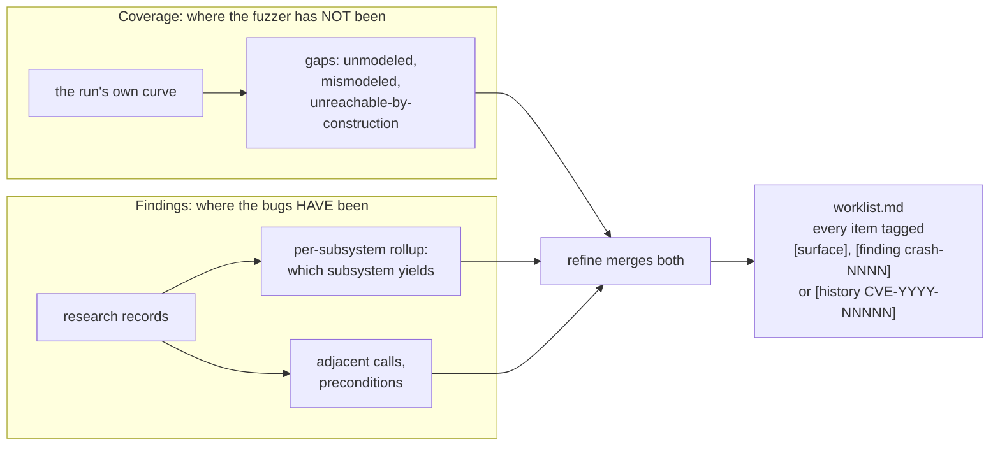
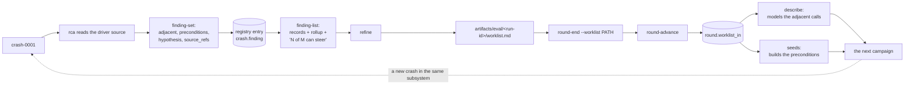

Twelve sub-agent definitions live in `agents/`, one per phase. Each file is a
contract stating what the sub-agent reads, what it does, what it writes, what
gate evidence it returns, and what it records in `knowledge/`.

Per-phase detail is in
[Sub-agents reference](/gspwn/reference/sub-agents/). This page specifies the
dispatch boundary and the two signals a sub-agent produces for the next round.

## The dispatch contract

| Direction | Content |
|---|---|
| Into the sub-agent | The full contents of `agents/<phase>.md`, `config/machine.yaml`, `config/campaign.yaml`, and the paths of the artifacts the phase reads |
| Out of the sub-agent | A one-paragraph summary, plus gate evidence naming artifact paths |
| Never crosses | Another sub-agent's transcript |

Sub-agents hand off artifact paths. Two properties follow from that boundary.

### Gate evidence as a claim about files

The orchestrator reads the named artifacts and checks that they exist and state
what the sub-agent reported, before recording `done`. A phase whose evidence
cannot be confirmed is recorded `blocked`.

A phase marked `done` on an unconfirmed claim leaves every later gate satisfied
by having nothing to inspect, and the condition stays invisible until
`round-end` measures the round. The `fuzz` phase carries the largest cost:
advancing on the smoke window makes `triage` scan a nearly empty workdir,
satisfies every later gate, and bills a full campaign for
`track_k.smoke_window_minutes` of measurement.

### Cross-phase state on disk

The work list is recorded in `state/pipeline.json`, so the next sub-agent reads
the previous run id from the state file. No two sub-agent contracts have to
agree on a filename convention.

## Prohibitions

| Prohibited action | Reason |
|---|---|
| Hand-editing `state/pipeline.json` | The tool validates, locks and writes atomically. Parallel sub-agents editing the file directly lose each other's updates |
| Typing in a measured number | `round.run_hours` feeds the spend ceiling, and the sampler already wrote every figure to `coverage.csv` |
| Removing a target because a hypothesis places the bug elsewhere | `rca` holds the only judgement in the loop, so a confident wrong one narrows every remaining round |
| Working past a `blocked` phase | A blocked gate halts the walk |
| Widening scope because an ioctl surface looked reachable | Scope is a threat-model decision, recorded in [Threat model](/gspwn/architecture/threat-model/) first |
| Claiming tenant reachability from the fuzzer's own environment | syzkaller holds a wider capability set than the modelled attacker |
| Recording a finding in `knowledge/` | Those files are committed to a public repository |

## Parallelism

`describe`, `seeds` and `harness` may run concurrently after `build`.
`PARALLEL_AFTER_BUILD` in `tools/pipeline_state.py` exempts the trio from the
phase-ordering integrity check.

In round 1, `seeds` consumes the `NV_*` header that `describe` produces. From
round 2 the header and `tools/ioctl_map.json` already exist, and the trio is
independent.

Background sub-agents are allowed for `fuzz`, a long-running monitor, and for
the parallel trio. A timed-out sub-agent is resumed, and its work is not
restarted from the beginning.

## The two steering signals

| Signal | Produced by | Answers | Consumed by |
|---|---|---|---|
| Coverage | `coverage_ctl.py series` and `plateau`, `surface_cov.py gaps` | Where the fuzzer has not been | `refine`, into `gaps.md` |
| Findings | `pipeline_ctl.py finding-list` | Where the bugs have been | `refine`, into `worklist.md` |
| History | `surface/worklist-round1.md` | Where the vendor has fixed bugs before | The round-1 `describe` and `seeds` phases |

The three are not interchangeable. A loop following coverage alone keeps
widening the surface and never returns to a subsystem that already yielded a
bug. Every work-list item carries a `[surface]`, `[finding crash-NNNN]` or
`[history CVE-YYYY-NNNNN]` tag naming which signal produced it, and the
`refine` gate reports the split.

`[surface]` absorbed the older `[coverage]` tag. `surface_cov.py gaps` names
the exact enumerated command a corpus has not reached, where an edge count only
gestures at a region.

## The feedback edge

Each hop carries a check, because each can fail without producing an error.

| Hop | Failure | Check | Reported by |
|---|---|---|---|
| `rca` records the finding | No research record written | An `rca_done_at` stamp with no research record | `pipeline_ctl.py validate` |
| The record steers | An empty `adjacent`, or one repeating `ioctls` | The offending field named per crash | `finding-list`, `validate` |
| `refine` consumes the records | Work items derived from coverage only | The gate reports the split of items by source | The `refine` sub-agent |
| The work list is recorded | `--worklist` omitted from `round-end` | `round-advance` carries only what was recorded | `pipeline_ctl.py` |
| `describe` consumes the items | An item modelled in name only | The gate reports, per item, what was modelled and whether the smoke run reached it | The `describe` sub-agent |

The `rca_done_at` stamp is durable. `rca_done` is a transient status: the `poc`
phase writes the reproduction class over it, so a check keyed on the current
status stops seeing an unanalysed crash exactly when the pipeline reaches the
phase that should notice it.

## The three targeting fields

`rca` fills `ioctls`, `preconditions` and `adjacent` through
`pipeline_ctl.py finding-set`. `FINDING_TARGETING` in
`tools/pipeline_state.py` holds the set.

| Field | Derived from | Use in the next round |
|---|---|---|
| `ioctls` | Transcribed from the reproducer | Models the calls that already ran |
| `preconditions` | Largely the same source | Builds the state that already existed |
| `adjacent` | Reading the driver source for the faulting object's other callers | Reaches code this reproducer never touched |

Only `adjacent` carries information the crash does not already contain. It is
populated by taking the object the bug touches, locating its other callers, and
listing the ones this reproducer never reached.

An empty `adjacent` is accepted only alongside a `no_adjacent_reason`. A bug
with no siblings on its lock or teardown path is a valid answer, as is a path
that disappears into GSP where the other callers are not visible. A
neighbouring call invented to fill the field costs the next round a full
describe-and-fuzz cycle against a target that was never adjacent to the bug.

## Knowledge

Every sub-agent runs `knowledge_ctl.py show --phase 
` before starting, and
records what it learns as it learns it.

| File | Subject | Example entry |
|---|---|---|
| `knowledge/learnings.md` | The target | "UVM has its own ioctl numbering scheme and does not follow the RM escape convention" |
| `knowledge/mistakes.md` | The process | "A flat coverage curve was reported as a plateau on a card that had stopped answering" |

These files are committed and outlive the box, the campaign and the session.
They are the only content a rebuilt machine starts with. Entries are appended
through `knowledge_ctl.py`, which holds a per-file lock, at the point the fact
is learned. An entry written at the end of a round from memory has already lost
the detail that mattered.

The repository is public, so entries carry ABI and process facts.
`knowledge_ctl.py note` refuses text naming a crash id or a path under
`artifacts/crashes`, `artifacts/pocs` or `artifacts/rca`.

## Enforcement points

| Property | Enforced by |
|---|---|
| A phase advances only on confirmed evidence | The orchestrator's step 4, against the files the gate names |
| Parallel sub-agents do not lose each other's writes | An exclusive `flock` held across every state transaction |
| A finding reaches the next round | `finding-set`, `round-end --worklist`, `round-advance` |
| A record that steers nothing is named | `finding-list` and `pipeline_ctl.py validate` |
| No finding is published to the public repository | `knowledge_ctl.py note` |

## See also

- [Steering the next round](/gspwn/guides/steering-the-next-round/)
- [Sub-agents reference](/gspwn/reference/sub-agents/)
- [Impact and severity](/gspwn/architecture/impact-and-severity/)
