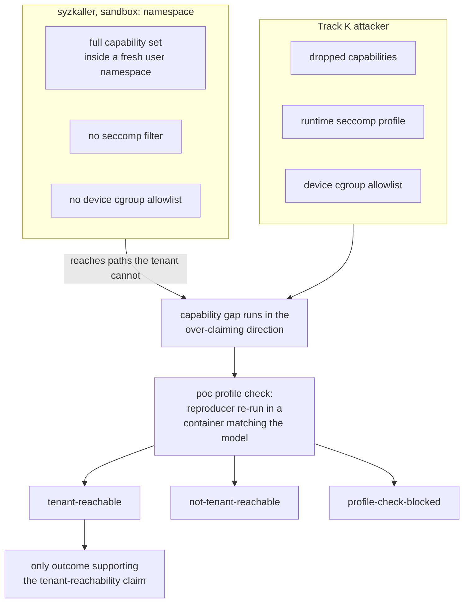

The campaign models one attacker per track.

## Attacker definitions

| Property | Track K | Track U |
|---|---|---|
| Position | Process inside a GPU container, on a host the attacker does not control | Supplier of the container image and its runtime configuration |
| Under attacker control | The syscalls issued from inside the container | The container image, the OCI configuration, the CDI spec, environment variables |
| Privilege of the code under test | Non-root, after confinement | Root, during container init, before isolation is enforced |
| Confinement in force | Linux capabilities dropped to the container runtime's default set, the runtime's seccomp profile, the device cgroup allowlist | None at the time the code runs |
| Capability request | `NVIDIA_DRIVER_CAPABILITIES=compute,utility`, which CUDA images request | Not applicable |
| Device nodes received | `/dev/nvidiactl`, `/dev/nvidiaX`, `/dev/nvidia-uvm`, `/dev/nvidia-uvm-tools` | Not applicable |
| Device nodes withheld | `/dev/nvidia-modeset`, `/dev/dri/*` | Not applicable |
| Primary target | The NVIDIA GPU kernel driver ioctl surface | `libnvidia-container`, written in C. The memory-safety surface |
| Secondary target | None | `nvidia-container-toolkit`, written in Go. Panic and denial-of-service surface only |
| Trust boundary crossed | Container to host kernel | Untrusted image input to a host root process |
| Objective | Host kernel compromise from inside the container | Host compromise before the container is confined |

`NVIDIA_DRIVER_CAPABILITIES` gates which device nodes a container receives. The
`graphics` and `display` values yield `/dev/dri` and the `nvidia-drm` nodes, and
a default tenant requests neither. An ioctl surface reachable only through those
nodes lies outside the Track K attacker's reach, and a crash found there cannot
be claimed under the model.

Go is memory-safe. A finding against `nvidia-container-toolkit` supports a
denial-of-service claim and no memory-corruption claim. The `harness` sub-agent
prompt forbids one.

## Scope exclusions

| Excluded | Reason |
|---|---|
| `nvidia-modeset` and `/dev/dri/*` | A default tenant never receives those nodes |
| Symlink TOCTOU and mount-escape logic bugs on Track U | Fuzzing finds them poorly. Recorded in the report as future work |
| Memory-corruption claims against the Go toolkit | Go is memory-safe |
| GSP firmware | Not instrumented. KCOV cannot see it, and no coverage number says anything about it |
| The cloud provider boundary | See [Blast radius](/gspwn/architecture/threat-model/#blast-radius) |

This page is where scope widens. A phase does not add a surface because its
ioctls looked reachable; the entry above changes first.

## Capability asymmetry

syzkaller runs under `sandbox: namespace`, which holds a full capability set
inside a fresh user namespace. The Track K attacker holds dropped capabilities,
a seccomp filter and a device cgroup allowlist. syzkaller therefore reaches
paths the attacker cannot, and every difference runs in the direction that
produces over-claims.



## Reachability profile check

The `poc` phase re-runs every Track K crash classified reliable or flaky inside
a container matching the model, as a non-root user, with the default capability
set:

```
docker run --rm --gpus all \
  -e NVIDIA_DRIVER_CAPABILITIES=compute,utility \
  --user 1000:1000 \
  -v $PWD/artifacts/pocs/crash-0001:/poc:ro \
  <cuda-runtime-image> /poc/repro
```

1. Confirm what that container received. Run `ls /dev/nvidia*` inside it. If
   `/dev/dri` is present, the capability set is wider than the model and the run
   does not establish tenant reachability.
2. Record one of the three outcomes below in the PoC README.

| Outcome | Condition | Permitted report statement |
|---|---|---|
| `tenant-reachable` | The reproducer fires in that container | The finding is reachable by an unprivileged tenant |
| `not-tenant-reachable` | The reproducer needs privilege the Track K attacker does not hold | The finding is reported in full, and its impact statement names the privilege required |
| `profile-check-blocked` | No suitable image, no Docker, or the reproducer needs a kernel-side harness | The finding is unverified for reachability, and is never reported as tenant-reachable |

## Blast radius

The campaign supports one claim: **an unprivileged container tenant reaching
host kernel compromise on a GPU container platform.**

The claim stops at the cloud provider boundary. Fuzzing an instance the operator
rents crosses no boundary the provider maintains:

- A guest kernel panic reboots that guest.
- The hypervisor is unaffected.
- The IOMMU fences GPU DMA to the same guest.

Nothing observed on that instance is evidence about other tenants or about
provider infrastructure. A claim about either exceeds what the campaign
measures.

## GSP coverage blind spot

Turing and later cards run a large part of the Resource Manager on the GSP
microcontroller. That code is not instrumented:

- No coverage number describes it.
- A plateau verdict says nothing about it.
- A fault whose path enters GSP RPC cannot be followed further from the kernel
  side. Its impact record is `undetermined`, with an `undetermined_reason`
  naming GSP.

Every artifact that reports coverage carries this statement. `series` and
`plateau` print it on every invocation.

## Enforcement points

| Constraint | Enforced by |
|---|---|
| Excluded device nodes are not modelled | The `describe` sub-agent |
| A seed referencing an excluded node is refused | `trace2seed.py` |
| Reachability is established by experiment | The `poc` phase profile check |
| A finding is called tenant-reachable only on a `tenant-reachable` outcome | The `report` sub-agent |
| Provider-boundary claims are refused | The `report` sub-agent |

## See also

- [Scope and oracle](/gspwn/architecture/scope-and-oracle/): what the pipeline
  detects and what it cannot.
- [Impact and severity](/gspwn/architecture/impact-and-severity/): how a
  severity is argued from a reproducer.
- [Rules of engagement](/gspwn/project/rules-of-engagement/).
