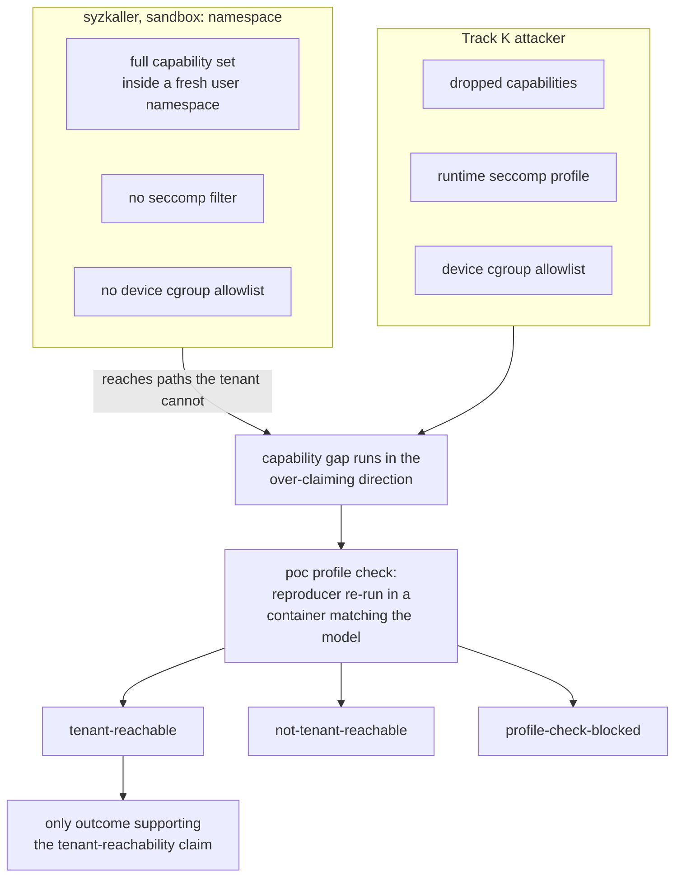

The campaign models one attacker per track.

## Authorisation

gspwn is for security research on a machine the operator owns or is explicitly
authorised to test. It builds an instrumented kernel, panics the machine
repeatedly, and drives hostile input into a device driver. Nothing else of
value may share that machine, and a machine under this pipeline is expected to
be unhealthy.

The pipeline may:

- Install a kernel and reboot into it.
- Panic the machine, repeatedly and on purpose.
- Write systemd units and grant itself passwordless sudo for its own tools.
- Leave the machine in a state where the GPU has stopped responding.

The pipeline does not:

- Contact NVIDIA PSIRT or publish anything.
- Weaponise a reproducer past reliable triggering.
- Build an escalation from a memory-safety primitive.
- Record a finding in the committed `knowledge/` tree.

Every action in the first list is normal operation. The `report` phase
assembles a disclosure package per confirmed finding and stops there. Nothing
leaves the machine.

## Attacker definitions

The two attackers differ in position, in the privilege the code under test
holds, and in the confinement in force when it runs.

| Property | Track K | Track U |
|---|---|---|
| Position | Process inside a GPU container, on a host the attacker does not control | Supplier of the container image and its runtime configuration |
| Under attacker control | The syscalls issued from inside the container | The container image, the OCI configuration, the CDI spec, environment variables |
| Privilege of the code under test | Non-root, after confinement | Root, during container init, before isolation is enforced |
| Confinement in force | Linux capabilities dropped to the container runtime's default set, the runtime's seccomp profile, the device cgroup allowlist | None at the time the code runs |
| Capability request | `NVIDIA_DRIVER_CAPABILITIES=compute,utility`, which CUDA images request | Not applicable |
| Device nodes received | `/dev/nvidiactl`, `/dev/nvidiaX`, `/dev/nvidia-uvm`, `/dev/nvidia-uvm-tools` | Not applicable |
| Device nodes received on the CDI path | `/dev/nvidia-modeset`, `/dev/dri/card*` and `/dev/dri/renderD*`, all injected with no capability check | Not applicable |
| Device nodes received conditionally | `/dev/nvidia-nvswitchctl` and `/dev/nvidia-nvswitch*`, when the image sets `NVIDIA_NVSWITCH=enabled` | Not applicable |
| Device nodes withheld | `/dev/nvidia-nvlink` on both paths. `/dev/nvidia-modeset` and `/dev/dri/*` on the legacy path alone | Not applicable |
| Primary target | The NVIDIA GPU kernel driver ioctl surface | `libnvidia-container`, written in C. The memory-safety surface |
| Secondary target | None | `nvidia-container-toolkit`, written in Go. Panic and denial-of-service surface only |
| Trust boundary crossed | Container to host kernel | Untrusted image input to a host root process |
| Objective | Host kernel compromise from inside the container | Host compromise before the container is confined |

Go is memory-safe. A finding against `nvidia-container-toolkit` supports a
denial-of-service claim and no memory-corruption claim. The `harness` sub-agent
prompt forbids one.

## Device node injection paths

Two mechanisms inject NVIDIA device nodes into a container. The path in force
decides whether `/dev/nvidia-modeset` and the `/dev/dri` nodes lie inside the
Track K attacker's reach.

File and line citations below read `libnvidia-container` at `v1.20.0`, commit
`08cb279`, and `nvidia-container-toolkit` at `v1.20.0`, commit `1780ac69`. The
[attack surface](/gspwn/architecture/attack-surface/) page carries all three
source pins.

- CDI, including `jit-cdi`, injects `/dev/nvidia-modeset` and the `/dev/dri`
  nodes under `compute,utility`. `pkg/nvcdi/common-nvml.go:52` lists
  `/dev/nvidia-modeset` beside the three unconditional control nodes, and `:28`
  calls that discoverer with no capability check.
  `internal/platform-support/dgpu/nvml.go:48-55` adds every `/dev/dri` node
  found for the GPU's PCI bus id, and `internal/edits/device.go:76` grants them
  `rwm`. `NVIDIA_DRIVER_CAPABILITIES` appears nowhere in `pkg/nvcdi`.
- Legacy `libnvidia-container` injects neither under `compute,utility`.
  `src/nvc_mount.c:786` skips the modeset minor unless `OPT_DISPLAY` is set.
  `src/options.h:92` sets that flag from the `display` value alone, `:91` shows
  `graphics` does not set it, and `:100` omits it from the container defaults.
  No source file in `libnvidia-container` references `/dev/dri` at all.

`internal/info/auto.go:89` resolves the default runtime mode to `jit-cdi`, and
`internal/modifier/mode.go:17` routes both CDI modes through the CDI generator.
The campaign models that default, so `/dev/nvidia-modeset` is inside the Track K
attacker's reach and its 64 dispatched commands are counted in the denominator.

`NVIDIA_DRIVER_CAPABILITIES` gates the legacy path, where the `display` value
yields the modeset node. A deployment pinned to `legacy` mode withholds it, and
a modeset crash is claimable against a CDI deployment only.

`/dev/dri/card*` and `/dev/dri/renderD*` are inside the model.
`internal/platform-support/dgpu/nvml.go:48-55` adds the nodes and
`internal/edits/device.go:76` grants read, write and mknod on them, and neither
call site tests `NVIDIA_DRIVER_CAPABILITIES`. `nvidia-drm` registers a device
for every GPU `nvidia-modeset` enumerates, at
`kernel-open/nvidia-drm/nvidia-drm-drv.c:2176`, so a tenant holding the GPU
holds the nodes.

`internal/discover/graphics.go:39` declares `NewDRMNodesDiscoverer`, and the
comment at `:37` restricts that function to legacy mode. That restriction
governs the legacy path alone and places no bound on the CDI path.

The two node types differ in what they reach. `nv_drm_ioctls[]` dispatches 24
of the 28 declared `DRM_NVIDIA_*` commands. The four at 0x19 to 0x1c,
`NVIDIA_REGISTER_ROI`, `NVIDIA_UNREGISTER_ROI`, `NVIDIA_GET_CRTC_ROI_CRCS` and
`NVIDIA_GET_ROI_CAPABILITIES`, have no entry in that table and reach no kernel
code.

| Permission flag | Count | Reachable on `renderD*` | Reachable on `card*` |
|---|---|---|---|
| `DRM_RENDER_ALLOW` | 21 | Yes | Yes |
| `DRM_MASTER`, on `NVIDIA_GRANT_PERMISSIONS` and `NVIDIA_REVOKE_PERMISSIONS` | 2 | No | Conditional |
| Neither, on `NVIDIA_GET_CLIENT_CAPABILITY` | 1 | No | Yes |

`drm_ioctl_permit` refuses a render client any command lacking
`DRM_RENDER_ALLOW`, so a tenant holding only `renderD*` reaches 21 and one
holding `card*` reaches 24. A default CDI tenant holds both node types.

The `DRM_MASTER` pair is conditional. The opening file descriptor becomes
master when `dev->master` is NULL, which is likely on a headless host and is
not guaranteed, so those two are recorded with their condition and are not
claimed unconditionally.

Device nodes are one gate of two, and the second is the allocation privilege
flag the driver attaches to each object class. A class carrying
`RS_FLAGS_ALLOC_PRIVILEGED` is out of reach even where the tenant holds the
device node, and a class carrying `RS_FLAGS_ALLOC_NON_PRIVILEGED` is in reach
even where its subsystem sounds excluded. The
[attack surface](/gspwn/architecture/attack-surface/) page holds the
measurement behind both statements.

## Reachable surfaces beyond the node list

A device-node list understates what the Track K attacker reaches. Four further
surfaces are in the model.

- `NV04_DISPLAY_COMMON`, class 0x0073, and 20 non-privileged `NV0073` control
  commands, reached by `NV_ESC_RM_ALLOC` on `/dev/nvidiactl` under
  `NV01_DEVICE_0`. No display node takes part. In scope, and 4 of the 20 have a
  kernel-side handler.
- `/dev/nvidia-nvswitchctl` and `/dev/nvidia-nvswitch*`, reached by
  `NVIDIA_NVSWITCH=enabled` in the image environment, honoured for unprivileged
  containers by default. In scope where the deployment leaves the default.
  Neither node checks privilege on open.
- `/var/run/nvidia-persistenced/socket` and
  `/var/run/nvidia-fabricmanager/socket`, granted by the `utility` capability,
  which a default tenant requests. In scope as a boundary. Both speak to host
  root processes.
- Host-side `mknod` driven by `NVIDIA_IMEX_CHANNELS`, reached through the image
  environment, read by `libnvidia-container` running as root. A Track U
  surface, and not an ioctl target.

The display exclusion rests on the privilege flag as well as the node list.
`NVC570_DISPLAY` and all 38 classes below it carry
`RS_FLAGS_ALLOC_PRIVILEGED`, so the display channel tree is closed to the
tenant whether or not a display node is present. `NV04_DISPLAY_COMMON` carries
`RS_FLAGS_ALLOC_NON_PRIVILEGED` and is therefore inside the model.

`/dev/nvidia-nvlink` is outside the model. The container toolkit never injects
it, and it appears there only inside `blockedPrefixes`.

## Scope exclusions

Seven items are outside the model.

- `/dev/nvidia-nvlink`. The container toolkit never injects it, and it appears
  there only inside `blockedPrefixes`.
- `/dev/dri/*` on a deployment pinned to `legacy` mode. `libnvidia-container`
  never injects those nodes. The exclusion applies to that deployment alone,
  and a default instance resolves to the CDI path. See
  [Device node injection paths](/gspwn/architecture/threat-model/#device-node-injection-paths).
- The display channel class tree below `NVC570_DISPLAY`. All 38 classes carry
  `RS_FLAGS_ALLOC_PRIVILEGED`, so the tenant cannot allocate them.
- Symlink TOCTOU and mount-escape logic bugs on Track U. Fuzzing finds them
  poorly, and the report records them as future work.
- Memory-corruption claims against the Go toolkit. Go is memory-safe.
- GSP firmware. It is not instrumented, KCOV cannot see it, and no coverage
  number says anything about it.
- The cloud provider boundary. See
  [Blast radius](/gspwn/architecture/threat-model/#blast-radius).

Widening the scope changes the list above first, and the enforcement points at
the end of this page apply it.

## Capability asymmetry

syzkaller runs under `sandbox: namespace`, which holds a full capability set
inside a fresh user namespace. The Track K attacker holds dropped capabilities,
a seccomp filter and a device cgroup allowlist. syzkaller therefore reaches
paths the attacker cannot, and every difference runs in the direction that
produces over-claims.



## Reachability profile check

The `poc` phase re-runs every Track K crash classified reliable or flaky inside
a container matching the model, as a non-root user, with the default capability
set:

```
docker run --rm --runtime=nvidia \
  -e NVIDIA_VISIBLE_DEVICES=all \
  -e NVIDIA_DRIVER_CAPABILITIES=compute,utility \
  --user 1000:1000 \
  -v $PWD/artifacts/pocs/crash-0001:/poc:ro \
  <cuda-runtime-image> /poc/repro
```

`--runtime=nvidia` selects the injection path. On Docker Engine 29.1.x and
older, `--gpus` injects the `nvidia-container-runtime-hook` prestart hook, and
that hook pins its own default to legacy mode, where the container receives
neither `/dev/nvidia-modeset` nor any `/dev/dri` node. A reproducer needing
either family then fails in a container narrower than the model and records
`not-tenant-reachable`, understating a real bug. Docker 29.2.0 and later read a
CDI specification for `--gpus` and reach the same device set, so the two flags
are equivalent there.

1. Confirm what that container received. Run `ls /dev/nvidia* /dev/dri` inside
   it and compare against the model, which
   `python3 tools/verify_tenant_surface.py expected` prints. A node the model
   places outside the tenant surface makes the run wider than the model, and
   that run does not establish tenant reachability. A node the model places
   inside that is absent makes the run narrower, and a failure in it says
   nothing. If `/dev/nvidia-nvswitch*` is present, record it: those nodes are
   conditional on `NVIDIA_NVSWITCH`, and a finding reached through them carries
   that condition in its impact statement.
2. Record one of the three outcomes below in the PoC README.

| Outcome | Condition | Permitted report statement |
|---|---|---|
| `tenant-reachable` | The reproducer fires in that container | The finding is reachable by an unprivileged tenant |
| `not-tenant-reachable` | The reproducer needs privilege the Track K attacker does not hold | The finding is reported in full, and its impact statement names the privilege required |
| `profile-check-blocked` | No suitable image, no Docker, or the reproducer needs a kernel-side harness | The finding is unverified for reachability, and is never reported as tenant-reachable |

## Blast radius

The campaign supports one claim, an unprivileged container tenant reaching host
kernel compromise on a GPU container platform.

The claim stops at the cloud provider boundary. Fuzzing an instance the operator
rents crosses no boundary the provider maintains, because three properties of a
rented instance hold the damage inside the guest:

- A guest kernel panic reboots that guest.
- The hypervisor is unaffected.
- The IOMMU fences GPU DMA to the same guest.

Nothing observed on that instance is evidence about other tenants or about
provider infrastructure. A claim about either exceeds what the campaign
measures.

## Claims the campaign refuses

One claim is supported, one is conditional on a profile-check outcome, and
seven are refused.

| Claim | Status | Basis |
|---|---|---|
| An unprivileged container tenant reaching host kernel compromise on a GPU container platform | Supported | The claim this campaign is built to support |
| A finding is reachable by an unprivileged container tenant | Conditional | Only on a `tenant-reachable` profile-check outcome |
| Anything about the cloud provider's boundary | Refused | Fuzzing a rented instance crosses no boundary the provider maintains |
| Anything about other tenants or provider infrastructure | Refused | Nothing observed here is evidence about either |
| Coverage of GSP firmware | Refused | GSP firmware is not instrumented |
| A fraction of the driver covered | Refused | It needs per-edge frequency counts that syz-manager does not report |
| A severity the evidence chain does not carry | Refused | `undetermined` is a valid outcome and carries no penalty |
| A crash count including Xid 13 and 31 | Refused | Those are the fuzzer's own noise floor |
| A memory-corruption finding against `nvidia-container-toolkit` | Refused | Go is memory-safe |

## GSP coverage blind spot

Turing and later cards run a large part of the Resource Manager on the GSP
microcontroller. That code is not instrumented:

- No coverage number describes it.
- A plateau verdict says nothing about it.
- A fault whose path enters GSP RPC cannot be followed further from the kernel
  side. Its impact record is `undetermined`, with an `undetermined_reason`
  naming GSP.

Every artifact that reports coverage carries this statement. `series` and
`plateau` print it on every invocation.

## Enforcement points

Five constraints from this page are enforced at a named point in the pipeline.

| Constraint | Enforced by |
|---|---|
| Excluded device nodes are not modelled | The `describe` sub-agent |
| A seed referencing an excluded node is refused | `trace2seed.py` |
| Reachability is established by experiment | The `poc` phase profile check |
| A finding is called tenant-reachable only on a `tenant-reachable` outcome | The `report` sub-agent |
| Provider-boundary claims are refused | The `report` sub-agent |

## See also

- [Scope and oracle](/gspwn/architecture/scope-and-oracle/): what the pipeline
  detects and what it cannot.
- [Impact and severity](/gspwn/architecture/impact-and-severity/): how a
  severity is argued from a reproducer.
- [Attack surface](/gspwn/architecture/attack-surface/): the measured
  denominator behind the nodes named here.
