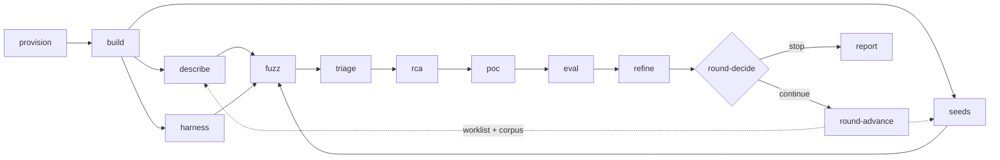

Round 1 runs from a provisioned machine to a recorded round outcome. Each
section below names the sub-agent that carries the phase out, the commands it
runs, and the evidence its gate needs.

The orchestrator asks `pipeline_ctl.py next` what to run, dispatches the
sub-agent for that phase, confirms the gate evidence on disk, and records the
result. A phase whose evidence cannot be confirmed is marked `blocked`, which
stops the pipeline.



The dashed edges are the only state a new round inherits: the worklist and the
corpus.

## Phase order and gates

| Phase | Gate to advance |
|---|---|
| `provision` | `manifest.json` written, `crashlog_ctl.py verify` prints READY, test panic harvested |
| `build` | Booted into the instrumented kernel, KASAN state matches the rung in the manifest, `nvidia-smi` works |
| `describe` | Syzlang compiles, a smoke run reaches the driver with dmesg evidence, an audit sample is logged |
| `seeds` | `artifacts/seeds/*.syz` exist and parse under syz-manager |
| `harness` | Track U harnesses build and produce coverage on seeds |
| `fuzz` | Both units active and coverage increasing within the smoke window, **then the campaign window has elapsed** |
| `triage` | Every raw crash registered unique, duplicate or flagged, and the flagged queue is empty |
| `rca` | An RCA file, a research record and an impact record for every unique crash selected for PoC |
| `poc` | A reproduction rate and classification per unique crash, plus a profile-check outcome per reliable or flaky Track K crash |
| `eval` | `artifacts/eval/` holds the coverage series, findings table, round progression and `version-persistence.md` |
| `refine` | `gaps.md` and `worklist.md` written with every item tagged, and the round outcome recorded |
| `report` | Report and PSIRT packages exist, disclosure status recorded |

## 1. provision

Prepares the machine. Detects whether it is on EC2 by querying the instance
metadata service with a two-second timeout, grants the agent passwordless sudo
for the pipeline tools, installs the orchestrator supervisor, records machine
facts into `config/machine.yaml`, installs crash capture, clones the source
trees and builds syzkaller.

Confirm the prerequisites the unattended loop cannot check for itself once it
is running:

```
python3 tools/orchestrator_ctl.py preflight
```

```
config:    valid
command:   claude --session-id {session} -p 'Drive the pipeline per AGENTS.md.'
sudo -n:   ok (sudo -n succeeds)
           needs it for: crashlog_ctl.py harvest (post-panic crash log capture)
           needs it for: campaign_ctl.py install-k (starting a Track K campaign)
           needs it for: coverage_ctl.py install-timer (installing the coverage sampler)
disk:      412.6 GB free

preflight clean
```

A failing preflight is a blocked gate. Each failing line names the missing
item. Correct it and re-run before dispatching `build`.

## 2. build

Builds and installs the instrumented kernel and the NVIDIA modules, walking a
degradation ladder and stopping at the first rung that passes:

| Rung | Kernel | NVIDIA modules |
|---|---|---|
| 1 | KASAN + KCOV | KASAN + KCOV |
| 2 | KASAN + KCOV | KCOV only |
| 3 | KASAN + KCOV | Uninstrumented |

```
sudo JOBS=$(nproc) LINUX_SRC=artifacts/src/linux \
  NVIDIA_SRC=artifacts/src/open-gpu-kernel-modules RUNG=1 \
  bash tools/build_kernel.sh
```

Rungs 2 and 3 add `SKIP_KERNEL=1`. Only the NVIDIA module CFLAGS differ between
rungs. The kernel image is identical, and rebuilding it per rung spends hours
of machine time from the same budget as the fuzzing.

The script sets the GRUB default to the entry it installed and verifies the
setting persisted, so the reboot needs no manual step. Reboot, then check the
gate:

```
uname -r
dmesg | grep -i kasan
lsmod | grep nvidia
nvidia-smi
```

Record the chosen rung in `config/machine.yaml` and
`artifacts/builds/manifest.json`.

## 3. describe, seeds and harness

These three phases may run in parallel after `build`. In round 1 `seeds`
consumes the `NV_*` header `describe` produces, so the trio is fully
independent only from round 2 on.

### describe

Authors syzlang descriptions for the ioctl surface of `/dev/nvidiactl`,
`/dev/nvidiaX` and `/dev/nvidia-uvm[-tools]`. Every number and struct layout
comes from the driver source, because the ABI shifts between branches and a
wrong direction bit produces descriptions that compile, run and never reach the
driver. `nvidia-drm`, `nvidia-modeset` and `/dev/dri/*` are out of scope: a
default container tenant never receives those nodes.

Agent-authored descriptions are treated as untrusted until measured, so the
gate needs four items:

1. A clean `syz-compile`.
2. A smoke run whose dmesg shows programs reaching the driver.
3. A reachability check showing that no device node early-outs uniformly.
4. A manual audit of five sampled descriptions, recorded in
   `artifacts/eval/description-audit.md`.

### seeds

Converts strace of a real CUDA workload into seed programs:

```
strace -v -f -P /dev/nvidiactl -P /dev/nvidia0 -P /dev/nvidia-uvm \
  -P /dev/nvidia-uvm-tools -o artifacts/seeds/trace.txt <workload>
python3 tools/trace2seed.py --trace artifacts/seeds/trace.txt \
  --out-dir artifacts/seeds/
```

```
wrote artifacts/seeds/seed-0000.syz (37 mapped ioctls, 4 unmapped)
```

Read that ratio. Unmapped requests become comments, so a mostly-unmapped seed
is an open/close chain that exercises nothing. Extend `tools/ioctl_map.json`
and re-run.

### harness

Writes libFuzzer and AFL++ harnesses for Track U into `artifacts/harnesses/`,
one directory per target, each with its source, a `seeds/` directory and a
`build.sh`. It also writes `artifacts/harnesses/run_all.sh` and records each
harness's replay command, with `{input}` where the file path goes, in
`artifacts/harnesses/TARGETS.md`. The `poc` phase passes that string to
`repro_ctl.py verify --cmd`, and without it a Track U crash cannot be scored.

Each harness must write its fuzzer output under
`artifacts/runs/$RUN_ID/u/<harness-name>/`, which is where the coverage sampler
looks. The harness names go into `track_u.targets` in `config/campaign.yaml`.

## 4. fuzz

Pick one run id of the form `r<round>-<n>` covering both tracks. Track U data
lives under `artifacts/runs/<id>/u/`, and the sampler and the deadline timer
key on the single id, so per-track ids leave Track U unsampled.

```
python3 tools/campaign_ctl.py gen-config --run-id r1-1
sudo python3 tools/campaign_ctl.py install-k --run-id r1-1 --seeds artifacts/seeds
sudo python3 tools/campaign_ctl.py install-u --run-id r1-1
sudo python3 tools/campaign_ctl.py start k
sudo python3 tools/campaign_ctl.py start u
sudo python3 tools/coverage_ctl.py install-timer --run-id r1-1
python3 tools/pipeline_ctl.py round-add-run --run-id r1-1
```

`install-k` prints the window it wrote and the budget it checked:

```
campaign window: 24 h (stops at epoch 1786000000, enforced by gspwn-deadline@r1-1.timer); budget 0.0 of 216 run-hours spent before this campaign
fresh corpus for run r1-1
packed 12 seed program(s) from artifacts/seeds into artifacts/runs/r1-1/workdir/corpus.db (0 carried program(s) preserved)
wrote artifacts/runs/r1-1/syz-manager.cfg (workdir artifacts/runs/r1-1/workdir)
installed gspwn-k.service for run r1-1 (MemoryMax=12G)
```

Confirm the first sample of each track records data. The sampler runs as root
and owns the CSV, so this check needs `sudo`:

```
sudo python3 tools/coverage_ctl.py sample --run-id r1-1
sudo python3 tools/coverage_ctl.py sample --run-id r1-1 --track u
```

Neither may report `source: unreachable`. A campaign with no coverage data
cannot close its round, and the loop treats a missing verdict as a stop.

Watch the smoke window, which is `track_k.smoke_window_minutes` long and
defaults to 30 minutes. Coverage must increase. Flat coverage across the whole
smoke window is a failed gate. Check the card before recording that outcome:

```
python3 tools/coverage_ctl.py gpu-health
```

A GPU that has fallen off the bus leaves the fuzzer running against nothing,
and its coverage curve matches the curve of a descriptions problem.

Wait out the campaign. The phase completes when the window closes:

```
python3 tools/campaign_ctl.py wait --run-id r1-1
```

```
run r1-1: 23.9 h left of its campaign window (ends 2026-08-16 15:31:04)
run r1-1: 23.9 h left of its campaign window (ends 2026-08-16 15:31:04)
...
run r1-1: campaign window has elapsed
```

The deadline is on disk, so a wait interrupted by a panic resumes against the
same deadline when the command is re-run after the reboot.

:::caution[The campaign window is the gate]
Every phase after `fuzz` measures the run. Advancing at half an hour into a
24-hour campaign leaves `triage` scanning a nearly empty workdir, satisfies the
later gates with no data to process, and bills a full campaign for thirty
minutes of measurement. `pipeline_ctl.py next` reports `wait` while a campaign
is live, and `round-end` refuses to measure one.
:::

## 5. triage

Turns raw crash artifacts into a deduplicated registry.

```
python3 tools/crash_parse.py --run-id r1-1
```

For each harvested crash-log directory:

```
for f in <harvest>/dmesg-ramoops-*; do python3 tools/crash_parse.py --dmesg "$f"; done
```

Output lines record the disposition of each sighting:

```
NEW crash-0001 KASAN: use-after-free in uvm_va_range_destroy [signal]
DUP KASAN: use-after-free in uvm_va_range_destroy -> crash-0001 (registered crash-0007 as duplicate; sources linked)
FLAG crash-0008 Kernel panic - not syncing: Fatal exception (same title as crash-0003, different stack) — decide with: pipeline_ctl.py crash-set crash-0008 --duplicate-of crash-0003 | --status unique
registry now holds 8 crashes
1 flagged — every one needs a decision before the triage gate holds: python3 tools/pipeline_ctl.py crash-list --status flagged
```

Work the flagged queue down. `crash-set` takes several ids and is
all-or-nothing, so a rejected id leaves the queue untouched:

```
python3 tools/pipeline_ctl.py crash-set crash-0008 --duplicate-of crash-0003
python3 tools/pipeline_ctl.py crash-set crash-0009 --status unique --notes "different faulting object"
```

The gate is `crash-list --status flagged` returning nothing, plus a clean
`validate`.

## 6. rca

One root-cause analysis per unique crash, in the priority order `triage` wrote
to `artifacts/crashes/QUEUE.md`. Each produces three files or records: the
prose in `artifacts/rca/<id>.md`, a research record, and an impact record.

```
python3 tools/pipeline_ctl.py finding-set crash-0001 --json - <<'JSON'
{"subsystem": "nvidia_uvm",
 "bug_class": "uaf",
 "trigger": "ioctl-sequence",
 "ioctls": ["UVM_CREATE_RANGE_GROUP", "UVM_FREE"],
 "preconditions": ["channel bound", "async work in flight"],
 "adjacent": ["UVM_DESTROY_RANGE_GROUP", "UVM_UNMAP_EXTERNAL"],
 "source_refs": ["uvm_range_group.c:412"],
 "hypothesis": "teardown paths skip the in-flight refcount check",
 "confidence": "medium"}
JSON
```

```
crash-0001: nvidia_uvm uaf/ioctl-sequence (confidence medium)
  next round can target: UVM_CREATE_RANGE_GROUP, UVM_DESTROY_RANGE_GROUP, UVM_FREE, UVM_UNMAP_EXTERNAL
```

`finding-list` closes with the count of records that can steer the next round:

```
2 of 3 record(s) can send the next round somewhere new.
These cannot, and rca should revisit them:
  crash-0004: no adjacent calls, and no no_adjacent_reason explaining why. This record cannot send the next round anywhere it has not already been
```

Attach the impact record the same way with `impact-set`. `impact-list` closes
with how many records can carry a severity.

## 7. poc

Turns unique crashes into verified reproducers. Stop the campaign first: a
Track K run counts as a reproduction partly because the machine went down
during it, and that inference holds only when the reproducer is the sole
possible cause of the panic.

```
python3 tools/repro_ctl.py extract crash-0001
python3 tools/repro_ctl.py verify crash-0001 --runs 10
```

```
crash-0001: crash signature funcs=['uvm_va_range_destroy', 'uvm_range_group_free'] phrases=['KASAN: use-after-free in uvm_va_range_destroy']
run 1 (1/10 counted): CRASH (uvm_va_range_destroy)
run 2 (2/10 counted): clean
...
crash-0001: 9/10 (90%) -> reliable [1 void run(s) excluded]
```

Every Track K crash that reached reliable or flaky then takes a profile check:
re-run the reproducer inside a container matching the threat model, as a
non-root user, with the default capability set. Record one outcome per crash in
the PoC README.

| Outcome | Meaning |
|---|---|
| `tenant-reachable` | the reproducer reached the fault under the threat model |
| `not-tenant-reachable` | the reproducer did not reach the fault |
| `profile-check-blocked` | the check could not be completed |

Only `tenant-reachable` supports the campaign's claim that an unprivileged
container tenant can reach the fault.

## 8. eval

Measures what the round did. Coverage series per run, a findings table from the
registry, the cross-round progression, an audit of a sample of `[UNVERIFIED]`
RCA claims, an impact audit, and a version-persistence result.

```
python3 tools/coverage_ctl.py series --run-id r1-1
```

```
run r1-1 track k: 141 samples over 23.5 h
  sources: json:/stats?format=json
  gpu: healthy across all 141 sample(s)
  disk free: 412.6 GB -> 388.1 GB (low water 388.1 GB)
  edges: 18422 -> 41907 (+23485)
  corpus: 512 -> 4183
  crashes: 0 -> 8
  NOTE: kernel-side reachable coverage only; GSP firmware is not instrumented.
```

`artifacts/eval/version-persistence.md` must exist. A recorded
`skipped: <why>` counts; a missing file does not.

## 9. refine

Closes the loop. Reads the curve, classifies each gap by why it is uncovered,
derives the finding-adjacent work, and writes the two files the next round
executes.

```
python3 tools/coverage_ctl.py plateau --run-id r1-1
```

```
r1-1: growing (k: growing (41907 distinct edges after 3.41e+09 executions; beta 0.412, R2 0.987 over 68 samples. At 1.45e+08 exec/h another 24 h is expected to find ~1180 new edge(s), 2.8% more (plateau below 50)); u: growing (...))
Coverage is kernel-side reachable code only; GSP firmware is not instrumented, so no verdict here says anything about it.
```

Every gap is classified as `unmodeled`, `mismodeled`,
`unreachable-by-construction`, or out of scope. Every work item carries its
source tag. Then promote the corpus and record the round:

```
python3 tools/corpus_ctl.py promote --run-id r1-1
python3 tools/pipeline_ctl.py round-end --from-run r1-1 \
  --worklist artifacts/eval/r1-1/worklist.md
```

```
round 1 closed: growing, crashes=6, run_h=23.5
  measured from run r1-1: k: growing (...); u: growing (...)
```

`round-end` derives the verdict, the edge counts, the crash count and the
billed hours from the run's own `coverage.csv` and the registry. Hand-entered
values would place a transcription step in front of a budget.

## 10. Loop decision

```
python3 tools/pipeline_ctl.py round-decide
```

```
round 1: continue — coverage still growing after round 1
next: pipeline_ctl.py round-advance
```

```
python3 tools/pipeline_ctl.py round-advance
```

```
opened round 2; round phases reset to pending (setup and crash registry kept)
```

Round 2 starts at `describe`, and `pipeline_ctl.py worklist` prints the path
round 1's `refine` recorded. When the decision is `stop`, the pipeline runs the
`report` phase.

## Next

- [Running a campaign](/gspwn/guides/running-a-campaign/) covers run ids,
  corpus policy and replacement in detail.
- [Steering the next round](/gspwn/guides/steering-the-next-round/) covers the
  feedback edge.
- [Troubleshooting](/gspwn/guides/troubleshooting/) maps symptoms to causes.
