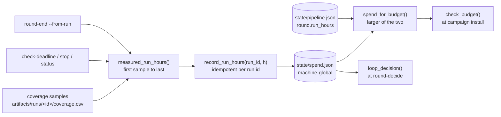

An unattended loop ends on one of five stop conditions. `pipeline_ctl.py
round-decide` evaluates them in the order below and records the first that
holds. A sixth limit, `loop.campaign_hours`, ends one campaign and leaves the
loop running.

| Order | Stop condition | Key | Overridable |
|---|---|---|---|
| 1 | Command surface complete: every enumerated target either exercised or carrying a written reason in the completion ledger | none, it is a ledger identity | no |
| 2 | Round cap reached | `loop.max_rounds`, default 10 | no |
| 3 | Run-hour budget spent | `loop.max_total_run_hours`, default 5000 | no |
| 4 | Both coverage curves flat | `loop.stop_on_plateau`, default true | yes, with `--reason` |
| 5 | No coverage verdict for the round | none | yes, with `--reason` |

Completion is checked first, so a campaign that finishes its work on its last
permitted round records why it finished and not which limit it hit. The round
cap is a backstop against a runaway loop: a campaign that reaches it failed to
converge, and its stop reason says so. `loop.max_total_run_hours` is the spend
ceiling, and at the shipped values it binds before the round cap does.

[Coverage and plateau](/gspwn/architecture/coverage-and-plateau/) covers how
conditions 4 and 5 are computed.

## The per-campaign window

`loop.campaign_hours`, default 1000, is the window one campaign runs for.
`campaign_ctl.py install-k` and `install-u` write it to
`artifacts/runs/<run-id>/deadline` as an absolute epoch second and install a
per-run `gspwn-deadline@<run-id>.timer`. That timer runs `check-deadline` every
`loop.deadline_check_min` minutes, default 2. When the window is up the
campaign units are stopped and disabled, so a later panic cannot bring them
back.

A deadline on disk survives the reboot a kernel panic causes. The campaign
units carry `Restart=always`, so without the deadline file nothing would ever
end a campaign.

## Measuring billed hours

A campaign's billed hours are the wall-clock span from its first coverage
sample to its last, on either track. Two samples are the minimum; a run with
one sample or none has no measurable span. A run that died after three hours
must not bill the configured thousand.

```
python3 tools/pipeline_ctl.py round-end --from-run r2-1
```

```
round 2 closed: growing, crashes=4, run_h=987.42
  measured from run r2-1: k: growing (...); u: growing (...)
  surface incomplete: 245 of 852 target(s) closed: 214 exercised, 31 accounted for, 607 left
```

The surface line prints on every `round-end`, because the completion reading
decides stop condition 1 and is never carried over from the previous round.

The configured window stands in only when a run left no usable coverage
samples, and that fallback says so:

```
billed 1000.00 run-hours for run r2-1 (configured window (no usable coverage samples); campaign window elapsed)
```

A run with no samples at all is reported:

```
  WARNING: run(s) r2-2 had no usable coverage samples and billed 0.0 h. Check the sampler, because unmeasured spend must not pass silently
```

## The ledger

`state/spend.json` maps run id to billed hours. It is machine-global:
`state/pipeline.json` follows `GSPWN_STATE`, and the ledger follows
`GSPWN_SPEND` alone, so a run with its own state file still counts against the
one cap.

Recording is idempotent per run id. Re-billing a run overwrites its entry, so a
retried `round-end` never double-counts a campaign.

A campaign install reconciles two records before trusting either.
`spend_for_budget()` compares the ledger total against the hours the state file
records and uses the larger, because a ledger write that failed on permissions
leaves hours on record and out of the ledger, and the cap would then read
headroom that was already spent. The gap is reported:

```
WARNING: spend ledger state/spend.json holds 1979.0 run-hours while the state file records 2966.4. 987.4 h of spend never reached the ledger, most likely a write that failed on permissions. Using the larger figure so the cap counts what actually ran. Fix the ledger's ownership and re-run: python3 tools/pipeline_ctl.py spend-init
```

`round-decide` and `round-show` read the ledger alone, so the two figures can
disagree until the ledger is re-seeded.

Four commands bill, and they cannot double-count because all four derive the
figure from the same coverage-sample span:

| Command | Bills when |
|---|---|
| `campaign_ctl.py check-deadline --run-id ID` | the campaign window has elapsed and every unit stopped cleanly |
| `campaign_ctl.py stop <k\|u> --run-id ID` | the operator stops the campaign by hand |
| `campaign_ctl.py status --run-id ID` | the deadline has already passed when `status` looks |
| `pipeline_ctl.py round-end --from-run ID` | the round closes |

Billing outside `round-end` as well keeps a round that never closes from
leaving its hours off the cap entirely. A round can fail to close because a
phase blocked, the breaker tripped, or a human stopped it.



## Reading the budget

```
python3 tools/pipeline_ctl.py round-show
```

```
rounds: 2 of max 10   run-hours: 1979.0 of 5000
  round 1   complete   growing    crashes=6    run_h=991.6   edges 12004->31220
            surface:  incomplete (214 exercised + 31 accounted of 852 on denominator v3-852)
            decision: continue (coverage still growing after round 1)
            runs: r1-1
            produced:  artifacts/eval/r1-1/worklist.md
  round 2   in_progress unknown    crashes=0    run_h=987.4
            runs: r2-1
            executing: artifacts/eval/r1-1/worklist.md
```

The first line carries the two figures conditions 2 and 3 are checked against.
`pipeline_ctl.py show` reports the same two on its second line, and
`pipeline_ctl.py brief` under its `## Where the pipeline is` heading.

## Budget check at campaign install

`campaign_ctl.py install-k` and `install-u` check the budget before writing
anything:

```
refusing to start: 4500.0 h already spent + 1000.0 h for this campaign exceeds loop.max_total_run_hours (5000). Raise the cap in config/campaign.yaml to allow it.
```

`round-decide` enforces the cap between rounds, and a campaign started directly
by the `fuzz` phase never passes through it, so without this check the cap could
be overshot by an arbitrary number of extra runs. Raising the cap is a
deliberate edit to `config/campaign.yaml`.

The refusal fires only on `spent + hours > cap`. Exact equality is admitted,
matching the enforcement point in `round-decide`.

## Overriding a stop

```
python3 tools/pipeline_ctl.py round-decide --decision continue --reason "one more"
```

Against a completion, round-cap or budget stop, `round-decide` refuses:

```
error: computed decision is stop (run-hour budget spent (5000.0 of 5000.0 h)). A completion, budget or round-cap stop cannot be overridden
```

A completion stop adds the route back: the verdict is recomputed from the
completion ledger on every `round-end`, so a target closed by a row that should
not have been written is reopened with `pipeline_ctl.py surface-unaccount
--variant NAME` followed by another `round-end`.

A plateau stop and an `unknown` stop are overridable, and each requires
`--reason`:

```
python3 tools/pipeline_ctl.py round-decide --decision continue \
  --reason "sampler was down for the last four hours; curve is not evidence"
```

## Recovering a missing ledger

A deleted or unreadable `state/spend.json` with billed hours still on record
refuses every command that reads spend:

```
error: spend ledger state/spend.json is missing, but the state file records 1979.0 billed run-hours. Refusing to treat the budget as unspent. Re-seed it from the state file with: python3 tools/pipeline_ctl.py spend-init
```

Falling back to zero would hand the loop a fresh budget. A genuinely fresh
machine, with no ledger and no recorded hours, reads 0.0 and starts normally.

1. Re-seed the ledger from the hours the state file records.

   ```
   python3 tools/pipeline_ctl.py spend-init
   ```

   ```
   seeded ledger state/spend.json: 1979.0 run-hours billed
   ```

   With a ledger already present the command changes nothing and says so:

   ```
   ledger already present at state/spend.json: 1979.0 run-hours billed
   (no change. Delete the ledger first to rebuild it from the state file)
   ```

   Because it never lowers recorded spend, it cannot be used to clear the
   budget. Re-seeding a ledger that is present but wrong needs the file
   deleted first.

2. Confirm the figure the loop will now read.

   ```
   python3 tools/pipeline_ctl.py round-show
   ```

   The `run-hours` figure on the first line must match the seeded total. A
   remaining gap means the state file and the ledger disagree, and the
   reconciliation warning under [The ledger](#the-ledger) names the amount.

## Hours entered by hand

```
python3 tools/pipeline_ctl.py round-end --from-run r2-1 --run-hours 4.0
```

Hours passed with `--run-hours` belong to no single run, so they bill under the
round's own key, `round-2`. Without that they would raise the round total while
the budget kept reading the ledger and never saw them. The recorded figure is
the round's current unattributed total, which keeps a repeated `round-end`
idempotent.

Derived per-run hours are preferred. The cap is measured against `run_hours`,
and typing it in puts a transcription step in front of a budget.

## Outside the stop conditions

The five stop conditions bound the search. The repository has no view of what
an instance costs and produces no cost estimate.

- Instance cost is bounded by nothing in the repository, and the provider's
  console reports it.
- Token cost is bounded by the circuit breaker over agent restarts
  (`orchestrator.max_same_boot_starts`, `orchestrator.max_reboots`) and by
  `orchestrator.max_agent_hours` over one launch. The agent vendor's usage page
  reports it.

Neither figure is a currency amount. See
[Unattended operation](/gspwn/guides/unattended-operation/).

## See also

- [Spend accounting](/gspwn/architecture/spend-accounting/) covers the write
  path and the idempotency argument.
- [Coverage and plateau](/gspwn/architecture/coverage-and-plateau/) covers stop
  conditions 4 and 5.
