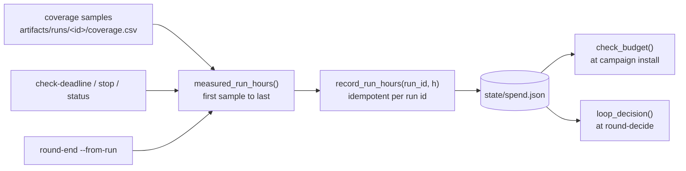

Three declared stopping rules bound an unattended run. They bound the search
itself. The repository has no view of what an instance costs and produces no
cost estimate.

| Cap | Key | Enforced by |
|---|---|---|
| Rounds | `loop.max_rounds` | `round-decide` |
| Total run-hours | `loop.max_total_run_hours` | `round-decide`, and every campaign install |
| Per-campaign hours | `loop.campaign_hours` | The per-run deadline timer |

A coverage plateau and an `unknown` coverage verdict also stop the loop. See
[Coverage and plateau](/gspwn/architecture/coverage-and-plateau/).

## Measuring billed hours

A campaign's billed hours are the wall-clock span from its first coverage
sample to its last, on either track. A run that died after three hours must not
bill the configured twenty-four.

```
python3 tools/pipeline_ctl.py round-end --from-run r2-1
```

```
round 2 closed: growing, crashes=4, run_h=23.47
  measured from run r2-1: k: growing (...); u: growing (...)
```

The configured window stands in only when a run left no usable coverage
samples, and that fallback says so:

```
billed 24.00 run-hours for run r2-1 (configured window (no usable coverage samples); campaign window elapsed)
```

A run with no samples at all is reported:

```
  WARNING: run(s) r2-2 had no usable coverage samples and billed 0.0 h — check the sampler; unmeasured spend must not pass silently
```

## The ledger

`state/spend.json` maps run id to billed hours. It is machine-global on
purpose: unlike `state/pipeline.json` it does **not** follow `GSPWN_STATE`, so
a run with its own state file still counts against the one cap.

Recording is idempotent per run id. Re-billing a run overwrites its entry, so a
retried `round-end` never double-counts a campaign.

Two paths bill, and they cannot double-count because both derive the figure the
same way:

| Path | When |
|---|---|
| `campaign_ctl.py` | On deadline stop, on manual stop, and when `status` finds a campaign already finished |
| `pipeline_ctl.py round-end` | When the round closes |

Billing in both places keeps a round that never closes from leaving its
hours off the cap entirely. A round can fail to close because a phase blocked,
the breaker tripped, or someone stopped it by hand.



## Reading the budget

```
python3 tools/pipeline_ctl.py round-show
```

```
rounds: 2 of max 3   run-hours: 47.0 of 216
  round 1   complete   growing    crashes=6    run_h=23.5   edges 12004->31220
            decision: continue — coverage still growing after round 1
            runs: r1-1
            produced:  artifacts/eval/r1-1/worklist.md
  round 2   in_progress unknown    crashes=0    run_h=23.5
            runs: r2-1
            executing: artifacts/eval/r1-1/worklist.md
```

`show` and `brief` print the same two figures on their first lines.

## Budget check at campaign install

A campaign install checks the budget before writing anything:

```
refusing to start: 200.0 h already spent + 24.0 h for this campaign exceeds loop.max_total_run_hours (216). Raise the cap in config/campaign.yaml to allow it.
```

`round-decide` enforces the cap between rounds, but a campaign started directly
by the `fuzz` phase never passes through it, so without this check the cap could
be overshot by an arbitrary number of extra runs. Raising the cap is a
deliberate edit to `config/campaign.yaml`.

Exact equality is admitted, matching the enforcement point in `round-decide`.

## Hard caps and overridable stops

```
python3 tools/pipeline_ctl.py round-decide --decision continue --reason "one more"
```

```
error: computed decision is stop (run-hour budget spent (216.0 of 216.0 h)) — a budget or round-cap stop cannot be overridden
```

The round cap behaves the same way. A plateau stop or an `unknown` stop can be
overridden, and requires `--reason`:

```
python3 tools/pipeline_ctl.py round-decide --decision continue \
  --reason "sampler was down for the last four hours; curve is not evidence"
```

## Missing ledger recovery

```
error: spend ledger state/spend.json is missing, but the state file records 47.2 billed run-hours. Refusing to treat the budget as unspent. Re-seed it from the state file with: python3 tools/pipeline_ctl.py spend-init
```

Falling back to zero would hand the loop a fresh budget. A genuinely fresh
machine, with no ledger and no recorded hours, reads 0.0 and starts normally.

```
python3 tools/pipeline_ctl.py spend-init
```

```
seeded ledger state/spend.json: 47.2 run-hours billed
```

It rebuilds the ledger from the hours the state file records and never lowers
recorded spend. With a ledger already present it changes nothing:

```
ledger already present at state/spend.json: 47.2 run-hours billed
(no change — delete the ledger first if you truly mean to rebuild it from the state file)
```

## Hours entered by hand

```
python3 tools/pipeline_ctl.py round-end --from-run r2-1 --run-hours 4.0
```

Hours passed with `--run-hours` belong to no single run, so they bill under the
round's own key, `round-2`. Without that they would raise the round total while
the budget kept reading the ledger and never saw them. The recorded figure is
the round's current unattributed total, which keeps a repeated `round-end`
idempotent.

Derived per-run hours are preferred. The cap is measured against `run_hours`,
and typing it in puts a transcription step in front of a budget.

## Outside the caps

| Cost | Bounded by | Source |
|---|---|---|
| Instance cost | Nothing in the repository | The provider's console |
| Token cost | The circuit breaker bounds agent restarts and `orchestrator.max_agent_hours` bounds one launch, both in restart and hour counts | The agent vendor's usage page |

Neither figure is a currency amount. See
[Unattended operation](/gspwn/guides/unattended-operation/).

## See also

- [Spend accounting](/gspwn/architecture/spend-accounting/) covers the write
  path and the idempotency argument.
- [Coverage and plateau](/gspwn/architecture/coverage-and-plateau/) covers the
  other two stop conditions.
