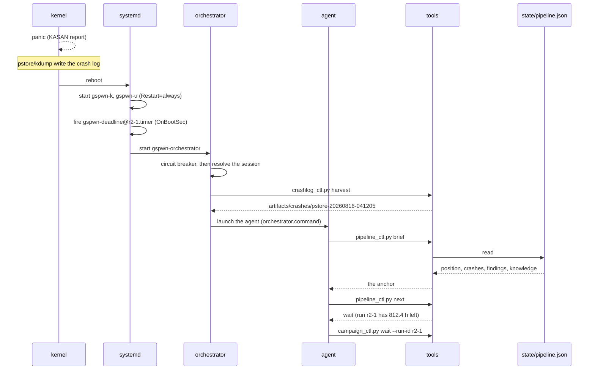

A campaign runs for `loop.campaign_hours`, 1000 by default, and the machine
panics repeatedly inside that window by design. Everything that has to survive
a panic is written to disk.

## Mechanisms that survive a panic

| Mechanism | Implementation |
|---|---|
| The fuzz units | `Restart=always` with `RestartSec=30` |
| The campaign deadline | an absolute epoch second in `artifacts/runs/<id>/deadline` |
| Deadline enforcement | `gspwn-deadline@<run-id>.timer`, `OnBootSec` and `OnUnitActiveSec` at `loop.deadline_check_min` |
| Coverage sampling | `gspwn-coverage.timer`, the same two directives at `--interval-min` |
| Pipeline position | `state/pipeline.json`, written atomically with `fsync` |
| Spend | `state/spend.json`, keyed by run id |
| Crash evidence | pstore, kdump, and the harvest under `artifacts/crashes/` |

Nothing in that list depends on an agent session being alive.

## The deadline file

```
sudo python3 tools/campaign_ctl.py install-k --run-id r2-1
```

```
campaign window: 1000 h (stops at epoch 1786000000, enforced by gspwn-deadline@r2-1.timer); budget 1979.0 of 5000 run-hours spent before this campaign
```

A deadline stored on disk makes an unattended round end on time across reboots.
Without it nothing ever ends a campaign, because the units restart.

The timer runs `check-deadline` every `loop.deadline_check_min` minutes:

```
python3 tools/campaign_ctl.py check-deadline --run-id r2-1
```

```
run r2-1: 812.4 h left of its campaign window
```

When the window is up it stops and disables both units, records the stops in
the campaign log, bills the run's measured hours, and retires its own timer:

```
billed 987.42 run-hours for run r2-1 (coverage samples; campaign window elapsed)
run r2-1: campaign window elapsed; stopped k, u
```

Disabling matters as much as stopping. An enabled `Restart=always` unit comes
back on the next boot, and this pipeline panics by design.

A `systemctl stop` that fails leaves the run unbilled and the timer installed,
and `check-deadline` exits 1 so the next timer pass retries:

```
ERROR: systemctl stop gspwn-k failed: Interactive authentication required. — NOT recording a stop; the deadline timer will retry
```

## Missing deadline file

A missing deadline file would leave the campaign unbounded, with
`check-deadline` reporting nothing to enforce on every pass while the units keep
fuzzing. The install event records when the campaign started and the window it
was given, which is the deadline, so it is rebuilt from state:

```
run r2-1: the deadline file was missing; rebuilt it from the install record (window ends at epoch 1786000000)
```

With nothing on disk, nothing reconstructible, and no unit running for the run,
`check-deadline` reports that there is nothing to enforce and exits 0. With
units still fuzzing, the campaign is stopped:

```
ERROR: run r2-1 has no deadline on disk and none reconstructible from the install record, but unit(s) gspwn-k are still fuzzing for it. Nothing bounds what that campaign spends, so it is being stopped. Re-install it with campaign_ctl.py install-k/install-u to start a fresh, bounded window.
```

## Waiting out a campaign across reboots

```
python3 tools/campaign_ctl.py wait --run-id r2-1
```

```
run r2-1: 812.4 h left of its campaign window (ends 2026-09-27 04:12:11)
run r2-1: 812.3 h left of its campaign window (ends 2026-09-27 04:12:11)
```

The heartbeat exists because a silent process blocking for weeks is
indistinguishable from a hung one. The interval is `--poll-min`, defaulting to
`loop.deadline_check_min`.

`wait --check` answers the same question without blocking: exit 0 once the
window has elapsed, exit 1 while the campaign is still inside it.

```
run r2-1: still fuzzing, 812.4 h left of its campaign window
```

A run with no recorded deadline and no reconstructible one exits 1 and names
the install command that starts the clock.

The deadline is re-read on every pass, so a `--replace` install that moves it is
followed correctly.

If the machine panics mid-wait, the process dies with it. Re-run the same
command after the reboot and it resumes against the same deadline.

On return, `wait` checks whether the units are still active and enforces the
deadline itself if the timer never did. Measuring a campaign that is still
running produces the same wrong number that waiting exists to prevent.

## The recovery sequence after a panic



Three commands are the whole procedure, and they need no memory of the previous
session:

1. Harvest the crash evidence before anything restarts on top of it.

   ```
   sudo python3 tools/crashlog_ctl.py harvest
   ```

2. Re-anchor the session from the state file.

   ```
   python3 tools/pipeline_ctl.py brief
   ```

3. Ask what the pipeline needs next.

   ```
   python3 tools/pipeline_ctl.py next
   ```

When `gspwn-orchestrator.service` is installed it performs the first two and
launches an agent, so the sequence runs without a human. See
[Unattended operation](/gspwn/guides/unattended-operation/).

## Harvest before restarting anything

`harvest` copies every pstore record out and then clears it, so the next panic
has somewhere to write, and it copies every unharvested `/var/crash` dump. Its
exit status distinguishes two answers that must not be confused.

| Exit | Condition |
|---|---|
| 0 | something was harvested, or nothing was found and every source was readable |
| 1 | nothing was found and at least one source could not be read, which is not evidence that no crash occurred |
| 1 | the command was not run as root |

A harvest that collected something and also failed on a source exits 0 and
prints a `WARN` naming what is missing, so read the output alongside the exit
status.
[Disk and crash logs](/gspwn/guides/disk-and-crash-logs/) covers both sources.

## Re-anchoring a session

```
python3 tools/pipeline_ctl.py brief
```

`brief` is derived from the state file at read time, so it cannot be stale. It
prints five sections, and a sixth when the state file has problems.

| Section | Content |
|---|---|
| `## Where the pipeline is` | the round, the spend against the cap, and the next action |
| `## Crashes` | the registry total broken down by status, and the flagged queue that blocks the triage gate |
| `## Findings (what steers the next round)` | the research records grouped by subsystem, and how many steer nothing new |
| `## Impact (what the report can argue)` | the impact records grouped by consequence, and how many cannot carry a severity |
| `## Recent knowledge (cross-campaign)` | the tail of `knowledge/`, `agent.brief_knowledge_entries` per file, each first line cut to `agent.brief_knowledge_line_chars` |
| `## Integrity: N problem(s)` | printed when `validate` finds problems, up to `agent.brief_max_problems` of them |

Re-run it at the start of every session. `--last N` overrides the knowledge
depth for one call.

## Missing spend ledger

```
error: spend ledger state/spend.json is missing, but the state file records 1979.0 billed run-hours. Refusing to treat the budget as unspent. Re-seed it from the state file with: python3 tools/pipeline_ctl.py spend-init
```

Every command that reads spend fails closed. Falling back to zero would hand
the loop a fresh budget. Recovery is
[Budget and spend](/gspwn/guides/budget-and-spend/#recovering-a-missing-ledger):

```
python3 tools/pipeline_ctl.py spend-init
```

## Resuming a round

`pipeline_ctl.py next` refuses to run ahead of a campaign that is still
fuzzing:

```
wait  (run r2-1 has 812.4 h left of its campaign window, and the round cannot be measured until it ends: python3 tools/campaign_ctl.py wait --run-id r2-1)
```

The `fuzz` phase itself is exempt, because it starts the campaign, and the
check applies only once `fuzz` is `done`.

`round-end` refuses for the same reason:

```
error: refusing to measure a live campaign: run r2-1 has 812.4 h left. The curve, the billed hours and the crash count would all describe the part of the run that happened to be over. Wait it out with `python3 tools/campaign_ctl.py wait --run-id <id>`, or pass --force if the campaign really is finished and only its deadline file is stale.
```

`--force` measures anyway, and it is correct only where the campaign really has
finished and its deadline file is stale.

## See also

- [Unattended operation](/gspwn/guides/unattended-operation/) installs the
  supervisor that runs the recovery sequence without a human.
- [Durability](/gspwn/architecture/durability/) covers the write path.
- [Disk and crash logs](/gspwn/guides/disk-and-crash-logs/) covers capture and
  pruning.
