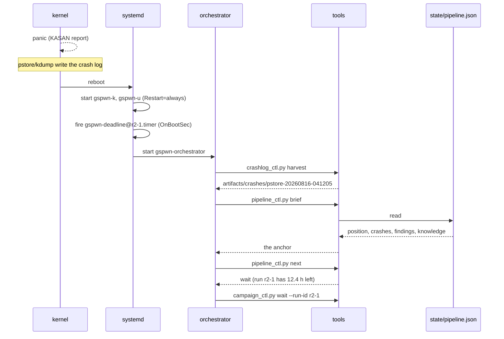

A campaign runs for `loop.campaign_hours`, and the machine panics repeatedly
inside that window by design. Everything that has to survive a panic is written
to disk.

## Mechanisms that survive a panic

| Mechanism | How it survives |
|---|---|
| The fuzz units | `Restart=always` with `RestartSec=30` |
| The campaign deadline | An absolute epoch second in `artifacts/runs/<id>/deadline` |
| Deadline enforcement | `gspwn-deadline@<run-id>.timer`, `OnBootSec` and `OnUnitActiveSec` |
| Coverage sampling | `gspwn-coverage.timer`, same shape |
| Pipeline position | `state/pipeline.json`, written atomically with `fsync` |
| Spend | `state/spend.json`, keyed by run id |
| Crash evidence | pstore, kdump, and the harvest under `artifacts/crashes/` |

Nothing in that list depends on an agent session being alive.

## The deadline file

```
sudo python3 tools/campaign_ctl.py install-k --run-id r2-1
```

```
campaign window: 24 h (stops at epoch 1786000000, enforced by gspwn-deadline@r2-1.timer)
```

A deadline stored on disk is what makes an unattended round end on time across
reboots. After a reboot the check reads the same deadline and still stops on
schedule. Without it nothing ever ends a campaign, because the units restart.

The timer runs `check-deadline` every `loop.deadline_check_min` minutes:

```
python3 tools/campaign_ctl.py check-deadline --run-id r2-1
```

```
run r2-1: 18.3 h left of its campaign window
```

When the window is up it stops **and disables** both units, records the stops
in the campaign log, bills the run's measured hours, and retires its own timer:

```
run r2-1: campaign window elapsed; stopped k, u
billed 23.47 run-hours for run r2-1 (coverage samples; campaign window elapsed)
```

Disabling matters as much as stopping. An enabled `Restart=always` unit comes
back on the next boot, and this pipeline panics by design.

## Missing deadline file

A missing deadline file leaves the campaign unbounded, with `check-deadline`
reporting nothing to enforce on every pass while the units keep fuzzing. The
install event records when the campaign started and the window it was given,
which is the deadline, so it is rebuilt from state:

```
run r2-1: the deadline file was missing; rebuilt it from the install record (window ends at epoch 1786000000)
```

If nothing is on disk and nothing is reconstructible while units are still
fuzzing for that run, the campaign is stopped:

```
ERROR: run r2-1 has no deadline on disk and none reconstructible from the install record, but unit(s) gspwn-k are still fuzzing for it. Nothing bounds what that campaign spends, so it is being stopped. Re-install it with campaign_ctl.py install-k/install-u to start a fresh, bounded window.
```

## Waiting out a campaign across reboots

```
python3 tools/campaign_ctl.py wait --run-id r2-1
```

```
run r2-1: 18.3 h left of its campaign window (ends 2026-08-16 15:31:04)
run r2-1: 18.2 h left of its campaign window (ends 2026-08-16 15:31:04)
```

The heartbeat exists because a silent process blocking for a day is
indistinguishable from a hung one. The interval is `--poll-min`, defaulting to
`loop.deadline_check_min`.

The deadline is re-read on every pass, so a `--replace` install that moves it is
followed correctly.

If the machine panics mid-wait, the process dies with it. Re-run the same
command after the reboot and it resumes against the same deadline.

On return, `wait` checks whether the units are still active and enforces the
deadline itself if the timer never did. Measuring a campaign that is still
running produces the same wrong number that waiting exists to prevent.

## The recovery sequence after a panic



Three commands are the whole procedure, and they need no memory of the previous
session:

```
sudo python3 tools/crashlog_ctl.py harvest
python3 tools/pipeline_ctl.py brief
python3 tools/pipeline_ctl.py next
```

When `gspwn-orchestrator.service` is installed it performs the first two and
launches an agent, so the sequence runs without a human. See
[Unattended operation](/gspwn/guides/unattended-operation/).

## Harvest before restarting anything

```
sudo python3 tools/crashlog_ctl.py harvest
```

pstore is a small fixed-size backend that frees a record only when the file is
deleted. `harvest` copies every record out and then clears it, so the next
panic has somewhere to write. Leaving records in place means lost findings on a
machine that panics by design.

`harvest` copies every unharvested `/var/crash` dump, because several panics
can land between two harvests.

Its exit code distinguishes two answers that must not be confused:

| Exit | Meaning |
|---|---|
| 0 | No new crash logs were found. Nothing to harvest |
| non-zero | A source could not be read. This is not evidence that no crash occurred |

## Re-anchoring a session

```
python3 tools/pipeline_ctl.py brief
```

`brief` is derived from the state file at read time, so it cannot be stale. It
carries where the pipeline is, what is blocked, what the crash registry holds,
what the findings say to target, what the impact records can argue, and the
tail of `knowledge/`.

A saved copy of its output goes out of date the moment the pipeline moves.
Re-run `brief` at the start of every session.

How much it carries is tunable through the `agent` section of
`config/campaign.yaml`, and `--last N` overrides the knowledge depth for one
call.

## Missing spend ledger

```
error: spend ledger state/spend.json is missing, but the state file records 47.2 billed run-hours. Refusing to treat the budget as unspent. Re-seed it from the state file with: python3 tools/pipeline_ctl.py spend-init
```

Every command that reads spend fails closed. Falling back to zero would hand
the loop a fresh budget.

```
python3 tools/pipeline_ctl.py spend-init
```

```
seeded ledger state/spend.json: 47.2 run-hours billed
```

It never lowers recorded spend. With a ledger already present it is a no-op and
says so, so it cannot be used to wipe the budget.

## Resuming a round

`pipeline_ctl.py next` refuses to run ahead of a campaign that is still
fuzzing:

```
wait  (run r2-1 has 12.4 h left of its campaign window; the round cannot be measured until it ends: python3 tools/campaign_ctl.py wait --run-id r2-1)
```

The `fuzz` phase itself is exempt, because it is what starts the campaign.

`round-end` refuses for the same reason:

```
error: refusing to measure a live campaign: run r2-1 has 12.4 h left. The curve, the billed hours and the crash count would all describe the part of the run that happened to be over. Wait it out with `python3 tools/campaign_ctl.py wait --run-id <id>`, or pass --force if the campaign really is finished and only its deadline file is stale.
```

## See also

- [Unattended operation](/gspwn/guides/unattended-operation/) installs the
  supervisor that runs the recovery sequence without a human.
- [Durability](/gspwn/architecture/durability/) covers the write path.
- [Disk and crash logs](/gspwn/guides/disk-and-crash-logs/) covers capture and
  pruning.
