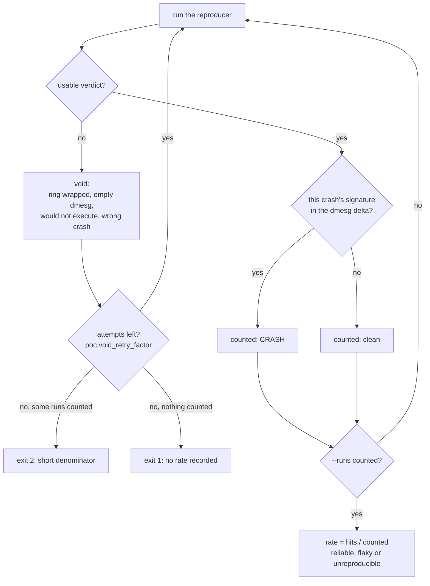

`tools/repro_ctl.py` extracts a reproducer and measures how often it works. A
disclosure package is built on the rate and the classification it records.

## 1. Stop the campaign

Track K verification refuses while `gspwn-k` reports `active` or `activating`:

```
refusing to verify while gspwn-k is still fuzzing: a run is scored as a reproduction when the box goes down during it, and the fuzzer panics this machine by design, so every one of its panics would count as a hit for this crash. Stop the campaign first (sudo python3 tools/campaign_ctl.py stop k), or pass --allow-live-campaign if you accept the inflated rate.
```

The phase order already guarantees it: `fuzz` does not finish until the
campaign window has closed and the deadline timer has stopped the units. On a
machine with no systemd the check cannot answer either way, and verification
proceeds.

`--allow-live-campaign` proceeds against a live campaign, and the recorded rate
is then an overestimate.

## 2. Extract the reproducer

```
python3 tools/repro_ctl.py extract crash-0001
```

Track K copies the syzkaller crash directory into
`artifacts/pocs/<crash-id>/` and normalises the names as it goes. Every copy
goes through a temporary file, an `fsync` and a rename, so a panic mid-extract
leaves no truncated artefact behind.

| Source in the crash directory | Stored as |
|---|---|
| `repro.prog`, or `repro.syz` in a hand-assembled directory | `repro.prog` |
| `repro.cprog`, `repro.report`, `repro.log`, `repro.stats`, `repro.c`, `description` | their own names |
| `report0`, or the lowest-numbered `report<N>` | `report` |
| `log0`, or the lowest-numbered `log<N>` | `log` |

```
extracted to artifacts/pocs/crash-0001: repro.prog, repro.cprog, description, report, log, repro.c (from repro.cprog)
```

`repro.c` comes from `repro.cprog` when that file is non-empty, because
syz-manager already ran prog2c on that program and reproduced the crash with
the result on the machine that faulted. Otherwise `syz-prog2c` translates
`repro.prog`. A zero-byte `repro.c` is the residue of a failed `syz-prog2c`, so
it is treated as missing and regenerated, and the regeneration is announced.

Normalising `report<N>` to `report` also feeds the crash signature.
`repro_ctl.py` reads `artifacts/pocs/<crash-id>/report` for the stack frames a
signature is built from, and syzkaller writes no unsuffixed form.

Three extractions end without a reproducer, each with its own message.

| Condition | Outcome |
|---|---|
| The crash directory holds neither a reproducer program nor a non-empty `repro.cprog` | `WARN` naming the directory. `verify` has nothing to run, and the crash is recorded `unreproducible` |
| The registry `dir` names a kernel log file, so no syzkaller crash directory exists | exit 1. The crash was harvested from dmesg, so syz-manager never saw it. A reproducer written by hand into `artifacts/pocs/<crash-id>/repro.c` is the only route to a PoC |
| `syz-prog2c` failed or produced an empty file | exit 1 with the return code. `repro.c` is left unwritten |

Track U copies the registry crash input to `artifacts/pocs/<crash-id>/input`.
An identical existing file is left alone. Differing existing content is refused
unless `--force` is passed. `--force` on a Track K crash prints a `WARN`
recording that it changed nothing, because Track K extraction refreshes every
artefact it copies.

When syz-manager never produced a reproducer, the crash is recorded as
`unreproducible` and no reproducer is hand-crafted for it.

## 3. Verify, Track K

```
python3 tools/repro_ctl.py verify crash-0001 --runs 10
```

```
crash-0001: crash signature funcs=['uvm_va_range_destroy', 'uvm_range_group_free'] phrases=['KASAN: use-after-free in uvm_va_range_destroy']
run 1 (1/10 counted): CRASH (uvm_va_range_destroy)
run 2 (2/10 counted): clean
run 3 (2/10 counted): VOID (dmesg ring wrapped; delta not computable)
...
crash-0001: 9/10 (90%) -> reliable [1 void run(s) excluded]
```

`--runs` means counted runs, defaults to `poc.default_runs`, and must be at
least 1. Resuming with a smaller `--runs` never rewrites an earlier, larger
measurement, and it reports the accumulated one:

```
already have 10 counted run(s) (>= 4 requested); use --restart to redo
```

`--restart` discards partial progress and starts from run 1.

Four preconditions are checked before any run is scored.

| Precondition | On failure |
|---|---|
| `artifacts/pocs/<crash-id>/repro.c` exists and is non-empty | exit 1, pointing back at `extract` |
| `gcc -pthread -static` builds it | exit 1 with the compiler's return code, pointing back at `extract` |
| A crash-specific signature can be derived from the title and the registered report | exit 1. Scoring against generic `BUG:` and `Oops` patterns would let any crash in the window trip |
| `dmesg` returns output | exit 1. With `kernel.dmesg_restrict=1` a non-root `dmesg` returns nothing, every run would score clean, and the crash would be misclassified `unreproducible` |

The tool rebuilds when `repro.c` is newer than the compiled binary. Without
that check, a `repro.c` regenerated by a later `extract` would be verified
through the previous binary, and neither file looks wrong on its own.

## 4. Verify, Track U

```
python3 tools/repro_ctl.py verify crash-0004 --track u \
  --cmd './build/parse_cfg {input}'
```

`--cmd` is required for a Track U crash and must contain `{input}`, which is
replaced with the shell-quoted path of `artifacts/pocs/<crash-id>/input`. Take
the template from the harness's entry in `harnesses/TARGETS.md`. When that
entry is missing, the crash is blocked on the `harness` phase.

`--crash-exit N` makes exit code `N` count as a reproduction alongside the
sanitizer signatures.

The last run's output is kept at `artifacts/pocs/<crash-id>/last-run.log` for
the PoC README, with the exit code appended.

`--cmd` and `--crash-exit` against a Track K crash exit 1. The registry decides
the track, and `--track` only cross-checks it.

## Hit conditions

A run is a hit only when the evidence ties to this crash. Each hit records an
evidence class in `repro_progress`.



| Track | Hit condition | Evidence class |
|---|---|---|
| K | this crash's signature appears in the dmesg delta | `dmesg-signature` |
| K | the run timed out and the crash title is hang-class | `timeout-hang-class` |
| K | the boot id changed and a harvested crash log carries this crash's signature | `harvested-log-signature` |
| K | the boot id changed and no crash logs were recoverable | `boot-id-change-only`, counted separately as a weak hit |
| U | a sanitizer signature appears in the harness output | `sanitizer-signature` |
| U | the harness timed out and the crash title is hang-class | `timeout-hang-class` |
| U | the harness exit code matched `--crash-exit` | `exit-condition` |

The signature is derived at verification start from the registry title with
volatile fields removed, plus the top `triage.signature_frames` stack frames of
the registered report. A generic `BUG:` or `Oops` in the window never scores on
its own, because the fuzzer panics this machine by design and any-crash
matching would inflate the rate that gates disclosure.

Hang-class titles are matched on `hung task`, `task hung`, `watchdog`,
`soft lockup`, `softlockup`, `rcu_sched`, `rcu_preempt` and `deadlock`.

The harvested log a recovery reads is the newest `artifacts/crashes/pstore-*`
directory, and only when its modification time is later than the current boot.
`vmcore` files and files above 32 MB are skipped, because the dmesg or console
text beside them carries the signature.

## Void runs

A void run produces no usable verdict. It is excluded from both the numerator
and the denominator, and re-run. Ten conditions void a run.

| Track | Condition | Recorded detail |
|---|---|---|
| K | the reproducer would not execute | `repro would not run: <error>` |
| K | `dmesg` returned nothing before or after the run | `dmesg returned no output mid-run` |
| K | the run timed out and the title has no hang-class marker | `repro timed out after <N>s` |
| K | the dmesg ring wrapped past the anchor | `dmesg ring wrapped; delta not computable` |
| U | the harness command could not be launched | `harness infra failure: <error>` |
| U | the harness exited 126 or 127 | `harness infra failure (exit <N>: command not runnable)` |
| U | the harness timed out and the title has no hang-class marker | `harness timed out after <N>s` |
| both | a run left in flight ended on the same boot id | `ended without a verdict on the same boot` |
| both | the boot id changed and the harvested log shows a different crash | `the harvested crash log shows a different crash` |
| U | the boot id changed and no crash logs were recoverable | `a track U replay cannot panic the kernel` |

A wrapped ring holds crash reports from earlier runs, so scanning it would
score a hit on every later run. An empty before-and-after dmesg pair reads as a
clean run and manufactures a 0% rate. A verification process that died on the
same boot through Ctrl-C or an OOM kill proves nothing about the kernel.

Verification keeps going until enough verdicts are recorded, bounded by an
attempt cap of `runs_done + poc.void_retry_factor x (runs still needed) + 5`.
At the shipped `void_retry_factor` of 2, a fresh `--runs 10` verification gives
up after 25 attempts:

```
giving up after 25 attempts: too many void runs
```

## Classification

The hit rate over the counted runs decides the status.

| Rate | Status |
|---|---|
| at or above `poc.reliable_threshold` | `reliable` |
| above 0, below the threshold | `flaky` |
| exactly 0 | `unreproducible` |

Both `reliable` and `flaky` are reportable. The label travels into the report,
and races and use-after-free bugs are routinely flaky. Every classification is
appended to the crash's history trail, so a re-measurement does not erase the
previous one.

The summary line carries up to three bracketed notes: how many void runs were
excluded, how many timeouts occurred and how they split between hang-class hits
and voids, and how many hits rest on boot-id-change-only evidence.

## Exit codes

Three exit codes report what the verification protocol achieved.

| Code | Meaning |
|---|---|
| 0 | the protocol was satisfied: at least `--runs` counted runs |
| 1 | a precondition failed, or no counted runs completed so no rate was recorded |
| 2 | a rate was recorded on fewer counted runs than requested, because the attempt cap fired |

Exit 1 with no counted runs prints the void total and records nothing:

```
crash-0001: 0 counted runs (14 void) — no rate recorded
```

Exit 2 prints the shortfall explicitly:

```
crash-0001: protocol shortfall — 6 of 10 requested runs counted (attempt cap); the rate above is recorded on a short denominator
```

`repro_runs_counted` and `repro_runs_requested` are stored next to the rate, so
a short denominator is visible to any consumer.

## Panics during verification

A kernel reproducer often takes the machine down mid-run. Progress is persisted
before and after every run, so the run that panicked is recovered on the next
invocation:

```
recovered run 4: machine rebooted mid-run and the harvested crash log contains this crash's signature (uvm_va_range_destroy) -> counted as CRASH
```

Run `crashlog_ctl.py harvest` before re-invoking `verify`, because the recovery
reads the newest harvest directory and treats one older than the current boot
as absent.

Re-run the same command to resume. `--restart` discards recorded reproductions
and understates the rate, so use it only when the measurement is deliberately
being redone.

## Mutual exclusion

`verify` holds an exclusive `flock` on `state/repro.lock` for its whole
session. Two concurrent verifiers share one dmesg ring and would corrupt each
other's delta windows, so a second session exits 1 immediately. It never
queues, because a queued verification would start against a ring full of the
other session's crashes:

```
another repro_ctl verify session holds state/repro.lock — concurrent verifiers share one dmesg ring and would corrupt each other's windows; wait for it to finish
```

The lock file is created in the machine's own state directory and does not
follow `GSPWN_STATE`, because what it protects is the one ring buffer. Two runs
with separate registries still exclude each other.

## The container profile check

Run this for every Track K crash that reached `reliable` or `flaky`, before it
is written up as tenant-reachable.

syzkaller runs under `sandbox: namespace`, which holds a full capability set
inside a fresh user namespace. A container tenant has dropped capabilities, a
seccomp filter and a device cgroup allowlist. syzkaller therefore reaches paths
the attacker cannot, and that gap produces over-claims.

```
docker run --rm --runtime=nvidia \
  -e NVIDIA_VISIBLE_DEVICES=all \
  -e NVIDIA_DRIVER_CAPABILITIES=compute,utility \
  --user 1000:1000 \
  -v $PWD/artifacts/pocs/crash-0001:/poc:ro \
  <cuda-runtime-image> /poc/repro
```

`--runtime=nvidia` with `NVIDIA_VISIBLE_DEVICES` replaces `--gpus all` here,
because what `--gpus` resolves to changed with the Docker Engine version.

| Docker Engine | `--gpus` resolves through | Device set |
|---|---|---|
| 29.1.x and older | the `nvidia-container-runtime-hook` prestart hook, pinned to legacy at `cmd/nvidia-container-runtime-hook/hook_config.go:120-123` | no modeset node and no DRM node |
| 29.2.0 and later | a CDI specification | the set `--runtime=nvidia` reaches, so the two forms are equivalent |

On the older path a reproducer needing the modeset node or a DRM node fails and
is recorded `not-tenant-reachable`, understating the finding.

Record one of three outcomes in the PoC README.

| Outcome | Condition | Consequence |
|---|---|---|
| `tenant-reachable` | the reproducer reproduces inside that container | the only outcome supporting the tenant-reachability claim |
| `not-tenant-reachable` | it needs privilege the model's attacker does not have | still a real driver bug. The impact statement names the privilege it needs |
| `profile-check-blocked` | the check could not be run: no suitable image, no Docker, or the reproducer needs a kernel-side harness | record why. Never recorded as tenant-reachable by default |

Confirm what the container actually received before trusting the result:

```
ls /dev/nvidia* /dev/dri
```

Compare that list against the model, which
`python3 tools/verify_tenant_surface.py expected` prints. The comparison runs
in both directions.

| Disagreement | Consequence for the run |
|---|---|
| a node the model places outside the tenant surface is present | the run is wider than the model, and it establishes nothing about tenant reach |
| a node the model places inside the tenant surface is absent | the run is narrower than the model, and a failure in it establishes nothing either |

`/dev/nvidia-nvswitch*` is the one exception. It is conditional on
`NVIDIA_NVSWITCH`, so its absence is no disagreement. Record it in the impact
statement where it is present.

## Write the PoC README

`artifacts/pocs/<crash-id>/README.md` carries the build steps, the run steps,
the expected sanitizer signature, the reproduction rate, the profile-check
outcome, and the preconditions. For Track U it states the exact privileges the
attacker needs.

## See also

- [Impact and severity](/gspwn/architecture/impact-and-severity/) covers what
  the report can argue from a verified reproducer.
- [repro_ctl.py reference](/gspwn/architecture/components/repro-ctl/)
