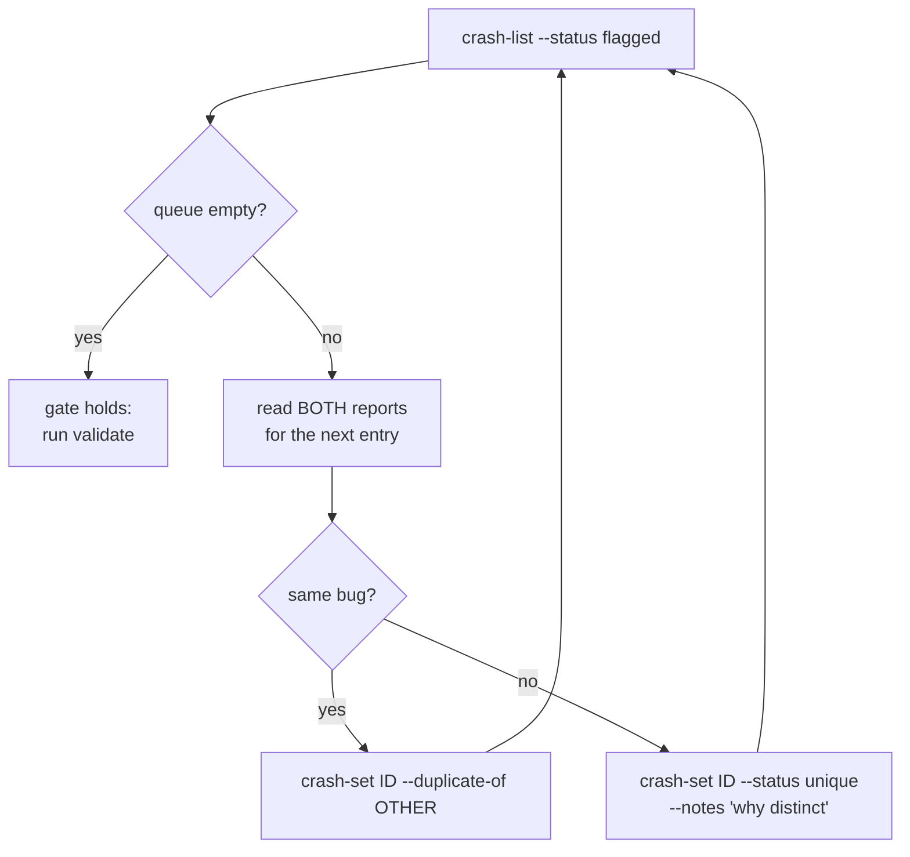

Triage turns raw crash artifacts into a deduplicated registry. The gate is an
empty flagged queue and a clean `validate`. Steps 1 to 5 run in order after
every campaign.

## 1. Scan every source

```
python3 tools/crash_parse.py --run-id r2-1
```

That call covers two sources: the syzkaller workdir at
`artifacts/runs/<id>/workdir/crashes/`, and the Track U crash directory at
`artifacts/u-crashes/`.

Always pass `--run-id`. Without it the tool falls back to the last run
registered in the current round, which is the wrong workdir in a round with
several campaigns. It warns only when no run is registered at all:

```
WARN: no run id given and none registered in this round — skipping the syzkaller workdir. Pass --run-id, or register the run with pipeline_ctl.py round-add-run.
```

A `WARN` naming a missing crashes directory means nothing was scanned. It says
nothing about whether the run crashed. Check the run id and re-run.

## 2. Scan the kernel logs

Kernel logs are scanned separately, one file at a time:

```
for f in <harvest>/dmesg-ramoops-*; do python3 tools/crash_parse.py --dmesg "$f"; done
for f in <harvest>/kdump-*/dmesg.* <harvest>/kdump-*/dump/dmesg.*; do
  [ -e "$f" ] && python3 tools/crash_parse.py --dmesg "$f"
done
```

On EC2 harvests, also parse the console log:

```
[ -e <harvest>/console-output.log ] && python3 tools/crash_parse.py --dmesg <harvest>/console-output.log
```

A named `--dmesg` path that does not exist is reported and skipped, and the
scan continues. A wrong harvest directory therefore registers nothing and
still exits 0, so read the `WARN` lines.

## 3. Read the output

```
NEW crash-0001 KASAN: use-after-free in uvm_va_range_destroy
NEW crash-0002 NVRM Xid 13 [noise]
DUP KASAN: use-after-free in uvm_va_range_destroy -> crash-0001 (registered crash-0007 as duplicate; sources linked)
FLAG crash-0008 Kernel panic - not syncing: Fatal exception (same title as crash-0003, different stack) — decide with: pipeline_ctl.py crash-set crash-0008 --duplicate-of crash-0003 | --status unique
registry now holds 8 crashes
1 flagged — every one needs a decision before the triage gate holds: python3 tools/pipeline_ctl.py crash-list --status flagged
```

| Line | Meaning |
|---|---|
| `NEW` | A crash with no prior match on either key |
| `DUP ... -> <id>` naming a new id | The same title and stack from a new source, registered as a duplicate linked to the surviving entry |
| `DUP ... -> <id>` naming no new id | The identical sighting re-read from the identical source, so nothing was registered |
| `FLAG` | A collision in one key with no confirmation from the other, needing a human decision |

The same panic is often recorded twice, once in the syzkaller workdir and again
in the harvested dmesg. Those duplicates belong in the counts, and only
`flagged` entries need a decision.

## 4. Work the flagged queue

```
python3 tools/pipeline_ctl.py crash-list --status flagged
```

```
crash-0008 [K] flagged        Kernel panic - not syncing: Fatal exception
crash-0011 [K] flagged        BUG: unable to handle page fault for address 0xADDR
```



The flag exists because a machine could not tell the two apart, so the decision
needs both reports read.

```
python3 tools/pipeline_ctl.py crash-set crash-0008 --duplicate-of crash-0003
python3 tools/pipeline_ctl.py crash-set crash-0011 --status unique --notes "different faulting object"
```

One generic panic title with a varying stack flags every distinct stack, so
`crash-set` takes several ids and applies the same edit to each:

```
python3 tools/pipeline_ctl.py crash-set crash-0012 crash-0013 crash-0014 \
  --duplicate-of crash-0003
```

The call is all-or-nothing, and a rejected id aborts the whole transaction
naming the id it refused. Group only what has actually been read.

### Correcting a mistake

```
python3 tools/pipeline_ctl.py crash-set crash-0012 --duplicate-of none
```

Clearing the link also clears the verdict, returning the crash to the unique
queue. Without that, the crash would keep `status=duplicate` with nothing to
duplicate and stay excluded from the RCA queue.

`--status duplicate` without a `--duplicate-of` link is refused: a crash that
leaves the queue must record what it duplicates.

## 5. Check the registry before handing off

```
python3 tools/pipeline_ctl.py validate
```

```
state is consistent
```

`validate` must print that before the triage gate holds. It exits 1 and prints
one `PROBLEM:` line per failure, covering a phase marked done ahead of its
dependency, a duplicate with no link to a surviving entry, a duplicate chain, a
crash analysed by `rca` with no research record, an impact record whose
consequence outruns its primitive, and dedup settings that moved underneath the
registry's stored hashes.

## Xid classification

NVRM entries carry a classification set at registration, visible in
`crash-list` and filterable with `--signal`.

| Class | Meaning | Action |
|---|---|---|
| `noise` | The fuzzer produces these by design: illegal instruction, illegal address, app-caused channel error | Not queued for RCA. Kept as an audit trail |
| `signal` | Memory-integrity or firmware-boundary Xids: ECC classes, GSP RPC timeout, corrupted push buffer | Queue for RCA |
| `health` | The GPU or the machine is degraded, notably Xid 79, fallen off the bus | Not a finding. The measurement path is broken |
| `review` | Anything not in the table, including Xids from a driver branch the table predates | Read it before deciding |

```
python3 tools/pipeline_ctl.py crash-list --signal signal
```

The default for an unlisted Xid is `review`, because a new driver branch can
introduce an Xid the table has never seen, and a `noise` default would discard
the one class of finding the campaign exists to produce.

The per-number table is `XID_CLASS` in `tools/crash_parse.py`.

Reclassifying is recorded as a judgement in the crash entry. An Xid classed
`noise` that looks like a finding gets a note saying why before it is promoted.

## Exclusions from the finding count

Three kinds of registry entry are excluded from every crash count the tools
derive.

| Entry | Reason for exclusion |
|---|---|
| Duplicates | The same bug sighted twice |
| Unresolved flagged collisions | The one-bug-or-two decision is still open |
| Noise Xids | The fuzzer produces them by design |

`show` and `brief` print the noise share on the line below the total, so a
registry of 412 crashes reports how many of them are findings:

```
crashes: 412 total (duplicate=3, flagged=1, unique=408)
  of these 402 are noise Xids (the fuzzer causes them by design, and they are not counted as findings)
```

The status counts sum to the total. The noise count is a second reading of the
same registry, because a noise Xid carries a status like any other entry.

## Prioritise for RCA

The queue order the `triage` phase writes to `artifacts/crashes/QUEUE.md`:

| Rank | Class |
|---|---|
| 1 | KASAN use-after-free and out-of-bounds writes, and Track U ASan heap corruption |
| 2 | Every other KASAN report |
| 3 | NVRM entries classed `signal` or `review` |
| 4 | Panics carrying no sanitizer report |

## See also

- [Crash identity](/gspwn/architecture/crash-identity/) explains the dedup
  algorithm.
- [Reproducing a crash](/gspwn/guides/reproducing-a-crash/) is the next phase.
