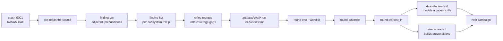

A round produces two signals. Coverage identifies the surface the fuzzer has
**not reached**. Findings identify the code that **has produced bugs**.

A loop that follows coverage alone keeps widening the surface and never returns
to a subsystem that already yielded a bug. The research record is the only path
by which a finding changes where the fuzzer looks.

## The chain



## 1. rca records the finding

```
python3 tools/pipeline_ctl.py finding-set crash-0001 --json - <<'JSON'
{"subsystem": "nvidia_uvm",
 "bug_class": "uaf",
 "trigger": "ioctl-sequence",
 "ioctls": ["UVM_CREATE_RANGE_GROUP", "UVM_FREE"],
 "preconditions": ["channel bound", "async work in flight"],
 "adjacent": ["UVM_DESTROY_RANGE_GROUP", "UVM_UNMAP_EXTERNAL"],
 "source_refs": ["uvm_range_group.c:412"],
 "hypothesis": "teardown paths skip the in-flight refcount check",
 "confidence": "medium"}
JSON
```

```
crash-0001: nvidia_uvm uaf/ioctl-sequence (confidence medium)
  next round can target: UVM_CREATE_RANGE_GROUP, UVM_DESTROY_RANGE_GROUP, UVM_FREE, UVM_UNMAP_EXTERNAL
```

Three fields do the steering:

| Field | Consumed by | Contents |
|---|---|---|
| `adjacent` | `describe` | Calls sharing an object, lock, refcount or teardown path with the fault, that this reproducer never exercised |
| `preconditions` | `seeds` | The object state that must exist before the bug class is reachable |
| `hypothesis` | `describe` | The underlying pattern, as a reason to model more of it |

`adjacent` is the only field carrying information the crash does not already
contain. `ioctls` is transcribed from the reproducer and `preconditions` mostly
from the same place, and a round can act on neither to look anywhere it has not
already looked.

Finding adjacent calls means reading source: take the object the bug touches,
find its other callers, and list the ones this reproducer never reached.

### Required record fields

A record is refused outright when it names no subsystem, or when it carries
none of `ioctls`, `preconditions` or `adjacent`. A taxonomy with nothing to
target is a label and directs no work.

A record that is accepted can still steer nothing. An empty `adjacent` is
allowed only when `no_adjacent_reason` says why:

```json
{"subsystem": "nvidia_rm",
 "bug_class": "null-deref",
 "trigger": "single-ioctl",
 "ioctls": ["NV_ESC_RM_CONTROL"],
 "adjacent": [],
 "no_adjacent_reason": "the fault path enters GSP RPC, so the other callers of the object are not visible from the kernel side",
 "confidence": "low"}
```

A bug with no siblings on its lock or teardown path is a valid answer, as is a
path that enters firmware. An invented neighbouring call sends the next round
at a wrong target, and that target is modelled and measured before the error
becomes visible.

## 2. Read the finding list

```
python3 tools/pipeline_ctl.py finding-list
```

```
crash-0001 [nvidia_uvm] uaf/ioctl-sequence  confidence=medium
    ioctls:        UVM_CREATE_RANGE_GROUP, UVM_FREE
    preconditions: channel bound, async work in flight
    adjacent:      UVM_DESTROY_RANGE_GROUP, UVM_UNMAP_EXTERNAL
    source:        uvm_range_group.c:412
    hypothesis:    teardown paths skip the in-flight refcount check
crash-0004 [nvidia_rm] refcount/fd-lifecycle  confidence=low
    ioctls:        NV_ESC_RM_FREE
    adjacent:      NV_ESC_RM_FREE
    STEERS NOTHING: every adjacent call is already in ioctls, so the record names no call the reproducer did not already make and adds nothing to the next round's worklist

by subsystem (what refine raises priority from):
  nvidia_uvm               3 finding(s)  uaf, refcount
  nvidia_rm                1 finding(s)  refcount

2 of 3 record(s) can send the next round somewhere new.
These cannot, and rca should revisit them:
  crash-0004: every adjacent call is already in ioctls, so the record names no call the reproducer did not already make and adds nothing to the next round's worklist
```

The closing count measures the `rca` phase. A round where every record was
accepted and none of them steer produces no work for the next round, and
`validate` reports it:

```
PROBLEM: crash-0004 has a finding that steers nothing: every adjacent call is already in ioctls, ...
```

The per-subsystem rollup is the target register. It records that `nvidia_uvm`
has produced three findings and `nvidia_rm` one, which is the loop's only
non-coverage evidence for where to look next.

## 3. refine merges both signals

The `refine` phase classifies every coverage gap by **why** it is uncovered:

| Classification | Fix | Phase |
|---|---|---|
| `unmodeled` | Author a description | `describe` |
| `mismodeled` | Correct the description: wrong struct, wrong direction, bad constraint | `describe` |
| `unreachable-by-construction` | Trace a real workload for the object chain | `seeds` |
| Out of scope or firmware | Nothing. Record it so the report's coverage claims stay correctly scoped | none |

Then it derives the finding-adjacent work: `adjacent` calls become describe
items, `preconditions` become seeds items, and the hypothesis may suggest
further items in the same subsystem.

Weighting follows the rollup. A subsystem with several findings ranks above a
coverage gap in an area that has produced none. A subsystem with no finding
across two rounds despite good coverage ranks below them, and `gaps.md` records
that, because it is a result the next round should not rediscover.

:::caution[A hypothesis only ever adds]
Nothing may remove or deprioritise a target because a hypothesis suggests the
bug is elsewhere. `rca` is the only judgement in this loop, so a confident
wrong one would otherwise narrow every remaining round.
:::

## 4. The two output files

`artifacts/eval/<run-id>/gaps.md` holds one row per gap: the ioctl or
subsystem, the evidence it is uncovered, the classification and the specific
next action. No action may be "investigate further".

`artifacts/eval/<run-id>/worklist.md` holds the ordered, deduplicated work
items for the next round, split into a describe section and a seeds section.
The next round's sub-agents are prompted with this file, so it is written for
them.

Every item carries its source:

```
## describe
- [finding crash-0001] Model UVM_DESTROY_RANGE_GROUP: shares the range-group
  object with the UAF in crash-0001, never exercised by its reproducer.
- [finding crash-0001] Model UVM_UNMAP_EXTERNAL: same teardown path.
- [surface] NV_ESC_RM_CONTROL command 0x20800110 is modeled as an opaque
  buffer; attach the real parameter struct.

## seeds
- [finding crash-0001] Trace a workload that binds a channel and leaves async
  work in flight, which is the precondition the UAF needed.
- [surface] Trace a workload reaching nvidia_uvm external-range creation,
  classified unreachable-by-construction.
```

A `[surface]` item marks an enumerated command the corpus has not reached. A
`[finding crash-NNNN]` item marks surface that has already produced a bug, and
the `describe` sub-agent works those first. A `[history CVE-YYYY-NNNNN]` item
marks a place a published fix changed.

A target that no round will reach belongs in the completion ledger and not in
the worklist. `pipeline_ctl.py surface-account` records the reason, and
"not reached yet" is refused by the vocabulary.

## 5. Record the work list in the round

```
python3 tools/pipeline_ctl.py round-end --from-run r2-1 \
  --worklist artifacts/eval/r2-1/worklist.md
python3 tools/pipeline_ctl.py round-decide
python3 tools/pipeline_ctl.py round-advance
```

`--worklist` records the path in the round. `round-advance` carries it into the
new round as `worklist_in`. Omitting it leaves the next round with no work
list, and the loop repeats the campaign it just ran.

The handoff travels in the state file, so the next sub-agent does not have to
guess the previous run id.

## 6. The next round reads the work list

```
python3 tools/pipeline_ctl.py worklist
```

```
artifacts/eval/r2-1/worklist.md
```

It exits 1 when there is none, which is round 1, and 1 with a message when
`refine` recorded a path whose file is missing:

```
artifacts/eval/r2-1/worklist.md (MISSING: refine recorded it but the file is not there)
```

A non-zero exit in round 2 or later is a blocked gate, and round 1's work is
not repeated in its place.

## Verifying the feedback edge

The `refine` gate reports the split of work items by source. A round in which
`rca` recorded findings but the work list carries no `[finding ...]` item has
broken the feedback edge, and the next round will repeat this one's search.

The `describe` gate reports, per finding item, what was modelled and whether
the smoke run reached it. An item that stays uncovered after modelling is a
finding about the model. It is recorded in the audit file and carried into the
next work list.

## See also

- [Sub-agents](/gspwn/architecture/sub-agents/) shows the feedback path in the
  wider system.
- [Impact and severity](/gspwn/architecture/impact-and-severity/) covers the
  other record `rca` produces.
