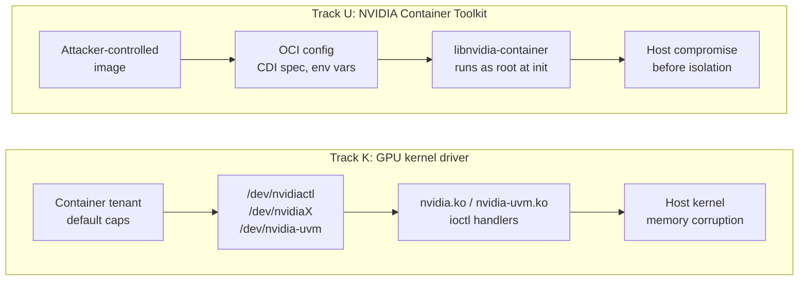

import NavCard from '../../components/NavCard.astro';

gspwn runs unattended on a machine it panics on purpose. Each round models an
interface, generates seeds, runs a bounded fuzzing campaign, deduplicates the
crashes, analyses them, verifies reproducers, measures the round, and writes the
work list the next round executes. Rounds continue until the species discovery
curve plateaus or a declared cap trips.

Two fuzzing methods run under that loop. Track K drives the driver's ioctl
surface with grammar-based generative fuzzing steered by KCOV edge coverage,
with KASAN as the oracle. Track U drives the toolkit's parsing and path-handling
surface with mutational coverage-guided fuzzing, with AddressSanitizer and
UndefinedBehaviorSanitizer as the oracle.

Campaign output is a set of verified vulnerabilities: deduplicated crashes, each
carrying a root-cause analysis, a reproducer with a measured reproduction rate,
an argued severity, and a disclosure package.

## Rationale

GPU capacity at cloud providers is growing, and much of it reaches tenants as a
sandbox: a training job, an inference endpoint, a hosted notebook, a playground
instance. Those sandboxes put untrusted code directly against the driver's ioctl
surface through `/dev/nvidiactl`, `/dev/nvidiaX` and `/dev/nvidia-uvm`. The
container runtime that admits them parses attacker-controlled image metadata as
root, during container init, before isolation is enforced.

A memory-safety defect reachable from a default container capability set
therefore carries a wide blast radius. One driver build runs across a provider's
fleet, and the vulnerable surface is reachable from the lowest-privilege
position that provider sells.

A second objective is the loop itself. gspwn is a testbed for autonomous
research on a task that runs for days, bills real money per hour, and reports
results that can be checked against artifacts on disk. The same work builds
working knowledge of the GPU driver stack.

## The two targets

gspwn attacks two codebases, called tracks.

**Track K** is the NVIDIA GPU kernel driver, `open-gpu-kernel-modules`. The
attacker is a container tenant holding the device nodes a default
`compute,utility` capability set grants: `/dev/nvidiactl`, `/dev/nvidiaX` and
`/dev/nvidia-uvm[-tools]`. syzkaller drives those ioctl surfaces against a
kernel built with KASAN and KCOV.

**Track U** is the NVIDIA Container Toolkit, `libnvidia-container` and
`nvidia-container-toolkit`. The attacker controls the container image, and the
code under test runs as root during container init before isolation is
enforced. libFuzzer and AFL++ harnesses drive the parsing and path-handling
surface.

## A fuzzing campaign produces

| Output | Where it lands |
|---|---|
| Deduplicated crash registry | `state/pipeline.json` |
| Root-cause analysis per unique crash | `artifacts/rca/<crash-id>.md` |
| Research record and impact record per analysed crash | the registry entry |
| Verified reproducer with a measured reproduction rate | `artifacts/pocs/<crash-id>/` |
| Per-run coverage series | `artifacts/runs/<run-id>/coverage.csv` |
| Work list steering the next round | `artifacts/eval/<run-id>/worklist.md` |
| Penetration-test-style report | `artifacts/report/<date>-report.md` |
| PSIRT-ready disclosure packages | `artifacts/report/disclosure/<crash-id>/` |

## Where to go next

  <NavCard title="Quickstart" href="/gspwn/getting-started/quickstart/" icon="rocket">
    The shortest path to a verified install on a machine with no GPU.
  </NavCard>
  <NavCard title="Architecture" href="/gspwn/architecture/overview/" icon="puzzle">
    The layers, the four state stores, the round loop, and how a campaign
    recovers from the panics it causes.
  </NavCard>
  <NavCard title="Requirements" href="/gspwn/getting-started/requirements/" icon="setting">
    Linux only, Debian family, root, and a Turing-or-later GPU.
  </NavCard>
  <NavCard title="Loops" href="/gspwn/architecture/loops/" icon="random">
    Every loop in the system, drawn: the round loop, the campaign window, the
    triage and verification cycles, and the restart breaker.
  </NavCard>

