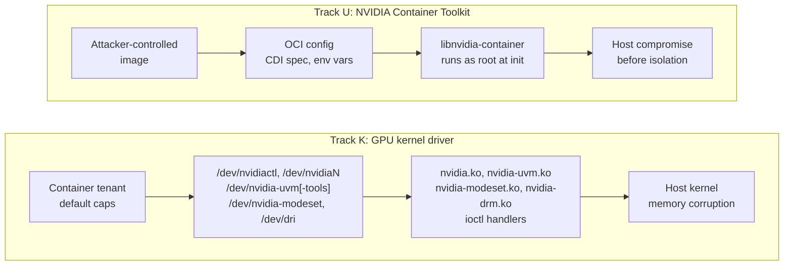

import NavCard from '../../components/NavCard.astro';

gspwn runs unattended on a machine it panics on purpose. Each round models an
interface, generates seeds, runs a bounded fuzzing campaign, deduplicates the
crashes, analyses them, verifies reproducers, measures the round, and writes the
work list the next round executes. Rounds continue until every enumerated
ioctl target is either exercised or carries a written reason, until the species
discovery curve plateaus, or until a declared cap trips.

Campaign output is a set of verified vulnerabilities: deduplicated crashes, each
carrying a root-cause analysis, a reproducer with a measured reproduction rate,
an argued severity, and a disclosure package.

## Rationale

GPU capacity at cloud providers is growing, and much of it reaches tenants as a
sandbox: a training job, an inference endpoint, a hosted notebook, a playground
instance. Those sandboxes put untrusted code directly against the driver's ioctl
surface through `/dev/nvidiactl`, `/dev/nvidiaN`, `/dev/nvidia-uvm`,
`/dev/nvidia-modeset` and `/dev/dri`. The container runtime that admits them
parses attacker-controlled image metadata as root, during container init, before
isolation is enforced.

A memory-safety defect reachable from a default container capability set
therefore carries a wide blast radius. One driver build runs across a provider's
fleet, and the vulnerable surface is reachable from the lowest-privilege
position that provider sells.

The loop itself is a second objective. gspwn is a testbed for autonomous
research on a task that runs for days, bills real money per hour, and reports
results that can be checked against artifacts on disk. The same work builds
working knowledge of the GPU driver stack.

## The two targets

gspwn attacks two codebases, called tracks.

**Track K** is the NVIDIA GPU kernel driver, `open-gpu-kernel-modules`. The
attacker is a container tenant holding the device nodes a default
`compute,utility` capability set reaches: `/dev/nvidiactl`, `/dev/nvidiaN`,
`/dev/nvidia-uvm[-tools]`, `/dev/nvidia-modeset` and `/dev/dri/cardN` with
`/dev/dri/renderDN`. syzkaller drives those ioctl surfaces with grammar-based
generative fuzzing, against a kernel built with KCOV for edge coverage and
KASAN as the oracle.

Track K's denominator is enumerated from driver source: 852 reachable commands
across seven families for driver 610.57.04, with a further 351 counted
separately across six groups and held outside it. The
[enumerated surface](/gspwn/reference/surface/) pages list every command in
both sets.

**Track U** is the NVIDIA Container Toolkit, `libnvidia-container` and
`nvidia-container-toolkit`. The attacker controls the container image, and the
code under test runs as root during container init before isolation is
enforced. libFuzzer and AFL++ harnesses drive the parsing and path-handling
surface with mutational coverage-guided fuzzing. AddressSanitizer and
UndefinedBehaviorSanitizer are the oracle.

## Campaign outputs

| Output | Location |
|---|---|
| Deduplicated crash registry | `state/pipeline.json` |
| Root-cause analysis per unique crash | `artifacts/rca/<crash-id>.md` |
| Research record and impact record per analysed crash | the registry entry |
| Verified reproducer with a measured reproduction rate | `artifacts/pocs/<crash-id>/` |
| Per-run coverage series | `artifacts/runs/<run-id>/coverage.csv` |
| Work list steering the next round | `artifacts/eval/<run-id>/worklist.md` |
| Penetration-test-style report | `artifacts/report/<date>-report.md` |
| PSIRT-ready disclosure packages | `artifacts/report/disclosure/<crash-id>/` |

## Sections

  <NavCard title="Getting started" href="/gspwn/getting-started/concepts/" icon="rocket">
    The vocabulary a campaign is described in, the hardware and operating
    system it needs, installation, and a first campaign end to end.
  </NavCard>
  <NavCard title="Knowledgebase" href="/gspwn/knowledgebase/" icon="open-book">
    The NVIDIA platform under the pipeline: the GPU stack, driver
    organisation, container admission, the RM object model, UVM and GSP
    offload.
  </NavCard>
  <NavCard title="Architecture" href="/gspwn/architecture/overview/" icon="puzzle">
    How gspwn works: the threat model, the round loop, the state stores, every
    component, and the enumerated surface tables.
  </NavCard>
  <NavCard title="Usage" href="/gspwn/guides/running-a-campaign/" icon="setting">
    Running a campaign, configuration keys, triage, reproduction, budget and
    troubleshooting.
  </NavCard>

