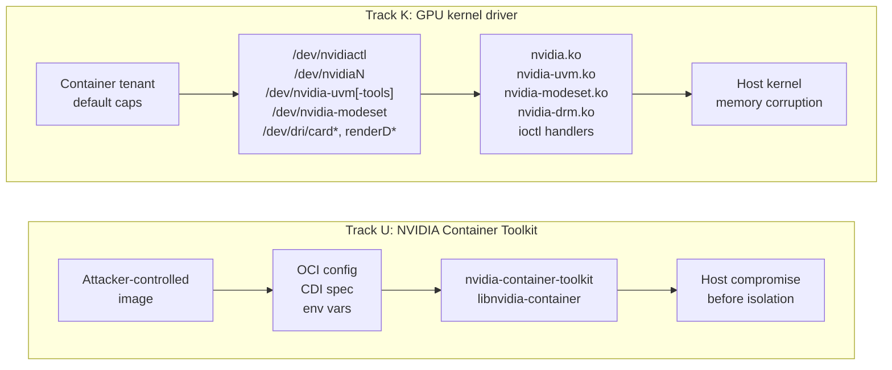
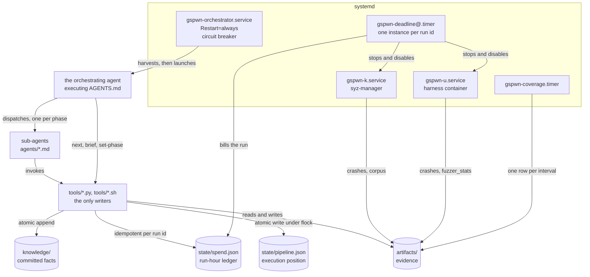

import NavCard from '../../components/NavCard.astro';

gspwn is an autonomous vulnerability-research agent for the NVIDIA GPU kernel
driver (Track K) and the NVIDIA Container Toolkit (Track U). It runs
coverage-guided fuzzing from the position a container tenant already holds:
syzkaller against the driver's ioctl surface, on a kernel built with KCOV for
edge coverage and KASAN as the oracle, and libFuzzer and AFL++ against the
toolkit's parsing and path handling under AddressSanitizer and
UndefinedBehaviorSanitizer.

A campaign runs in rounds. A round writes syzlang descriptions and seeds, fuzzes
both tracks for a bounded window, deduplicates crashes into a registry, produces
a root-cause analysis and a verified reproducer for each unique crash, and
measures how much of the enumerated command surface it reached. The measurement
writes the work list the next round executes.

Coverage is measured against a denominator taken from driver source. The
inventories enumerate 1203 commands for driver 610.57.04. Of those, 852 across
seven families are reachable by the modelled attacker and visible to KCOV, and
they form the denominator. The
[enumerated surface](/gspwn/reference/surface/) pages list all 1203.

## Threat position

GPU capacity at cloud providers reaches tenants as a sandbox: a training job,
an inference endpoint, a hosted notebook, a playground instance. Untrusted code
in that sandbox holds the driver's ioctl surface directly. The container
runtime that admitted it parsed attacker-controlled image metadata as root,
during container init, before isolation was enforced.

Both positions are the lowest-privilege thing a provider sells, and one driver
build runs across a provider's whole fleet. A memory-safety defect reachable
from a default `compute,utility` capability set therefore reaches the host
kernel from every tenant on every machine carrying that build.

gspwn is also a testbed for autonomous research. A campaign runs for days
unattended, and every result it reports can be checked against an artefact on
disk.

## The two targets

**Track K** is the NVIDIA GPU kernel driver, `open-gpu-kernel-modules`. The
attacker is a container tenant holding the device nodes a default
`compute,utility` capability set reaches: `/dev/nvidiactl`, `/dev/nvidiaN`,
`/dev/nvidia-uvm[-tools]`, `/dev/nvidia-modeset` and `/dev/dri/cardN` with
`/dev/dri/renderDN`. syzkaller drives them with grammar-based generative
fuzzing.

**Track U** is the NVIDIA Container Toolkit, `libnvidia-container` and
`nvidia-container-toolkit`. The attacker controls the container image, and the
code under test runs as root during container init, before isolation is
enforced. libFuzzer and AFL++ harnesses drive the parsing and path-handling
surface with mutational coverage-guided fuzzing.

## Architecture

gspwn is built in five layers. Track K fuzzing panics the machine as a normal
part of its work, so each layer commits its result to disk as it produces it
and resumes from that record when the machine returns.

[Architecture overview](/gspwn/architecture/overview/) has the layer table, the
four state stores and the refusal conditions.

## The round

Twelve phases run in order. `provision` and `build` prepare the machine once,
nine phases form the round, and `report` closes the campaign.

| Phase | Produces |
|---|---|
| `describe` | syzlang descriptions for the ioctl surface under test |
| `seeds` | Corpus programs, from traces of real workloads and from allocation chains |
| `harness` | libFuzzer and AFL++ harnesses for the Track U targets |
| `fuzz` | A bounded campaign on both tracks, with a coverage series |
| `triage` | Crashes deduplicated into a registry, one entry per distinct stack |
| `rca` | A root-cause analysis per unique crash |
| `poc` | A reproducer, with its reproduction rate measured over repeated runs |
| `eval` | The round measured: coverage reached, surface accounted for, gaps named |
| `refine` | The work list the next round executes |

Three keys in `config/campaign.yaml` bound the search before a campaign starts.

| Key | Bounds |
|---|---|
| `loop.campaign_hours` | The fuzzing window one round gets |
| `loop.max_rounds` | How many rounds may run |
| `loop.max_total_run_hours` | Machine time billed across every run |

## Stop conditions

`round-decide` applies five tests to the finished round, in the order below,
and stops the campaign on the first that holds.

| Condition | Test | Read from |
|---|---|---|
| Surface complete | Every enumerated ioctl target is exercised by a corpus program or accounted for with a written reason | The completion ledger |
| Round cap | The round number reaches `loop.max_rounds` | `state/pipeline.json` |
| Run-hour cap | Billed run-hours reach `loop.max_total_run_hours` | `state/spend.json` |
| Plateau | The species discovery curve has flattened, with `loop.stop_on_plateau` set | The per-run coverage series |
| No verdict | The round recorded no coverage verdict, so no decision can be argued | `state/pipeline.json` |

Surface completion, the round cap and the run-hour cap hold whatever the
coverage series is doing at the time.

## Output

A campaign produces verified vulnerabilities. Each one is a deduplicated crash
carrying a root-cause analysis, a reproducer with a measured reproduction rate,
an argued severity, and a disclosure package.

| Artefact | Location |
|---|---|
| Deduplicated crash registry | `state/pipeline.json` |
| Root-cause analysis per unique crash | `artifacts/rca/<crash-id>.md` |
| Research record and impact record | The registry entry |
| Verified reproducer with a measured rate | `artifacts/pocs/<crash-id>/` |
| Per-run coverage series | `artifacts/runs/<run-id>/coverage.csv` |
| Work list steering the next round | `artifacts/eval/<run-id>/worklist.md` |
| Penetration-test-style report | `artifacts/report/<date>-report.md` |
| PSIRT-ready disclosure packages | `artifacts/report/disclosure/<crash-id>/` |

## Sections

  <NavCard title="Getting started" href="/gspwn/getting-started/concepts/" icon="rocket">
    The vocabulary a campaign is described in, the hardware and operating
    system it needs, installation, and a first campaign end to end.
  </NavCard>
  <NavCard title="Knowledgebase" href="/gspwn/knowledgebase/" icon="open-book">
    The NVIDIA platform under the pipeline: the GPU stack, driver
    organisation, container admission, the RM object model, UVM and GSP
    offload.
  </NavCard>
  <NavCard title="Architecture" href="/gspwn/architecture/overview/" icon="puzzle">
    How gspwn works: the threat model, the round loop, the state stores, every
    component, and the enumerated surface tables.
  </NavCard>
  <NavCard title="Usage" href="/gspwn/guides/running-a-campaign/" icon="setting">
    Running a campaign, configuration keys, triage, reproduction, budget and
    troubleshooting.
  </NavCard>

