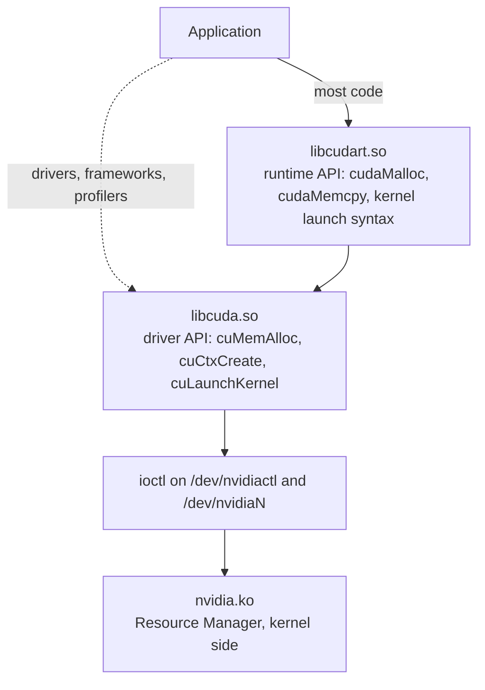

Two APIs reach the GPU. Almost all CUDA code calls the higher one and never
names the lower one, so the boundary appears in stack traces and linker errors
before it appears in source.



## The two APIs

| Property | Runtime API | Driver API |
| --- | --- | --- |
| Library | `libcudart.so` | `libcuda.so` |
| Ships with | The CUDA toolkit | The driver |
| Prefix | `cuda*` | `cu*` |
| Context handling | Implicit. A primary context is created on first use. | Explicit. `cuCtxCreate`, `cuCtxPushCurrent`. |
| Module loading | Implicit. Kernels are registered by the `<<<>>>` syntax at startup. | Explicit. `cuModuleLoad`, `cuModuleGetFunction`. |
| Versioning | Minor version compatible within a major release | Tied to the installed driver |
| Error type | `cudaError_t` | `CUresult` |

The two are interoperable. A runtime API call and a driver API call in the
same thread act on the same context, because the runtime uses the primary
context of the current device and the driver API can retain the same one with
`cuDevicePrimaryCtxRetain`.

## Contexts

A context is the GPU-side equivalent of a process. It owns everything a
program allocates on the device.

| Resource | Consequence |
| --- | --- |
| A virtual address space | A device pointer is meaningful in its context and nowhere else |
| Loaded modules and their kernels | A kernel handle from one context cannot be launched in another |
| Streams and events | Ordering is per-context |
| Allocations | Destroying a context frees everything in it |

Contexts are per-device and per-process. Two processes on one GPU have separate
contexts and separate address spaces, and the GPU switches between them.

The runtime API creates the primary context lazily on first use.
Before it exists, `cudaMalloc` has nothing to allocate from; that is why the
first CUDA call in a process is far slower than the rest. It is paying for
context creation, module loading and, without `nvidia-persistenced`, device
initialisation.

## Kernel launch

The `<<<>>>` syntax is not C++. `nvcc` rewrites it.

| Stage | Produced |
| --- | --- |
| Source | `kernel<<<grid, block>>>(args)` |
| After `nvcc` | `cudaLaunchKernel(&kernel, grid, block, argv, shared, stream)` |
| Inside the runtime | The registered device function is looked up and `cuLaunchKernel` is called |
| Inside the driver | Arguments are packed into a command buffer and a doorbell is rung |

Registration happens at load time. `nvcc` emits a constructor per translation
unit that calls `__cudaRegisterFatBinary` and `__cudaRegisterFunction`,
associating the host stub address with the device function inside the fatbin.

## Streams and synchronisation

| Construct | Ordering |
| --- | --- |
| One stream | Operations complete in issue order |
| Two streams | No ordering, and they may overlap |
| The default stream, legacy mode | Implicitly synchronises with every other blocking stream |
| The default stream, per-thread mode | Behaves as an ordinary stream. Selected by `--default-stream per-thread`. |
| `cudaEventRecord` and `cudaStreamWaitEvent` | An explicit edge between two streams |

Launches are asynchronous. A kernel launch returns after the command is queued,
so a timing measurement that does not synchronise measures the queue and not
the kernel.

## Worked example: cudaMalloc to the ioctl

```
cudaMalloc(&p, 1024);
```

1. `libcudart.so` finds no primary context for the current device and calls
   `cuDevicePrimaryCtxRetain`.
2. `libcuda.so` opens `/dev/nvidiactl`, allocates a root client, then a device
   and a subdevice object under it. Each allocation is an ioctl carrying a
   class number and a parameter struct.
3. The context is created: address space objects, channel groups and the
   command buffers the driver will submit through.
4. `cudaMalloc` calls `cuMemAlloc`, which asks the Resource Manager for device
   memory of the requested size.
5. The Resource Manager kernel side validates the request against the client's
   handles and forwards the allocation to the GSP.
6. The GSP performs the allocation and returns a handle over the RPC queue.
7. The kernel side maps the allocation into the context's virtual address space
   and returns the device virtual address.
8. `cudaMalloc` writes that address into `p` and returns `cudaSuccess`.

Steps 1 through 3 happen once per process. A later `cudaMalloc` in the same
process starts at step 4, which is why the first one costs so much more than
the second.

## See also

- [Resource Manager object model](/gspwn/knowledgebase/rm-object-model/)
- [GSP offload](/gspwn/knowledgebase/gsp-offload/)
- [Installed stack](/gspwn/knowledgebase/installed-stack/)
