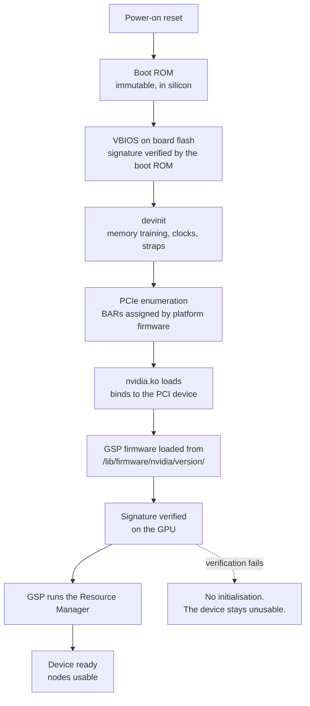

Several microcontrollers inside a GPU package execute before the host driver
loads. They train the memory system, verify signatures and bring up the main
engines, and each runs firmware signed by NVIDIA. `nvidia.ko` enters the
sequence only after PCIe enumeration has completed.

## The microcontrollers

Older microcontrollers are Falcon cores. Newer designs use RISC-V.

| Processor | Responsibility |
| --- | --- |
| Boot ROM | Immutable first-stage code. Verifies the VBIOS signature. |
| GSP | Runs the bulk of the Resource Manager after handoff |
| SEC2 | Security operations, including key handling for encrypted paths |
| PMU | Power and thermal management, clock and voltage control |
| Display controller firmware | Display engine bring-up, on parts that have one |
| NVDEC, NVENC, NVJPEG controllers | Their own codec firmware |

Firmware for these is either resident in board flash as part of the VBIOS or
supplied by the host. `NV_FIRMWARE_FOR_NAME` at
`kernel-open/nvidia/nv.c:27` builds the host-side name as
`nvidia/<version>/<image>.bin`, resolved under the kernel's firmware search
path at `/lib/firmware/`. The GSP image is `gsp_tu10x.bin` on Turing and GA100
and `gsp_ga10x.bin` on Ampere GA10x and later, selected by chip family in
`kernel-open/common/inc/nv-firmware.h`. Everything loaded from the host is
signed and verified on the GPU before it executes.

## The trust boundary

| Stage | Verified by | Replaceable |
| --- | --- | --- |
| Boot ROM | Nothing. It is the root. | No. It is fixed in silicon. |
| VBIOS | The boot ROM, against a key fused into the part | Only by a signed image from the vendor |
| GSP firmware | The GPU, at load time | Only by a signed image, shipped with the matching driver |
| Kernel module | The host kernel's module signing policy, where enforced | Yes. The source is published. |
| Userspace libraries | Nothing beyond ordinary file permissions | Yes |

The boundary falls between the kernel module and the GSP firmware. The host
side is readable and buildable from published source. Everything above the
boundary is a signed image the GPU verifies, and no host tool reads or alters
it.

## VBIOS

| Contents | Use |
| --- | --- |
| devinit tables | The register write sequences that train memory and set clocks |
| Board identity | Device IDs, subsystem IDs, the board's SKU |
| Power and thermal tables | Default and maximum limits, fan curves |
| Straps | Board-level configuration read at reset |
| Signed firmware images | The microcontroller code resident on the board |

`nvidia-smi -q` reports the VBIOS version. A mismatch between VBIOS version and
driver expectations shows as an initialisation failure with no further
attribution, because the failure occurs before any interface capable of
reporting detail exists.

## Driver-side initialisation

| Step | Performed by |
| --- | --- |
| PCI probe, BAR mapping, interrupt setup | `nvidia.ko` |
| GSP firmware load and handoff | `nvidia.ko`, writing into device memory |
| Resource Manager bring-up | GSP firmware |
| Device node creation | `nvidia.ko` and the userspace helper, or `nvidia-modprobe` on demand |
| UVM initialisation | `nvidia-uvm.ko`, on first open of its node |
| Display bring-up | `nvidia-modeset.ko` and `nvidia-drm.ko`, on parts with a display engine |

Without a process holding the device open, the driver tears this state down and
repeats it on the next open. `nvidia-persistenced` holds a handle so the
sequence runs once. The first CUDA call on an idle machine takes seconds
without it and milliseconds with it.

## Reset

| Reset | Scope | Requires |
| --- | --- | --- |
| `nvidia-smi -r` | The GPU, back to a post-devinit state | No process holding the device |
| Function-level reset over PCIe | The PCI function | Platform support, and the same exclusivity |
| Host reboot | Everything, including board state a GPU reset leaves alone | Nothing |

A GPU in an unrecoverable state after an Xid often clears with a GPU reset. A
state that survives a reset generally requires a full power cycle, because the
board's own state is only cleared at power-on.

## Confidential computing

Hopper and later parts support a mode where device memory is encrypted and the
GPU attests to its own firmware state.

| Element | Provides |
| --- | --- |
| Attestation report | A signed statement of the firmware versions running on the part |
| Encrypted device memory | Data unreadable by the host, including by a privileged host |
| Protected PCIe transfers | Data encrypted in transit between host and device |
| Disabled interfaces | Debug and profiling paths that would expose protected state are turned off |

The mode is set per GPU and reported by `nvidia-smi -q`. Peer-to-peer and some
profiling capabilities are unavailable while it is active.

## See also

- [GSP offload](/gspwn/knowledgebase/gsp-offload/)
- [Installed stack](/gspwn/knowledgebase/installed-stack/)
- [Interconnect](/gspwn/knowledgebase/interconnect/)
