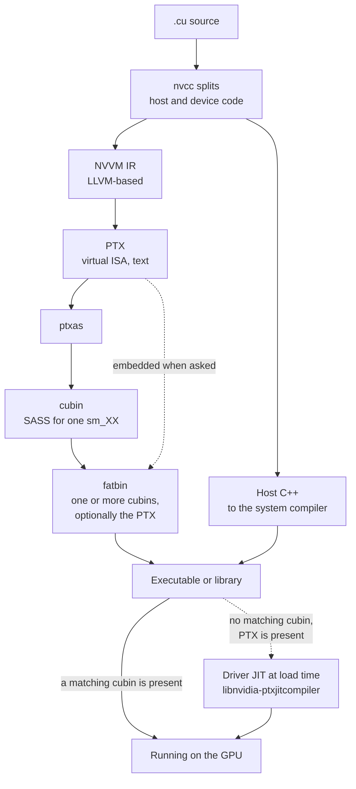

CUDA device code passes through two compilers and two instruction sets. The
first instruction set is virtual and forward-compatible; the second is
architecture-specific and has no compatibility guarantee across major versions.
Which one ends up in a binary is what decides whether it runs on a GPU released
after it was built.



## The two instruction sets

| Property | PTX | SASS |
| --- | --- | --- |
| Nature | Virtual ISA, a compiler target | The instruction set the hardware executes |
| Form | Text | Binary, inside a cubin |
| Stability | Forward-compatible. Newer drivers compile older PTX. | Architecture-specific. No compatibility across major compute capabilities. |
| Documented | Yes, the PTX ISA specification | No |
| Produced by | `nvcc`, from NVVM IR | `ptxas`, from PTX |
| Inspected with | Read directly, or `cuobjdump -ptx` | `cuobjdump -sass`, `nvdisasm` |

PTX is not what the GPU runs. Every path ends in SASS; the question is only
whether `ptxas` ran when the binary was built or when it was loaded.

## Compatibility rules

| Rule | Statement |
| --- | --- |
| Binary compatibility | A cubin for `sm_X.y` runs on `sm_X.z` where `z` is at least `y`. It does not run across a major version. |
| PTX compatibility | PTX for `compute_X.y` compiles for any capability at or above `X.y`, including ones released later |
| Just-in-time compilation | When no compatible cubin is present and PTX is, the driver compiles it at load time |

A binary built only for `sm_80` runs on 8.0, 8.6 and 8.9. It fails on 9.0. The
same binary with `compute_80` PTX embedded runs on 9.0 through the just-in-time
path, after a compilation pause on first load.

## Selecting targets

| Flag | Selects | Produces |
| --- | --- | --- |
| `-arch=compute_80` | A virtual architecture | PTX |
| `-code=sm_80` | A real architecture | A cubin |
| `-arch=sm_80` | Shorthand for both | PTX compiled to a cubin, and the PTX discarded |
| `-gencode arch=compute_80,code=sm_80` | One pair, repeatable | One cubin per repetition |
| `-gencode arch=compute_80,code=[sm_80,compute_80]` | A cubin plus the PTX | A cubin and a just-in-time fallback |

The last form is what a redistributable binary uses. Cubins cover the
architectures that exist, and the embedded PTX covers the ones that do not yet.

```
nvcc -gencode arch=compute_70,code=sm_70 \
     -gencode arch=compute_80,code=sm_80 \
     -gencode arch=compute_89,code=sm_89 \
     -gencode arch=compute_90,code=[sm_90,compute_90] \
     kernel.cu
```

Each `-gencode` adds a cubin, so the binary grows with the list. This is why
framework wheels are large and why they name their supported architectures.

## The just-in-time path

When the driver loads a module with no compatible cubin, it hands the embedded
PTX to `libnvidia-ptxjitcompiler.so`. The result is cached.

| Property | Value |
| --- | --- |
| Cache location | `~/.nv/ComputeCache` |
| Cache controls | `CUDA_CACHE_DISABLE`, `CUDA_CACHE_MAXSIZE`, `CUDA_CACHE_PATH` |
| Cost | A pause on first load, once per binary and architecture |
| Failure mode | An older driver cannot compile PTX from a newer toolkit |

The last row is the direction that does break. Forward compatibility is a
property of PTX against newer hardware, and it does not make a newer toolkit's
output loadable by an older driver.

## Inspecting a binary

| Command | Reports |
| --- | --- |
| `cuobjdump --list-elf <binary>` | Which architectures the fatbin carries |
| `cuobjdump -ptx <binary>` | The embedded PTX, if any |
| `cuobjdump -sass <binary>` | Disassembled SASS per cubin |
| `nvdisasm <cubin>` | SASS with control flow, from a standalone cubin |
| `nvcc --keep` | Leaves every intermediate on disk, including the PTX and the cubin |

## Worked example: an sm_80 binary on a Hopper GPU

A library built with `-gencode arch=compute_80,code=[sm_80,compute_80]`, run on
an H100 at compute capability 9.0.

1. `cuobjdump --list-elf` reports one ELF for `sm_80`. `cuobjdump -ptx` reports
   PTX for `compute_80`.
2. The process starts and `libcuda.so` loads the module.
3. The driver looks for a cubin at 9.0, then for one at 9.x. Neither exists.
4. Binary compatibility does not apply: 8.0 and 9.0 differ in major version.
5. The driver finds the `compute_80` PTX and passes it to
   `libnvidia-ptxjitcompiler.so`, which compiles it for `sm_90`.
6. The result is cached under `~/.nv/ComputeCache`. The first launch is delayed
   by the compilation; later runs of the same binary skip step 5.
7. The kernel runs, using no Hopper-specific feature. Thread block clusters and
   the tensor memory accelerator are unreachable from `compute_80` PTX, so the
   code is correct and leaves the new hardware idle.

Step 7 is the cost of relying on the just-in-time path. It preserves
correctness across a generation and gives none of the generation's new
capability.

## See also

- [Execution model](/gspwn/knowledgebase/execution-model/)
- [Product lines](/gspwn/knowledgebase/product-lines/)
- [Driver and toolkit versions](/gspwn/knowledgebase/driver-versions/)
