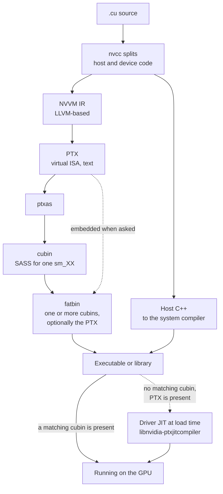

CUDA device code passes through two compilers and two instruction sets. PTX,
Parallel Thread Execution, is a virtual instruction set held as text. SASS,
Streaming Assembler, is the binary instruction set a given GPU generation
executes. A binary carries one or both, and that choice decides whether it runs
on a GPU released after it was built.



A cubin is the compiled object holding SASS for exactly one architecture. A
fatbin bundles one or more cubins, and optionally the PTX they were compiled
from, into a single object the host executable embeds. NVVM IR is the
LLVM-based intermediate representation `nvcc` produces before emitting PTX.

## The two instruction sets

PTX and SASS differ in six properties: nature, form, stability,
documentation, the tool that produces each, and the tool that reads each back.

| Property | PTX | SASS |
| --- | --- | --- |
| Nature | Virtual ISA, a compiler target | The instruction set the hardware executes |
| Form | Text | Binary, inside a cubin |
| Stability | Forward-compatible. Newer drivers compile older PTX. | Architecture-specific. No compatibility across major compute capabilities. |
| Documented | Yes, the PTX ISA specification | No |
| Produced by | `nvcc`, from NVVM IR | `ptxas`, from PTX |
| Inspected with | Read directly, or `cuobjdump -ptx` | `cuobjdump -sass`, `nvdisasm` |

The GPU executes SASS, so `ptxas` runs on every path. It runs either when the
binary is built or when the binary is loaded.

## Compatibility rules

- Binary compatibility runs a cubin built for `sm_X.y` on `sm_X.z` where `z` is
  at least `y`. It does not carry across a major version.
- PTX compatibility compiles PTX for `compute_X.y` for any capability at or
  above `X.y`, including ones released later.
- Just-in-time compilation takes over when no compatible cubin is present and
  PTX is, and the driver compiles it at load time.

A binary built only for `sm_80` runs on 8.0, 8.6 and 8.9. It fails on 9.0. The
same binary with `compute_80` PTX embedded runs on 9.0 through the just-in-time
path, after a compilation pause on first load.

## Selecting targets

`-arch`, `-code` and `-gencode` select a virtual architecture, a real
architecture, or a pair of both.

| Flag | Selects | Produces |
| --- | --- | --- |
| `-arch=compute_80` | A virtual architecture | PTX |
| `-code=sm_80` | A real architecture | A cubin |
| `-arch=sm_80` | Shorthand for both | PTX compiled to a cubin, and the PTX discarded |
| `-gencode arch=compute_80,code=sm_80` | One pair, repeatable | One cubin per repetition |
| `-gencode arch=compute_80,code=[sm_80,compute_80]` | A cubin plus the PTX | A cubin and a just-in-time fallback |

A redistributable binary uses the last form. Cubins cover the architectures
that exist, and the embedded PTX covers the ones that do not yet.

```
nvcc -gencode arch=compute_70,code=sm_70 \
     -gencode arch=compute_80,code=sm_80 \
     -gencode arch=compute_89,code=sm_89 \
     -gencode arch=compute_90,code=[sm_90,compute_90] \
     kernel.cu
```

Each `-gencode` adds a cubin, so the binary grows with the list. Framework
wheels carry a cubin per supported architecture, which is why they are large
and why their release notes name the architectures they cover.

## The just-in-time path

When the driver loads a module with no compatible cubin, it hands the embedded
PTX to `libnvidia-ptxjitcompiler.so`. The result is cached.

| Property | Value |
| --- | --- |
| Cache location | `~/.nv/ComputeCache` |
| Cache controls | `CUDA_CACHE_DISABLE`, `CUDA_CACHE_MAXSIZE`, `CUDA_CACHE_PATH` |
| Cost | A pause on first load, once per binary and architecture |
| Failure mode | An older driver cannot compile PTX from a newer toolkit |

Forward compatibility runs in one direction. PTX from an older toolkit compiles
on a newer driver for newer hardware. PTX from a newer toolkit uses directives
an older driver's compiler has never seen, which produces the failure in the
last row.

## Inspecting a binary

Five commands report what a built binary carries.

| Command | Reports |
| --- | --- |
| `cuobjdump --list-elf <binary>` | Which architectures the fatbin carries |
| `cuobjdump -ptx <binary>` | The embedded PTX, if any |
| `cuobjdump -sass <binary>` | Disassembled SASS per cubin |
| `nvdisasm <cubin>` | SASS with control flow, from a standalone cubin |
| `nvcc --keep` | Leaves every intermediate on disk, including the PTX and the cubin |

## See also

- [Execution model](/gspwn/knowledgebase/execution-model/)
- [Product lines](/gspwn/knowledgebase/product-lines/)
- [Installed stack](/gspwn/knowledgebase/installed-stack/)
