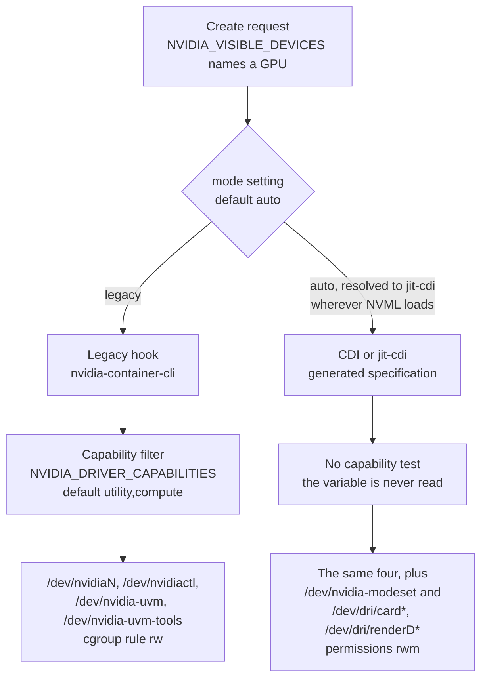

A GPU container receives NVIDIA character devices by bind mount. Two
independent mechanisms perform that mount, and they select different sets for
the same request. The legacy hook filters by `NVIDIA_DRIVER_CAPABILITIES`. The
CDI path takes its device set from a specification and reads no capability
value.

Line references below are to `libnvidia-container` at commit `08cb279`,
`nvidia-container-toolkit` at commit `1780ac6`, which is 25 commits past
`v1.20.0`, and `open-gpu-kernel-modules` 610.57.04 at commit `e4a5faa`. The
admission sequence itself is on
[Container admission path](/gspwn/knowledgebase/container-admission/).

## Capability values

`NVIDIA_DRIVER_CAPABILITIES` accepts a comma-separated list. The toolkit
translates each accepted value into one `nvidia-container-cli` flag
(`cmd/nvidia-container-runtime-hook/capabilities.go:7`), and the library maps
each flag to option bits (`src/options.h:83`, `container_opts[]`).

| Value | CLI flag | Option bits | Implies |
| --- | --- | --- | --- |
| `utility` | `--utility` | `OPT_UTILITY_BINS`, `OPT_UTILITY_LIBS` | |
| `compute` | `--compute` | `OPT_COMPUTE_BINS`, `OPT_COMPUTE_LIBS` | |
| `video` | `--video` | `OPT_VIDEO_LIBS`, `OPT_COMPUTE_LIBS` | `compute` |
| `graphics` | `--graphics` | `OPT_GRAPHICS_LIBS` | |
| `display` | `--display` | `OPT_DISPLAY`, `OPT_GRAPHICS_LIBS` | `graphics` |
| `ngx` | `--ngx` | `OPT_NGX_LIBS` | |
| `compat32` | `--compat32` | `OPT_COMPAT32` | |
| `all` | every flag above | every bit above | everything |

The default is `utility,compute`
(`internal/config/image/capabilities.go:46`, `DefaultDriverCapabilities`). The
seven values above are the full supported set
(`internal/config/image/capabilities.go:48`, `SupportedDriverCapabilities`). A
value outside that set makes the hook panic
(`cmd/nvidia-container-runtime-hook/container_config.go:170`), so the container
fails to start.

One image shape overrides the default. An image carrying `CUDA_VERSION` and no
`NVIDIA_REQUIRE_CUDA` is treated as a legacy image
(`internal/config/image/cuda_image.go:101`, `IsLegacy`), and a legacy image with
`NVIDIA_DRIVER_CAPABILITIES` unset receives the full supported set, including
`display` and `graphics`
(`cmd/nvidia-container-runtime-hook/container_config.go:160`).

## Capability to device node, legacy hook

Two sites in `libnvidia-container` decide the set.

`lookup_devices` (`src/nvc_info.c:517`) builds a candidate list from the driver
options. It places `/dev/nvidia-uvm` and `/dev/nvidia-uvm-tools` on the list
unless `OPT_NO_UVM` is set, `/dev/nvidia-modeset` unless `OPT_NO_MODESET` is
set, and `/dev/nvidiactl` unconditionally. None of the three driver options is
set by default (`src/options.h:51`, `default_driver_opts` is the empty string),
so all four are discovered on any host.

`nvc_driver_mount` (`src/nvc_mount.c:786`) then filters that list with two
tests. A device whose major is not 195 requires `OPT_COMPUTE_LIBS`, which
withholds both UVM nodes from a container that did not ask for `compute`. A
device whose minor is 254 requires `OPT_DISPLAY`, which withholds
`/dev/nvidia-modeset`. Each node is therefore discovered by default and
withheld from the container by one of the two tests. The per-GPU node is
mounted separately by `nvc_device_mount` (`src/nvc_mount.c:814`), with no
capability test at all.

| Capability | `/dev/nvidiaN` | `/dev/nvidiactl` | `/dev/nvidia-uvm` | `/dev/nvidia-uvm-tools` | `/dev/nvidia-modeset` | `/dev/dri/*` |
| --- | --- | --- | --- | --- | --- | --- |
| none | yes | yes | no | no | no | no |
| `utility` | yes | yes | no | no | no | no |
| `compute` | yes | yes | yes | yes | no | no |
| `video` | yes | yes | yes | yes | no | no |
| `graphics` | yes | yes | no | no | no | yes |
| `display` | yes | yes | no | no | yes | yes |
| `ngx` | yes | yes | no | no | no | no |
| `compat32` | yes | yes | no | no | no | no |
| `utility,compute` | yes | yes | yes | yes | no | no |
| `all` | yes | yes | yes | yes | yes | yes |

`video` grants the UVM nodes because it sets `OPT_COMPUTE_LIBS` alongside
`OPT_VIDEO_LIBS`, and `display` grants the modeset node because it sets
`OPT_DISPLAY` alongside `OPT_GRAPHICS_LIBS`. The table above holds for the
legacy hook alone, and the CDI device set is below.

`/dev/nvidiaN` and `/dev/nvidiactl` are ungated on both paths. A container that
names a GPU in `NVIDIA_VISIBLE_DEVICES` receives both even with an empty
capability set, and both carry the Resource Manager ioctl surface described on
[Resource Manager object model](/gspwn/knowledgebase/rm-object-model/).

`libnvidia-container` never mounts `/dev/dri/*`. The string `dri/` occurs
nowhere in its sources. The DRM nodes come from the Go runtime by two separate
routes. Under the legacy hook, `internal/modifier/graphics.go:71` builds a DRM
node discoverer only when the capability set contains `graphics` or `display`,
and matches the globs `/dev/dri/card*` and `/dev/dri/renderD*`
(`internal/discover/graphics.go:404`) filtered to the PCI bus IDs of the
visible GPUs. Under the CDI path, `GetDeviceNodesByBusID`
(`internal/info/drm/drm_devices.go:25`) globs
`/sys/bus/pci/devices/<busid>/drm/*` and maps each entry's basename into
`/dev/dri`, and `internal/platform-support/dgpu/nvml.go` appends the result to
the per-GPU device edit with no capability test. `internal/edits/device.go:76`
stamps every such edit `rwm`.

## Capability to library and binary

`match_binary_flags` (`src/nvc_info.c:767`) and `match_library_flags`
(`src/nvc_info.c:777`) decide what each capability injects. The arrays they
match against start at `src/nvc_info.c:60`.

| Capability | Binaries | Libraries |
| --- | --- | --- |
| `utility` | `nvidia-smi`, `nvidia-debugdump`, `nvidia-persistenced`, `nv-fabricmanager` | `libnvidia-ml.so`, `libnvidia-cfg.so`, `libnvidia-nscq.so` |
| `compute` | `nvidia-cuda-mps-control`, `nvidia-cuda-mps-server` | Thirteen entries, including `libcuda.so`, `libcudadebugger.so`, `libnvidia-opencl.so`, `libnvidia-gpucomp.so`, `libnvidia-ptxjitcompiler.so`, `libnvidia-allocator.so`, `libnvidia-nvvm.so`, `libnvidia-pkcs11.so`, `libnvidia-tileiras.so` |
| `video` | none | `libvdpau_nvidia.so`, `libnvidia-encode.so`, `libnvidia-opticalflow.so`, `libnvcuvid.so` |
| `graphics` | none | `libnvidia-eglcore.so`, `libnvidia-glcore.so`, `libnvidia-glsi.so`, `libnvidia-tls.so`, `libnvidia-fbc.so`, `libnvidia-ifr.so`, `libnvidia-rtcore.so`, `libnvoptix.so`, the GLVND ICDs and the GL compatibility wrappers |
| `display` | none | Same set as `graphics` |
| `ngx` | none | `libnvidia-ngx.so` |
| `compat32` | none | The 32-bit build of whatever the other values selected |

`match_binary_flags` tests only `OPT_UTILITY_BINS` and `OPT_COMPUTE_BINS`,
which is why every other capability injects no binary.

`nvidia-modprobe`, `nvidia-settings` and `nvidia-xconfig` are commented out of
the utility binary list. The X server modules are excluded by the comment block
at `src/nvc_info.c:50`.

## Non-device injection, legacy hook

Eight items reach the container alongside the device nodes. Three are
unconditional and the rest follow a capability value or a flag.

| Item | Condition | Mechanism |
| --- | --- | --- |
| `/proc/driver/nvidia` holding `params`, `version`, `registry` | Unconditional | tmpfs with file copies, not bind mounts. `ModifyDeviceFiles: 1` is rewritten to `0` in the copy (`src/nvc_mount.c:391`). Remounted `nodev,nosuid,noexec` |
| `/proc/driver/nvidia/gpus/<busid>` | Once per visible GPU, unconditional | Bind mount of host procfs, remounted read-only (`src/nvc_mount.c:446`) |
| `/var/run/nvidia-persistenced/socket` | `utility` | Unix socket to a host root daemon |
| `/var/run/nvidia-fabricmanager/socket` | `utility` | Unix socket to the host NVSwitch fabric manager |
| `/tmp/nvidia-mps` | `compute` | Named pipe directory into a host MPS server |
| GSP firmware images | Unless `--no-gsp-firmware` | Read-only bind mount |
| `/etc/nvidia/nvidia-application-profiles-rc.d` | `graphics` or `display` | Writable application profile directory |
| Container ldcache | Unconditional | `ldconfig` run against the container root |

The three IPC sockets are filtered at `src/nvc_mount.c:769`: the persistenced
and fabricmanager sockets require `OPT_UTILITY_LIBS`, and everything else on
that list requires `OPT_COMPUTE_LIBS`.

The device cgroup allowlist is written one rule per mounted node, in the form
`c <major>:<minor> rw` (`setup_device_cgroup`, `src/cgroup_legacy.c:84` for
cgroup v1 and `src/cgroup.c:193` for v2). On this path the `m` permission is
never granted, so a container cannot create further nodes on those majors. The
CDI path grants `rwm` on every device edit, so the two mechanisms differ on `m`
as well as on which nodes they inject.

## MIG capability nodes

`/dev/nvidia-caps/nvidia-capN` gates MIG instance access. Three routes reach it.

| Route | Nodes granted | Privilege required |
| --- | --- | --- |
| `NVIDIA_VISIBLE_DEVICES` naming a MIG instance | The GPU instance `access` cap device and the compute instance `access` cap device for that instance, plus the matching `/proc/driver/nvidia/capabilities` files | None |
| `NVIDIA_MIG_CONFIG_DEVICES=all` | The whole `/dev/nvidia-caps` directory and all of `/proc/driver/nvidia/capabilities` | Privileged container. The hook panics otherwise (`cmd/nvidia-container-runtime-hook/container_config.go:191`) |
| `NVIDIA_MIG_MONITOR_DEVICES=all` | Same whole-directory mount | Privileged container |

## Device nodes the capability set does not gate

Five environment variables inject character devices without consulting
`NVIDIA_DRIVER_CAPABILITIES`. Four are read in `internal/modifier/cdi.go:129`,
`gatedDevices.DeviceRequests`, and the fifth is the IMEX channel list
(`internal/modifier/cdi.go:151`).

| Variable | Value | Nodes injected | Additional mounts |
| --- | --- | --- | --- |
| `NVIDIA_NVSWITCH` | `enabled` | `/dev/nvidia-nvswitchctl`, `/dev/nvidia-nvswitch*` | none |
| `NVIDIA_GDS` | `enabled` | `/dev/nvidia-fs*` | `/run/udev`, `/etc/cufile.json` |
| `NVIDIA_MOFED` | `enabled` | `/dev/infiniband/uverbs*`, `/dev/infiniband/rdma_cm` | none |
| `NVIDIA_GDRCOPY` | `enabled` | `/dev/gdrdrv` | none |
| `NVIDIA_IMEX_CHANNELS` | channel id list | `/dev/nvidia-caps-imex-channels/channel<id>` | none |

Three defaults decide whether an unprivileged container can set them.

| Setting | Default | Effect |
| --- | --- | --- |
| `accept-nvidia-visible-devices-envvar-when-unprivileged` | `true` (`api/config/v1/config.go:106`) | Device requests through environment variables are honoured for unprivileged containers |
| `ignore-imex-channel-requests` | unset, so false (`api/config/v1/features.go:49`) | IMEX channel requests through `NVIDIA_IMEX_CHANNELS` are honoured |
| `disable-imex-channel-creation` | unset, so false (`api/config/v1/features.go:41`) | The hook omits `--no-create-imex-channels` (`cmd/nvidia-container-runtime-hook/main.go:98`), so `nvidia-container-cli` runs `mknod` on the host for each requested channel id |

Each node is located on the host and mounted from there. A missing host node is
skipped, so the variable has an effect only where the corresponding kernel
module is loaded. The gated set is applied in legacy, csv and jit-cdi modes
(`internal/modifier/mode.go:24`, `supportedModifierTypes`, plus the gated and
IMEX requests appended in `internal/modifier/cdi.go:83`). Pure `cdi` mode,
which reads a specification file written ahead of time, skips it.

## CDI path

`nvidia-container-runtime` resolves its mode from the `mode` setting, whose
default is `auto` (`api/config/v1/config.go:120`). On a platform where NVML or
WSL is detected, `auto` resolves to `jit-cdi` (`internal/info/auto.go:111`,
`ResolveRuntimeMode` returning the resolver default `JitCDIRuntimeMode`, set at
`internal/info/auto.go:89`). In that mode and in `cdi` mode the runtime applies
only the hook remover and the CDI specification. The graphics modifier and the
capability filter are absent from the modifier list
(`internal/modifier/mode.go:26`).

A CDI specification injects nodes from three origins.

- Common edits, applied for any requested device: `/dev/nvidia-modeset`,
  `/dev/nvidia-uvm-tools`, `/dev/nvidia-uvm` and `/dev/nvidiactl`
  (`pkg/nvcdi/common-nvml.go:57`).
- Per-GPU device edits: `/dev/nvidiaN`, plus every DRM node on the PCI bus id
  of that GPU.
- Per-MIG device edits: the parent `/dev/nvidiaN`, the GPU instance cap device,
  the compute instance cap device, and the DRM nodes when the MIG profile
  carries the `gfx` attribute.

The same request reaches a different device set on each path. `mode = "auto"`
resolves to `jit-cdi` wherever NVML loads, so a default installation grants the
right-hand column.

| Node | Legacy hook, `utility,compute` | CDI or jit-cdi, any capability value |
| --- | --- | --- |
| `/dev/nvidiaN`, `/dev/nvidiactl`, `/dev/nvidia-uvm`, `/dev/nvidia-uvm-tools` | granted `rw` | granted `rwm` |
| `/dev/nvidia-modeset` | withheld | granted `rwm` |
| `/dev/dri/card*`, `/dev/dri/renderD*` | withheld | granted `rwm` |

The CDI path also drops the per-GPU procfs bind mount. In its place, the
`disable-device-node-modification` CDI hook writes a `params` file carrying
`ModifyDeviceFiles: 0` into the container root. Graphics libraries and the
Vulkan, EGL and OpenCL loader configuration files are part of the common edits
(`pkg/nvcdi/common-nvml.go:30`), so a CDI container receives them without
requesting `graphics`.

A third CDI kind, `management`, generated by
`nvidia-ctk cdi generate --mode=management` for driver container images, lists
`/dev/nvidia*`, `/dev/nvidia-caps/nvidia-cap*`, the four control nodes and
`/dev/nvidia-caps-imex-channels/channel*` (`pkg/nvcdi/management.go:101`), with
names beginning `nvidia-fs`, `nvidia-nvswitch` and `nvidia-nvlink` filtered out
(`pkg/nvcdi/management.go:141`).

## Node creation on the host

The kernel modules register character device regions. With one exception they
do not create `/dev` entries. `nvidia-modprobe`, udev, or an administrator does
that, which is why `libnvidia-container` links the `nvidia-modprobe-utils`
`mknod` helpers and calls them while loading modules.

| Node | Module | Major | Minor | Exists when |
| --- | --- | --- | --- | --- |
| `/dev/nvidiaN` | `nvidia.ko` | 195 | GPU index, 0 to 247 | The module is loaded |
| `/dev/nvidiactl` | `nvidia.ko` | 195 | 255 | The module is loaded |
| `/dev/nvidia-modeset` | `nvidia-modeset.ko` | 195 | 254 | That module is loaded |
| `/dev/nvidia-uvm` | `nvidia-uvm.ko` | dynamic | 0 | That module is loaded |
| `/dev/nvidia-uvm-tools` | `nvidia-uvm.ko` | same dynamic major | 1 | That module is loaded and userspace created the node |
| `/dev/nvidia-caps/nvidia-capN` | `nvidia.ko`, nv-caps | dynamic | one per registered capability | The module is loaded. Individual entries appear under `/proc/driver/nvidia-caps` as MIG instances are created |
| `/dev/nvidia-caps-imex-channels/channelN` | `nvidia.ko`, nv-caps-imex | dynamic | channel id | `NVreg_ImexChannelCount` is non-zero, default 2048. `NVreg_CreateImexChannel0` defaults to 0, so no channel node is created at load |
| `/dev/nvidia-nvswitchctl` | `nvidia.ko` | dynamic | 255 | The module is loaded on a 64-bit host. Registration is unconditional and does not require NVSwitch hardware |
| `/dev/nvidia-nvswitchN` | `nvidia.ko` | same dynamic major | device instance | The NVSwitch PCI driver bound that instance |
| `/dev/nvidia-nvlink` | `nvidia.ko` | dynamic | 0 | The module is loaded |
| `/dev/dri/cardN`, `/dev/dri/renderDN` | `nvidia-drm.ko` | DRM major | assigned by the DRM core | That module is loaded and bound. The DRM core creates the nodes, so this family alone needs no `mknod` from userspace. The `modeset` parameter only upgrades the driver feature bits |

Major 195 and the two reserved minors are the constants
`NV_DEVICE_MAJOR`, `NV_CTL_DEVICE_MINOR` and `NV_MODESET_DEVICE_MINOR`, which
`libnvidia-container` declares together at `src/nvc_internal.h:30`. The IMEX
defaults are at `kernel-open/nvidia/nv-reg.h:1071`.

Four `nvidia.ko` module parameters set the permissions on the nodes it manages.
`NVreg_ModifyDeviceFiles` defaults to 1
(`kernel-open/nvidia/nv-reg.h:1026`), `NVreg_DeviceFileUID` and
`NVreg_DeviceFileGID` default to 0
(`kernel-open/nvidia/nv-reg.h:1027`), and `NVreg_DeviceFileMode` defaults to
`0666` (`kernel-open/nvidia/nv-reg.h:1029`). That mode is why an unprivileged
process inside a container can open `/dev/nvidiactl` and `/dev/nvidiaN` once
they are bind-mounted.

## NVSwitch and NVLink nodes

`nvswitch_init` (`kernel-open/nvidia/linux_nvswitch.c:1712`) runs from
`nvlink_drivers_init` (`kernel-open/nvidia/nv.c:521`) whenever `nvidia.ko`
loads on a 64-bit host, and `nvlink_core_init` runs alongside it. Both allocate
their character device regions before any PCI driver registration, with no
NVSwitch hardware required.
`/proc/driver/nvidia-nvswitch/permissions` and
`/proc/driver/nvidia-nvlink/permissions` each report `DeviceFileMode: 438`
(`kernel-open/nvidia/procfs_nvswitch.c:49` and
`kernel-open/nvidia/nvlink_linux.c:91`), that is `0666`, and
`nvidia-modprobe` reads those files when it creates the nodes.

| Node | Injected into a container | Path |
| --- | --- | --- |
| `/dev/nvidia-nvswitchctl` | Yes | `NVIDIA_NVSWITCH=enabled` in `legacy`, `csv` or `jit-cdi` mode, or a CDI specification generated with `nvidia-ctk cdi generate --mode=nvswitch` and requested by name |
| `/dev/nvidia-nvswitchN` | Yes | Same, and the NVSwitch PCI driver must have bound that instance |
| `/dev/nvidia-nvlink` | No | No code path injects it. The one injection glob is `/dev/nvidia-nvswitch*` (`internal/discover/nvswitch.go:30`), which does not match the name, and the two places that glob `/dev/nvidia*` filter it out by prefix |

`libnvidia-container` contains no reference to any of the three names, so the
legacy hook alone can never inject them. The toolkit's only injection site is
`internal/discover/nvswitch.go`, reached through the `nvswitch` CDI mode. The
node must already exist on the host, since neither component runs `mknod` for
these two.

On open, `ctl_fops` (`kernel-open/nvidia/linux_nvswitch.c:253`) declares an
owner and an ioctl entry point and no `.open` member, so the driver performs no
check when a process opens `/dev/nvidia-nvswitchctl`.

Two switch statements dispatch device ioctls, and each command in them carries
its own privilege flag. `NVSWITCH_DEV_CMD_DISPATCH_PRIVILEGED`
(`src/common/nvswitch/kernel/nvswitch.c:43`) calls
`_nvswitch_lib_validate_privileged_ctrl`
(`src/common/nvswitch/kernel/nvswitch.c:4439`) against
`NVSWITCH_DEV_CMD_CHECK_ADMIN` or `NVSWITCH_DEV_CMD_CHECK_FM`
(`src/common/nvswitch/kernel/nvswitch.c:40`). The other two dispatch macros
call the handler with no check.

| Dispatcher | Entries | Privileged | No check |
| --- | --- | --- | --- |
| `nvswitch_lib_ctrl` (`src/common/nvswitch/kernel/nvswitch.c:6241`) | 96 | 70 | 26 |
| `nvswitch_lib_ctrl_tnvl_lock_only` (`src/common/nvswitch/kernel/nvswitch.c:6109`) | 26 | 11 | 15 |

Across the two, 81 of 122 entries apply the check and 41 apply none. The 41
divide into 38 written with `NVSWITCH_DEV_CMD_DISPATCH` and 3 with
`NVSWITCH_DEV_CMD_DISPATCH_WITH_PRIVATE_DATA`
(`src/common/nvswitch/kernel/inc/common_nvswitch.h:185`).

## See also

- [Container admission path](/gspwn/knowledgebase/container-admission/)
- [Partitioning modes](/gspwn/knowledgebase/partitioning/)
- [Resource Manager object model](/gspwn/knowledgebase/rm-object-model/)
- [Installed stack](/gspwn/knowledgebase/installed-stack/)
