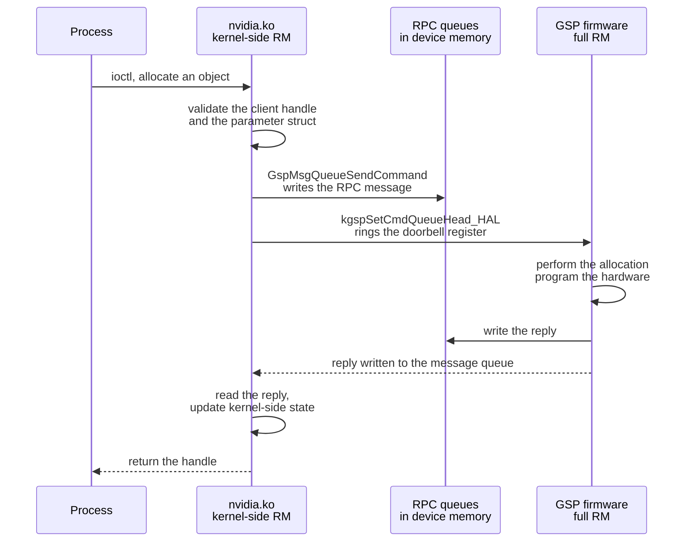

The Resource Manager ran entirely in the host kernel before the R515 driver. On
Turing and later from R515 onward, most of it runs on a RISC-V processor inside
the GPU, the GPU System Processor, and the kernel module is a client of it. The
open kernel modules require this arrangement: the code they omit runs as signed
firmware on the GSP.

## Division of function

The kernel module keeps the syscall boundary and the host-visible bookkeeping.
The GSP takes the hardware.

| Function | Side |
| --- | --- |
| Character device entry points and ioctl dispatch | Kernel |
| Client, handle and object bookkeeping visible to userspace | Kernel |
| Parameter validation at the syscall boundary | Kernel |
| Memory mapping into process address spaces | Kernel |
| Interrupt handling and bottom halves | Kernel |
| Hardware initialisation and register programming | GSP |
| The bulk of object class implementations | GSP |
| Channel and runlist scheduling | GSP |
| Power and clock management | GSP |
| Fault reporting and error containment | GSP |
| The display engine, where present | Kernel, through `nvidia-modeset.ko` |

An operation typically validates in the kernel, executes on the GSP, and
updates state on both sides. 679 of the 1372 exported control commands have
their CPU-side handler compiled out under this arrangement, counted on
[RM control command surface](/gspwn/knowledgebase/rm-control-surface/).

## The transport

Two queues in device memory carry the RPC. A register write announces a
command, and the kernel polls the reply queue for the response.

| Element | Location |
| --- | --- |
| Command queue | Device memory, written by `GspMsgQueueSendCommand` and read by the GSP |
| Reply queue | Device memory, written by the GSP and read by the kernel |
| Doorbell | `kgspSetCmdQueueHead_HAL`, the register write that tells the GSP a message is waiting |
| Completion | `_kgspRpcRecvPoll` spins on the reply queue until the response arrives or the timeout fires |
| Event channel | A separate path for unsolicited messages such as fault notifications |

Messages are serialised structures with their own versioning. The RPC message
layout is an internal interface with no compatibility guarantee, so the
firmware and the kernel module are built and shipped together, and the module
version and the firmware version have to be equal.

## Consequences

The split has five consequences for anything analysing the driver.

- The firmware is signed and verified on the GPU before it executes. The module
  declares it as `nvidia/<version>/gsp_ga10x.bin` or `gsp_tu10x.bin` by chip
  family, resolved under the kernel's firmware search path at
  `/lib/firmware/` (`kernel-open/nvidia/nv.c:27`). It cannot be replaced or
  modified.
- Coverage instrumentation stops at the queue. KCOV and KASAN are
  compiler-inserted and only cover code the host compiler built. The GSP runs
  code no host toolchain touched.
- A failure inside the GSP surfaces as an Xid entry in the kernel log,
  sometimes with no further attribution, so the host sees a symptom and not a
  fault site.
- Operations that were function calls became message round trips, so a
  sequence of small calls now pays one round trip each.
- Publishing the kernel-side half discloses no hardware programming detail,
  because that detail moved into the firmware. The open modules became
  publishable on that basis.

## Xid

An Xid is a numbered error the driver logs when the GPU reports a fault. The
number identifies a class.

| Reported condition | Typical meaning |
| --- | --- |
| A memory fault by a channel | An illegal address in a kernel |
| A double-bit ECC error | Uncorrectable memory corruption |
| A GSP RPC timeout | The firmware stopped responding |
| A robust channel error | An engine faulted and its channel was killed |

`nvidia-smi -q` reports the counts. The kernel log carries the entries with the
PID and channel where available.

## See also

- [Resource Manager object model](/gspwn/knowledgebase/rm-object-model/)
- [Boot and firmware chain](/gspwn/knowledgebase/boot-firmware/)
- [NVIDIA GPU stack](/gspwn/knowledgebase/gpu-stack/)
