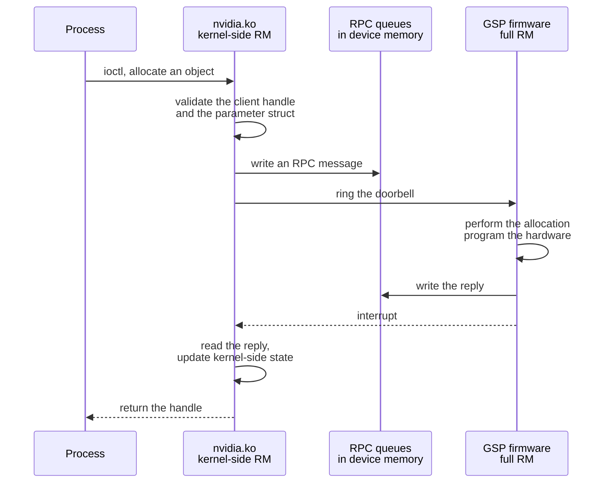

The Resource Manager ran entirely in the host kernel before the R515 driver. On
Turing and later from R515 onward, most of it runs on a RISC-V processor inside
the GPU, the GPU System Processor, and the kernel module is a client of it. The
open kernel modules require this arrangement: the code they omit runs as signed
firmware on the GSP.

## Division of function

| Function | Side |
| --- | --- |
| Character device entry points and ioctl dispatch | Kernel |
| Client, handle and object bookkeeping visible to userspace | Kernel |
| Parameter validation at the syscall boundary | Kernel |
| Memory mapping into process address spaces | Kernel |
| Interrupt handling and bottom halves | Kernel |
| Hardware initialisation and register programming | GSP |
| The bulk of object class implementations | GSP |
| Channel and runlist scheduling | GSP |
| Power and clock management | GSP |
| Fault reporting and error containment | GSP |
| The display engine, where present | Kernel, through `nvidia-modeset.ko` |

The split is not clean along any single line. An operation typically validates
in the kernel, executes on the GSP, and updates state on both sides.

## The transport

| Element | Location |
| --- | --- |
| Command queue | Device memory, written by the kernel and read by the GSP |
| Reply queue | Device memory, written by the GSP and read by the kernel |
| Doorbell | A register write that tells the GSP a message is waiting |
| Completion | An interrupt from the GSP to the host |
| Event channel | A separate path for unsolicited messages such as fault notifications |

Messages are serialised structures with their own versioning. The firmware and
the kernel module are built and shipped together for this reason: the RPC
message layout is an internal interface with no compatibility guarantee, which
is why the equality coupling between module version and firmware version is
absolute.

## Consequences

| Consequence | Detail |
| --- | --- |
| The firmware is signed | It loads from `/lib/firmware/nvidia/<version>/` and the GPU verifies it. It cannot be replaced or modified. |
| Coverage instrumentation stops at the queue | KCOV and KASAN are compiler-inserted and only cover code the host compiler built. The GSP runs code no host toolchain touched. |
| Errors arrive as symptoms | A failure inside the GSP surfaces as an Xid entry in the kernel log, sometimes with no further attribution |
| Latency changed shape | Operations that were function calls became message round trips, so batching matters more |
| The open modules became possible | Publishing the thin half discloses no hardware programming detail, because that detail moved into the firmware |

`open-gpu-kernel-modules` is publishable because the unpublished code moved to
the far side of the RPC queue. The kernel-side module discloses no hardware
programming detail, because it no longer contains any.

## Xid

An Xid is a numbered error the driver logs when the GPU reports a fault. The
number identifies a class.

| Reported | Typical meaning |
| --- | --- |
| A memory fault by a channel | An illegal address in a kernel |
| A double-bit ECC error | Uncorrectable memory corruption |
| A GSP RPC timeout | The firmware stopped responding |
| A robust channel error | An engine faulted and its channel was killed |

`nvidia-smi -q` reports the counts; the kernel log carries the entries with the
PID and channel where available.

## Worked example: an allocation crossing the boundary

A process calls the driver API to allocate device memory.

1. `libcuda.so` issues an allocate ioctl on `/dev/nvidiactl` with a class
   number, a parent handle and a parameter structure.
2. `nvidia.ko` validates that the parent handle belongs to this client and that
   the parameter structure's size and fields are consistent with the class.
3. The kernel side builds an RPC message and writes it into the command queue
   in device memory.
4. It rings the doorbell.
5. The GSP reads the message, allocates the memory, programs the page tables,
   and constructs the object in its own bookkeeping.
6. The GSP writes a reply into the reply queue and raises an interrupt.
7. The kernel side reads the reply, records the object in its handle table, and
   returns the handle to userspace.

Instrumentation built into `nvidia.ko` observes steps 2, 3, 4, 6 and 7. Step 5
is invisible to it: no host compiler produced that code, so no compiler-inserted
probe reports on it. An error introduced at step 5 appears at step 6 as a
failure code, or later as an Xid, with nothing tying it to a line of firmware.

## See also

- [Resource Manager object model](/gspwn/knowledgebase/rm-object-model/)
- [Boot and firmware chain](/gspwn/knowledgebase/boot-firmware/)
- [NVIDIA GPU stack](/gspwn/knowledgebase/gpu-stack/)
