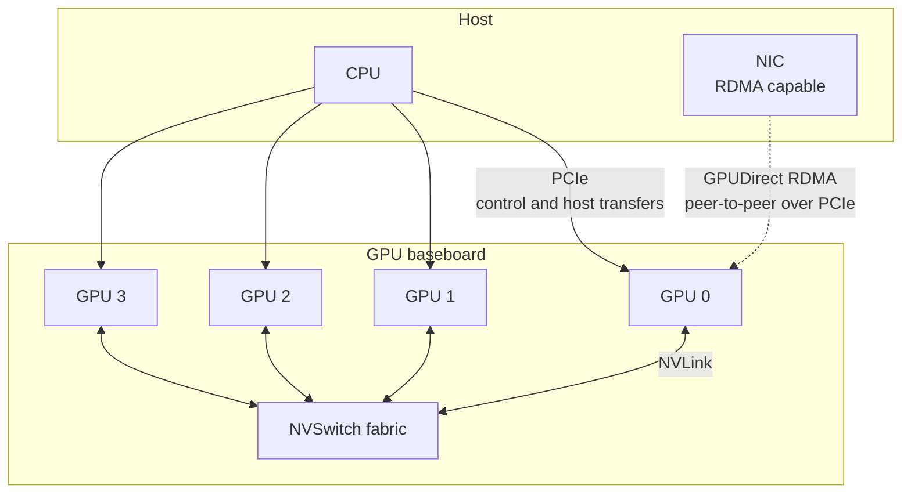

A GPU is reached over two distinct fabrics. PCIe carries control: config space,
register windows, and the interrupt line. NVLink, where present, carries data
between GPUs and sometimes between GPU and CPU. A machine with both routes the
same `cudaMemcpy` differently depending on which endpoints it connects.

## PCIe

Every GPU is a PCIe endpoint whatever else it is attached to. The kernel module
binds to it as an ordinary PCI driver. Config space holds the vendor and device
IDs, the class code, the capability list and the BAR sizing registers.

The driver records three memory apertures, named at
`kernel-open/common/inc/nv.h:292-295` and filled from the device's PCI
resources at `kernel-open/nvidia/nv-pci.c:2103`.

| Driver name | Index | Contents |
| --- | --- | --- |
| `NV_GPU_BAR_INDEX_REGS` | 0 | The register aperture. Every hardware register the driver programs is a store into this window |
| `NV_GPU_BAR_INDEX_FB` | 1 | The device memory aperture the host uses to reach GPU memory directly |
| `NV_GPU_BAR_INDEX_IMEM` | 2 | The instance memory aperture, holding per-channel hardware structures |

The device memory aperture is sized at boot by platform firmware. Where it is
smaller than device memory, the host sees one window at a time and the driver
moves that window to reach the rest. Resizable BAR removes the limit. With it
enabled and supported by the platform firmware, the aperture covers the whole
of device memory and host mappings need no window movement.
`nv_resize_pcie_bars` at `kernel-open/nvidia/nv-pci.c:2090` performs the resize
during probe and fails the probe when it cannot.

| Quantity | Command |
| --- | --- |
| Device and vendor IDs, link speed and width | `lspci -vvv -s <bdf>` |
| BAR sizes as assigned | `lspci -vvv` resource lines, or `/sys/bus/pci/devices/<bdf>/resource` |
| Current and maximum link generation | `nvidia-smi -q -d PCI` |

A GPU negotiating a lower link width than the slot supports indicates a
platform configuration or a physical seating fault. `nvidia-smi -q -d PCI`
names both the current value and the maximum.

## NVLink

| Generation | First part | Per-link bandwidth, each direction | Links per GPU |
| --- | --- | --- | --- |
| NVLink 1 | P100 | 20 GB/s | 4 |
| NVLink 2 | V100 | 25 GB/s | 6 |
| NVLink 3 | A100 | 25 GB/s | 12 |
| NVLink 4 | H100 | 25 GB/s | 18 |
| NVLink 5 | B200 | 50 GB/s | 18 |

Aggregate figures quoted for a part are the per-link figure multiplied by the
link count and often by two for bidirectional traffic. A B200's published
1.8 TB/s is 18 links times 50 GB/s each direction, doubled. Comparing a
bidirectional aggregate against a unidirectional PCIe figure overstates the
ratio by two.

NVSwitch is a crossbar. Without it, GPUs are connected in a mesh and the
available bandwidth between two GPUs depends on how many links directly join
them. With it, every GPU reaches every other at full link bandwidth, so
all-to-all collectives run at a uniform rate on an 8-GPU baseboard.

`nvidia-smi topo -m` prints the matrix. The legend names each pair's connection:
NVLink counts, a PCIe host bridge, a CPU socket traversal, or a shared switch.

## Peer-to-peer

| Path | Requires | Used by |
| --- | --- | --- |
| GPU to GPU over NVLink | An NVLink route between the two | `cudaMemcpyPeer`, NCCL, unified memory migration |
| GPU to GPU over PCIe | `cudaDeviceCanAccessPeer` returning true, and no IOMMU translation in the way | The same calls, at lower bandwidth |
| NIC to GPU | `nvidia-peermem.ko` loaded, and an RDMA-capable NIC | GPUDirect RDMA, used by MPI and NCCL over the network |
| Storage to GPU | A supporting filesystem and driver stack | GPUDirect Storage |

`nvidia-peermem.ko` exists to register GPU memory with the kernel's RDMA
subsystem so that a NIC can DMA into it without a bounce through host memory.
Without it, a NIC writing to GPU memory stages through a host bounce buffer,
whatever NVLink topology the GPUs have between them.

Virtualisation affects peer-to-peer over PCIe. With an IOMMU translating device
addresses, one GPU's view of another's BAR may not be routable, and
`cudaDeviceCanAccessPeer` returns false on hardware that would otherwise
support it.

## Coherent attachment

On Grace Hopper and Grace Blackwell systems the CPU and GPU are joined by
NVLink-C2C, which is cache coherent.

| Consequence | Mechanism |
| --- | --- |
| One address space | The GPU walks the CPU's page tables through address translation services |
| No migration for correctness | A page is reachable from either side wherever it is resident |
| Migration for performance only | Placement still matters for bandwidth, so the advice APIs remain useful |
| `malloc` memory is addressable | No separate allocator is required to reach host data from a kernel |

## See also

- [Memory hierarchy](/gspwn/knowledgebase/memory-hierarchy/)
- [Installed stack](/gspwn/knowledgebase/installed-stack/)
- [Orchestration](/gspwn/knowledgebase/orchestration/)
